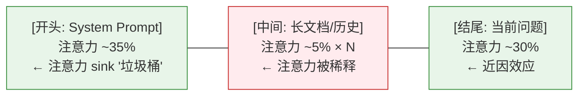
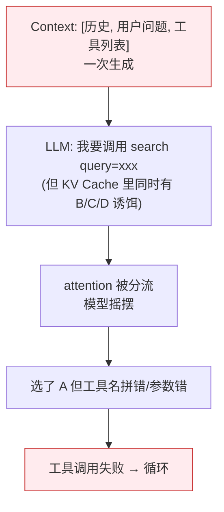
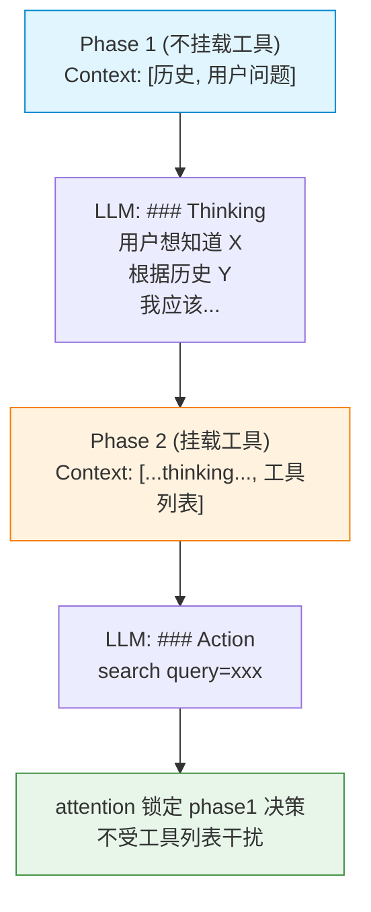

# 工程技巧 -> 架构层：提示词、上下文、驾驭为什么起作用

> 本文是 [《从AI应用开发者的角度去理解 Transformer 架构》](./agent-thinking-transformer-from-prompt.md) 的下半篇。上半篇讲架构本身（核心概念、KV Cache、DeepSeek-V3、工具调用机制），本文把提示词、上下文、驾驭三类工程技巧逐条对应到 Transformer 架构层，看每条为什么起作用。

---
## 第五部分：提示词工程 → 架构层

> **提示词工程解决的核心问题**：模型能力固定，如何通过输入文本让模型输出你要的东西？核心矛盾是"模型懂什么"（训练时决定的）vs "你怎么告诉它"（即时输入的控制力）。所有提示词技巧本质上都是**引导 attention 分配 + 激活特定 FFN 通路**。

### 1. "设定角色"为什么能稳定输出？

**你的工程技巧**：在 system prompt 里写"你是一个资深 Python 工程师，专注于代码审查"。

**架构解释**：

模型在 Embedding 阶段把每个 token 映射成一个高维向量。**"资深 Python 工程师"作为一组 token，在向量空间里有确定的位置**。

进入 Transformer 层后，Self-Attention 会让后续所有 token 都参考这组 token 的 QKV。**这等于在 attention 矩阵的对应行上打了个"标签"**，让模型在生成每一段输出时都倾向参考这个标签下的 FFN 通路——"专家级 Python 知识"对应的 FFN 权重就被激活了。

**工程启示**：

- **角色描述要具体**——"Python 工程师" + "代码审查" + "关注安全性和性能" 三个修饰符一起用
- **角色 token 放 System Prompt**——attention sink 让开头 token 吸引最多注意力，放对位置很重要
- **如果模型"忘了角色"**——通常不是 FFN 的问题，而是 attention 被新内容抢走了。**重复一次角色描述**比优化角色措辞更管用

### 2. "Few-shot 示例"为什么比 Zero-shot 好？

**你的工程技巧**：在 prompt 里给几个示例（"输入 → 输出"），让模型照葫芦画瓢。

**架构解释**：

```
示例 1: 输入 X1 → 输出 Y1   ← 在 context 中
示例 2: 输入 X2 → 输出 Y2   ← 在 context 中
新问题: 输入 X3            ← 用户提问
```

当模型处理 X3 时，Self-Attention 会让它**回看前面的示例对**（X1→Y1, X2→Y2），形成"模式匹配"的注意力连接。同时 FFN 中"按这种格式输出"的知识通路被 attention 触发。

**Zero-shot vs Few-shot 的本质区别**：

- **Zero-shot**：attention 只能找到"指令" → FFN 从训练记忆中**抽取**对应能力（容易抽错）
- **Few-shot**：attention 找到"指令 + 示例" → FFN 从训练记忆中**激活**已有模式（稳定）

**工程启示**：

- **示例数量 3-5 个是甜蜜点**——太多会**稀释**新问题的注意力权重
- **示例要覆盖"边界情况"**——如果模型在某种输入上总出错，给一个"正确示例"比调整指令措辞更有效
- **示例格式必须与新输入严格对齐**——格式不一致时 attention 难以识别"同结构"

### 3. "Chain-of-Thought 思维链"为什么能提升推理？

**你的工程技巧**：让模型"一步一步思考"。

**架构解释**：

这是 LLM **自回归生成** + **KV Cache 累积** 的精妙结合：

```
直接答：
  KV Cache: [问题] → LLM → [答案]
  ↑ 模型看不到自己的"思考过程"

CoT：
  KV Cache: [问题, "让我想想：5-2=", "3", "再 3+3=", "6"]
  ↑ 后续生成能看到前面所有步骤，attention 建立完整推理链
```

1. **模型一次只能生成一个 token**——它不能"在脑中"做完整推理再输出
2. **强制 CoT 把推理"展开"到 KV Cache 里**——每一步推理的 token 都进入 KV Cache
3. **后续 token 能 attention 到前面所有推理步骤**——不会"忘记"自己刚才算到哪里了
4. **FFN 在每一步都被正确激活**——而不是在最后一步尝试"一次性回忆所有推理"

**工程启示**：

- **CoT 对算术、逻辑、多步推理特别有效**——这些任务的"中间状态"必须保留在 KV Cache 里
- **CoT 对简单任务无帮助甚至有害**——"北京是中国的首都吗？"加 CoT 反而消耗 token
- **"强迫 CoT"比"鼓励 CoT"更有效**——"让我们一步步思考" 比 "请仔细思考" 触发 CoT 的概率高 10x

### 4. "分隔符"为什么能稳定格式输出？

**你的工程技巧**：用 `---`、`###`、XML 标签等结构化标记。

**架构解释**：

Self-Attention 对"位置突变"敏感——分隔符创造了一个**强烈的 attention 锚点**。

```
没有分隔符：
  [System "你是 X" User "问题" Tool "结果"]
  ↑ attention 难以判断"哪些 token 属于 System"

有分隔符：
  [System "你是 X" <sep> User "问题" <sep> Tool "结果"]
  ↑ <sep> 的 Key 让 attention 快速识别"墙"
```

**工程启示**：

- **XML 标签（`<system>`、`<user>`）比 `---` 更强**——标签本身就是 token，attention 可以基于 token 内容区分
- **结构嵌套深度不超过 3 层**——再深 attention 难以追踪嵌套关系
- **格式示例比格式说明更可靠**——给一个 `<example>...</example>` 比说"请用 XML 格式输出"有效

### 5. "负面提示"为什么有效但有副作用？

**架构解释**：

"不要做 X" 让模型**明确知道 X 是什么**，从而在生成时 attention 到 X 的"反面"。

**副作用**：提到 X 就让 X 在 attention 中被强化——这叫 **"Don't think of a white bear" 反讽效应**。模型既要注意"避免 X"又要注意"X 是什么"，反而强化了 X 的存在感。

**工程启示**：

- **正向指令优于负向指令**——"请简短回答" 比 "不要写长段落" 有效
- **实在要禁止，必须给出替代方案**——"不要用 for 循环，请用列表推导式"
- **高频负面词（如"不要"、"禁止"）会让模型困惑**——因为负面概念本身需要 token 表达

### 6. "Temperature 设置"对应什么架构行为？

**架构解释**：

最后一步是 Softmax——把每个 token 的 logits 转换成概率。Temperature 控制这个转换的"锐度"：

```
logits = [2.0, 1.0, 0.5, 0.1]
T = 0.1:  [0.69, 0.20, 0.08, 0.03]   ← 极度集中（确定输出）
T = 0.7:  [0.45, 0.27, 0.17, 0.11]   ← 中等分散
T = 1.0:  [0.40, 0.25, 0.15, 0.10]   ← 标准
T = 1.5:  [0.32, 0.23, 0.17, 0.13]   ← 更均匀（多样输出）
```

**工程启示**：

- **T=0 + Greedy 采样**：完全确定性的输出（代码、数学）
- **T=0.2-0.5**：轻微随机（自然语言生成）
- **T=0.7-1.0**：高随机（创意写作、头脑风暴）
- **Top-p / Top-k 是"截断采样"**——只从概率最高的前 p/k 个 token 中选
- **现代 LLM 默认 temperature=1.0**——provider 不会自动帮你设置

### 7. "为什么结构化提示词有用"

**架构解释**：

结构化提示词（XML 标签、Markdown 标题等）的"有用"在**注意力分配机制**：

```
非结构化: [一大段纯文本]
  → attention 难以定位"哪部分是指令"
结构化: [<system>...</system> <instruction>...</instruction>]
  → 每个标签的 Key 是个强 attention 锚点
  → 模型清楚知道"哪部分是哪类信息"
```

**关键设计原则**：

- **标签本身就是 token**——`<system>` 和普通 token 在 embedding 空间是完全不同的向量
- **标签名字要有区分度**——`<system>` `<instruction>` `<example>` 比 `<s1>` `<s2>` `<s3>` 强
- **嵌套不超过 3 层**——再深 attention 难以追踪
- **开头用大标签**——attention sink 让开头 token 吸引最多注意力，把最重要的放最前面

### 总结：提示词工程与架构层的对应速查

| 技巧 | 影响的架构层 | 核心原理 |
|------|------------|---------|
| 角色设定 | Embedding + FFN | 锁定 FFN 通路激活方向 |
| Few-shot | Attention + FFN | 示例创建 attention 模式匹配，激活已有通路 |
| CoT 思维链 | 自回归 + KV Cache | 展开推理步骤到 KV Cache，让后续 attention 看到全部 |
| 分隔符 | Attention | 创造 attention 锚点，区分语义边界 |
| 负面提示 | Attention（反讽效应） | 强化被禁止的概念（副作用） |
| Temperature | Softmax | 控制概率分布的集中/均匀程度 |
| 结构化提示词 | Attention | 用标签做 attention 锚点，帮模型定位

### 进阶：System Prompt 不是字符串，是"操作系统内核"

传统的思维里，System Prompt 只是发往 API 的一个文本常量。但在驾驭工程中，**System Prompt 被看做是"操作系统内核"**——它必须是模块化编译和动态链接的。

**为什么不能把 System Prompt 写成一大坨？**

如果当前项目不是 Git 仓库，为什么要把 500 Token 的"Git 提交流程规范"塞进去？如果用户只问天气，为什么要把项目微服务架构图告诉模型？**每一条无关的信息都在稀释模型对真正重要指令的注意力。**

**工业级的分层加载策略**：

1. **极简内核（Minimal Core）**—引擎代码只硬编码最基础的身份认知和交互模式，通常不到 1000 Tokens
2. **工作区守则（AGENTS.md）**—状态外部化。引擎读取项目根目录的 AGENTS.md，由人类维护当前项目的专属架构和规范
3. **技能外挂（Skills）**—特定领域的知识包，以 SKILL.md 形式存在，按需加载

这种"渐进式暴露"策略让 System Prompt 的内容随环境变化——在 Git 仓库中才加载 Git 规范，有 Python 项目才加载 Python 规范。**Prompt 越长，模型对核心指令的 attention 越弱，所以不要把所有东西塞进同一个 System Prompt。**

---

## 第六部分：上下文工程 → 架构层

> **上下文工程解决的核心问题**：Agent 在多次 LLM 调用间运行，如何在每次调用时构造最优上下文？核心矛盾是"token 越多越好（信息更全）"vs "token 越少越好（成本低、注意力不分散）"。

### 1. "Working Memory 截断"为什么要保留最近 N 条？

**架构根源**：Self-Attention 是 O(N²) 的——token 数 N → 计算量 N²，N 每翻一倍计算量就翻 4 倍。

```
N=100  → 10,000 次 attention 计算
N=200  → 40,000 次
N=1000 → 1,000,000 次
```

**截断到 N 条不只是省 token，更是保证 attention 精度**。context 越长，每个 token 扫的内容就越多，注意力权重被太多无关内容稀释，关键信息的权重就会降低。

**工程启示**：

- **截断 + 摘要**比单纯截断好——把早期消息压缩成摘要放回 context
- **截断要保留"语义关键"的消息**——工具结果和用户决策比闲聊更重要
- **截断要在 LLM 调用前做**——不能在生成中途丢弃

### 2. "Lost in the Middle"——注意力 Sink 现象

**Liu et al. (2023) 的经典发现**：当关键信息放在长 context 的**中间**时，检索精度显著下降。放在**开头**或**结尾**时精度最高。

#### 原因：注意力 Sink（注意力汇流）

Xiao et al. (2023) 发现一个反直觉的现象：**开头几个 token 会吸引不成比例的注意力，跟它们的内容是否重要无关**。模型把开头 token 当成了一个"attention 垃圾桶"——把"无处安放"的注意力分数倾倒在那里。

**为什么叫"垃圾桶"？**

每一层 Self-Attention 计算中，每个 token 的注意力分数之和必须等于 1（Softmax 强制归一化）。当 context 很长时，很多 token 对当前生成相关性不高——但注意力分数不能归零，必须分配到某个地方。

模型发现开头几个 token 总是存在、总是稳定、不会产生干扰——于是就把"多余的注意力分数"倒在那里。就像家里的垃圾桶——不是因为它重要，是因为它永远在那里，有什么不需要的东西就往里扔。

**用数字来看**——假设一个 50 token 的 context：

```
注意力分配的"理想情况"：
  → 与当前生成最相关的 3 个 token 各分 20%、10%、10%（总共 40%）
  → 剩下 47 个 token 分 60%——但 Softmax 不能归零

注意力分配的"实际情况"（受 attention sink 影响）：
  → 3 个相关 token 分 40%
  → 开头第 1 个 token 分到 35%——模型把"多余的"倒给它了
  → 中间 46 个 token 共享剩下的 25%
```

**这就是为什么中间内容被忽略**——不是中间 token 不相关，是注意力分数被开头"截胡"了。



**注意力 Sink 对应用开发的直接影响**：

| 场景 | 问题 | 解法 |
|------|------|------|
| 长 System Prompt | 核心指令放中间会被忽略 | 最重要的指令放 System Prompt 最开头，利用 attention sink 获得免费高注意力 |
| RAG top-k 结果 | 最相关的文档被放在中间位置 | 检索后**重排序**——最相关放最前或最后 |
| 多轮对话历史 | 关键决策被中间闲聊淹没 | 截断时保留决策点，不是按时间截断 |
| 长文档问答 | 关键段落被掩盖 | 先做摘要放开头，具体细节放末尾 |
| Multi-Agent 汇总 | Orchestrator prompt 太长 | 每个 Agent 的结果精简到首尾 |

**工程启示**：

- **重要指令放 System Prompt（开头）**——利用注意力 sink 获得"免费"的高注意力
- **当前问题放 User 消息末尾**——利用近因效应
- **RAG 检索结果要重新排序**——最相关的放最前或最后，不要按相似度分数排序
- **多轮对话避免中间塞满无关内容**——及时截断或压缩，截断时保留"关键决策"而非"最近聊天"

### 3. "压缩早期消息"比"截断"好在哪

**架构差异**：

```
截断：KV Cache 中早期消息被彻底删除 → 模型完全看不到早期
压缩：KV Cache 中保留早期摘要 token → 模型能看到"摘要级"的早期
```

直接截断的问题是信息永久丢失。压缩保留了语义骨架——模型至少知道早期发生过什么。

**工程启示**：

- **压缩的代价是 LLM 调用**——需要额外的 summarize 调用
- **压缩比建议 5-10x**——5K tokens 压到 500-1000
- **压缩要保留"决策点"**——模型做过什么决定、为什么，比压缩原始对话更有价值
- **压缩在 Loop 早期做**——而不是等 context 满了才做

### 4. "Plan Mode"状态外部化为什么能降低幻觉

**架构原因**：LLM 的"记忆"完全存在于 KV Cache 里。Comaction 后模型真的看不到那些信息——不是忘了，是没看到。

```
传统 Agent：KV Cache 中早期被压成 [summary]
  → 模型读 summary → 可能推断错误 → 幻觉
Plan Mode：TODO.md 在文件系统上
  → Agent read_file → 刷新记忆 → 不依赖压缩质量
```

**工程启示**：

- **状态外部化不是偷懒**——是 KV Cache 物理限制下的必然选择
- **TODO.md 比 summary 更可靠**——summary 经过 LLM 二次加工可能失真
- **状态文件应该可读、可 diff、可回滚**——人类可以直接介入纠正

### 上下文工程速查

| 技巧 | 解决的问题 | 架构层 | 关键原则 |
|------|----------|--------|---------|
| Working Memory 截断 | N 条/消息太多 | Self-Attention O(N²) | 截断+摘要，保留语义关键 |
| Lost in the Middle | 信息放中间被忽略 | 注意力 Sink | 关键信息放开头或结尾 |
| 压缩早期消息 | 截断丢信息 | KV Cache | 5-10x 压缩比，保留决策点 |
| Plan Mode 状态外部化 | 长程任务幻觉 | KV Cache 易失性 | 文件系统做持久存储 |

---

## 第七部分：驾驭工程 → 架构层

> **驾驭工程解决的核心问题**：Agent 不是"单次调模型"，而是"多次调模型 + 循环判断 + 外部工具使用"。核心矛盾是"模型自己判断"（灵活但可能跑偏）vs "你给它写好流程"（可控但死板）。所有驾驭工程技巧本质上都是**用架构约束 + 循环设计来补足模型自回归生成的不确定性**。

### 1. "两阶段循环（先 Think 再 Act）"为什么能降低幻觉？

**你的工程技巧**：在 Agent Loop 中强制模型先输出 `### Thinking` 块，再输出 `### Action` 块。

**架构解释**：

这是驾驭工程最重要的发现之一。背后是 attention + 自回归的精妙组合：

**问题场景（一阶段模式）**：



**两阶段模式（强制 Thinking）**：



**架构原因——"决策和行动分离"对抗 attention 分散**：

- **决策需要"内省"**——只能基于已有 context 推理
- **行动需要"选择"**——必须从工具列表中挑
- **混在一起**时，工具列表的 token 会"分走"一部分 attention，导致推理不专注

**两阶段强制让模型"先想清楚，再行动"**，本质上是用结构化约束让 attention 的分配更合理。

**工程启示**：

- **不是所有任务都需要两阶段**——简单单步任务（"今天天气"）一阶段更高效
- **两阶段对长程任务最有效**——复杂推理、工具组合、决策树
- **Phase 1 的 prompt 要明确"不要选工具"**——"先思考，不要执行"
- **Phase 2 的 prompt 要明确"基于前面的思考"**——避免模型"忘记"自己刚想的

### 2. "Tool 描述"为什么决定 Agent 能力上限？

**你的工程技巧**：每个工具的 description 写得极其详细。

**架构解释**：

Agent 在生成 tool_call 时，是用 LLM 的"分类能力"——根据工具的 description 决定用哪个。

**架构对应**：

```
Context: [任务, search(query), write_file(path, content), bash(command)]

LLM 自回归生成：
  → 第一个 token: 看到 description "搜索网络信息"
  → 第二个 token: 看到 description "写文件"
  → ...

attention 决定：
  - "搜索信息" → 触发 FFN 中"搜索"对应的 FFN 通路 → 输出 search
  - "写文件" → 触发 FFN 中"写"对应的 FFN 通路 → 输出 write_file
```

**description 越模糊 → attention 越难分配 → 模型越容易选错工具**

**工程启示**：

- **description 必须"具体到能区分"**——"处理文件"不够，"读取指定路径的文件，返回内容"更好
- **description 包含使用场景**——"用于查询实时信息（如天气、新闻），不用于本地文件"
- **description 包含反例**——"不要用于数学计算"
- **每个 description 至少 50 字**——比工具名长 3-5 倍

---

### 3. 死循环（Doom Loop）——为什么 System Prompt 拦不住

**你的工程场景**：Agent 在某个错误上连续重试 10 次，每次都是同样的参数、同样的错误。

**架构解释**：

导致死循环的原因不是模型"忘了" System Prompt——它字面意义上没忘——而是两个行为陷阱：

1. **上下文内容分布偏移**：连续几次遇到同样错误后，上下文末尾堆满了结构相似的错误信息。这些重复 token 在分布上占据主导，强力牵引模型的下一步生成，让模型"只想解决眼前的报错"
2. **近因偏差（Recency Bias）**：相比上下文开头泛泛而谈的"连续失败请停止"规则，模型更倾向于对**刚刚返回的报错**做出强烈反应

**Why System Prompt 没用**？

System Prompt 写在最前面——注意力 sink 让它有"免费的高注意力"，但被末尾堆叠的大量错误信息覆盖了。模型不是看不到，而是"要处理的信息太多，顾不上开头的警告"。

**关键解法思路**：将提醒伪装成最新一条 User Message（借助 Recency Bias），而不是放在 System Prompt里。这条提醒紧贴报错位置，模型必须优先处理它。

### 4. 中间件拦截（Middleware）——为什么不能信任模型自己判断

**你的工程场景**：Agent 可能发起高危操作（rm -rf /、删除数据库），仅靠 System Prompt 里的"别删"是不够的。

**架构解释**：

模型在自回归生成时，每个 token 的选择都是基于概率的。即使 99% 的概率选"正确操作"，1% 的概率选"高危操作"——如果推理次数足够多，1% 的灾难迟早发生。

**关键防线**：在执行工具前插入中间件（Middleware）拦截，而非依赖模型"理智"。这是架构层面的防御，不是 prompt 层面的。中间件可以做三层判断：

| 级别 | 行为 | 适用 |
|------|------|------|
| **allow** | 白名单命令直接放行 | git status、read_file 等只读操作 |
| **ask** | 敏感操作挂起，等人确认 | rm、delete、write 等高危操作 |
| **deny** | 黑名单直接拦截 | 已知危险命令 |

**架构对应**：中间件插在 ToolCall（模型输出 JSON）和 ToolExecute（你的代码真的去执行）之间——不依赖模型的注意力分配，而是靠代码逻辑强制拦截。

### 5. 受控错误恢复（Recovery Hints）——让模型从报错中自救

**你的工程场景**：模型试图 read_file 一个不存在的文件，收到 "no such file or directory"。

**架构解释**：

传统框架把报错原样返回给模型，模型面对生硬报错时会机械道歉或盲目重复。

**Recovery Hints 的做法**：在工具返回报错时，引擎层拦截并注入"锦囊妙计"。比如：

```
原始报错：
  "Error executing read_file: no such file or directory"

注入后的报错：
  "Error executing read_file: no such file or directory
   [系统救援指南]: 路径似乎不正确，先使用 bash 执行 ls -la 找到正确路径"
```

**为什么有效**：Recovery Hints 利用了 Causal Mask 的单向性——模型在下一步生成时必须处理最新一条消息，Hints 紧贴报错位置，成为 attention 的"被迫关注点"。

### 6. 并行工具调用与 Subagent 任务委派

**你的工程技巧**：同时执行多个独立工具，或将复杂探索任务交给子 Agent 独立处理。

**架构解释**：

**并行工具调用**——模型在一次自回归生成中可以输出多个 tool_calls，它们彼此独立、可以并行执行。这是因为 Self-Attention 在矩阵层面是并行的——多个 tool_calls 的 JSON 结构在同一轮生成中同时输出，你的代码可以在收到后同时执行它们。

**并行调用的架构基础**：attention 矩阵是 N×N 的，所有 token 同时算——不限制只能输出 1 个 tool_call。

**适用条件**：工具之间没有数据依赖关系。比如"查北京天气"和"查上海天气"互不依赖，可以并行。但"先搜索文件再编辑文件"有依赖，必须串行。

**Subagent 任务委派**——当某个子任务需要大量上下文（如深度搜索一个目录、分析多个文件），主 Agent 如果自己处理，会占用大量 KV Cache 空间，导致 attention 被稀释。Subagent 模式让子 Agent 在一个**独立 Session** 中处理，只把精华结果返回给主 Agent。

```
主 Agent Context: [主任务, 结果 A=..., 结果 B=...]
  → attention 集中在主任务上
  ↓
子 Agent 独立 Session: [搜索任务 A 的详细代码]
  → 自己的 KV Cache，不会被主任务"挤占"
  ↓
只把搜索结果摘要返回给主 Agent
```

**架构对应**：Subagent 本质上是**上下文隔离**——利用独立的 KV Cache 空间，避免一个方向的探索占满主 context。

**工程启示**：
- **并行调用的前提是工具间无依赖**——查询类、读取类天然可并行；写入、修改类串行
- **Subagent 不是"为了分工而分工"**——是 attention 物理限制下的解法
- **Subagent 增加 token 消耗**——Orchestrator 的 prompt 要包含子 Agent 的输入输出
- **子 Agent 的结果要精简**——传回 top-3 关键结论，而不是完整日志


### 7. "Multi-Agent 协作"为什么有效？

**你的工程技巧**：让多个 Agent 各负责一摊，最后汇总。

**架构解释**：

每个 Agent 都有自己的 **KV Cache 和 FFN 通路**——它们是"独立的大脑"。让一个大脑同时处理多个任务，会造成 attention 分散。让多个大脑各管一摊，每个大脑的 attention 都聚焦。

```
单一 Agent 处理 5 个任务：
  Context: [任务 1, 任务 2, 任务 3, 任务 4, 任务 5]
  → attention 在 5 个任务间分配
  → 每个任务的处理都不深入

Multi-Agent：
  Agent 1: Context: [任务 1]      → 深入处理
  Agent 2: Context: [任务 2]      → 深入处理
  ...
  Orchestrator: 汇总结果
  → 每个 Agent 的 attention 都聚焦
```

**工程启示**：

- **Multi-Agent 不是"为了分工而分工"**——是 attention 物理限制下的解法
- **Orchestrator 是必要的**——否则多个 Agent 的结果无法合并
- **Multi-Agent 增加 token 消耗**——Orchestrator 的 prompt 要包含所有 Agent 的输入输出

### 8. "Reflection / Self-Critique" 为什么有效？

**你的工程技巧**：让模型对自己的输出做反思，再改进。

**架构解释**：

**第一遍生成时**，KV Cache 里只有用户的输入。模型的"评判"和"生成"用同一个 FFN——会"既当运动员又当裁判"。

**Reflection 模式**：

```
Round 1: 生成答案 A
Round 2: Context = [问题, A] → 让模型评判 A
         → 评判的结果 B 进入 KV Cache
Round 3: Context = [问题, A, B] → 让模型基于 B 改进 A
         → 最终答案 C（比 A 更好）
```

**架构对应**：

- **多轮让 KV Cache 累积"思考"**——每轮的输出成为下一轮的 context
- **Self-Critique 强制 attention 关注"自己刚写的"**——避免"当局者迷"
- **反思过程会激活"评价类" FFN 通路**——通常模型在训练时对"评价"和"生成"分开学习

**工程启示**：

- **Reflection 对"开放式问题"最有效**（写作、设计）——对"事实性回答"帮助不大（模型本来就知道）
- **Reflection 有 token 成本**——通常 2-3x 单次生成
- **控制反思轮数**——超过 3 轮通常收益递减

## 总结：架构 → 工程技巧的速查表

| 架构层 | 对应的工程技巧 | 为什么有效 |
|--------|---------------|----------|
| **Embedding** | 角色设定、专业术语 | 锁定 FFN 通路的激活方向 |
| **Positional Encoding** | 关键信息放开头/结尾 | Lost in the Middle + 注意力 sink |
| **Self-Attention** | 分隔符、Few-shot、负面提示、结构化输出 | 注意力权重分配决定哪些 token 被关注 |
| **Multi-Head** | 结构化标记、多种任务指令 | 不同 head 关注不同方面 |
| **FFN** | Few-shot、CoT、Tool 描述 | FFN 通路决定"能做什么" |
| **Layer 堆叠** | CoT、Reflection、多轮 | 每层处理不同抽象层级的信息 |
| **Tokenization** | 简洁表达、避免歧义 | 不同语言的 token 效率差异 |
| **KV Cache** | system prompt 稳定、压缩 context | 缓存复用减少计算 |
| **Decode 阶段** | temperature、Top-p | 控制采样的随机性 |
| **Self-Attention O(N²)** | Working Memory 截断、摘要压缩 | 减少 attention 矩阵规模 |

### 核心洞察

1. **Transformer 的所有行为都能解释为"attention 怎么分配"+"FFN 激活什么通路"**
2. **你的工程技巧本质上是"引导 attention 和 FFN"**
3. **架构限制是物理的**——KV Cache、attention 复杂度、FFN 静态——决定了工程上的取舍

理解了这些对应，你就能从"凭经验调 prompt"升级到"基于架构理解做主动优化"。

---

## 你不必深究的部分

作为 AI 应用开发者，下列内容可以跳过：

- Scaled Dot-Product Attention 的数学推导（`softmax(QK^T/√d)V`）
- RoPE 复数旋转矩阵的具体形式
- SwiGLU 激活函数的数学性质
- Grouped-Query Attention 的具体 KV 共享比例
- Flash Attention 的分块 IO 优化数学证明
- vLLM PagedAttention 的虚拟地址映射算法

**关键洞察**：理解"是什么"和"为什么这样影响我的 prompt"远比理解"怎么算的"重要。

---

## 延伸阅读

- 两阶段循环的实现
- [工具调用篇](agent-tool-calling.md)——Tool description 的设计原则
- [上下文管理篇](agent-context-management.md)——Working Memory / Compaction
- [驾驭工程实践](../evolution-trends/agent-coding-strategy-state-reflect.md)——状态外部化
