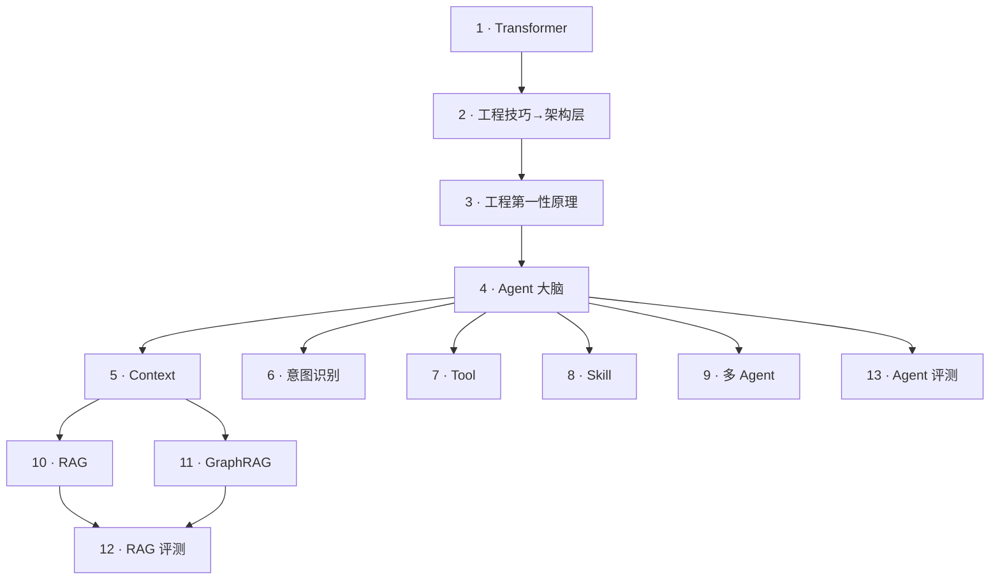

# Agent 工程技巧

这一栏持续总结 Agent 各组件的工程技巧、边界和真实样本，图谱本身尽量完整；具体产品不需要装入全部组件，而应从产品任务和模型真实失败出发选择必要部分。所有组件先统一到一个上游判断：用必要的确定性外框管理概率性模型，同时保留模型处理语义问题的空间。详见 [Agent 工程的第一性原理](./agent-engineering-first-principles.md)。

每一篇都按同一套章节结构写：

- **一、动机**：说明本篇解决什么问题、跟其他工程技巧的边界
- **二、关键判断速览**：5-10 条核心判断，方便跳读
- **三、工程化要点**：按子主题分小节展开，实战策略池融入正文对应位置
- **反模式**（独立成章）：按子主题分类的具体反行为，不折叠
- **何时不该用**（独立成段或章节）：本篇工程技巧的适用边界
- **样本索引**（折叠）：每一篇至少指 2-3 处真实源码节，复盘时按此跳回应用笔记

## 整体坐标

> **编号 = 引入顺序，位置 = 演化方向**。主轴是 Transformer → 工程技巧→架构层 → 工程第一性原理 → 大脑 → Context → RAG/GraphRAG；从大脑同时长出意图识别 / Tool / Skill / 多 Agent 四个分支，其中 Context 是 Skill 和多 Agent 的依赖前置（Skill 激活 = 往 Context 注入；多 Agent Handoff = 拆分 Context）。
>
> **评测节点（12 / 13）有回流箭头**——判对错不是上线前体检，结果要能回去调 RAG 参数、调大脑 Prompt、调 Tool 选择。
>
> **可观测性是横切关注**（不占主编号），可在任意阶段注入。
>
> **暂缓项**：MCP / Hooks / 权限（暂无足够样本支撑且不直接服务简历项目）—— 等真实工程需求出现再补。Agent 评测已独立成第 12 号，骨架先行，样本待补。

## 易混淆的两个工程技巧：Agent 大脑 vs 意图识别

两个工程技巧在真实系统里经常粘在一起，但**核心张力、位置、输出都不一样**——这篇独立区分，避免回看时混淆。

**一个例子**——用户说 "我昨天跟你说过的那份合同，发我邮箱"：

- **意图识别**（入口层，一次请求判一次）：把这句话归类并抽取——输出 `{action: "retrieve_and_send", entities: {item: "合同", time_ref: "昨天", target: "邮箱"}, confidence: 0.92}`。如果信不过：反问用户"你说的合同是哪份？"
- **Agent 大脑**（中枢，全程每轮都跑）：拿到意图分类后决定怎么一步步把活干完——先调记忆检索找昨天提到的合同 → 找到后调邮箱工具发送 → 发送失败要不要重试 / 换通道。本质是状态机 + 思考链 + 行动调度。

| 维度 | 意图识别 | Agent 大脑 |
|---|---|---|
| **位置** | 入口层（一次请求判一次） | 全程（每轮都跑） |
| **输入** | 用户的自然语言 query | 上一轮状态 + 当前 observation + 历史 |
| **输出** | 分类标签 + 实体 + 置信度 | 思考文本 + 行动决策（继续 / 调工具 / 回复 / 退出） |
| **核心张力** | 语义模糊 ↔ 分类粒度 | 自主性 ↔ 可控性 / 思考 ↔ 行动边界 |
| **失败兜底** | 反问 / 走默认分支 / 转人工 | Replan / 反思 / 退到上一步 |
| **类比** | 医院挂号分诊台 | 医生看病的过程 |

**实际工程里两个耦合的点**：
1. 意图识别给低置信度时，大脑决定追问 vs 走兜底
2. 意图识别本身是大脑循环的一个步骤（每轮先分路再决策）
3. 简单任务可以省略意图识别，让大脑直接吃 query——这是大脑篇要回答的设计取舍之一

> 大脑篇和意图识别篇会**互相在动机段点名对方**，明确"我是入口 / 我是中枢"。

## 工程技巧坐标总表

### 结构性工程技巧（4-9）

| # | 工程技巧 | 核心张力 | 现有文章 | 样本来源 |
|---|---|---|---|---|
| 1 | Transformer 架构 | （前置地基） | [agent-thinking-transformer-from-prompt](./agent-thinking-transformer-from-prompt.md) | — |
| 2 | 工程技巧→架构层 | （前置地基） | [agent-engineering-to-architecture](./agent-engineering-to-architecture.md) | — |
| 3 | **工程第一性原理** | 确定性外框 ↔ 模型语义空间 / 图谱完整 ↔ 产品按需 | [agent-engineering-first-principles](./agent-engineering-first-principles.md) | 产品形态图谱 / 本栏全部样本 |
| 4 | **Agent 大脑** | 自主性 ↔ 可控性 / 思考 ↔ 行动边界 | [agent-brain](./agent-brain.md)（原 Loop 升格） | cc-03 / dify-04 |
| 5 | **Context 上下文** | 信息充分 ↔ 成本注意力（轴 1） / 持久 ↔ 检索遗忘（轴 2） | [agent-context-management](./agent-context-management.md) | cc-05 / cc-07 / cc-08 / dify-05 |
| 6 | **意图识别** | 语义模糊 ↔ 分类粒度 | [agent-intent-recognition](./agent-intent-recognition.md) | Dify question-classifier / Claude Code prompt routing（应用笔记待建） |
| 7 | **Tool 工具** | 描述准确性 ↔ 防御多层 / 声明执行 ↔ 凭据隔离 / 用户可见 ↔ 系统安全 | [agent-tool-calling](./agent-tool-calling.md) | cc-05 / cc-07 / dify-07 |
| 8 | **Skill 经验封装** | 经验复用 ↔ 激活时机 | [agent-skill-design](./agent-skill-design.md)（从原 MCP/Skill 拆） | cc-09 |
| 9 | **多 Agent 编排** | 并行收益 ↔ 协调开销 | [agent-multi-agent-orchestration](./agent-multi-agent-orchestration.md) | cc-10 |

### 专项工程（10-11）

| # | 专项工程 | 核心张力 | 现有文章 | 样本来源 |
|---|---|---|---|---|
| 10 | **RAG 工程技巧** | 召回率 / 精度 / 成本 / 延迟 / 可解释性 ↔ 何时不用 RAG | [rag-engineering](./rag-engineering.md) | dify-09 / dify-10 / LangChain / LlamaIndex |
| 11 | **GraphRAG 工程技巧** | 图构建成本 ↔ 多跳问答能力 / 何时不上 GraphRAG | [graph-rag-engineering](./graph-rag-engineering.md) | Microsoft GraphRAG / dify / Neo4j |

### 评测（12-13，有回流箭头）

| # | 评测 | 度量对象 | 现有文章 | 样本来源 |
|---|---|---|---|---|
| 12 | **RAG 评测** | 检索段 + 生成段，4 项指标 + 5 个维度 | [rag-evaluation](./rag-evaluation.md)（从 rag-engineering §评测 拆出） | dify-09 / dify-10 |
| 13 | **Agent 评测**（骨架） | 决策链端到端 + 决策节点 + 工具调用 三层 | [agent-evaluation](./agent-evaluation.md) | 占位骨架，样本待补 |

### 横切层（不占主编号）

| 工程技巧 | 位置 | 现有文章 | 样本来源 |
|---|---|---|---|
| 可观测性 | 任意阶段可注入 | [agent-observability](./agent-observability.md) | cc-18 / dify-14 |

### 暂缓（占位）

| 工程技巧 | 暂缓原因 | 何时补 |
|---|---|---|
| MCP | 不主流、样本偏协议层 | 等真正工程需求或主流样本出现。详见 [agent-mcp](./agent-mcp.md) |
| Hooks | 样本在但偏框架特性罗列 | 与简历项目挂钩时再补 |
| 权限 | 与 Tool 权限划分有重叠 | 等独立样本出现 |

## 工程技巧 → 行动前先问 → 样本 三段映射

复盘时按这三条对照走。下次真要动手某个工程技巧，先扫它这行的"行动前先问"，再从"样本来源"跳到具体源码节。

### 4 · Agent 大脑

**行动前先问**：
- 我能把单轮切成至少 4 段吗（感知 / 思考 / 行动 / 观察）？
- AI 消息与工具调用为什么必须结对？边界画在哪？
- 慢思考（COT / ReAct / Plan）是 prompt 策略还是架构策略？
- 压缩对思维链的影响是什么？关键推理步骤怎么不被截断？
- Plan / Replan / 反思 触发时机分别是什么？
- 单大脑放不下时怎么判断该交给编排层？

**与意图识别（5）的边界**：本篇是"中枢"，解决"拿到问题后怎么一步步办完"；意图识别是"入口"，解决"用户说的是哪类问题、要哪些参数"。详见 [§易混淆的两个工程技巧](./index.md)

**样本**：[cc-03 agent-loop](../../application-notes/engineering/claude-code-cli/cc-03-agent-loop.md) · [dify-04 agent-reasoning](../../application-notes/engineering/dify/dify-04-agent-reasoning.md)

### 5 · Context（两轴：管理技巧 + 记忆系统）

**轴 1 · 管理技巧 行动前先问**：
- System Prompt 按稳定性分层了吗？`SYSTEM_PROMPT_DYNAMIC_BOUNDARY` 位置稳定吗？
- Token 预算用动态残差（`rest_tokens = context_size - max_tokens - curr_message_tokens`）还是固定配额？
- 超预算时按 User 边界整轮丢弃还是按条数丢？
- 压缩是分层级（5 阶段：原地缩减 → snip → microcompact → server-side → LLM summary）还是上来就调 LLM？
- Prompt Cache 怎么分层（static / dynamic / scratchpad / 记忆索引 / 记忆全文）？
- tool definitions 稳定常驻还是动态增删？

**轴 2 · 记忆系统 行动前先问**：
- 长期记忆"索引常驻 + 全文按需"还是"常驻全文 + 索引辅助"？
- 记忆分几层（session / user / domain / global）？每层存什么、生命周期多长？
- 记忆检索走向量、关键词、还是图谱混合？
- 遗忘策略怎么设计（容量上限 / 时间衰减 / 重要性淘汰 / 用户显式清除）？
- 用户显式清除接口有保留吗（避免"AI 记住了用户想忘的事"）？

**与 Agent 大脑篇（3）的边界**：大脑篇判断 5（压缩对思维链的破坏）是"思考过程视角"，Context 篇展开"压缩算法 / token 预算 / cache 命中"等工程细节。大脑篇判断 3（AI 消息与工具调用结对）是"边界视角"，Context 篇展开"每轮上下文怎么组装"。

**样本**：[cc-07 context-assembly](../../application-notes/engineering/claude-code-cli/cc-07-context-assembly.md) · [cc-08 compaction-subsystem](../../application-notes/engineering/claude-code-cli/cc-08-compaction-subsystem.md) · [dify-05 agent-context](../../application-notes/engineering/dify/dify-05-agent-context.md)

### 6 · 意图识别

**行动前先问**：
- 该不该单独建意图识别层？路由决策复杂度 > 3 个分支才建；否则大脑直接吃 query
- 分类粒度按路由需要决定：粗分类起步（任务级），按需细化（动作级）
- 分类标签互斥优先，可重叠次之，层级最复杂 —— 默认互斥起步
- 模糊 query 怎么兜底？高风险反问 + 转人工；低风险默认分支
- 多轮意图怎么累积？槽位填充 + 指代消解 + 上下文继承
- 意图识别用什么实现？默认 LLM 单次分类，高频简单意图可缓存
- 意图识别层接在哪一层？独立层优于塞进大脑循环
- 意图识别失败怎么降级？让大脑兜底，不要直接拒答
- 意图识别怎么评测？离线评估集 + 在线分布监控 + 边界 case 专项
- 意图识别与权限怎么配合？按意图路由最小工具白名单

**与 Agent 大脑（3）的边界**：意图识别是"入口"，解决"用户说的是哪类问题、要哪些参数、信不信"；大脑是"中枢"，解决"拿到意图后怎么一步步办完"。详见 [§易混淆的两个工程技巧](./index.md)

**样本**：Dify question-classifier / Claude Code prompt routing（应用笔记待建）/ LangChain RouterChain

### 7 · Tool（三轴：描述层 + 注册执行层 + 权限层）

**描述层 行动前先问**：
- description 写到"给不懂技术的人能判断该不该用"的标准了吗？
- `description.llm` 和 `description.human` 分两套了吗？
- 准确性防御叠 5 层了吗（描述 / Schema / 系统提示 / 容错 / 反馈）？

**注册与执行层 行动前先问**：
- 工具三层（元数据 / Schema / 执行逻辑）清晰分离吗？
- 5+ 异构来源工具用唯一 ToolManager + 多级缓存（进程级 / 请求级 / 用户级 / 会话级）？
- 声明（schema）与执行（instance）物理分离？凭据按请求 fork？
- 安全相关属性默认 fail-closed（`isReadOnly` / `isConcurrencySafe` / `isDestructive` 默认 false）？
- 工具失败默认注入错误（`is_error: true`）而非抛异常？
- 超长结果持久化 + 预览而非截断？

**权限层 行动前先问**：
- 权限划分三层（系统级 / 用户级 / 会话级）独立来源 + deny 优先合并？
- **用户可见的权限**：工具按"任务场景 + 敏感度"分组暴露？高危工具默认隐藏？过滤在 schema 注入之前？
- HITL 在执行前阻塞？审批超时默认拒绝？审批信息格式化（操作目的 / 影响范围 / 成本预估 / 建议操作）？
- 工具被禁用用 logit masking（默认）还是删 schema（仅废弃）？

**样本**：[cc-05 tool-execution-pipeline](../../application-notes/engineering/claude-code-cli/cc-05-tool-execution-pipeline.md) · [dify-07 tool-registration](../../application-notes/engineering/dify/dify-07-tool-registration.md)

### 8 · Skill

**行动前先问**：
- Skill 是 prompt 经验封装还是工具的另一种形态？
- Skill 激活时机怎么定（按 query 匹配 / 按阶段注入 / 按工具调用触发）？
- Skill 多了怎么分组、怎么避免上下文过载？
- Skill 和 prompt template 的边界在哪？

**样本**：[cc-09 skill-system](../../application-notes/engineering/claude-code-cli/cc-09-skill-system.md)

### 9 · 多 Agent 编排

**行动前先问**：
- 该不该拆——并行收益与协调开销哪个更高？
- 选 DAG 还是 Swarm 范式？
- Handoff 时控制权 / 上下文 / 状态各传什么？
- 一个 Agent 失败时整图怎么继续？

**样本**：[cc-10 subagent-isolation](../../application-notes/engineering/claude-code-cli/cc-10-subagent-isolation.md)

### 10 · RAG 工程技巧

**行动前先问**：
- 我该停在 R0 / R1 / R2 / R3 哪个阶段？知识总量 < 100 段 → R0；100-10K → R1；10K+ → R2；高复杂度 → R3
- 我这个场景**该不该用 RAG**？知识 < 50 段且静态 → 直接塞 Prompt；主题高度集中 → Summary Index
- 切分策略怎么选（段落 / 标题 / 语义 / parent_child / qa）？默认 paragraph + 512 + 100 overlap
- embedding 选稠密 / 稀疏 / 混合？专有名词 / 错误码 / 数字 ID 占比 > 1/3 必须混合
- 检索走 BM25 / 向量 / Hybrid？HYBRID 模式下 score_threshold 必须在 Rerank 之后
- Rerank 用本地还是云端？本地 BGE 优先于 Cohere 跨太平洋调用
- 在线 RAG 缓存分几层？文档更新即失效的语义是什么
- 引用与归属：强制引用 / 句级校验 / 引用覆盖率 > 80% / 幻觉率 < 20%
- 4 项指标（Context Precision / Recall / Faithfulness / Answer Relevancy）有最小评估集吗？上线前 30 条起步
- 上线后怎么持续监控（不能用"用户没投诉"当评估）

**样本**：[dify-09 rag-indexing](../../application-notes/engineering/dify/dify-09-rag-indexing.md) · [dify-10 rag-retrieval](../../application-notes/engineering/dify/dify-10-rag-retrieval.md) · LangChain / LlamaIndex 公开框架（应用笔记目录待建）

### 11 · GraphRAG 工程技巧

**行动前先问**：
- 核心问法里 ≥ 30% 是跨实体 / 多跳 / 全局主题？否则不上 GraphRAG
- 知识量 500-100K 段？太小不值得，太大成本爆炸
- 延迟容忍 2-5s？强实时场景走普通 RAG
- 预算能覆盖 5-20x 索引成本？否则走普通 RAG
- 实体抽取 schema 预定义了吗？关系类型清单限定了吗？
- 实体别名合并了吗？每条三元组保留来源 chunk_id + 置信度了吗？
- 多分辨率社区检测（Leiden 推荐）+ 多粒度社区摘要做了吗？
- 多跳检索跳数限制 ≤ 3 吗？路径剪枝了吗？
- GraphRAG + 普通 RAG 协同了吗（按意图分流）？
- 多跳评测集覆盖 1-3 跳 + 每种关系类型 ≥ 10 条吗？

**与普通 RAG 的关系**：GraphRAG 是 RAG 在"多跳 / 全局主题"场景的旁支形态，不是替代。详见 [rag-engineering](./rag-engineering.md)

**样本**：Microsoft GraphRAG 官方文档（公开框架）/ dify GraphRAG 集成（应用笔记目录待建）/ Neo4j + LangChain

### 12 · RAG 评测

**行动前先问**：
- 评估集从真实 query 抽还是合成？真实 query 分布优先
- ground truth 标到 chunk 级还是答案级？chunk 级（复用 `section_path` 元数据）
- 最小评估集几条起步？30 条，分事实题 / 多跳题 / 边缘 case
- 四项指标全覆盖吗（Precision / Recall / Faithfulness / Answer Relevancy）？
- 排查是先看检索段 Recall 再看 Faithfulness，还是直接调 Prompt？
- 五个维度（准确 / 可信 / 速度 / 扩展 / 体验）都监控了吗？
- 速度盯 P95 / P99 还是只盯平均？必须盯尾延迟
- LLM 自动打分能当裁判吗？只能做初筛
- 评测结果是回流到 RAG 调参还是只做上线前体检？必须回流

**与 RAG 工程篇（9）的边界**：RAG 篇展开"怎么搭管线"，RAG 评测展开"搭起来之后怎么判好不好"。两者之间是**回流箭头**——评测结果指导 RAG 调参，不是单方向。

**样本**：dify-09 rag-indexing · dify-10 rag-retrieval（应用笔记待建）· LangChain / LlamaIndex 公开评估模块

### 13 · Agent 评测（骨架）

**行动前先问**：
- 评测粒度走哪一层？整图完成级 / 决策节点级 / 工具调用级 三层都要有
- 失败模式覆盖全了吗？幻觉 / 死循环 / 工具误用 / 权限越权 / 多 Agent 协调失败 五类
- 有 trace 可回放吗？没有 trace 的 Agent 评测等于盲调
- 离线评估集覆盖三类场景？happy path / 边界 case / 已知失败模式回归
- 在线 A/B 走影子模式起步还是直接上流量？影子模式优先

**与 RAG 评测（11）的边界**：Agent 评测的评测对象是多轮决策链（跨工具、跨 Agent、跨 Session），失败模式从"喂错料"扩展到五类，评测粒度从 chunk 级下沉到工具调用级 / 决策节点级 / 整图完成级。

**当前位置**：骨架先行，**正文待真实样本回填**——已知硬规则"无样本不立条"被打破一次，理由是评测作为方法学其工程化骨架（评测什么 / 怎么搭 / 怎么回流）和 RAG 评测同构，先立住不至于未来补时还要回头重排坐标。

**样本**：待真实样本回填。计划接入 Claude Code CLI 的 trace 系统（cc-18 已有观测数据可复用）。

### 可观测性 · 横切

> 不占主编号，任意阶段可注入。详见 [agent-observability](./agent-observability.md)

**行动前先问**：
- 测的是能力 / 回归 / 行为对齐，三种目标我能区分吗？
- 离线测评 vs 影子模式 vs 在线 A/B，用哪个？
- 观测对象：核心 token / 决策路径 / 失败模式各埋点没有？
- 过度观测的真实代价我算过吗（成本 / 噪音 / 隐私）？

**样本**：[cc-18 observability](../../application-notes/engineering/claude-code-cli/cc-18-observability.md) · [dify-14 observability](../../application-notes/engineering/dify/dify-14-observability.md)

## 复盘回看的硬指标

这一栏不通过的硬指标：

- 一篇文章读完，**找不到具体节跳转回应用笔记** → 样本索引没写到位
- 一篇关键判断速览里的判断**找不到真实样本出处** → 是空中楼阁，下次回看没价值
- 一篇文章没有"具体反行为而不是抽象负向词"的反模式章节 → 失败模式没显形
- 一篇文章没有"何时不该用"的边界说明 → 过度工程化的风险没挡住

> 三段路径：复盘时从谱系坐标表 → 工程技巧文章 → 应用笔记样本对应节。一次走通才说明这一栏闭环了。

## 这一栏怎么回到应用笔记

- 提炼出"哪些设计值得照搬 / 哪些换实现 / 哪些别碰"，回到应用笔记对应篇的"我的判断"段 — 后续拆项目时直接复用
- 提炼出"行动前先问"的检查点，进入 [方法与复盘总览](../index.md) 里"复盘模板"的检查栏
- 应用笔记里有新工程技巧出现（如未来补 Hooks / 权限 / Agent 行为测评）→ 反向补这一栏