# 从AI应用开发者的角度去理解 Transformer 架构

如果你已经在做 AI 应用开发（提示词工程、上下文工程、驾驭工程），你大概率不需要从数学推导去理解 Transformer——你需要的是**理解那些工程技巧为什么会起作用**。

但有个前提：你需要先懂几个核心概念。QKV 是什么、Attention 在干什么、FFN 在干什么、自回归是什么意思、结构化提示词为什么有用

本文的写法：

- **前半部分（基础）**：把 QKV / Attention / FFN / 自回归这些核心概念从零讲明白，但不写数学推导
- **架构串联**：把上面所有部件组装成完整 Transformer 架构
- **KV Cache + DeepSeek-V3 真实模型对照**：理解性能瓶颈和真实模型的工程优化
- **工具调用机制**：理解大模型怎么"调用工具"
- **后半部分（应用）**：每一种提示词/上下文/驾驭工程技巧，对应到 Transformer 架构里的哪一层、为什么起作用
- **不深究的部分**：明确标注哪些数学可以跳过

这不是一篇科普 Transformer 全貌的文章，而是**给 AI 应用开发者用的"理解架构 + 指导实践"手册**。

---

## 视角转换：你不是模型研究者

平时做 AI 应用开发，你接触到的概念是：

- **提示词工程**：角色设定、Few-shot、CoT、分隔符、负面提示
- **上下文工程**：截断、压缩、Working Memory、KV Cache
- **驾驭工程**：两阶段循环、Plan Mode、状态外部化

这些技巧在 Transformer 里都有具体的"落地点"。理解这些对应关系比理解数学公式更关键——它能让你**从"瞎试 prompt"升级到"基于架构理解做主动优化"**。

---

# 第一部分：理解 Transformer 的核心概念

在讲"工程技巧对应哪一层"之前，必须先弄清楚几个核心概念。这部分用最朴素的方式解释，不写数学。

按数据在模型里的"流动顺序"组织——**怎么读 → 怎么处理 → 怎么写**：

1. **怎么读（输入端）**：Token → Embedding → Positional Encoding → Self-Attention（QKV）
2. **怎么处理（模型内部）**：Transformer Block（Multi-Head + FFN）× N 层
3. **怎么写（输出端）**：自回归 + Softmax + Sampling
4. **现代 LLM 为什么都是 Decoder-Only**

这跟实际数据流向一致，比按概念分类更符合"应用开发者的工程直觉"。

---

## 主题一：模型怎么"读"输入

> **这一节回答的问题**：你的 prompt 进来后，模型怎么把它变成能"理解"的内部表示？

数据流：Token → Embedding → Positional Encoding → Self-Attention

### 1. 什么是 Token——模型的"字"

LLM 不认识"汉字"、"英文单词"、"标点"。它只认识 **token（词元）**。

Token 是模型自己的"字"：

```
英文: "Hello world"    → ["Hello", " world"]      → 2 tokens
中文: "你好世界"        → ["你好", "世", "界"]      → 3 tokens（每个汉字约 1.5 token）
代码: "if (x == 5)"    → ["if", " (", "x", " ==", " 5", ")"] → 6 tokens
emoji: "😀"             → 1-2 tokens
```

**关键事实**：

- **同一个词，不同模型可能切成不同数量的 token**——GPT 用 BPE，LLaMA 用 SentencePiece
- **上下文窗口按 token 计数**——不是字符数
- **不同语言 token 效率不同**——中文比英文多消耗 30-50% 的 token

**估算公式**：

```python
# 英文: 字符数 / 4 ≈ token 数
# 中文: 字符数 / 1.5 ≈ token 数
# 代码: 字符数 / 3 ≈ token 数
estimated = (len(content) / 4) * 1.1 + 5  # +10% 安全边际，+5 是消息格式开销
```

### 2. 什么是 Embedding——把"字"变成"坐标"

每个 token 进入模型后，被映射成一个**高维向量**（比如 4096 维的浮点数）。这就是 **embedding**。

你可以把 embedding 空间想象成一个"语义地图"：

```
        "国王" ──── "皇后"
           │         │
        "男人" ──── "女人"
           │         │
        "王子" ──── "公主"

向量空间中，语义相近的词距离近：
- "国王" 和 "王后" 距离很近
- "猫" 和 "狗" 比 "猫" 和 "汽车" 距离近
- "开心" 和 "高兴" 距离很近
```

**embedding 在训练完成后就固定了**——你不能通过 prompt 改变某个词的 embedding。

**为什么这对你重要？**

- **"苹果"在 embedding 空间里同时靠近"水果"和"苹果公司"**——模型怎么知道你说的是哪个？靠**上下文**（attention 层的工作）
- **专业术语如果不在训练数据里，embedding 就是随机的**——这时候给它一个**定义**比反复使用术语更有效

### 3. 什么是 Positional Encoding——给"字"加位置

Transformer 没有循环结构，它本身不知道 token 的顺序。Positional Encoding 就是告诉它"第一个词是第一个，第二个词是第二个"。

从使用视角：

- **位置信息跟语义信息一样重要**——"我打你"和"你打我"的 token 完全一样，全靠位置区分
- **位置编码的设计决定了模型的长度外推能力**——为什么有的模型到 8K 就崩，有的能到 128K（RoPE / YaRN 等）
- **相对位置编码**（RoPE）是现代模型主流——在中间插入内容比末尾追加更不容易搞乱 attention

### 4. 什么是 Self-Attention（用 QKV 实现）——模型怎么"读懂"

**Self-Attention 是 Transformer 理解语言的核心机制**。

**一句话**：**每个 token 在读自己的 context 时，会"看向"所有其他 token，决定哪些 token 对理解自己最重要**。

**举个例子**：模型读到"苹果"这个 token 时，它会去看周围所有的 token：

```
Context: "我昨天买了一个苹果，很甜。"

"苹果" 看向所有 token，得到一组注意力分数：

token "我"   : 0.05   （不太相关）
token "昨天" : 0.10   （时间修饰）
token "了"   : 0.03
token "买"   : 0.15   （动作修饰）
token "了"   : 0.03
token "一个" : 0.08   （量词）
token "苹果" : 0.20   ← 自己（self-attention）
token "，"   : 0.01
token "很"   : 0.20   ← 重要！修饰"甜"
token "甜"   : 0.15   ← 重要！描述苹果的味道
```

`苹果` 注意到 `甜` 和 `很` 都高度相关——所以模型推断"苹果"这里是水果（而不是苹果公司）。

**Self-Attention 的本质**：**让每个 token 决定"我应该重点关注哪些其他 token"**。

#### Self-Attention 是怎么实现的？——QKV 三件套

Self-Attention 内部其实在做"问答匹配"，需要三个东西：**Query（查询）、Key（键）、Value（值）**。

**直觉类比**：

你去图书馆找书：

- **Query（你的查询）**：你想找"机器学习"相关的书
- **Key（书的标签）**：每本书上的标签
- **Value（书的内容）**：你真正想读的内容

找的过程：
1. 你的 Query 和每本书的 Key 比较——"机器学习" Query 和 "机器学习" Key 完全匹配
2. 根据匹配度，从匹配的书的 Value 里抽取内容

**在 Transformer 里**：

每个 token 生成自己的 Query、Key、Value（每个都是向量）。

- **Query** = 这个 token 在问"我应该关注什么样的信息？"
- **Key** = 这个 token 自我介绍"我提供什么信息"
- **Value** = 这个 token 实际携带的"信息内容"

**计算 attention 分数的过程**：

```
对 token A：
  A.Query 和所有 token 的 Key 计算相似度
  → 得到一组分数（比如 A.Query · B.Key = 0.7，A.Query · C.Key = 0.3）
  → softmax 归一化（让分数和为 1）
  → 得到 attention 权重

用这些权重对所有 token 的 Value 加权求和：
  → A 的新表示 = 0.7 × B.Value + 0.3 × C.Value + ...
```

**QKV 总结**：Q 和 K 决定"关注谁"，V 决定"拿到什么信息"。

**对应用开发者的关键事实**：

- **Self-Attention 是"双向"的**——每个 token 看所有其他 token（包括自己）
- **每个 token 自己决定看谁**——权重是动态计算的，不是预设的
- **Causal Mask**（生成时用）让 attention 变成"单向"——每个 token 只能看到自己和之前的 token，不能看未来

#### 理解 Causal Mask："双向能力" vs "单向约束"

> **这是整个文档最容易混淆的地方，请仔细看。**

你可能会想：既然 Self-Attention 是双向的，为什么还要加 Causal Mask 让它变单向？

**答案是**：模型在"能做什么"和"实际推理时让做什么"是两个层面。

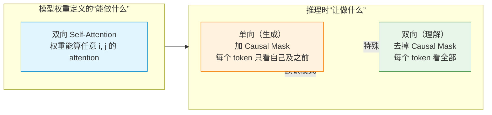

**具体来说**：

- **模型权重本身是双向的**——矩阵运算中，第 i 个 token 的 Query 可以和任意第 j 个 token 的 Key 算相似度。这是模型架构的"能力"
- **Causal Mask 是生成时加的可移除约束**——它只在"自回归生成"场景下加上，让模型看不到未来。这是推理的"约束"
- **如果要求模型只做"理解"（分类、总结、提取）**，可以**去掉 Causal Mask**，让 attention 双向看全部内容——这相当于把 LLM 的 Decoder 当 Encoder 用

**为什么文档中既有"Decoder 用单向"又有"Decoder-Only 仍然是双向的"**？

| 说法 | 应用场景 | 解释 |
|------|---------|------|
| Decoder 用**单向** Self-Attention | **生成场景**（默认） | 每个 token 只看到自己和之前的位置——Causal Mask 生效 |
| Decoder-Only 的 attention 是**双向的** | **理解场景**（可选的） | Attention 权重本身能算任意两个 token 之间的相似度——去掉 Causal Mask 就是双向 |
| 为什么原始 Transformer 的 Decoder 有 **Cross-Attention** | 需要关注编码器输出 | Encoder-Decoder 架构中，Decoder 除了单向 attention，还要看 Encoder 的输出 |
| 为什么 Decoder-Only 没有 Cross-Attention | 输入输出是同一段 | 不存在"独立的输入"需要关注，prompt 就在 Decoder 的上下文中 |

**结论**：**说"单向"时指的是生成时的约束模式，说"双向"时指的是模型本身的能力。** 两者不矛盾——可以理解为"**一个双向能力被 Causal Mask 临时约束成单向的生成机器**"。在应用中：
- 指令遵循、角色设定 利用的是**训练时学习到的双向理解能力**
- CoT、自回归生成 依赖的是 **Causal Mask 约束的单向生成能力**
- 如果你把 LLM 当分类/检索/理解模型用（去掉 Causal Mask），它就能"双向理解"——这也是 **Decoder-Only 能做理解任务的根本原因**

#### 用 PyTorch 代码看 Causal Mask

```python
import torch

seq_len = 4
attention_scores = torch.randn(seq_len, seq_len)

# 构造 Causal Mask（上三角设为 True）
mask = torch.triu(torch.ones(seq_len, seq_len), diagonal=1)

# 应用 Mask——"未来位置"设为 -inf
masked_scores = attention_scores.masked_fill(mask.bool(), float("-inf"))

# Softmax 后，-inf 变成 0——这些位置完全不参与 attention
probs = torch.softmax(masked_scores, dim=-1)
# 第 1 行（t1）只能看自己：[1.0, 0, 0, 0]
# 第 2 行（t2）能看 t1 和自己：[?, ?, 0, 0]
```

**Causal Mask = "未来屏蔽器"**——它在 Self-Attention 计算时，**阻止每个 token 看到还没生成出来的"未来位置"**。

**为什么需要它？** 没有 Causal Mask 时，第 N 个 token 的 attention 能看到位置 N+1、N+2...——但这些位置**根本还没有 token**（只有 padding 或随机值）。这会导致：

- **训练时**：模型学会"作弊"——从未来位置偷答案
- **推理时**：未来位置是 padding，模型困惑

**Causal Mask 的"因果"含义**：

- **原因（cause）** = 已经生成的 token → 看得见
- **结果（effect）** = 还没生成的 token → 看不见

保证模型**只看"原因"，不看"结果"**——这就是"自回归"的物理实现。

**为什么这条对应用开发者重要？**

理解了 Causal Mask 就能理解这些工程现象：

1. **为什么"提示词开头"很重要？**——生成第一个 token 时，attention 矩阵被 Causal Mask 限制只能看前面的 prompt
2. **为什么每生成一个 token 都要重算 attention？**——每个新 token 加入后，Causal Mask 矩阵变了（多一行/一列），必须重算（这是 KV Cache 重要的原因）
3. **训练和推理方向不同**——训练必须用 Causal Mask（否则作弊），推理必须用 Causal Mask（否则偷看），但用 LLM 做"理解"任务（如分类）反而**不用** Causal Mask

---

## 主题二：模型怎么处理（Transformer Block 内部）

> **这一节回答的问题**：Self-Attention 已经让 token 决定"看哪些"，但**看到之后怎么"处理信息"**？答案在 Transformer Block 里。

**关键事实**：一个 Transformer Block 内部做两件事——**先 Self-Attention（看）、再 FFN（想）**。然后这个 Block 重复 N 次（32 层或 80 层），形成 Layer 堆叠。

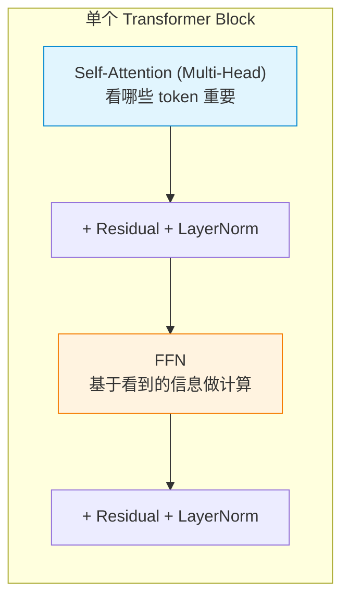

### 5. 什么是 Multi-Head Attention——多角度看问题

**Self-Attention 不止一组 QKV，而是多组并行**——典型 32-128 组。这就是"多头"。

不同的 head 可以学到不同的关注模式：

- **Head 1**：可能学到了"语法关系"（主语-谓语-宾语）
- **Head 2**：可能学到了"指代关系"（"它"指代什么）
- **Head 3**：可能学到了"长距离依赖"（开头的指令和后面的输出）
- **Head 4**：可能学到了"实体识别"（什么是人名、地名）

**对应用开发者的启示**：

- **模型同时从多个角度"读"你的 prompt**——结构、关键词、上下文、格式约束
- **如果你的 prompt 在不同维度上"打架"**（指令说"简短"但示例很长），不同 head 会关注不同部分，可能产生矛盾输出

### 6. 什么是 FFN——模型的"知识库"

Self-Attention 决定"看哪里"，**FFN（前馈神经网络）决定"看懂什么"**。

**直觉理解**：**FFN 是模型存储"事实性知识"的地方**。

```
"北京是中国的首都"
"水在 100 度沸腾"
"Python 用缩进表示代码块"

这些事实存在哪里？——存在 FFN 的权重里，不是 attention 层。
```

**FFN 的结构**（简化理解）：

```
FFN(x):
  hidden = gelu(x @ W1)  # 升维到 4 倍（4096 → 16384）
  out = hidden @ W2      # 降维回原维度（16384 → 4096）
  return out
```

- **占模型参数的大部分**（约 2/3）
- **静态的**——训练完成后不变，你不能通过 prompt 改变模型的知识
- **激活什么通路**——取决于 attention 找到的相关 token

**FFN 与 Attention 的协作**：

```
输入: "中国的首都是？"
  ↓
Self-Attention: 让"首都"重点关注"中国"
  ↓
FFN: 激活"中国首都"对应的知识通路（FFN 中某组权重）
  ↓
输出 logits: "北京"的分数最高
```

**对应用开发者的关键事实**：

- **few-shot 本质上是帮 attention 定位相关 FFN 通路**——不是教新知识，是激活已有的知识提取路径
- **如果模型"幻觉"了**——通常是 attention 没找到正确的 token，FFN 激活了错误的通路
- **设角色、给定义**——是在 attention 层帮模型锁定正确的 FFN 通路

### 7. 什么是 Layer 堆叠——多层 Transformer

**单层 Transformer 做不了复杂推理**。模型由几十到上百层 Transformer 叠加：

- **底层**（如第 1-10 层）：关注词的语法和表面关系
- **中层**（如第 10-30 层）：关注语义和实体关系
- **高层**（如第 30-80 层）：关注抽象指令和任务意图

**对应用开发者的启示**：

- **任务复杂度决定需要多少层**——简单任务可能只需要底层激活，复杂推理需要高层
- **好的 prompt 同时在多层起作用**——底层看到词汇、中层看到结构、高层看到意图
- **CoT 为什么有效**——把一个需要高层推理的问题拆成多个底层+中层的步骤

---

## 主题三：模型怎么"写"输出

> **这一节回答的问题**：处理完所有层后，模型怎么把内部表示变成一个个 token 输出？

### 8. 什么是自回归生成 + Softmax + Sampling——"逐 token 输出"的完整机制

**核心事实**：LLM 不是"读完 prompt 后一次性写出答案"。它是**一个字一个字地生成**，每次只生成一个 token（一个词或一个字符片段），然后把这个新 token 加回去，再生成下一个。

**举个例子**——你想让模型回答"中国的首都是哪座城市？"：

```mermaid
flowchart LR
    P["prompt: 中国的首都是哪座城市？"]
    P -- 生成 --> T1["北"]
    T1 -- 拼到末尾 --> P2["prompt + 北"]
    P2 -- 生成 --> T2["京"]
    T2 -- 拼到末尾 --> P3["prompt + 北 + 京"]
    P3 -- 生成 --> T3["市"]
    T3 -- 拼到末尾 --> P4["prompt + 北 + 京 + 市"]
    P4 -- 生成 --> E["END"]
    E --> Result["最终输出: 北京市"]

    style P fill:#f0f0f0,stroke:#666
    style P2 fill:#f0f0f0,stroke:#666
    style P3 fill:#f0f0f0,stroke:#666
    style P4 fill:#f0f0f0,stroke:#666
    style T1 fill:#fff3e0,stroke:#f57c00
    style T2 fill:#fff3e0,stroke:#f57c00
    style T3 fill:#fff3e0,stroke:#f57c00
    style E fill:#ffebee,stroke:#c62828
    style Result fill:#e8f5e9,stroke:#388e3c
```

**递推关系**：

- 第 1 步的输入 = P（prompt），输出 = T1（北）
- 第 2 步的输入 = **P + T1**（= P2），输出 = T2（京）
- 第 3 步的输入 = **P + T1 + T2**（= P3），输出 = T3（市）
- 每一步的输入 = **上一步的输入 + 上一步的输出**

这就是 "**regressive（回归）**" 的本意——**用自己之前的输出回归（成为）下一步的输入**。

**这就是"自回归"（autoregressive）**：

- **auto** = 自己
- **regressive** = 回归（用自己之前的输出作为输入）

每生成一个新 token，模型都把"目前为止生成的所有内容"当作新的输入，再决定下一个 token。

#### Softmax + Sampling：怎么"选"下一个 token

模型处理完所有层后，输出**一个向量**，对下一个 token 做选择：

```
logits（最后一层的原始分数）: [2.5, 1.8, 1.2, 0.5, -1.0]  # 5 个候选 token 的分数
       ↓
Softmax 转成概率: [0.65, 0.32, 0.18, 0.09, 0.02]  # 总和为 1
       ↓
采样（Sampling）: 按概率选一个 → "今天"
```

**Temperature** 控制 Softmax 的"锐度"：

```
T = 0.1: 极度集中（概率都压在最高分上）  → 输出确定
T = 1.0: 标准（按训练分布）              → 自然
T = 2.0: 几乎均匀（高分的优势被稀释）    → 输出多样
```

#### 为什么"评分并行"和"选 token 串行"要分开看？

```python
# 伪代码：单步生成（看起来简单，但内部有并行 + 串行两部分）

# === 并行阶段（GPU 一次性算完所有候选 token 的概率）===
# 假设词表有 10 万个 token
logits = model.forward(input_ids)        # GPU 并行：所有 token 的分数
probs = softmax(logits / temperature)    # GPU 并行：所有 token 的概率
# 此时：probs[0]=0.02, probs[1]=0.15, probs[2]=0.40, ... 10 万个值
# 全部算完了

# === 串行阶段（按概率选 1 个 token）===
top_k_filter = probs.top_k(50)           # 选 top 50
next_token = sample(top_k_filter)         # 选 1 个
# 必须等这一步完成才能开始下一步
```

**"并行"和"串行"在不同层次**：

- **GPU 算子层**：一次 attention、一次 softmax 都是**矩阵并行**
- **自回归 token 层**：每生成 1 个新 token 都要等上 1 个完成，**这是串行的**

**KV Cache 的存在理由和"并行"无关**——它解决的是另一个问题：避免重算历史 token 的 K 和 V。具体看 §2 KV Cache。

#### 为什么这对你重要？

1. **每个 token 依赖前一个 token**——但**不是简单串行**。现代 LLM 在每一步的"评分阶段"是 GPU 并行的，但在"选 token 阶段"是串行的
2. **每一步都重新跑 attention**——所以**输出越长越慢**（自回归的 token 越多，attention 计算越多）
3. **生成的每个 token 都进入"对话历史"**——你的 prompt 在 KV Cache 里被反复读取
4. **CoT（思维链）有效**——因为每一步推理的 token 都进入 context，后续生成能看到前面的推理

**Temperature 选择**：
- **T=0**：代码生成、数学（要稳定）
- **T=0.7-1.0**：自然语言生成（要自然）
- **T=1.5+**：创意写作（要多样性）

### 9. 自注意力 vs 自回归：两个容易混淆的概念

**一句话区分**：

- **自注意力（Self-Attention）** = 模型**怎么读** context 的机制（"看哪些 token"）
- **自回归（Autoregressive）** = 模型**怎么写**下一个 token 的策略（"按什么顺序生成"）

它们描述的是**两个不同维度**的事情：

| 维度 | 自注意力 (Self-Attention) | 自回归 (Autoregressive) |
|------|--------------------------|--------------------------|
| **回答的问题** | 处理一个 token 时，**应该看其他哪些 token**？ | 生成下一个 token 时，**按什么顺序**？ |
| **作用阶段** | 处理 input 的 attention 计算阶段 | 输出 token 的生成阶段 |
| **方向性** | **双向**（每个 token 看所有其他 token）| **单向**（每个新 token 只能看自己和之前的） |
| **类比** | 读一篇文章时"反复回看上下文" | 写作时"从左到右一个一个字写" |
| **对应 prompt 工程** | 决定"角色设定/few-shot 怎么影响理解" | 决定"CoT 怎么逐步展开" |

**自注意力的方向性问题——Causal Mask**：

虽然叫"自"注意力，但标准 Self-Attention 是**双向**的——每个 token 可以看所有其他 token（包括未来位置）。

但生成时是**单向的**——因为生成下一个 token 时未来还不存在。这个单向性不是 Self-Attention 本身的特性，是通过 **Causal Mask（因果掩码）** 强制实现的：

```python
# 训练和理解时用双向 Self-Attention
attention_scores = Q @ K.T  # 双向：每个 token 跟所有 token 算相似度

# 生成时用 Causal Mask 变成单向
mask = torch.triu(torch.ones(seq_len, seq_len), diagonal=1)  # 上三角
attention_scores = attention_scores.masked_fill(mask, -inf)
# 现在 "苹果" 看不到 "很" 之后的 token
```

**对应现象速查表**：

| 现象 | 跟 Self-Attention 有关 | 跟自回归有关 |
|------|----------------------|--------------|
| 模型"理解"上下文（角色设定、Few-shot） | ✅ | |
| 上下文长注意力分散（KV Cache 增长） | ✅ | ✅（每步重算） |
| CoT 思维链有效 | | ✅（中间步骤可被后续看到） |
| 上下文太长变慢 | ✅ | ✅ |
| 模型按 token 一个一个输出 | | ✅ |
| 推理模型慢（生成思考 tokens） | | ✅ |

---

## 主题四：现代 LLM 为什么都是 Decoder-Only

> **这一节回答的问题**：在原始 Transformer 论文（2017）中，模型分两部分：**Encoder**和**Decoder**。但今天你用的所有主流大模型（GPT-4/5、Claude 4、Gemini、DeepSeek-V3、Qwen3、LLaMA-4）**都是 Decoder-Only**——这是为什么？

### 10. 一句话区分

- **Encoder（编码器）** = **读** context 的组件——把输入"理解"成一个向量表示
- **Decoder（解码器）** = **写**输出的组件——基于已读到的内容，**逐 token 生成**回答
- **Encoder-Decoder** = 两者都有（原始 Transformer）
- **Decoder-Only** = 只要 Decoder（现代所有 LLM）

### 原始 Transformer：Encoder-Decoder 架构

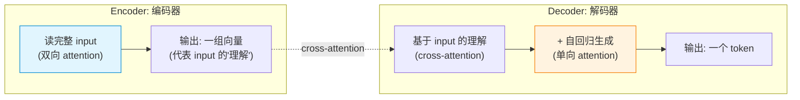

**关键特征**：

- **Encoder**：用**双向** Self-Attention——每个 token 能看所有其他 token（包括未来位置）
- **Decoder**：用**单向** Self-Attention（Causal Mask）+ **Cross-Attention**（关注 Encoder 的输出）

**典型应用**：翻译（"Hello" → "你好"）、摘要（长文 → 短文）——这类"输入完整、输出也完整"的任务

### 现代 LLM：Decoder-Only 架构

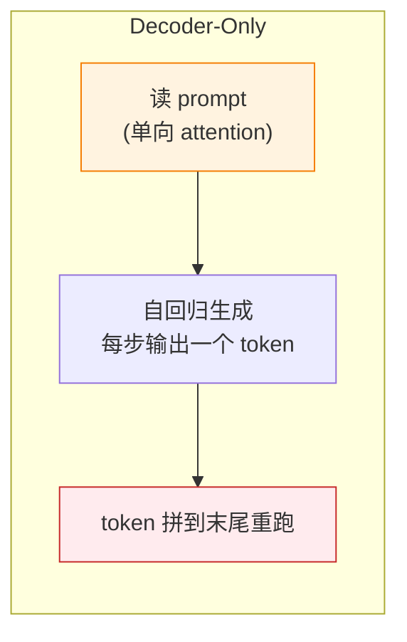

**关键特征**：

- **只有 Decoder**——Encoder 那一半被砍掉
- **仍然用单向** Self-Attention（Causal Mask）
- **没有 Cross-Attention**——不需要，因为没有"独立"的输入要关注
- 输入和输出**用同一套机制**处理——把 prompt 也当作"还没生成完的输出"的一部分

### 为什么现代 LLM 几乎都选 Decoder-Only？

| 原因 | 解释 |
|------|------|
| **1. 训练目标统一** | Decoder-Only 的训练目标就是"预测下一个 token"——所有文本（包括 prompt、回答、代码、对话）都可以塞进同一个目标，无需区分"输入"和"输出" |
| **2. 涌现能力强** | 扩大规模时 Decoder-Only 出现了"涌现能力"（in-context learning、chain-of-thought、function calling），Encoder-Decoder 没有这种涌现 |
| **3. 数据利用率高** | 同一段文本既可以当"输入"（理解任务）又可以当"输出"（生成任务），训练数据利用率翻倍 |
| **4. Scaling 友好** | Decoder-Only 的 scaling law 更清晰——参数量/数据量/性能三者的关系更可预测 |
| **5. 工程简单** | 只有一套模型架构，无需考虑"何时用 encoder 何时用 decoder" |

### 历史上的"决胜"

- **2018-2019：Encoder-Decoder 时代**（T5、BART）——翻译/摘要很强
- **2020 之后：Decoder-Only 时代**——GPT-3（175B）证明超大 Decoder-Only 全能
- **现在**：所有主流 LLM（GPT-4/5、Claude 4、Gemini、DeepSeek-V3、Qwen3、LLaMA-4、Mistral 3）都是 Decoder-Only

### 实际开发中的意义

**作为应用开发者，你不需要在 Encoder / Decoder 之间选**——主流 API（OpenAI、Anthropic、Google、DeepSeek）都给你 Decoder-Only 的统一接口：

```
input:  prompt
output: 生成的 token（逐个）
```

但理解这个区别能帮你理解：

- **为什么所有 API 都是"流式输出"**——Decoder-Only 自回归生成的天然特性
- **为什么 encoder 风格的"理解"任务也能用 LLM 做**——Decoder-Only 的 Self-Attention 权重本身是**双向**的（任意两个 token 之间都能算相似度），只是在"生成"模式下加了 Causal Mask 变成单向。在做"理解"任务（分类、总结、抽取）时，可以直接**暴露全部 prompt 让模型做双向 attention**，不需要生成多个 token——这就相当于把 Decoder-Only 当 Encoder 用。详见上面"双向能力 vs 单向约束"的讨论。
- **为什么 prompt 中加 context 能让模型"理解"更好**——本质上是 Decoder-Only 的 attention 在 prompt 部分做了"理解"工作

### 总结成一张图

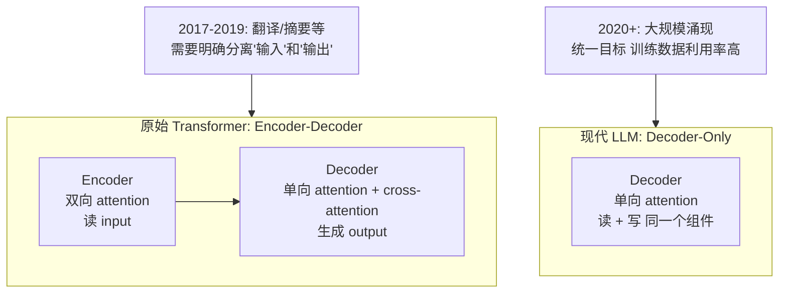

**结论**：现代 LLM 选 Decoder-Only 不是因为"更好"，是因为"更通用、更适合大规模训练"——一个架构既能做理解也能做生成，还能通过 prompt 在两者间切换。

---

# 第二部分：理解"什么是 KV Cache"

**KV Cache 是 LLM 推理的核心性能瓶颈，是连接架构和工程的关键概念。**

## 从自回归推导出 KV Cache 的必然性

KV Cache 不是"一个可选的性能优化"——它是**自回归生成 + Self-Attention 数学特性的必然产物**。

**推理链条**：

```
自回归生成决定了：
  → 每步生成 1 个新 token
  → 新 token 拼到 prompt 末尾作为下一步的输入

Self-Attention 的计算方式决定了：
  → 每步都要算"新 token 和所有旧 token 的 attention"
  → 每个 token 的 attention 分数 = Q · K（query 和所有 key 的相似度）

结合起来：
  第 1 步：输入 [t1, t2, t3]，算 K[t1], K[t2], K[t3]
  第 2 步：输入 [t1, t2, t3, t4]
     → 需要 K[t1], K[t2], K[t3], K[t4]
     → 但 K[t1], K[t2], K[t3] 在第 1 步已经算过了！

结论：如果不缓存，每步都要重算所有历史的 K 和 V。
```

**这个"重算"的成本有多大？**

```
第 1 步：算 K[t1], K[t2], K[t3]                     → 3 次 K 投影
第 2 步（没缓存）：重算 K[t1], K[t2], K[t3] + 算 K[t4] → 4 次 K 投影
第 3 步（没缓存）：重算 K[t1], K[t2], K[t3], K[t4] + K[t5] → 5 次 K 投影
...
第 N 步（没缓存）：算 N + 1 个 K 投影
总计算量：3 + 4 + 5 + ... + (N+2) = O(N²)  ← 不可接受

有 KV Cache：
第 1 步：算 K[t1], K[t2], K[t3] → 缓存
第 2 步：只算 K[t4] → 追加到缓存
第 3 步：只算 K[t5] → 追加到缓存
...
总计算量：N  → 可接受
```

**KV Cache 的存在解决了 O(N²) 重算问题**，但它带来了新的问题——**显存占用随 token 数线性增长**。

这就是为什么说 KV Cache 是"连接架构和工程的关键概念"——它用一个显存问题换掉了一个计算问题，**代价和收益都是 O(N) 级别的**。空间换时间的思想。

## Prefill 和 Decode 是两阶段

KV Cache 的生命周期分为两个截然不同的阶段：

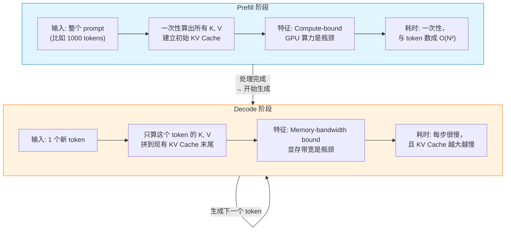

| 阶段 | Prefill | Decode |
|------|---------|--------|
| **做什么** | 处理整个 prompt，建立 KV Cache | 一个个生成新 token，追加到 KV Cache |
| **输入量** | 整个 prompt（1000+ tokens） | 1 个 token |
| **计算模式** | 矩阵乘法，GPU 并发算所有 token | 1 个 token 的 QKV，之后读取整个 KV Cache |
| **瓶颈** | **Compute-bound**（GPU 算力利用率高） | **Memory-bandwidth bound**（GPU 算力闲置，卡在搬运数据） |
| **KV Cache 变化** | 从空到充满 | 逐步增长 |
| **对延迟的影响** | prompt 越长→prefill 越久 | 已生成的 token 越多→decoder 越慢 |
| **对成本的影响** | 一次性，但长 prompt 很贵 | 每步累加，输出越长越贵 |

## Decode 阶段为什么越来越慢

是的——你每生成一个新 token，"已生成的 token 数"增加 1，KV Cache 体积增加一层（模型有 N 层，所以是 N 个 K, V 向量）。

生成第 100 个 token 时，需要**读取 99 个历史 token 的 KV Cache**（约 200 万+ 个数值）。生成第 1000 个 token 时，需要 **读取 999 个历史 token**。

**关键在于 Decode 阶段的计算特点**：

```
Decode 阶段的 Attention 计算：
  attention = softmax(Q_new @ K_cache^T) @ V_cache

  Q_new:    [1, head_dim]           ← 新 token 的 Query
  K_cache:  [seq_len, head_dim]     ← 整个历史（不断增长）
  V_cache:  [seq_len, head_dim]     ← 整个历史（不断增长）
```

这个矩阵乘法的**计算量很小**（1 × seq_len × head_dim），但**数据量很大**（seq_len 越长，从显存搬到 GPU 核心的数据就越多）。

**GPU 的利用率**在 Decode 阶段非常低——因为大部分时间花在**等数据从显存搬过来**，而不是**真的在算**。

## KV Cache 的显存成本公式

```
KV Cache 显存 = 2 × L × H × D × S × bytes_per_element
```

| 参数 | 含义 | 典型值 |
|------|------|--------|
| L | Transformer 层数 | 32-80 |
| H | 注意力头数 | 32-96 |
| D | head 维度 | 64-128 |
| S | 序列长度（token 数） | 4K-128K |
| bytes | 每个浮点数字节数 | 2（FP16）或 1（FP8 量化） |

**典型实例**（GPT-4 估计配置 120 层）：

```
2 × 120 × 96 × 128 × S × 2 = 5.9 MB / token

100K tokens ≈ 590 GB
```

你调用 API 时，这个 590GB 由**服务商承担**，这就是为什么：
- 长上下文 API 价格高（需要的显存是短上下文的 10-100 倍）
- 你的并发请求会**共享服务商的显存池**——每个请求的 KV Cache 占掉一部分可用显存

## 连续批处理（Continuous Batching）对 KV Cache 的影响

> 这一节对理解"为什么并发请求越多，响应越慢"很重要。

现代推理服务（vLLM、SGLang、TGI）都用**连续批处理**（Continuous Batching）：

- 传统批处理：等所有请求的生成都完成，再处理下批
- 连续批处理：一个请求生成完 1 个 token 后立即处理其他请求的 token

**KV Cache 的影响**：

```
显存池 = 服务商单张 GPU 的显存（比如 A100 80GB）

并发 10 个 20K token 的请求：
每个请求的 KV Cache = 5.9 MB × 20K ≈ 120 GB
10 个请求 = 1200 GB → 远超 80GB → 这 10 个请求不能同时处理

并发 5 个 2K token 的请求：
每个请求的 KV Cache = 5.9 MB × 2K ≈ 12 GB
5 个请求 = 60 GB → 可以在 80GB 显存中同时处理
```

这就是为什么：
- 服务商限制最大并发连接数
- **长 prompt + 长生成 = 高延迟 + 高成本**
- **并发查询短任务比并发查询长任务更省钱**

## Prompt Cache / Prefix Caching

**Prompt Cache**（也叫 Prefix Caching）：把已经算过的 KV Cache 保留一段时间（通常 5 分钟到几小时），下次同样的 prompt 前缀来时**直接复用**前缀部分的 KV，只算新部分的 K, V。

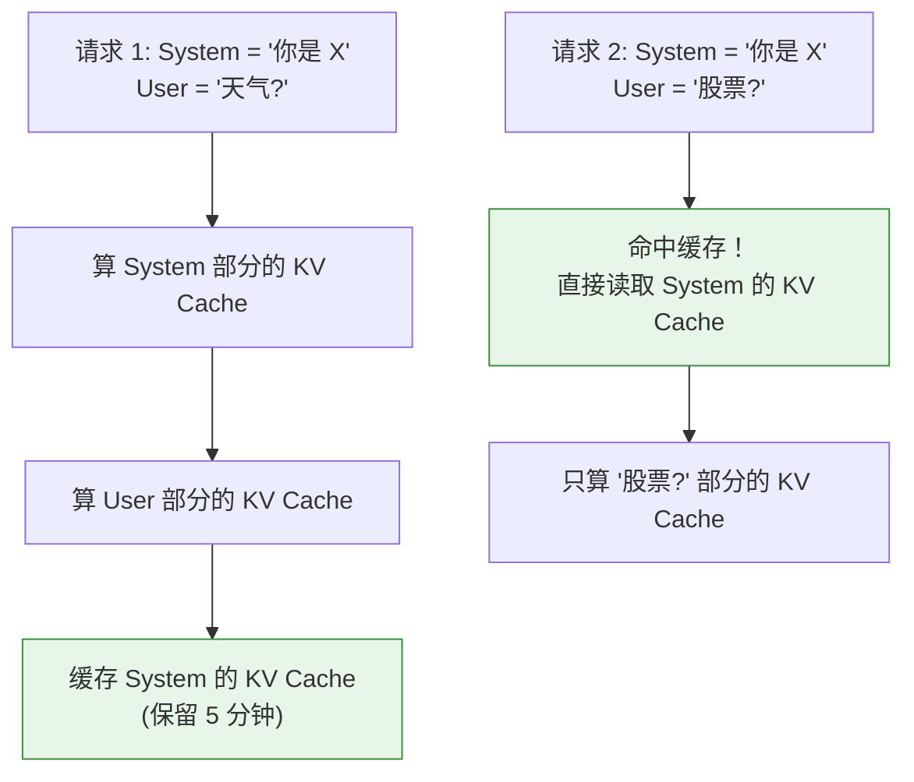

**不同缓存策略的差异**：

| 策略 | 缓存粒度 | 典型 TTL | 适用场景 |
|------|---------|---------|---------|
| **系统级 cache** | 所有请求共享 | 5-60 分钟 | System Prompt 稳定 |
| **用户会话级 cache** | 同用户请求共享 | 会话生命周期 | 多轮对话复用早期上下文 |
| **前缀精确匹配** | 完全相同的前缀 | 按需要 | 缓存命中率高 |
| **语义近似匹配** | 相似内容（NLP 匹配） | 按需要 | 命中率更高但实现复杂 |

**对应用开发者的启示**：

- **System Prompt 越稳定越好**——不要在 system 消息里塞时间戳、随机 ID。`[System: "你是 X, 当前时间: 2026-06-24"]` 每次不同，缓存永远命中不了
- **工具定义放在 system 消息里**——所有请求都共享这一段 KV Cache
- **长 system prompt 是"一次性投资"**——第一次调用贵，后续缓存命中后几乎免费
- **前缀稳定的 KV Cache 复用**是 vLLM / SGLang 等推理服务的标准特性
- **生产环境部署时建议预热 KV Cache**——把 system prompt 提前跑一次，建立缓存

## 现代 LLM 的 KV Cache 优化（减少显存占用）

为了在有限的显存中支持更长的上下文，业界做了大量优化：

### 1. GQA / MLA：减少 KV Cache 存储量

DeepSeek-V3 的 MLA（Multi-head Latent Attention）和 Llama 3 的 GQA（Grouped Query Attention）都通过**共享 KV** 来减少显存占用：

| 机制 | 原理 | KV Cache 减少倍数 | 代表模型 |
|------|------|----------------|---------|
| MHA（标准） | 每个 head 独立的 K, V | 1x（基线） | Llama 2 70B、GPT-3 |
| GQA | 多个 Q head 共享一组 KV | 2-8x | Llama 3 8B/70B、Gemma 2 |
| **MLA** | 把 KV 压缩到低维潜空间 | **32x** | **DeepSeek-V3** |

### 2. PagedAttention（vLLM）

把 KV Cache 切成固定大小的"页"（类似 OS 虚拟内存）：

- **显存利用率从 ~40% 提升到 ~90%**（消除碎片）
- 支持 **Prefix Caching**——多个请求共享相同 system prompt 的 KV Cache
- 支持 **Continuous batching**——动态调度 KV Cache 页

### 3. KV Cache 量化

把 FP16（16 位浮点）的 KV Cache 量化为 INT8（8 位整数）或 INT4：

```
FP16 KV Cache:   5.9 MB / token (100%)
INT8 KV Cache:   2.9 MB / token (50%)    ← 质量损失很小
INT4 KV Cache:   1.5 MB / token (25%)    ← 质量损失可接受
```

大多数生产推理服务默认启用 KV Cache 量化。

## 工程层面的总结

```
KV Cache 是"用显存换速度"的产物：
  ↓
没有它：每步重算 O(N²)，再大的显存也救不了
  ↓
有了它：每步只需 1 个 QKV + 读取历史 K,V
  ↓
代价：显存占用 = O(L × H × D × S)
  ↓
现代优化：MLA / GQA → 减少存储
          PagedAttention → 消除碎片
          KV Cache 量化 → 压缩精度
          Prefix Caching → 复用结果
```

---

# 第三部分：从通用架构到 DeepSeek-V3——一个真实大模型怎么实现

前面讲了"教科书版"的 Transformer——标准 Tokenization、Self-Attention、Dense FFN。但真实的大模型会在教科书架构上做大量改造。

**为什么用 DeepSeek-V3 做对照？**

1. **完全开源**——架构细节全部公开（DeepSeek-V3 Technical Report）
2. **架构有代表性**——用了当今主流的多种优化（MLA / MoE / FP8）
3. **正在被广泛使用**——DeepSeek App、DeepSeek API、各种开源衍生模型

**真实模型 = 教科书架构 + 工程优化**。理解了这个等式，你就能把前面的核心概念（Attention、FFN 等）跟真实模型的技术选择对应起来。

## DeepSeek-V3 的整体参数

| 指标 | 数值 | 对比教科书标准变化 |
|------|------|------------------|
| **总参数** | 671B | 极大 |
| **激活参数**（每次推理用到的） | **37B** | **只有总参数的 5.5%（MoE 效果）** |
| 层数 | 61 层 | 标准 |
| 隐藏维度 | 7168 | 标准 |
| 注意力头数 | 128 头 | 标准 |
| 专家数（MoE） | 256 路由 + 1 共享 | **关键创新** |
| 每 token 激活专家 | 8 个 | **关键创新** |
| 上下文窗口 | **128K** | 远超原始 Transformer |
| 位置编码 | **YaRN**（RoPE 扩展） | RoPE + 外推 |
| 注意力机制 | **MLA（Multi-head Latent Attention）** | **核心创新** |
| 训练精度 | **FP8** | 前沿 |

## 关键创新速览：DeepSeek-V3 在改什么

在深入每个组件之前，先总览 DeepSeek-V3 对教科书的四大改动：

| 教科书组件 | 标准做法 | DeepSeek-V3 的做法 | 带来的好处 |
|-----------|---------|-------------------|-----------|
| **位置编码** | 训练多长就只能用多长 | **YaRN 外推**：训练 4K，推理 128K | 超长上下文 |
| **Self-Attention** | 每头独立 K,V，KV Cache 大 | **MLA**：把 K,V 压缩到低维潜空间 | KV Cache 减小 32x |
| **FFN** | 每次推理用全部参数 | **DeepSeekMoE**：256 专家，每 token 只选 8 个 | 总参数大但激活参数小，成本低 |
| **训练精度** | FP16/BF16 | **FP8 混合精度** | 训练成本低 |

下面逐一展开。

## DeepSeek-V3 各个组件的真实实现

### 1. Tokenization：用 SentencePiece

DeepSeek-V3 用 **SentencePiece**（不是 GPT 的 BPE）。

- **优势**：把空格当作普通字符处理，用同一套词表处理多语言
- **代价**：英文一个词 ≈ 0.6-0.8 token，比 GPT-4o 的 BPE 更"碎片"
- **对应用开发的启示**：从 GPT 切到 DeepSeek，**相同文本的 token 数会增加 20-30%**，成本估算需重算

### 2. Embedding：7168 维向量空间

每个 token 映射成 7168 维浮点数向量。

- **比 GPT-4 推测的 12288 维小**——因为 MoE 把"知识"分散到专家 FFN 里，embedding 不需要装那么多
- **词表大小 100K+**——支持多语言

### 3. Positional Encoding：YaRN（RoPE 扩展）

DeepSeek-V3 用 **RoPE**（旋转位置编码），但支持到 128K 上下文，远超训练时的 4K。

**怎么做到的？**

- 训练时只用 4K 上下文训练位置编码
- 推理时用 **YaRN** 外推到 128K
- 核心思想：**对长距离的 RoPE 频率做"温度缩放"**——保留近距离精度，放松远距离精度

**对应用开发的启示**：

- 128K 窗口**真实可用**——不是"理论上 128K 但 100K 后就不行了"
- 但远距离仍有 Lost in the Middle 效应——关键信息仍要放靠近开头/结尾，跟位置编码优化无关

### 4. Self-Attention：MLA（Multi-head Latent Attention）——核心创新

这是 DeepSeek-V3 **最重要的架构创新**。它直接回答了第二部分提出的问题——"KV Cache 到底有多贵？"和"怎么把它降下来？"

**标准 MHA 的问题**：

```
标准 Self-Attention（MHA）：
  每层每个 head 独立存 K, V
  KV Cache = [layer, head, seq_len, head_dim]

DeepSeek-V3 配置（61 层，128 头，head_dim=128）：
  每 token 的 KV Cache = 2 × 61 × 128 × 128 × 2 bytes ≈ 4 MB
  100K tokens → 400 GB 显存  ← 灾难
```

**MLA 的解法**：把 K,V 压缩到一个**低维潜空间（latent space）**。

```
标准 MHA：
  KV Cache: [layer, head, seq_len, head_dim]    ← 每个 head 独立

MLA：
  KV Cache: [layer, seq_len, latent_dim=512]    ← 所有 head 共享压缩向量
  → 比 MHA 小 128×128/512 = 32 倍
```

**MLA 的精髓**：

- **存储**：只存低维压缩向量（KV Cache 从 4 MB/token 降到 ~130 KB/token）
- **计算**：需要 attention 时，从压缩向量恢复出 K, V 做计算
- **质量**：压缩有损，但通过精心设计的恢复矩阵，**质量接近标准 MHA**

**这对应用开发者意味着**：

- **长上下文成本大幅降低**——DeepSeek-V3 用 MLA 把 100K tokens 的 KV Cache 从 400 GB 压到 ~12 GB
- 你的**对话可以更长**——因为服务商能承受的显存成本更低
- **别忘了 Lost in the Middle**——MLA 只解决 KV Cache 大小问题，不解决注意力分散问题

### 5. FFN：DeepSeekMoE——另一个核心创新

**传统 FFN**（教科书版）：

```
FFN(x):
  hidden = gelu(x @ W1)  # 升维到 4 倍
  out = hidden @ W2      # 降维回原维度
  # 每次推理都用全部参数
```

**DeepSeekMoE**（把"知识库"拆成 256+1 个"专家"）：

```
MoE_FFN(x):
  # 1. Router 决定"这个 token 适合哪些专家处理"
  router_scores = softmax(x @ W_router)    # 256 个专家的得分
  selected = top_k(router_scores, k=8)      # 只选分数最高的 8 个

  # 2. 只激活选中的 8 个专家
  for expert in selected:
    output += expert(x) * router_scores[expert]

  return output
```

**DeepSeekMoE 与标准 FFN 的差异**：

| 维度 | 标准 Dense FFN | DeepSeekMoE |
|------|--------------|-------------|
| 每次激活参数比例 | **100%** | **3.5%（8/256 专家 + 1 共享）** |
| 总参数 vs 激活参数 | 总=激活 | 总 671B，激活 **37B** |
| 推理成本 | 与总参数成正比 | 与激活参数成正比 |
| 训练成本 | 与总参数成正比 | 与**所有专家**的总参数成正比 |

**为什么 DeepSeek-V3 的 API 便宜**？

```
每次推理成本 ≈ 激活参数 × 算力单价

稠密模型（如 LLaMA-3 70B）：激活 70B × $X = 70BX
MoE 模型（如 DeepSeek-V3）：激活 37B × $X = 37BX  ← 约一半
```

这就是 DeepSeek API 能做到"白菜价"的根本原因。

**对应用开发的启示**：

- MoE 模型 API **按激活参数定价**，不是按总参数
- MoE 对**批量请求更友好**——多个请求可以共享专家 FFN 参数
- **专家分工在训练中自然涌现**——某些专家专攻代码，某些专攻数学，某些专攻中文

### 6. Layer 堆叠：61 层，前 3 层是 Dense

DeepSeek-V3 有 61 层，但**不是所有层都用 MoE**：

```
Layer 1-3:    [MLA] + [Dense FFN]      ← 提取通用基础特征
Layer 4-61:   [MLA] + [MoE FFN]        ← 按领域分工
```

**为什么前 3 层用 Dense？**

- 底层需要稳定的"通用特征提取"——Dense FFN 更稳定
- 高层需要按领域"专家分工"——MoE FFN 更高效

### 7. 训练精度：FP8 混合精度

DeepSeek-V3 是**首个大规模成功训练 FP8 的大模型**。

| 精度 | 每参数字节数 | 说明 |
|------|------------|------|
| FP32 | 4 bytes | 训练标准精度 |
| FP16 / BF16 | 2 bytes | 推理常用 |
| **FP8** | **1 byte** | **DeepSeek 创新，显存减半** |

- 大部分计算用 FP8（快、省显存）
- 关键部分（如 Loss 计算）保留 FP32（保证稳定）
- 显存占用减半 → **能训练更大的模型**
- 训练成本约 558 万美元（相比 GPT-4 推测超 1 亿美元）

## DeepSeek-V3 vs 标准 Transformer 对照表

| 组件 | 教科书标准 | DeepSeek-V3 | 对应用开发者的影响 |
|------|-----------|-------------|-----------------|
| Tokenization | BPE | SentencePiece | 从 GPT 切 DeepSeek **token 数 +20-30%** |
| 位置编码 | 绝对 RoPE | **YaRN（RoPE 扩展）** | **128K** 上下文真实可用 |
| Self-Attention | MHA | **MLA** | KV Cache **减小 32x**，长上下文便宜 |
| FFN | Dense | **DeepSeekMoE**（256 专家） | 总参数 671B，**激活仅 37B**，API 便宜 |
| 训练精度 | FP16/BF16 | **FP8** | 训练成本低 → API 更便宜 |
| 上下文窗口 | 4K-8K | **128K** | 长文档/长对话可处理 |

## DeepSeek-V3 对 AI 应用开发者的总结

四条你可以直接用的结论：

1. **为什么便宜**：MoE 让激活参数仅 37B（总 671B 的 5.5%），每次推理只算激活参数
2. **为什么能长上下文**：MLA 把 KV Cache 从 400 GB（100K tokens）压缩到 ~12 GB，显存需求降 32 倍
3. **为什么代码/数学强**：MoE 专家在训练中自然分工，某些专家专攻代码/数学/中文
4. **最佳实践**：放心用长 system prompt、结构化输出、长程对话、COT 思维链——MLA 和 MoE 让这些变得便宜

## 小结：抽象架构 vs 真实模型

| 你在文档里看到的 | 真实 DeepSeek-V3 |
|-----------------|-----------------|
| Tokenization（概念） | **SentencePiece**（实现） |
| Self-Attention（MHA） | **MLA**（KV Cache 压缩 32x） |
| FFN（单层全连接） | **DeepSeekMoE**（256 专家 + 路由） |
| 32 层 Transformer | **61 层** Transformer |
| FP32 / FP16 精度 | **FP8 混合精度** |
| 4K 上下文 | **128K**（YaRN 外推） |

**核心骨架不变**：

```
Tokenization → Embedding → Positional Encoding → Self-Attention + FFN × N → Output → Softmax → 自回归
```

理解了这个骨架，看任何模型的技术报告都不会迷路——只是某些组件做了工程优化（MLA 替 MHA、MoE 替 FFN）。

# 第四部分：工具调用（Tool Calling）——大模型原生支持的特殊机制

你每天在用的 Agent 能力（让模型调工具）看起来像是模型"主动决定调外部系统"。**实际上这是大模型原生支持的一种特殊输出格式**——不是真的"调用"了什么，而是输出了一个结构化的"工具调用请求"，由你的代码负责执行。

## 1. 工具调用是"输出 JSON"不是"调 API"

**最反直觉的事实**：当模型说"我要调用 search 工具"时，它**并没有真的调用任何东西**，它只是输出了一个结构化 JSON：

```json
{"name": "search", "arguments": {"query": "Transformer 架构"}}
```
**这是你的代码**（LangChain、Agent 框架、或者你自己写的逻辑）**看到这段 JSON 后**，**真的去执行**那个工具。

模型只负责生成 JSON，不负责真的调用外部 API。

> **一个重要区分：结构化输出 ≠ 工具调用**
>
> | 概念 | 特点 | 例子 |
> |------|------|------|
> | **结构化输出**（JSON mode） | 模型输出被约束为 JSON 格式，但**内容自由** | `{"summary": "..."}`、`{"tags": [...]}` |
> | **工具调用**（Tool Calling） | 模型输出**特定的 JSON 结构**（`name`+`args`），且**与工具 Schema 绑定** | `{"name": "get_weather", "arguments": {"city": "北京"}}` |
>
> **关键区别**：结构化输出只保证格式是 JSON，不限制内容是什么。工具调用除了格式还**约束内容必须匹配工具定义**（工具名和参数类型）。一个模型可能支持 JSON mode 但不支持 tool_calls（比如某些小模型通过 prompt 可以输出 JSON，但不会正确路由到指定工具）。**支持 tool_calls 的模型必然支持结构化输出，反之不一定。**

## 2. 大模型怎么支持工具调用——训练到推理的全链路

### 2.1 核心本质：工具调用 = 模型在 SFT 阶段学会的"结构化输出"

大模型支持工具调用**不是靠提示词**，而是靠**训练时专门做的微调（SFT，Supervised Fine-Tuning）**。

**训练阶段做了什么？**

让模型看大量这样的样本，学会在"需要查信息"的场景输出 JSON 而非自然语言：

```
用户: "今天北京天气？"
↓ 期望输出（训练时的标准答案）
assistant: {"name": "get_weather", "arguments": {"city": "北京"}}
↓ 然后给工具结果
tool: {"温度": 22, "天气": "晴"}
↓ 最后输出自然语言
assistant: "北京今天 22 度，晴天。"
```

模型看到几万条这样的样本后，就学会了：
1. **什么时候该输出 tool_calls**（用户问实时信息时）
2. **tool_calls 的 JSON 结构长什么样**（`{"name": ..., "arguments": ...}`）
3. **输出的 JSON 必须与工具的 JSON Schema 匹配**（参数名、类型）

### 2.2 推理时发生了什么——三步骤

当你在 Agent 中使用模型时，工具调用在模型内部实际经历三步：

```
第一步：你的代码把工具 Schema 拼到 System Prompt 末尾
  system = "你是助手。可用工具：[{'name': 'get_weather', 'parameters': {'city': {'type': 'string'}}}]"

第二步：模型进入自回归生成
  → Self-Attention 读到工具 Schema（在 prompt 的末尾附近）
  → FFN 激活"SFT 时学会的"工具调用通路
  → 输出 { → 输出 "name": → 输出 "get_weather" → 输出 "arguments": → 输出 "北京"

第三步：你的代码看到 tool_calls JSON → 真的去执行 → 把结果发回给模型
  → 模型看到工具结果 → 输出自然语言
```

**关键**：模型**不需要真的调用 API**，它只是**选择输出一个特定格式的 JSON**。那个 JSON 怎么执行，是你的代码的事。

### 2.3 模型怎么"决定"用哪个工具——注意力竞争

多个工具可用时，模型在自回归生成过程中做"选择题"：

```
Context 末尾（最近的 token 影响力最大）：
  ...[历史..., user: "今天北京天气？", 
    工具1描述: "搜索网络信息",
    工具2描述: "查询天气",    ← 这里 attention 分数最高
    工具3描述: "写文件"]

LLM 生成到 name: 时，下一步要选"工具名"这个 token
  
  self-attention 在三个工具描述之间分配权重
  → "天气" 的语义匹配度最高（因为用户问题也提到了"天气"）
  → "搜索网络信息" 匹配度中等
  → "写文件" 匹配度最低
    
  → 模型选 "get_weather" 作为输出
```

**这就是为什么工具 description 这么重要**——attention 权重决定模型选哪个，而 attention 权重取决于"用户问题"和"工具描述"的语义匹配度。

## 3. 一次完整的工具调用流程 + 真实数据结构

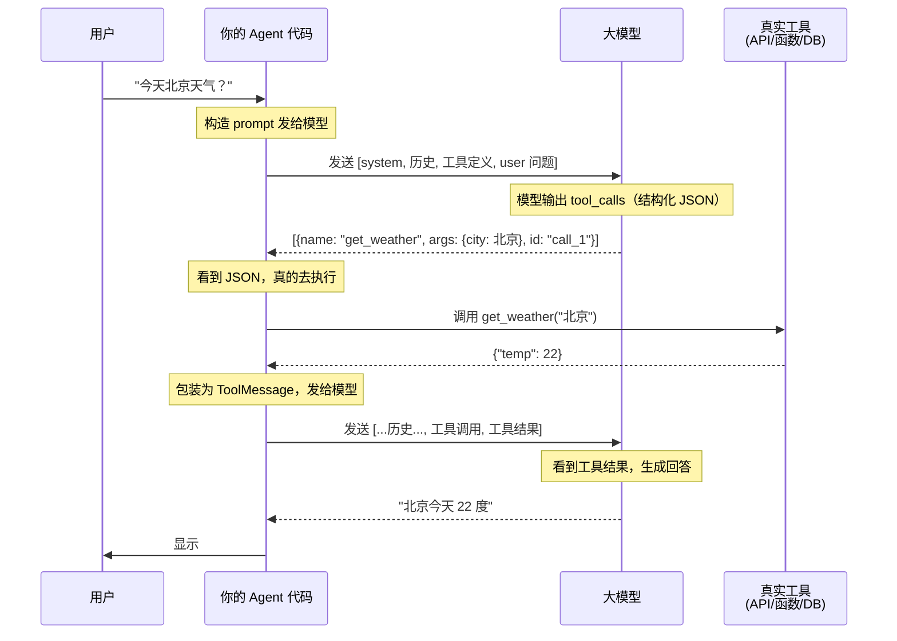

**真实数据结构**（LangChain v1，`langchain_core/messages/tool.py`）：

```python
# 模型输出——ToolCall
class ToolCall(TypedDict):
    name: str      # 工具名
    args: dict     # 参数
    id: str | None # 调用 ID（关联结果）

# 执行结果——ToolMessage
from langchain_core.messages import ToolMessage
tool_result = ToolMessage(
    content="22 度，晴天",
    tool_call_id="call_1",  # 对应 ToolCall 的 id
    status="success",
)

# 完整对话链
messages = [
    {"role": "assistant", "tool_calls": [{"name": "get_weather", "args": {"city": "北京"}, "id": "call_1"}]},
    {"role": "tool", "content": "22 度", "tool_call_id": "call_1"},
]
```

**关键事实**：
- 每次工具调用是**两次 LLM 调用**——一次输出 tool_calls，一次基于结果生成回答
- **`tool_call_id` 字段配对请求和结果**——特别在并行多个工具时区分

## 4. 并行调用与推理模型差异

**并行工具调用**：模型可以一次输出多个 tool_calls（如同时查北京+上海+广州天气），彼此独立可并行执行。

**推理模型调工具**：

| 模型类型 | 调用前的行为 | 特点 |
|---------|------------|------|
| 普通 Chat 模型（V3、GPT-4o） | 直接输出 tool_calls | 快、便宜 |
| 推理模型（DeepSeek-R1、o1） | 先输出 reasoning_content 思考，再输出 tool_calls | 准、贵 3-10 倍 |

## 5. 工具调用失败的五种原因

| 原因 | 表现 | 解决 |
|------|------|------|
| **工具描述不清楚** | 模型选错工具 | description 写具体使用场景和反例 |
| **参数 Schema 太复杂** | 模型输出 JSON 格式错 | 参数扁平化（避免嵌套 dict） |
| **工具太多（>20）** | 模型注意力分散 | 用 router agent 分层管理 |
| **模型不支持工具调用** | 模型不返回 tool_calls | 换支持 tool_calls 的模型；或通过**提示词模拟**（见附注） |
| **上下文太长 Schema 被截断** | 模型不记得有哪些工具 | 压缩上下文 |

## 6. 设计原则

```
1. description 是"模型的 prompt"——越具体，模型选得越准
2. Schema 越简单越好——扁平参数优于嵌套 dict
3. 工具数量控制在 5-10 个——多了注意力分散
4. 错误处理要返回给模型——让模型能根据错误调整
5. 参数命名要清晰——"query"比"q"好
```

## 小结

```
工具调用 = 模型输出结构化 JSON（tool_calls）+ 你的代码真的去执行

不是模型主动调外部系统
是模型说想做什么
你的代码听到后真的去做
```

**5 条关键事实**：
1. 不支持原生工具调用的模型可以通过**提示词模拟**（见附注），但精度不如原生支持
2. 工具 description 决定模型选得对不对——这是你的 prompt
3. JSON Schema 限制模型输出——它不会乱传参数
4. 每次工具调用是两次 LLM 调用
5. 推理模型调工具更准确但贵 3-10 倍

> **附：提示词模拟工具调用（不原生支持 tool_calls 时的替代方案）**
>
> 对不原生支持 `tool_calls` 输出的模型，可以在系统 prompt 里要求模型输出结构化 JSON，由你的代码解析后执行。
>
> ```python
> system = """你是助手。需要查询信息时，输出以下 JSON：
> {"tool": "工具名", "args": {参数}}
> 可用工具：
> - get_weather(city: string): 查询天气
> """
> response = llm.invoke(system + user_query)
>
> import json
> try:
>     tool_call = json.loads(response)
>     result = execute_tool(tool_call["tool"], tool_call["args"])
>     final = llm.invoke(system + user_query + "结果：" + result)
> except json.JSONDecodeError:
>     final = response  # 模型没输出 JSON，直接返回
> ```
>
> **对比**：
>
> | | 原生 Tool Calling | 提示词模拟 |
> |---|---|---|
> | 精度 | **高**（模型专门训练过 JSON 输出） | 低（易格式错误） |
> | 解析失败率 | **低**（API 层保证结构） | 高（需 fallback） |
> | 工具路由 | attention 精准选工具 | 凭记忆输出，易幻觉 |
> | 实现难度 | 框架封装 | 自己写解析+循环 |
> | 适用范围 | 仅支持 tool_calls 的模型 | 任何模型 |
>
> **什么时候用**：必须用不支持 tool_calls 的模型时、工具少（1-3 个）快速验证时。优先用原生，提示词模拟是备选。

---

# 第五部分：提示词工程 → 架构层

> **提示词工程解决的核心问题**：模型能力固定，如何通过输入文本让模型输出你要的东西？核心矛盾是"模型懂什么"（训练时决定的）vs "你怎么告诉它"（即时输入的控制力）。所有提示词技巧本质上都是**引导 attention 分配 + 激活特定 FFN 通路**。

### 1. "设定角色"为什么能稳定输出？

**你的工程技巧**：在 system prompt 里写"你是一个资深 Python 工程师，专注于代码审查"。

**架构解释**：

模型在 Embedding 阶段把每个 token 映射成一个高维向量。**"资深 Python 工程师"作为一组 token，在向量空间里有确定的位置**。

进入 Transformer 层后，Self-Attention 会让后续所有 token 都参考这组 token 的 QKV。**这等于在 attention 矩阵的对应行上打了个"标签"**，让模型在生成每一段输出时都倾向参考这个标签下的 FFN 通路——"专家级 Python 知识"对应的 FFN 权重就被激活了。

**工程启示**：

- **角色描述要具体**——"Python 工程师" + "代码审查" + "关注安全性和性能" 三个修饰符一起用
- **角色 token 放 System Prompt**——attention sink 让开头 token 吸引最多注意力，放对位置很重要
- **如果模型"忘了角色"**——通常不是 FFN 的问题，而是 attention 被新内容抢走了。**重复一次角色描述**比优化角色措辞更管用

### 2. "Few-shot 示例"为什么比 Zero-shot 好？

**你的工程技巧**：在 prompt 里给几个示例（"输入 → 输出"），让模型照葫芦画瓢。

**架构解释**：

```
示例 1: 输入 X1 → 输出 Y1   ← 在 context 中
示例 2: 输入 X2 → 输出 Y2   ← 在 context 中
新问题: 输入 X3            ← 用户提问
```

当模型处理 X3 时，Self-Attention 会让它**回看前面的示例对**（X1→Y1, X2→Y2），形成"模式匹配"的注意力连接。同时 FFN 中"按这种格式输出"的知识通路被 attention 触发。

**Zero-shot vs Few-shot 的本质区别**：

- **Zero-shot**：attention 只能找到"指令" → FFN 从训练记忆中**抽取**对应能力（容易抽错）
- **Few-shot**：attention 找到"指令 + 示例" → FFN 从训练记忆中**激活**已有模式（稳定）

**工程启示**：

- **示例数量 3-5 个是甜蜜点**——太多会**稀释**新问题的注意力权重
- **示例要覆盖"边界情况"**——如果模型在某种输入上总出错，给一个"正确示例"比调整指令措辞更有效
- **示例格式必须与新输入严格对齐**——格式不一致时 attention 难以识别"同结构"

### 3. "Chain-of-Thought 思维链"为什么能提升推理？

**你的工程技巧**：让模型"一步一步思考"。

**架构解释**：

这是 LLM **自回归生成** + **KV Cache 累积** 的精妙结合：

```
直接答：
  KV Cache: [问题] → LLM → [答案]
  ↑ 模型看不到自己的"思考过程"

CoT：
  KV Cache: [问题, "让我想想：5-2=", "3", "再 3+3=", "6"]
  ↑ 后续生成能看到前面所有步骤，attention 建立完整推理链
```

1. **模型一次只能生成一个 token**——它不能"在脑中"做完整推理再输出
2. **强制 CoT 把推理"展开"到 KV Cache 里**——每一步推理的 token 都进入 KV Cache
3. **后续 token 能 attention 到前面所有推理步骤**——不会"忘记"自己刚才算到哪里了
4. **FFN 在每一步都被正确激活**——而不是在最后一步尝试"一次性回忆所有推理"

**工程启示**：

- **CoT 对算术、逻辑、多步推理特别有效**——这些任务的"中间状态"必须保留在 KV Cache 里
- **CoT 对简单任务无帮助甚至有害**——"北京是中国的首都吗？"加 CoT 反而消耗 token
- **"强迫 CoT"比"鼓励 CoT"更有效**——"让我们一步步思考" 比 "请仔细思考" 触发 CoT 的概率高 10x

### 4. "分隔符"为什么能稳定格式输出？

**你的工程技巧**：用 `---`、`###`、XML 标签等结构化标记。

**架构解释**：

Self-Attention 对"位置突变"敏感——分隔符创造了一个**强烈的 attention 锚点**。

```
没有分隔符：
  [System "你是 X" User "问题" Tool "结果"]
  ↑ attention 难以判断"哪些 token 属于 System"

有分隔符：
  [System "你是 X" <sep> User "问题" <sep> Tool "结果"]
  ↑ <sep> 的 Key 让 attention 快速识别"墙"
```

**工程启示**：

- **XML 标签（`<system>`、`<user>`）比 `---` 更强**——标签本身就是 token，attention 可以基于 token 内容区分
- **结构嵌套深度不超过 3 层**——再深 attention 难以追踪嵌套关系
- **格式示例比格式说明更可靠**——给一个 `<example>...</example>` 比说"请用 XML 格式输出"有效

### 5. "负面提示"为什么有效但有副作用？

**架构解释**：

"不要做 X" 让模型**明确知道 X 是什么**，从而在生成时 attention 到 X 的"反面"。

**副作用**：提到 X 就让 X 在 attention 中被强化——这叫 **"Don't think of a white bear" 反讽效应**。模型既要注意"避免 X"又要注意"X 是什么"，反而强化了 X 的存在感。

**工程启示**：

- **正向指令优于负向指令**——"请简短回答" 比 "不要写长段落" 有效
- **实在要禁止，必须给出替代方案**——"不要用 for 循环，请用列表推导式"
- **高频负面词（如"不要"、"禁止"）会让模型困惑**——因为负面概念本身需要 token 表达

### 6. "Temperature 设置"对应什么架构行为？

**架构解释**：

最后一步是 Softmax——把每个 token 的 logits 转换成概率。Temperature 控制这个转换的"锐度"：

```
logits = [2.0, 1.0, 0.5, 0.1]
T = 0.1:  [0.69, 0.20, 0.08, 0.03]   ← 极度集中（确定输出）
T = 0.7:  [0.45, 0.27, 0.17, 0.11]   ← 中等分散
T = 1.0:  [0.40, 0.25, 0.15, 0.10]   ← 标准
T = 1.5:  [0.32, 0.23, 0.17, 0.13]   ← 更均匀（多样输出）
```

**工程启示**：

- **T=0 + Greedy 采样**：完全确定性的输出（代码、数学）
- **T=0.2-0.5**：轻微随机（自然语言生成）
- **T=0.7-1.0**：高随机（创意写作、头脑风暴）
- **Top-p / Top-k 是"截断采样"**——只从概率最高的前 p/k 个 token 中选
- **现代 LLM 默认 temperature=1.0**——provider 不会自动帮你设置

### 7. "为什么结构化提示词有用"

**架构解释**：

结构化提示词（XML 标签、Markdown 标题等）的"有用"在**注意力分配机制**：

```
非结构化: [一大段纯文本]
  → attention 难以定位"哪部分是指令"
结构化: [<system>...</system> <instruction>...</instruction>]
  → 每个标签的 Key 是个强 attention 锚点
  → 模型清楚知道"哪部分是哪类信息"
```

**关键设计原则**：

- **标签本身就是 token**——`<system>` 和普通 token 在 embedding 空间是完全不同的向量
- **标签名字要有区分度**——`<system>` `<instruction>` `<example>` 比 `<s1>` `<s2>` `<s3>` 强
- **嵌套不超过 3 层**——再深 attention 难以追踪
- **开头用大标签**——attention sink 让开头 token 吸引最多注意力，把最重要的放最前面

### 总结：提示词工程与架构层的对应速查

| 技巧 | 影响的架构层 | 核心原理 |
|------|------------|---------|
| 角色设定 | Embedding + FFN | 锁定 FFN 通路激活方向 |
| Few-shot | Attention + FFN | 示例创建 attention 模式匹配，激活已有通路 |
| CoT 思维链 | 自回归 + KV Cache | 展开推理步骤到 KV Cache，让后续 attention 看到全部 |
| 分隔符 | Attention | 创造 attention 锚点，区分语义边界 |
| 负面提示 | Attention（反讽效应） | 强化被禁止的概念（副作用） |
| Temperature | Softmax | 控制概率分布的集中/均匀程度 |
| 结构化提示词 | Attention | 用标签做 attention 锚点，帮模型定位

### 进阶：System Prompt 不是字符串，是"操作系统内核"

传统的思维里，System Prompt 只是发往 API 的一个文本常量。但在驾驭工程中，**System Prompt 被看做是"操作系统内核"**——它必须是模块化编译和动态链接的。

**为什么不能把 System Prompt 写成一大坨？**

如果当前项目不是 Git 仓库，为什么要把 500 Token 的"Git 提交流程规范"塞进去？如果用户只问天气，为什么要把项目微服务架构图告诉模型？**每一条无关的信息都在稀释模型对真正重要指令的注意力。**

**工业级的分层加载策略**：

1. **极简内核（Minimal Core）**—引擎代码只硬编码最基础的身份认知和交互模式，通常不到 1000 Tokens
2. **工作区守则（AGENTS.md）**—状态外部化。引擎读取项目根目录的 AGENTS.md，由人类维护当前项目的专属架构和规范
3. **技能外挂（Skills）**—特定领域的知识包，以 SKILL.md 形式存在，按需加载

这种"渐进式暴露"策略让 System Prompt 的内容随环境变化——在 Git 仓库中才加载 Git 规范，有 Python 项目才加载 Python 规范。**Prompt 越长，模型对核心指令的 attention 越弱，所以不要把所有东西塞进同一个 System Prompt。**

---

# 第六部分：上下文工程 → 架构层

> **上下文工程解决的核心问题**：Agent 在多次 LLM 调用间运行，如何在每次调用时构造最优上下文？核心矛盾是"token 越多越好（信息更全）"vs "token 越少越好（成本低、注意力不分散）"。

### 1. "Working Memory 截断"为什么要保留最近 N 条？

**架构根源**：Self-Attention 是 O(N²) 的——token 数 N → 计算量 N²，N 每翻一倍计算量就翻 4 倍。

```
N=100  → 10,000 次 attention 计算
N=200  → 40,000 次
N=1000 → 1,000,000 次
```

**截断到 N 条不只是省 token，更是保证 attention 精度**。context 越长，每个 token 扫的内容就越多，注意力权重被太多无关内容稀释，关键信息的权重就会降低。

**工程启示**：

- **截断 + 摘要**比单纯截断好——把早期消息压缩成摘要放回 context
- **截断要保留"语义关键"的消息**——工具结果和用户决策比闲聊更重要
- **截断要在 LLM 调用前做**——不能在生成中途丢弃

### 2. "Lost in the Middle"——注意力 Sink 现象

**Liu et al. (2023) 的经典发现**：当关键信息放在长 context 的**中间**时，检索精度显著下降。放在**开头**或**结尾**时精度最高。

#### 原因：注意力 Sink（注意力汇流）

Xiao et al. (2023) 发现一个反直觉的现象：**开头几个 token 会吸引不成比例的注意力，跟它们的内容是否重要无关**。模型把开头 token 当成了一个"attention 垃圾桶"——把"无处安放"的注意力分数倾倒在那里。

**为什么叫"垃圾桶"？**

每一层 Self-Attention 计算中，每个 token 的注意力分数之和必须等于 1（Softmax 强制归一化）。当 context 很长时，很多 token 对当前生成相关性不高——但注意力分数不能归零，必须分配到某个地方。

模型发现开头几个 token 总是存在、总是稳定、不会产生干扰——于是就把"多余的注意力分数"倒在那里。就像家里的垃圾桶——不是因为它重要，是因为它永远在那里，有什么不需要的东西就往里扔。

**用数字来看**——假设一个 50 token 的 context：

```
注意力分配的"理想情况"：
  → 与当前生成最相关的 3 个 token 各分 20%、10%、10%（总共 40%）
  → 剩下 47 个 token 分 60%——但 Softmax 不能归零

注意力分配的"实际情况"（受 attention sink 影响）：
  → 3 个相关 token 分 40%
  → 开头第 1 个 token 分到 35%——模型把"多余的"倒给它了
  → 中间 46 个 token 共享剩下的 25%
```

**这就是为什么中间内容被忽略**——不是中间 token 不相关，是注意力分数被开头"截胡"了。

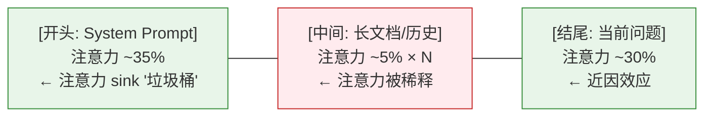

**注意力 Sink 对应用开发的直接影响**：

| 场景 | 问题 | 解法 |
|------|------|------|
| 长 System Prompt | 核心指令放中间会被忽略 | 最重要的指令放 System Prompt 最开头，利用 attention sink 获得免费高注意力 |
| RAG top-k 结果 | 最相关的文档被放在中间位置 | 检索后**重排序**——最相关放最前或最后 |
| 多轮对话历史 | 关键决策被中间闲聊淹没 | 截断时保留决策点，不是按时间截断 |
| 长文档问答 | 关键段落被掩盖 | 先做摘要放开头，具体细节放末尾 |
| Multi-Agent 汇总 | Orchestrator prompt 太长 | 每个 Agent 的结果精简到首尾 |

**工程启示**：

- **重要指令放 System Prompt（开头）**——利用注意力 sink 获得"免费"的高注意力
- **当前问题放 User 消息末尾**——利用近因效应
- **RAG 检索结果要重新排序**——最相关的放最前或最后，不要按相似度分数排序
- **多轮对话避免中间塞满无关内容**——及时截断或压缩，截断时保留"关键决策"而非"最近聊天"

### 3. "压缩早期消息"比"截断"好在哪

**架构差异**：

```
截断：KV Cache 中早期消息被彻底删除 → 模型完全看不到早期
压缩：KV Cache 中保留早期摘要 token → 模型能看到"摘要级"的早期
```

直接截断的问题是信息永久丢失。压缩保留了语义骨架——模型至少知道早期发生过什么。

**工程启示**：

- **压缩的代价是 LLM 调用**——需要额外的 summarize 调用
- **压缩比建议 5-10x**——5K tokens 压到 500-1000
- **压缩要保留"决策点"**——模型做过什么决定、为什么，比压缩原始对话更有价值
- **压缩在 Loop 早期做**——而不是等 context 满了才做

### 4. "Plan Mode"状态外部化为什么能降低幻觉

**架构原因**：LLM 的"记忆"完全存在于 KV Cache 里。Comaction 后模型真的看不到那些信息——不是忘了，是没看到。

```
传统 Agent：KV Cache 中早期被压成 [summary]
  → 模型读 summary → 可能推断错误 → 幻觉
Plan Mode：TODO.md 在文件系统上
  → Agent read_file → 刷新记忆 → 不依赖压缩质量
```

**工程启示**：

- **状态外部化不是偷懒**——是 KV Cache 物理限制下的必然选择
- **TODO.md 比 summary 更可靠**——summary 经过 LLM 二次加工可能失真
- **状态文件应该可读、可 diff、可回滚**——人类可以直接介入纠正

### 上下文工程速查

| 技巧 | 解决的问题 | 架构层 | 关键原则 |
|------|----------|--------|---------|
| Working Memory 截断 | N 条/消息太多 | Self-Attention O(N²) | 截断+摘要，保留语义关键 |
| Lost in the Middle | 信息放中间被忽略 | 注意力 Sink | 关键信息放开头或结尾 |
| 压缩早期消息 | 截断丢信息 | KV Cache | 5-10x 压缩比，保留决策点 |
| Plan Mode 状态外部化 | 长程任务幻觉 | KV Cache 易失性 | 文件系统做持久存储 |

---

# 第七部分：驾驭工程 → 架构层

> **驾驭工程解决的核心问题**：Agent 不是"单次调模型"，而是"多次调模型 + 循环判断 + 外部工具使用"。核心矛盾是"模型自己判断"（灵活但可能跑偏）vs "你给它写好流程"（可控但死板）。所有驾驭工程技巧本质上都是**用架构约束 + 循环设计来补足模型自回归生成的不确定性**。

### 1. "两阶段循环（先 Think 再 Act）"为什么能降低幻觉？

**你的工程技巧**：在 Agent Loop 中强制模型先输出 `### Thinking` 块，再输出 `### Action` 块（详见 [Agent Loop 设计篇](agent-loop-design.md)）。

**架构解释**：

这是驾驭工程最重要的发现之一。背后是 attention + 自回归的精妙组合：

**问题场景（一阶段模式）**：

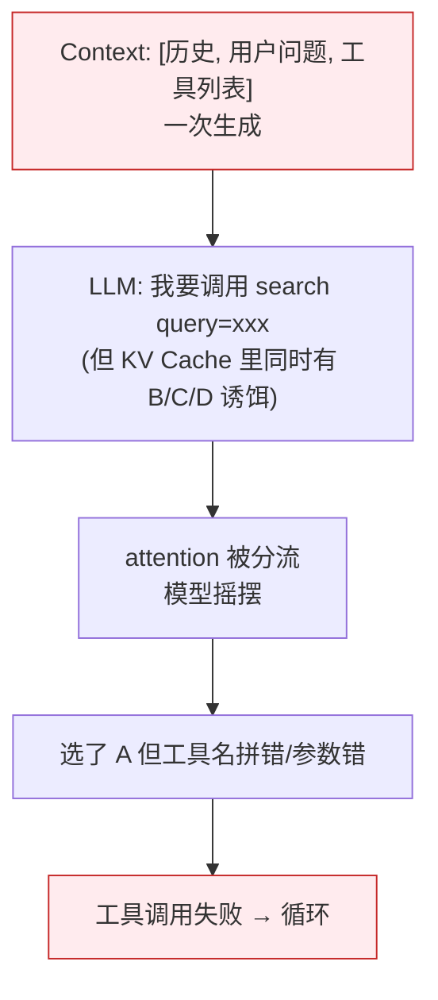

**两阶段模式（强制 Thinking）**：

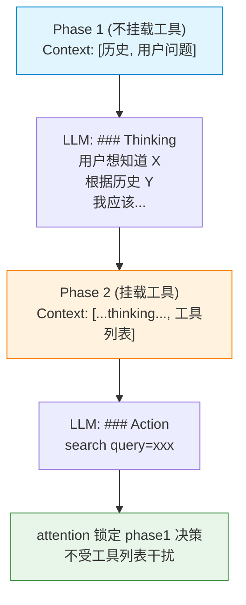

**架构原因——"决策和行动分离"对抗 attention 分散**：

- **决策需要"内省"**——只能基于已有 context 推理
- **行动需要"选择"**——必须从工具列表中挑
- **混在一起**时，工具列表的 token 会"分走"一部分 attention，导致推理不专注

**两阶段强制让模型"先想清楚，再行动"**，本质上是用结构化约束让 attention 的分配更合理。

**工程启示**：

- **不是所有任务都需要两阶段**——简单单步任务（"今天天气"）一阶段更高效
- **两阶段对长程任务最有效**——复杂推理、工具组合、决策树
- **Phase 1 的 prompt 要明确"不要选工具"**——"先思考，不要执行"
- **Phase 2 的 prompt 要明确"基于前面的思考"**——避免模型"忘记"自己刚想的

### 2. "Tool 描述"为什么决定 Agent 能力上限？

**你的工程技巧**：每个工具的 description 写得极其详细。

**架构解释**：

Agent 在生成 tool_call 时，是用 LLM 的"分类能力"——根据工具的 description 决定用哪个。

**架构对应**：

```
Context: [任务, search(query), write_file(path, content), bash(command)]

LLM 自回归生成：
  → 第一个 token: 看到 description "搜索网络信息"
  → 第二个 token: 看到 description "写文件"
  → ...

attention 决定：
  - "搜索信息" → 触发 FFN 中"搜索"对应的 FFN 通路 → 输出 search
  - "写文件" → 触发 FFN 中"写"对应的 FFN 通路 → 输出 write_file
```

**description 越模糊 → attention 越难分配 → 模型越容易选错工具**

**工程启示**：

- **description 必须"具体到能区分"**——"处理文件"不够，"读取指定路径的文件，返回内容"更好
- **description 包含使用场景**——"用于查询实时信息（如天气、新闻），不用于本地文件"
- **description 包含反例**——"不要用于数学计算"
- **每个 description 至少 50 字**——比工具名长 3-5 倍

---

### 3. 死循环（Doom Loop）——为什么 System Prompt 拦不住

**你的工程场景**：Agent 在某个错误上连续重试 10 次，每次都是同样的参数、同样的错误。

**架构解释**：

导致死循环的原因不是模型"忘了" System Prompt——它字面意义上没忘——而是两个行为陷阱：

1. **上下文内容分布偏移**：连续几次遇到同样错误后，上下文末尾堆满了结构相似的错误信息。这些重复 token 在分布上占据主导，强力牵引模型的下一步生成，让模型"只想解决眼前的报错"
2. **近因偏差（Recency Bias）**：相比上下文开头泛泛而谈的"连续失败请停止"规则，模型更倾向于对**刚刚返回的报错**做出强烈反应

**Why System Prompt 没用**？

System Prompt 写在最前面——注意力 sink 让它有"免费的高注意力"，但被末尾堆叠的大量错误信息覆盖了。模型不是看不到，而是"要处理的信息太多，顾不上开头的警告"。

**关键解法思路**：将提醒伪装成最新一条 User Message（借助 Recency Bias），而不是放在 System Prompt里。这条提醒紧贴报错位置，模型必须优先处理它。

### 4. 中间件拦截（Middleware）——为什么不能信任模型自己判断

**你的工程场景**：Agent 可能发起高危操作（rm -rf /、删除数据库），仅靠 System Prompt 里的"别删"是不够的。

**架构解释**：

模型在自回归生成时，每个 token 的选择都是基于概率的。即使 99% 的概率选"正确操作"，1% 的概率选"高危操作"——如果推理次数足够多，1% 的灾难迟早发生。

**关键防线**：在执行工具前插入中间件（Middleware）拦截，而非依赖模型"理智"。这是架构层面的防御，不是 prompt 层面的。中间件可以做三层判断：

| 级别 | 行为 | 适用 |
|------|------|------|
| **allow** | 白名单命令直接放行 | git status、read_file 等只读操作 |
| **ask** | 敏感操作挂起，等人确认 | rm、delete、write 等高危操作 |
| **deny** | 黑名单直接拦截 | 已知危险命令 |

**架构对应**：中间件插在 ToolCall（模型输出 JSON）和 ToolExecute（你的代码真的去执行）之间——不依赖模型的注意力分配，而是靠代码逻辑强制拦截。

### 5. 受控错误恢复（Recovery Hints）——让模型从报错中自救

**你的工程场景**：模型试图 read_file 一个不存在的文件，收到 "no such file or directory"。

**架构解释**：

传统框架把报错原样返回给模型，模型面对生硬报错时会机械道歉或盲目重复。

**Recovery Hints 的做法**：在工具返回报错时，引擎层拦截并注入"锦囊妙计"。比如：

```
原始报错：
  "Error executing read_file: no such file or directory"

注入后的报错：
  "Error executing read_file: no such file or directory
   [系统救援指南]: 路径似乎不正确，先使用 bash 执行 ls -la 找到正确路径"
```

**为什么有效**：Recovery Hints 利用了 Causal Mask 的单向性——模型在下一步生成时必须处理最新一条消息，Hints 紧贴报错位置，成为 attention 的"被迫关注点"。

### 6. 并行工具调用与 Subagent 任务委派

**你的工程技巧**：同时执行多个独立工具，或将复杂探索任务交给子 Agent 独立处理。

**架构解释**：

**并行工具调用**——模型在一次自回归生成中可以输出多个 tool_calls，它们彼此独立、可以并行执行。这是因为 Self-Attention 在矩阵层面是并行的——多个 tool_calls 的 JSON 结构在同一轮生成中同时输出，你的代码可以在收到后同时执行它们。

**并行调用的架构基础**：attention 矩阵是 N×N 的，所有 token 同时算——不限制只能输出 1 个 tool_call。

**适用条件**：工具之间没有数据依赖关系。比如"查北京天气"和"查上海天气"互不依赖，可以并行。但"先搜索文件再编辑文件"有依赖，必须串行。

**Subagent 任务委派**——当某个子任务需要大量上下文（如深度搜索一个目录、分析多个文件），主 Agent 如果自己处理，会占用大量 KV Cache 空间，导致 attention 被稀释。Subagent 模式让子 Agent 在一个**独立 Session** 中处理，只把精华结果返回给主 Agent。

```
主 Agent Context: [主任务, 结果 A=..., 结果 B=...]
  → attention 集中在主任务上
  ↓
子 Agent 独立 Session: [搜索任务 A 的详细代码]
  → 自己的 KV Cache，不会被主任务"挤占"
  ↓
只把搜索结果摘要返回给主 Agent
```

**架构对应**：Subagent 本质上是**上下文隔离**——利用独立的 KV Cache 空间，避免一个方向的探索占满主 context。

**工程启示**：
- **并行调用的前提是工具间无依赖**——查询类、读取类天然可并行；写入、修改类串行
- **Subagent 不是"为了分工而分工"**——是 attention 物理限制下的解法
- **Subagent 增加 token 消耗**——Orchestrator 的 prompt 要包含子 Agent 的输入输出
- **子 Agent 的结果要精简**——传回 top-3 关键结论，而不是完整日志


### 7. "Multi-Agent 协作"为什么有效？

**你的工程技巧**：让多个 Agent 各负责一摊，最后汇总。

**架构解释**：

每个 Agent 都有自己的 **KV Cache 和 FFN 通路**——它们是"独立的大脑"。让一个大脑同时处理多个任务，会造成 attention 分散。让多个大脑各管一摊，每个大脑的 attention 都聚焦。

```
单一 Agent 处理 5 个任务：
  Context: [任务 1, 任务 2, 任务 3, 任务 4, 任务 5]
  → attention 在 5 个任务间分配
  → 每个任务的处理都不深入

Multi-Agent：
  Agent 1: Context: [任务 1]      → 深入处理
  Agent 2: Context: [任务 2]      → 深入处理
  ...
  Orchestrator: 汇总结果
  → 每个 Agent 的 attention 都聚焦
```

**工程启示**：

- **Multi-Agent 不是"为了分工而分工"**——是 attention 物理限制下的解法
- **Orchestrator 是必要的**——否则多个 Agent 的结果无法合并
- **Multi-Agent 增加 token 消耗**——Orchestrator 的 prompt 要包含所有 Agent 的输入输出

### 8. "Reflection / Self-Critique" 为什么有效？

**你的工程技巧**：让模型对自己的输出做反思，再改进。

**架构解释**：

**第一遍生成时**，KV Cache 里只有用户的输入。模型的"评判"和"生成"用同一个 FFN——会"既当运动员又当裁判"。

**Reflection 模式**：

```
Round 1: 生成答案 A
Round 2: Context = [问题, A] → 让模型评判 A
         → 评判的结果 B 进入 KV Cache
Round 3: Context = [问题, A, B] → 让模型基于 B 改进 A
         → 最终答案 C（比 A 更好）
```

**架构对应**：

- **多轮让 KV Cache 累积"思考"**——每轮的输出成为下一轮的 context
- **Self-Critique 强制 attention 关注"自己刚写的"**——避免"当局者迷"
- **反思过程会激活"评价类" FFN 通路**——通常模型在训练时对"评价"和"生成"分开学习

**工程启示**：

- **Reflection 对"开放式问题"最有效**（写作、设计）——对"事实性回答"帮助不大（模型本来就知道）
- **Reflection 有 token 成本**——通常 2-3x 单次生成
- **控制反思轮数**——超过 3 轮通常收益递减

# 总结：架构 → 工程技巧的速查表

| 架构层 | 对应的工程技巧 | 为什么有效 |
|--------|---------------|----------|
| **Embedding** | 角色设定、专业术语 | 锁定 FFN 通路的激活方向 |
| **Positional Encoding** | 关键信息放开头/结尾 | Lost in the Middle + 注意力 sink |
| **Self-Attention** | 分隔符、Few-shot、负面提示、结构化输出 | 注意力权重分配决定哪些 token 被关注 |
| **Multi-Head** | 结构化标记、多种任务指令 | 不同 head 关注不同方面 |
| **FFN** | Few-shot、CoT、Tool 描述 | FFN 通路决定"能做什么" |
| **Layer 堆叠** | CoT、Reflection、多轮 | 每层处理不同抽象层级的信息 |
| **Tokenization** | 简洁表达、避免歧义 | 不同语言的 token 效率差异 |
| **KV Cache** | system prompt 稳定、压缩 context | 缓存复用减少计算 |
| **Decode 阶段** | temperature、Top-p | 控制采样的随机性 |
| **Self-Attention O(N²)** | Working Memory 截断、摘要压缩 | 减少 attention 矩阵规模 |

### 核心洞察

1. **Transformer 的所有行为都能解释为"attention 怎么分配"+"FFN 激活什么通路"**
2. **你的工程技巧本质上是"引导 attention 和 FFN"**
3. **架构限制是物理的**——KV Cache、attention 复杂度、FFN 静态——决定了工程上的取舍

理解了这些对应，你就能从"凭经验调 prompt"升级到"基于架构理解做主动优化"。

---

## 你不必深究的部分

作为 AI 应用开发者，下列内容可以跳过：

- Scaled Dot-Product Attention 的数学推导（`softmax(QK^T/√d)V`）
- RoPE 复数旋转矩阵的具体形式
- SwiGLU 激活函数的数学性质
- Grouped-Query Attention 的具体 KV 共享比例
- Flash Attention 的分块 IO 优化数学证明
- vLLM PagedAttention 的虚拟地址映射算法

**关键洞察**：理解"是什么"和"为什么这样影响我的 prompt"远比理解"怎么算的"重要。

---

## 延伸阅读

- [Agent Loop 设计篇](agent-loop-design.md)——两阶段循环的实现
- [工具调用篇](agent-tool-calling.md)——Tool description 的设计原则
- [上下文管理篇](agent-context-management.md)——Working Memory / Compaction
- [驾驭工程实践](agent-coding-strategy-state-reflect.md)——状态外部化