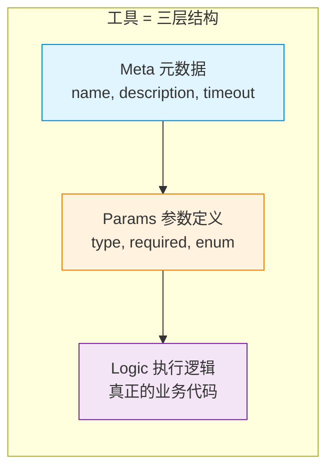
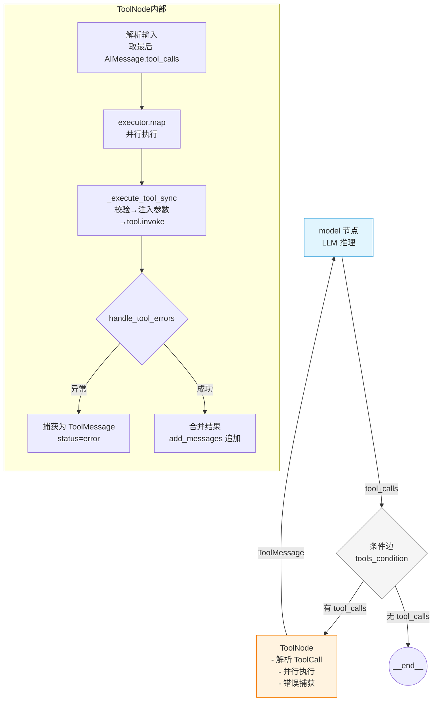

# 工具调用篇

Agent 不"思考"，Agent 调用工具。工具是 Agent 影响世界的唯一途径。

如果你把 Agent 循环比作人的躯干，工具就是手。躯干决定什么时候做什么，但具体怎么"做"——读文件、发请求、执行命令——是手的事。工具调用的设计质量，直接决定了 Agent 的能力边界和可靠性上限。

本文从四个部分展开：

1. **工具的本质与设计**——工具是什么，怎么写一个好工具
2. **用原始代码管理工具**——自己实现注册、校验、分发、权限
3. **用框架管理工具**——LangChain 1.0 / LangGraph 的工具体系
4. **人在环路**——什么时候需要人介入，怎么介入

---

## 一、工具的本质与设计

### 工具的三层结构

在 Agent 系统中，每一个工具都包含三个层次：



**元数据**告诉 LLM"这个工具是干什么的"：

```python
@dataclass
class ToolMetadata:
    name: str                    # 工具名，LLM 通过这个名字调用它
    description: str             # 描述，LLM 判断"什么时候该用"的依据
    timeout_seconds: int = 30    # 执行超时，防止工具卡死拖垮整个循环
    dangerous: bool = False      # 是否高危操作，影响人机交互策略
```

**参数定义**告诉 LLM"需要填什么参数、填什么格式"：

```python
@dataclass
class ToolParameter:
    name: str                # 参数名
    type: str                # 类型：string, integer, boolean...
    description: str         # 说明（给 LLM 看，直接影响填参准确率）
    required: bool = True    # 是否必填
    enum: list = None        # 枚举值（如果有）
```

**执行逻辑**是真正的业务代码。过去的所有结构都只为了两件事：让 LLM 正确选择工具，让程序正确把 LLM 的意图转成函数调用。

### description 是工具设计的命门

LLM 不能直接读你的 Python 代码。它通过工具的描述信息来理解一个工具的能力和用法。JSON Schema 就是它的"说明书"。

```python
# 工具定义会被自动转成 JSON Schema 发给 LLM
{
    "name": "calculator",
    "description": "计算数学表达式，支持加减乘除、幂运算、三角函数等",
    "parameters": {
        "type": "object",
        "properties": {
            "expression": {
                "type": "string",
                "description": "要计算的表达式，如 '2 + 2'、'sqrt(16)'"
            }
        },
        "required": ["expression"]
    }
}
```

这个 JSON 会塞进 LLM 每次调用的 prompt 中。LLM 看到它就知道有一个叫 calculator 的工具，需要一个 expression 参数。

description 写得越清晰，LLM 调用越准确。一个简单的检验方法：**把 description 给一个不懂技术的人看，问他知道该填什么吗。如果他说不知道，那 LLM 大概率也不知道。**

### 参数容错：不能假设 LLM 输出完美的数据

LLM 的参数输出往往有小毛病——字符串该传整数的地方传了 `"10"` 而不是 `10`，布尔值传了 `"true"` 而不是 `true`。工具层需要做一层容错转换：

```python
def coerce_parameters(params: dict, spec: dict) -> dict:
    """对 LLM 输出的参数做类型容错"""
    out = dict(params)
    for name, param in spec.items():
        if name not in out:
            continue
        val = out[name]
        
        # 整数：接受浮点数和数字字符串
        if param.type == "integer":
            if isinstance(val, float) and val.is_integer():
                out[name] = int(val)
            elif isinstance(val, str) and val.strip().isdigit():
                out[name] = int(val.strip())
        
        # 布尔：接受常见字符串形式
        elif param.type == "boolean":
            if isinstance(val, str):
                s = val.strip().lower()
                out[name] = s in ("true", "1", "yes")
    
    return out
```

### 返回值设计

工具返回值会成为后续 LLM 调用的上下文。设计时注意：

- **返回结构要稳定**：同一工具在不同输入下返回的字段结构应该一致
- **区分"空结果"和"出错"**：空结果用字段表示，出错用字段表示，不要混用
- **控制返回数据量**：一次返回 500 条让 LLM 处理，不如只返回 top-10
- **异常不要抛出**：永远以结构化结果返回，错误信息让 LLM 自行理解

```python
@dataclass
class ToolResult:
    success: bool           # 成功还是失败
    output: str             # 执行结果
    error: str = None       # 错误信息（LLM 看到后会尝试修正）
```

---

## 二、用原始代码管理工具

不依赖框架时，工具调用的核心是一套注册、校验、分发的机制。

### Tool Registry：工具的注册与发现

注册表的核心职责有三个：

1. **动态挂载**：允许随时向系统注册新的工具
2. **描述暴露**：把当前所有已挂载工具的 Schema 打包返回，发给 LLM
3. **路由分发**：LLM 返回工具调用请求后，找到对应的实现并执行

```python
class ToolRegistry:
    """工具的注册与分发中心"""
    def __init__(self):
        self._tools: dict[str, BaseTool] = {}
    
    def register(self, tool: BaseTool):
        """注册一个工具"""
        name = tool.name()
        if name in self._tools:
            raise ValueError(f"工具 '{name}' 已被注册")
        self._tools[name] = tool
    
    def get_schemas(self) -> list[dict]:
        """获取所有工具的 JSON Schema，供 LLM 调用"""
        return [tool.schema() for tool in self._tools.values()]
    
    def execute(self, tool_name: str, args: dict) -> ToolResult:
        """路由并执行工具调用"""
        tool = self._tools.get(tool_name)
        if not tool:
            return ToolResult(
                success=False,
                error=f"系统中不存在名为 '{tool_name}' 的工具"
            )
        try:
            output = tool.execute(**args)
            return ToolResult(success=True, output=output)
        except Exception as e:
            return ToolResult(success=False, error=str(e))
```

把 Registry 集成到完整的 Agent 循环中，就是之前 `react_loop` 里 `safe_tool_call` 的升级版——由 Registry 集中管理 Schema 暴露和工具路由，不再散落在代码各处的 `if-else` 中。

### 在循环中集成 Registry

结合之前编写的 `react_loop`，注册表的集成点在两个位置：

**1. 循环开始前：暴露 Schema 给 LLM**

```python
# 每次 LLM 调用时，把 Registry 中的所有工具 Schema 附上
context = build_messages(messages, config)
schemas = registry.get_schemas()         # 获取所有工具定义
response = llm.invoke(context, tools=schemas)  # 传给 LLM
```

**2. 工具调用时：通过 Registry 路由执行**

```python
# 收到 LLM 返回的 tool_calls 后，交给 Registry 执行
tool_calls = response.get("tool_calls", [])
for tc in tool_calls:
    # 将参数传给 registry.execute，由它负责路由和容错
    result = registry.execute(tc["name"], tc["args"])
    # registry.execute 内部做了路由查找、参数校验、异常捕获
    messages.append({
        "role": "tool",
        "content": str(result.output if result.success else result.error),
        "tool_call_id": tc["id"]
    })
```

Registry 接在循环中间，作为 LLM 意图和物理执行的绝缘层。

### 基于任务类型过滤工具

给 LLM 暴露的工具越多，它的选择越不准。经验是每次只暴露当前任务需要的 3-5 个工具：

```python
def filter_tools_for_task(registry: ToolRegistry, task_type: str) -> list:
    """根据任务类型过滤工具"""
    if task_type == "research":
        return registry.filter(categories=["search", "web"])
    elif task_type == "analysis":
        return registry.filter(categories=["calculation", "database"])
    elif task_type == "coding":
        return registry.filter(categories=["file", "shell"])
    return registry.get_schemas()  # 兜底：全部暴露
```

### 工具的执行边界与防御

工具执行时需要在几个层面加防御，这些防御不是可选的"高级功能"，而是生产环境的必备项：

**超时控制**：工具可能卡住（网络请求无响应、命令一直挂起）。每个工具都应该有自己的超时设置：

```python
def execute_with_timeout(tool, timeout_seconds: int) -> ToolResult:
    try:
        return asyncio.wait_for(
            tool.execute(),
            timeout=timeout_seconds
        )
    except asyncio.TimeoutError:
        return ToolResult(success=False, error="执行超时，已被系统终止")
```

**限流控制**：Agent 可能短时间内连续调用同一个工具（比如在调试中频繁搜索），需要在工具层做限流：

```python
class RateLimiter:
    def __init__(self, max_calls_per_minute: int):
        self.max_calls = max_calls_per_minute
        self.calls = []  # 时间戳列表
    
    def check(self) -> bool:
        now = datetime.now()
        # 清除超过 1 分钟的记录
        self.calls = [t for t in self.calls if now - t < timedelta(minutes=1)]
        if len(self.calls) >= self.max_calls:
            return False
        self.calls.append(now)
        return True
```

### 并发执行多个工具

前沿 LLM 支持在一次返回中输出多个 tool_calls。在 Agent 循环中，可以将这些互相独立的工具调用并行执行，以提升效率：

```python
from concurrent.futures import ThreadPoolExecutor, as_completed

def execute_tool_calls(tool_calls: list, registry: ToolRegistry) -> list:
    """并行执行多个工具调用"""
    results = [None] * len(tool_calls)
    
    with ThreadPoolExecutor(max_workers=5) as executor:
        future_map = {}
        for i, tc in enumerate(tool_calls):
            future = executor.submit(registry.execute, tc.name, tc.args)
            future_map[future] = i
        
        for future in as_completed(future_map):
            idx = future_map[future]
            results[idx] = future.result()
    
    return results
```

注意：并行执行的前提是"独立性假设"——同一轮中的多个工具调用被假设为互不依赖。如果它们之间有顺序依赖，LLM 应该把它们分在不同轮次发出。

---

## 三、用框架管理工具

### LangChain 1.0 的工具体系

LangChain 1.0 的工具体系围绕 `BaseTool`、`@tool` 装饰器和 `ToolNode` 构建。

#### 工具定义的三种方式与区别

LangChain 1.0 提供三种创建工具的方式，适用于不同场景。它们的核心差异在于：**输入参数如何处理、Schema 如何推断**。

**方式一：继承 `BaseTool`**

```python
from langchain_core.tools import BaseTool

class GetWeatherTool(BaseTool):
    name: str = "get_weather"
    description: str = "查询指定城市的当前天气"

    def _run(self, city: str) -> str:
        return f"{city} 的天气是晴朗，25°C"
```

适用：工具逻辑复杂、需要在类中管理状态、需要多个实例方法协作。你完全控制 Schema 的定义方式。

**方式二：`@tool` 装饰器（最常用）**

```python
from langchain.tools import tool

@tool
def get_weather(city: str) -> str:
    """查询指定城市的当前天气"""
    return f"{city} 的天气是晴朗，25°C"
```

适用：大多数场景。`@tool` 根据函数的类型注解和 docstring 自动推断 Schema。**`infer_schema=True`（默认）时它调用 `StructuredTool.from_function()` 创建多输入的 `StructuredTool`；如果函数没有类型注解或主动设 `infer_schema=False`，则回退为单输入 `Tool`**。两种子类的区别在下一段详述。

关于 `@tool` 的 `description`，优先级是这样的（源码第 212-214 行）：

1. **`@tool(description="...")` 括号里显式传入**——最高优先级，走 `description_ = description`
2. **函数自身的 docstring `"""..."""`**——没有显式传入时，走 `description_ = source_function.__doc__`
3. **`args_schema` 的 docstring**——最后兜底

实践中大多数情况直接用 `description=` 参数最清晰：

```python
@tool(description="查询指定城市的当前天气")
def get_weather(city: str) -> str:
    return f"{city} 的天气是晴朗，25°C"
```

函数 docstring 的回退只是一种便利，不是常规用法——尤其在函数内部已经有业务逻辑注释时，docstring 可能不适合直接暴露给 LLM。

完整签名如下，支持 `extras` 传递 provider 特有元数据（如 Anthropic 的 `cache_control`）：

```python
@tool(extras={"cache_control": {"type": "ephemeral"}})
def search_kb(query: str) -> str:
    """搜索知识库"""
    return db.search(query)
```

**方式三：`StructuredTool.from_function()`**

```python
from langchain_core.tools import StructuredTool

tool = StructuredTool.from_function(
    func=my_function,
    name="my_tool",
    description="做什么的",
    args_schema=MyArgsModel  # 可选，传了就跳过推断
)
```

适用：已有现成函数需要转为工具，需要对 Schema 有更多自定义控制（如传预定义的 Pydantic model）。

**`Tool` vs `StructuredTool` 的区别**

这是最容易混淆的地方。`Tool` 和 `StructuredTool` 都继承自 `BaseTool`，但处理输入的方式不同：

| 维度 | `Tool` | `StructuredTool` |
|------|--------|-----------------|
| 输入形式 | 单输入（string → string） | 多输入（dict → any） |
| Schema 要求 | 无 `args_schema` 时默认 `tool_input: string` | 必须有 `args_schema`（Pydantic 或 JSON Schema） |
| 使用场景 | 简单函数，只有一个参数 | 多参数、结构化输入 |
| `@tool(infere_schema=True)` | 无类型注解的函数 | 有类型注解的函数 |

当使用 `@tool` 时，如果函数有完整的类型注解，装饰器内部调用 `StructuredTool.from_function()`，它通过 `create_schema_from_function()` 从函数签名自动生成 Pydantic model 作为 Schema。如果函数没有类型注解或 `infer_schema=False`，则创建 `Tool`，输入退化为一个 string 字段。

**从源码看 Schema 推断逻辑（`@tool` 内部第 305 行）：**

```python
if infer_schema or args_schema is not None:
    # 走 StructuredTool：多输入，有 Schema
    return StructuredTool.from_function(
        func, coroutine, name=tool_name, ...,
        infer_schema=infer_schema, ...
    )
# 回退为 Tool：单输入 string->string
return Tool(name=tool_name, func=func, description=f"{tool_name} tool", ...)
```

`@tool` 内部通过类型注解和 docstring 自动推导工具 Schema（源码：`StructuredTool.from_function` 在 `langchain_core/tools/structured.py`）：

| 源码元素 | 映射到 Schema 字段 |
|---------|------------------|
| 函数名 | `name` |
| docstring | `description` |
| 参数类型注解 | `parameters.properties` |
| 是否有默认值 | `required` 数组 |

#### 工具注册与绑定

`create_agent` 在内部对 `tools` 参数做的处理（源码：`langchain/agents/factory.py` 的 `_get_bound_model` 函数，约第 1339 行）：

1. **统一转为 BaseTool**：将所有裸函数、Callable 转为 `BaseTool` 实例
2. **绑定到模型**：根据 `response_format` 策略调用 `model.bind_tools(final_tools, ...)`

```python
# create_agent 内部自动调用 bind_tools
agent = create_agent(model=llm, tools=[get_weather, search_kb])
# 等价于 llm.bind_tools([get_weather, search_kb])
```

`bind_tools` 是 `BaseChatModel` 的抽象方法（源码：`langchain_core/language_models/chat_models.py`），各 provider（OpenAI、Anthropic）各自实现，将 `BaseTool` 对象转换为对应模型的 tool 格式。

#### 框架级别怎么调用

`create_agent` 内部构造了 LangGraph 的 `ToolNode`。调用链如下（源码：`langgraph/prebuilt/tool_node.py`）：



`ToolNode` 的 `__init__` 签名（源码第 610+ 行）：

```python
class ToolNode(RunnableCallable):
    def __init__(
        self,
        tools: Sequence[BaseTool | Callable],
        *,
        name: str = "tools",
        handle_tool_errors: bool | str | Callable | type[Exception]
                           | tuple[type[Exception], ...] = default_handle,
        messages_key: str = "messages",
    ):
```

注意 `handle_tool_errors` 是在 `ToolNode` 层级控制的（不是工具层级）。默认策略是捕获 `ToolInvocationError` 并返回错误消息，其他异常默认被放行。

内置条件函数 `tools_condition`（源码第 1436 行）：

```python
def tools_condition(
    state: list[AnyMessage] | dict[str, Any] | BaseModel,
    messages_key: str = "messages",
) -> Literal["tools", "__end__"]:
```

判断逻辑：取最后一条 AIMessage，有 `tool_calls` → 返回 `"tools"`，否则返回 `"__end__"`。

#### 手工 ToolNode vs 自动工具执行

```python
from langgraph.graph import StateGraph, MessagesState, START
from langgraph.prebuilt import ToolNode, tools_condition

# ToolNode 自动处理所有工具执行逻辑
tool_node = ToolNode(tools=[get_weather, search_kb])

graph = StateGraph(MessagesState)
graph.add_node("model", call_llm)
graph.add_node("tools", tool_node)

# tools_condition 做路由判断
graph.add_conditional_edges("model", tools_condition, {
    "tools": "tools",
    "__end__": END
})
graph.add_edge("tools", "model")
```

如果需要更精细的控制（如工具间数据依赖、前置权限校验），也可以绕过 ToolNode 手动控制：

```python
def custom_tool_node(state: MessagesState):
    last_ai = state["messages"][-1]
    outputs = []
    for tc in last_ai.tool_calls:
        # 前置校验、权限检查、缓存命中检测...
        tool = registered_tools[tc["name"]]
        result = tool.invoke(tc["args"])
        outputs.append(ToolMessage(content=str(result), tool_call_id=tc["id"]))
    return {"messages": outputs}
```

### 框架的边界

框架帮你处理了工具 Schema 的自动生成、路由分发、错误捕获。但框架级的工具管理有几个天然局限：

- **权限控制**：框架只能控制"暴露哪些工具"，不能控制"同一个工具不同参数的不同权限"。工具一旦暴露，Agent 可以用任意参数调用
- **工具间依赖**：不原生支持"工具 A 执行完后才能执行工具 B"的流程。应该在工具描述中注明依赖关系，让 LLM 自己分轮次调用
- **限流与审计**：框架级不提供内置的限流和审计日志，需要自己在工具函数内部或外层 Middleware 中补充

---

## 四、人在环路（Human-in-the-Loop）

### 什么时候需要人

不是所有工具调用都需要人。需要人介入的场景是那些"错了不可逆"的操作：

- **高风险命令**：删除文件、批量操作、数据库变更
- **需要判断力的决策**：是否升级权限、是否发送消息给客户
- **模型不确定时**：LLM 输出置信度过低（需要模型事后解释其置信度）
- **合规要求**：审计规定某些操作必须有人确认

### 在原始代码中实现 HITL

在 Agent 循环中，HITL 就是一个条件检查点——在工具执行前插入暂停逻辑：

```python
def requires_approval(tool_name: str, args: dict) -> bool:
    """判断工具调用是否需要人工审批"""
    if tool_name == "bash":
        dangerous = ["rm -rf", "sudo", "drop table", "kubectl delete"]
        return any(kw in str(args) for kw in dangerous)
    if tool_name == "write_file":
        return True  # 写文件默认需要确认
    return False


def agent_loop_with_hitl(prompt: str, tools, registry, config):
    """支持 HITL 的 Agent 循环"""
    messages = [{"role": "user", "content": prompt}]
    
    for step in range(config.max_iterations):
        context = build_messages(messages, config)
        schemas = registry.get_schemas()
        response = llm.invoke(context, tools=schemas)
        messages.append({"role": "assistant", "content": response})
        
        tool_calls = response.get("tool_calls", [])
        if not tool_calls:
            return response.get("content", "")
        
        for tc in tool_calls:
            # HITL 检查点：在真正执行前暂停
            if requires_approval(tc["name"], tc["args"]):
                approval = wait_for_human(
                    tool_name=tc["name"],
                    args=tc["args"],
                    timeout=300  # 5 分钟超时
                )
                if approval.status == "rejected":
                    # 把拒绝结果写回消息列表，让 LLM 自己反思
                    messages.append({
                        "role": "tool",
                        "content": f"操作被人工拒绝，原因：{approval.reason}",
                        "tool_call_id": tc["id"]
                    })
                    continue
                elif approval.status == "timeout":
                    # 超时策略：自动拒绝（安全优先）
                    messages.append({
                        "role": "tool",
                        "content": "操作审批超时，已自动拒绝",
                        "tool_call_id": tc["id"]
                    })
                    continue
            
            # 通过则执行
            result = registry.execute(tc["name"], tc["args"])
            messages.append({
                "role": "tool",
                "content": str(result.output if result.success else result.error),
                "tool_call_id": tc["id"]
            })
    
    return extract_partial_result(messages)
```

HITL 的阻塞方式可以是在终端弹确认框（本地 CLI）、通过飞书/钉钉发送审批消息（远程）、或提供一个 HTTP API 让外部系统回调。不管哪种形式，核心模式都是**通道阻塞 + 外部唤醒**：当前协程挂起在 channel 上，等待外部系统通过 channel 发送"同意"或"拒绝"信号。

### 在 LangGraph 中实现 HITL

LangGraph 通过 `interrupt_after` 和 checkpointer 原生支持 HITL。在关键节点执行后挂起，等待人恢复：

```python
# 在编译时指定在哪个节点后中断
graph = graph.compile(
    checkpointer=checkpointer,
    interrupt_after=["tools"]  # 工具执行后暂停
)

# 运行
config = {"configurable": {"thread_id": "1"}}
for event in graph.stream({"messages": [user_msg]}, config):
    # 流式执行...

# 检查是否在等待
state = graph.get_state(config)
if state.next:
    # 人在环路：检查工具调用是否高危，然后决定继续还是修改
    approve = input("放行工具调用？(y/n): ")
    if approve == "y":
        graph.invoke(None, config)  # 继续执行
    else:
        # 修改 state，注入拒绝消息
        state.values["messages"].append(rejected_msg)
        graph.update_state(config, {"messages": state.values["messages"]})
```

`interrupt_after` 是框架级别的 HITL 支撑——图执行到指定节点后，框架自动暂停并序列化当前状态。人可以在检查后选择"继续"或"修改状态后继续"。

### 在 Registry 层实现 Middleware 式拦截

另一种方案是在 Registry 的执行路径中挂载 Middleware。Registry 收到 ToolCall 后，在执行前依次通过所有 Middleware。任何一个 Middleware 拒绝，工具都不会被真正调用：

```python
class SecureRegistry(ToolRegistry):
    """带 Middleware 拦截的注册表"""
    def __init__(self):
        super().__init__()
        self.middlewares = []
    
    def use(self, middleware):
        """注册中间件"""
        self.middlewares.append(middleware)
    
    def execute(self, tool_name: str, args: dict) -> ToolResult:
        # 1. 先过所有中间件
        for mw in self.middlewares:
            allowed, reason = mw(tool_name, args)
            if not allowed:
                return ToolResult(
                    success=False,
                    error=f"操作被拦截，原因：{reason}"
                )
        
        # 2. 通过则执行
        return super().execute(tool_name, args)
```

这种方式的优点是安全逻辑和业务逻辑完全解耦。你可以挂载多个 Middleware 来处理不同的拦截维度：高危命令拦截、频率控制、操作审计等，每个 Middleware 只关注一件事。

### HITL 设计的三个关键问题

**1. 超时怎么办？**

人可能不在线。设置超时，超时后的默认行为建议为"自动拒绝"（安全优先）。

**2. 同步还是异步？**

- 同步 HITL：Agent 循环挂起，等人确认后再继续。适合关键决策点
- 异步 HITL：Agent 继续其他工作，人稍后补确认。适合非阻塞操作

**3. 审批信息怎么呈现？**

不要只扔原始 JSON 给人看。格式化展示：操作目的、影响范围、成本预估、建议操作。

---

## 设计检查清单

当你设计 Agent 的工具系统时，逐一检查以下问题：

1. **每个工具的 description 是否清晰到"外行也能看明白"？**
2. **参数定义是否包含容错处理**（类型转换、边界截断）？
3. **工具执行是否受超时保护？**
4. **是否有频率限制**防止 Agent 在单工具上无限制调用？
5. **工具异常是否以结构化结果返回**而非抛出异常导致循环崩溃？
6. **是否根据任务类型过滤工具**，每次最多暴露 5-8 个？
7. **高危操作是否有 HITL 审批**且审批有超时兜底？
8. **注册表的路由和业务逻辑是否解耦**（通过 Middleware 而非硬编码）？
