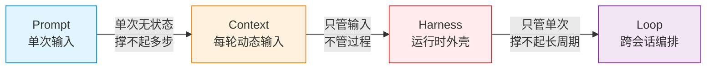
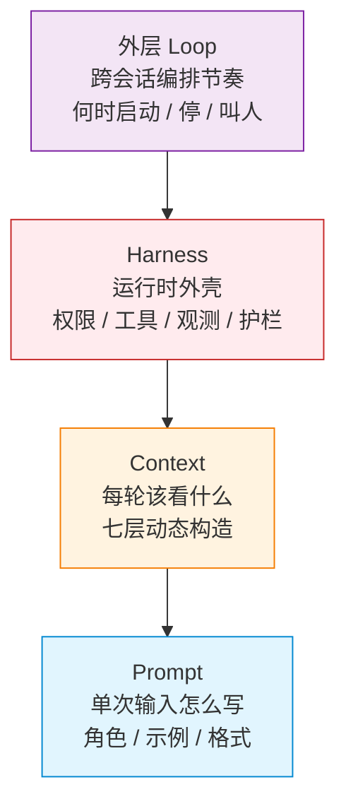

# 从 Prompt 到 Loop：四层工程的演变脉络

这个站里已经有几篇深拆：[Agent 大脑](../agent-system-design/agent-brain.md)、[上下文管理](../agent-system-design/agent-context-management.md)、[Skill 经验封装](../agent-system-design/agent-skill-design.md)、[可观测性](../agent-system-design/agent-observability.md)。也有一篇把提示词/上下文/驾驭工程技巧逐条对应到 Transformer 架构层、解释"为什么起作用"的[文章](../agent-system-design/agent-thinking-transformer-from-prompt.md)，还有一篇做 [Agent 设计模式元认知](./agent-coding-strategy-state-reflect.md)的文章。

这篇不重复它们。这篇回答一个更靠前的问题：

> prompt、context、harness、loop 这四层工程，为什么会一层一层长出来？每一层各自盯着什么问题？前一层撞到了什么墙，才不得不催生下一层？

把它们摆成一条演变线，不是为了再排一遍名词，而是为了拿到一个坐标系——之后看到任何一个 Agent 技巧、任何一个框架特性，能立刻判断它属于哪一层、在解决哪类问题、有没有跑偏。

## 两条红线先放前面

**第一条：约束放置点逐层外推。** 这四层的演变，本质是把"约束的放置点"一层一层往外推——从单次输入的文字，到每一轮动态构造的上下文，到包住模型的运行时外壳，再到跨会话的编排节奏。每推一层，都是因为前一层撑不住更动态、更长周期的任务。

**第二条：工程始终是"引导"而不是"生成"。** 模型里有什么，训练完就定了；四层工程没有任何一层改变模型里有什么，它们改变的是"这一次能不能在对的时机、对的步骤、以对的约束，把模型里已有的高质量能力引导出来"。Prompt 引导单次，Context 引导每轮，Harness 引导整个运行时，Loop 引导跨会话的节奏。杠杆的根部始终是输入质量，后面三层是让这个质量在更多步、更长周期里不塌掉的脚手架。

这和这个站一直在说的判断一致：客观模型决定能力上限，主观输入技巧决定单次能否落在好结果。

## 坐标表

| 层 | 关注点 | 解决了什么（前一层做不到的） | 撞到了什么墙（催生下一层） | 约束放在哪 |
|---|---|---|---|---|
| **Prompt** | 单次输入怎么写，才能激活模型里对的区域 | 自然语言聊天的输出不可控、格式乱 | 单次无状态，撑不起多步有状态任务 | 这一次输入的文字 |
| **Context** | 每一轮该塞什么、不塞什么 | Prompt 是静态一次性的，但任务是多轮动态的 | 只管输入不管过程，模型还是会跑偏 | 每轮动态构造的输入 |
| **Harness** | 用什么外壳包住模型，约束它的感知-决策-行动 | Context 只解决"喂什么"，没解决"模型怎么决策怎么行动" | 只管单次任务，撑不起长周期自驱动 | 运行时外壳 |
| **Loop** | 怎么让 agent 跨会话按节奏自驱动 | Harness 默认人发起一次跑一次，长周期任务跑不起来 | 当前最外层，仍在演化 | 跨会话的编排节奏 |

---

## 第一节：Prompt —— 把单次输入写对

**关注点**：一次调用，输入怎么写，才能稳定激活模型里已有的高质量区域，产出可用的、结构化的输出。

**它解决的问题**：最早用 LLM 是自然语言聊天，输出不可控——格式乱、答非所问、该给 JSON 给散文、该给代码给解释。Prompt 工程把"随便聊"变成"可工程化的单次输入"：角色设定锁定视角，Few-shot 给出范例分布，CoT 引导推理路径，分隔符划清边界，负面提示排除歧义，结构化模板约束输出格式。每一条都是在用文字约束模型的采样空间。

**它撞到的墙**：Prompt 是一次性的、无状态的。每次调用从零开始，模型不记得上一次。一旦任务需要多步推进、需要工具、需要记住中间状态，单次输入就撑不住——没法在一次 prompt 里塞下"动态变化的文件状态、上一轮工具返回、还没解决的子问题"。而且 prompt 越写越长，模型注意力有限，关键信息被稀释（lost in the middle），写到后面反而更差。

> 单次输入的工程，撑不起多步、有状态、需外部信息的任务。这堵墙催生了下一层。

## 第二节：Context —— 每一轮亲手构造该看什么

**关注点**：多轮任务里，每一轮 LLM 调用，该构造一段什么样的"当前该看到的信息"，才能让模型在这一步做对判断。

**它解决的问题（Prompt 撞的墙）**：Prompt 工程假设输入是静态、一次性的。但 Agent 是多轮的，每一轮该看的不一样——第一轮要看任务描述，中间轮要看上一轮工具结果和剩余计划，快结束时要看完成情况。Context 工程把"写好一段固定输入"升级成"每轮亲手构造一段动态输入"：截断、压缩（Compaction）、Working Memory 滑动窗口、Tool Results 用后掩码、RAG 按需注入、状态外部化到 PLAN.md/TODO.md、System Prompt 模块化编译成"操作系统内核"、Prompt Cache 稳定前缀、分层 token 预算。

**关键转变**：Context 不再是一段字符串，而是分层的——System Prompt（角色规范）/ Conversation History（对话历史）/ Working Memory（短期工作记忆）/ Retrieved Context（检索信息）/ Tool Results（工具返回）/ Externalized State（外部化状态）/ Long-Term Memory（长期记忆），每一层有自己的生命周期和管理策略。详见[上下文管理篇](../agent-system-design/agent-context-management.md)。

**它撞到的墙**：Context 只解决了"喂什么信息"，没解决"模型拿到信息后怎么决策、怎么行动、怎么知道该停"。可以塞一段完美的上下文，模型还是可能：该调工具的时候不调、该停的时候不停、跑偏了不自知、错了不回头、乱改不该改的文件。Context 是输入侧的工程，但 Agent 的可靠性还依赖过程侧的控制——谁决定下一步、怎么约束它、错了怎么拉回、越权怎么拦。

> 把信息喂对，不等于把过程管住。这堵墙催生了下一层。

## 第三节：Harness —— 用运行时外壳包住模型

**关注点**：用一个运行时外壳把模型包起来，约束它在多轮里的感知-决策-行动，使其稳定、可控、可观测、可复盘。

**它解决的问题（Context 撞的墙）**：Context 工程解决"喂什么"，但模型在多轮里的行为还是不可控。Harness 工程解决"怎么用架构约束 + 循环设计 + 权限 + 观测，给模型的动态决策兜底"。核心手段：两阶段循环（Plan Mode / Think-then-Act，先想再动）、权限边界（Permission 拦截危险操作）、工具系统（Tool Use 规定能做什么）、Hook 拦截（在关键点插校验）、Subagent 隔离（重活分出去、上下文不污染主会话）、状态外部化与断点续传、预算护栏（token/时间/轮数上限）、可观测性（Telemetry 留下每一步的证据）、Skill 系统（把稳定的能力固化成可复用模块）。

**关键转变**：从"管输入"到"管运行时"。传统软件的关键决策在设计阶段写死在代码里，运行时只执行；Agent 把一部分决策权交还给运行时（模型动态判断下一步），Harness 的角色是用架构给这个动态决策兜底——不是写死流程，而是约束流程的边界。这正是[建立 Agent 设计模式元认知](./agent-coding-strategy-state-reflect.md)里说的：决策权从代码转移到运行时，Harness 约束模型动态决策使其稳定可控可复盘。

**它撞到的墙**：Harness 解决了"单次任务/单会话里怎么稳"，但很多真实价值是长期的、跨会话的、需要持续推进的——持续监控代码质量、定期巡检依赖、长周期重构、按节奏跟进一个持续演进的课题。Harness 默认是"人发起一次，agent 跑完一次，会话结束就没了"。它没回答：谁来决定什么时候启动下一轮？什么时候该收手？什么时候该叫人？一个 harness 实例是短命的，怎么让"驾驭"持续存在、跨会话自驱动？

> 单次任务的驾驭够了，长周期、自驱动的任务还缺一层"什么时候跑、跑多久、怎么接力"的编排。这堵墙催生最外层。

## 第四节：Loop —— 让 agent 跨会话自驱动

**关注点**：怎么把多次 harness 运行编排成一条持续、自驱动、可中断可恢复的任务线——agent 自己决定何时启动下一轮、何时收手、何时叫人。

**它解决的问题（Harness 撞的墙）**：Harness 只管单次任务，长周期任务跑不起来。Loop 工程解决"跨会话的编排节奏"：定时触发（cron / 一次性 fireAt）、自驱循环（autonomous loop，跑完一轮自己排下一轮）、休眠与唤醒（idle 时挂起、到点再跑）、接力（handoff，跨会话交接上下文）、收尾条件（loop-until-dry / loop-until-count / loop-until-budget）、人在回路介入点（HITL，关键节点叫人）。

**关键转变**：从"人发起 → agent 跑一次 → 结束"到"agent 按节奏自驱动 → 跨会话持续推进 → 该叫人时叫人"。

**这里必须区分 loop 的两层含义**，否则会混：

- **内层 loop（单 agent 内的 OTA 循环）**：Observe-Think-Act，发生在一个 agent 的一次运行内部，属于 Harness 的组成部分。循环设计篇拆的就是这层。
- **外层 loop（跨会话的自驱动编排）**：把多次 harness 运行串成一条长线，agent 跨会话持续推进。本文作为演变最外层讲的是这层。

两层是嵌套关系：外层 loop 的每一轮，内部跑的是一个 harness（里面又含一个内层 OTA loop）。混淆这两层，会把"循环设计"和"循环编排"当成同一件事。

**它撞到的墙（诚实地说）**：Loop 是四层里最外、也最不成熟的一层。前三层已经形成了相对稳定的工程共识（技巧清单、设计模式、检查清单），外层 loop 目前还主要散落在具体 harness 的特性里（定时任务、自驱模式、调度唤醒），还没有像前三层那样成体系的"设计原则"。这本身就是演变还在进行中的证据——墙还在，工具还在长。

---

## 综合：演变的底层逻辑

把四层叠起来看，三条逻辑浮现出来。

### 1. 约束放置点逐层外推

Prompt 把约束放在"这一次的文字"里；Context 放在"每一轮的动态输入"里；Harness 放在"运行时外壳"里；Loop 放在"跨会话的编排节奏"里。每一次外推，都是因为更外层的任务没法靠更内层的约束覆盖——单次文字管不了多轮，每轮输入管不了过程，单次运行时管不了长周期。

四层是嵌套累积的，不是平级替代。外层包含内层，内层是外层每一跳的组成部分：

（箭头表示"外层包含 / 作用于内层"：一次 Loop 跳内部跑一个 Harness，Harness 每轮构造 Context，Context 里是一段 Prompt。）

### 2. 每一层都撞"概率性模型 vs 多步动态任务"这堵墙

模型是概率采样，单步尚可控；一旦任务变成多步、动态、长周期，概率性的偏移会累积——跑偏、遗忘、无限循环、越权、成本失控。四层工程各自在一个粒度上对抗这种累积：

- **Prompt** 对抗单次偏移。
- **Context** 对抗多轮偏移。
- **Harness** 对抗运行时偏移。
- **Loop** 对抗跨会话偏移。

### 3. 后层不替代前层，只让前层在更大尺度上不塌

这条最重要，也最容易被误读。

- Context 没有让 Prompt 不重要——Context 工程本质是"每一轮都做一次 prompt 工程"。
- Harness 没有让 Context 不重要——Harness 里的 System Prompt、工具描述、Plan 文件，全是 context 工程。
- Loop 没有让 Harness 不重要——Loop 的每一跳内部跑的还是一个完整 harness。

**输入质量始终是根部杠杆，后三层是让这个质量在更多步、更长周期里不塌掉的脚手架。** 配置和外壳是必要的，但它们保护输入质量，不替代输入质量。这也是为什么这个站反复强调：Claude Code 的配置做完之后，决定好坏的不是更多配置，而是输入质量。

## 本质：演变到底在做什么、在追求什么

把上面三条逻辑收成一句话，就是这四层演变的本质：

> **把"靠人记住的判断"一层层固化成"靠结构保证的机制"，让一个概率性、无状态、单次的文本生成器，变成确定性、有状态、可持续、能承担真实任务的执行体。**

这个本质有两个面向，缺一个都不完整。

### 面向一：固化——把人的判断变成结构

Prompt 阶段，"每轮该塞什么、怎么写"全靠人现场判断、现场写。Context 阶段，"每轮该看什么"被固化成截断 / 掩码 / 外部化等策略。Harness 阶段，"该不该调工具、该不该停、错了怎么办"被固化成权限 / 护栏 / Hook / 观测。Loop 阶段，"什么时候启动、什么时候收手、什么时候叫人"被固化成触发 / 收尾 / HITL。

每一层都是把上一层"靠人记住才能做对"的判断，沉淀成"靠结构自动保证"的机制。方法论不会自动变成反应——所以必须把关键判断固化成结构，不能指望每次都靠人想起来。Prompt 是输入技巧的"文字形态"，Context 是"每轮形态"，Harness 是"运行时结构形态"，Loop 是"持续节奏形态"。演变的方向，是同一份"引导能力"的工程化程度越来越高、对人现场状态的依赖越来越低。

### 面向二：承担——让概率性能力变成可承担的工程资产

模型单次采样是概率性的：同一个任务，十次里可能一次特别好，几次平庸，几次跑偏。光有概率性能力，只能做 demo——demo 只回答"模型有没有机会完成这件事"。

四层工程在做的是给这个概率性能力配上兜底，让它从"演示性的"变成"可承担的"。换个说法：**模型给的是概率分布的中心，工程切的是分布的尾部。** 每一层都在一个尺度上把"可能跑出来的坏结果"用结构挡掉，让输出集中在"可承担的好结果"区域：

- **Prompt** 切单次乱答的尾部——把输出分布约束到可用区域。
- **Context** 切多轮累积偏移的尾部——让每一轮的分布都被重新约束。
- **Harness** 切运行时闯祸的尾部——让失败有边界、可恢复、可观测。
- **Loop** 切跨会话失控的尾部——让持续推进有节奏、可中断、可接力。

中心是模型给的，尾部是工程切的。demo 只需要中心够好；生产必须尾部被切掉。这就是"一次性成功幻觉"的解药——四层工程不负责让模型更聪明，负责让模型的坏结果不外溢。

### 那么本质在追求什么

一句话：**追求"让模型能做事"和"让模型不闯祸"的统一。**

能做事是上限问题（能不能达到），不闯祸是下限问题（会不会塌）。demo 只管上限；四层工程的本质是在保下限——因为真实任务里，下限塌了，上限再高也没用。每一层都同时在做这两件事，只是重心从"激活能力"逐渐移向"约束边界"：

| 层 | 能做事（激活能力·上限） | 不闯祸（约束边界·下限） |
|---|---|---|
| **Prompt** | 角色 / 示例 / CoT 激活对的区域 | 格式约束 / 负面提示 / 分隔符切掉乱答 |
| **Context** | 每轮塞对的信息 | 截断 / 掩码 / 预算防过载与稀释 |
| **Harness** | 工具 / Skill 扩展能做的范围 | 权限 / 护栏 / Hook / 观测拦危险动作 |
| **Loop** | 跨会话持续推进 | 收尾条件 / HITL / 接力防失控 |

这和这个站一直在说的判断是同一件事的两个面：**客观模型决定能力上限，主观技巧决定单次能否落在好结果。** 模型给上限，工程保下限，输入质量决定单次落点。四层演变本质是在把"保下限"这件事工程化——从靠人现场盯，变成靠结构层层兜。

### 本质不是什么（用来反着 sharpen）

- **不是让模型变聪明**——模型训练完就定了，四层都不改模型内部，只改"怎么把模型已有的能力引导出来"。
- **不是替代人的判断**——输入质量始终是根部，结构只让它不塌。把判断固化成结构，是为了让人不必每次都靠记忆重现，不是为了把人摘出去。
- **不是为自主而自主**——外层 loop 存在，只是因为任务周期长过了内层能管的范围。自主是手段（撑住长周期），不是目的；目的是让"引导"在更长周期里持续生效。

如果再收一次：**四层工程的本质，是把人对概率性模型的那点"引导能力"，从一次性的人肉操作，沉淀成可持续、可扩展、可承担的工程结构。模型没变，变的是"引导"这件事的工程化程度。**

## 容易误读的几处

- **"Harness 等于框架"**：不等。框架（LangChain / LangGraph）是 Harness 的一种实现材料，Harness 是"用运行时外壳约束模型动态决策"这个工程层本身。手写两百行循环也是 harness，用框架搭也是 harness，区别只在实现，不在层次。
- **"Context 就是把 prompt 写长"**：不是。Context 工程的核心反而不是"塞更多"，而是"塞更准"——截断、掩码、外部化、分层预算，很多时候是在删信息、挪信息，让每一轮只看到该看的。把 prompt 写长是 prompt 工程，每轮动态裁剪该看什么才是 context 工程。
- **"Loop 就是 OTA 循环"**：见上文两层 loop 的区分。OTA 是 harness 内部的，外层 loop 是跨会话编排。
- **"四层是替代关系"**：见综合第 3 条。是嵌套累积，不是替代。
- **"越外层越高级"**：不是。越外层管的面越宽，但根基仍在最内层的输入质量。一个 loop 编排得再好，每一跳内部的 prompt/context 质量差，照样跑歪。演变的方向是"覆盖更宽"，不是"层次更高级"。

## 这条线怎么和站里其他文章配合读

- 想看每层"为什么在架构上起作用"：[从 AI 应用开发者的角度理解 Transformer 架构](../agent-system-design/agent-thinking-transformer-from-prompt.md)——把提示词/上下文/驾驭工程技巧逐条对应到 Transformer 的某一层。
- 想深拆 Context 层的七层结构与策略：[上下文管理篇](../agent-system-design/agent-context-management.md)。
- 想看 Harness 作为元认知框架怎么落到 coding agent：[建立 Agent 设计模式元认知](./agent-coding-strategy-state-reflect.md)。
- 想看四层在真实任务里怎么被用上、踩什么坑：[实操落地篇](../tool-mastery/agent-from-paradigm-to-practice.md)。
- 想看工具 / Skill / 可观测性这些 Harness 手段的具体设计：[工具调用篇](../agent-system-design/agent-tool-calling.md)、[Skill 经验封装篇](../agent-system-design/agent-skill-design.md)、[可观测性篇](../agent-system-design/agent-observability.md)。

## 用这个坐标系自检

看到一个 Agent 技巧或框架特性时，按这个顺序定位：

1. 它在约束"这一次的文字"吗？→ Prompt 层。
2. 它在约束"某一轮该看什么"吗？→ Context 层。
3. 它在约束"运行时怎么决策怎么行动"吗？→ Harness 层。
4. 它在约束"什么时候启动、什么时候停、什么时候叫人"吗？→ Loop 层。

定位清楚，才能判断它解决的是哪类问题、有没有和别的层混在一起、是不是在错误的层用力。最常见的错误，是用 Prompt 层的力气去解 Harness 层的问题（写更长的 prompt 代替权限边界），或用 Harness 层的力气去解 Context 层的问题（堆工具和护栏代替把每轮该看什么想清楚）。层次放错，越用力越偏。
