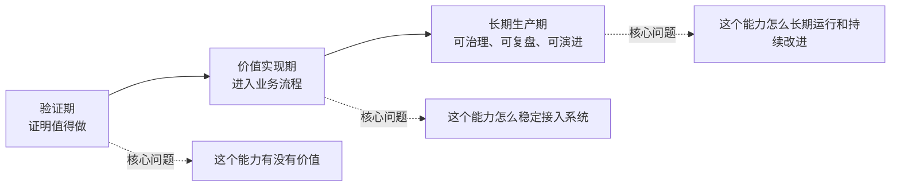
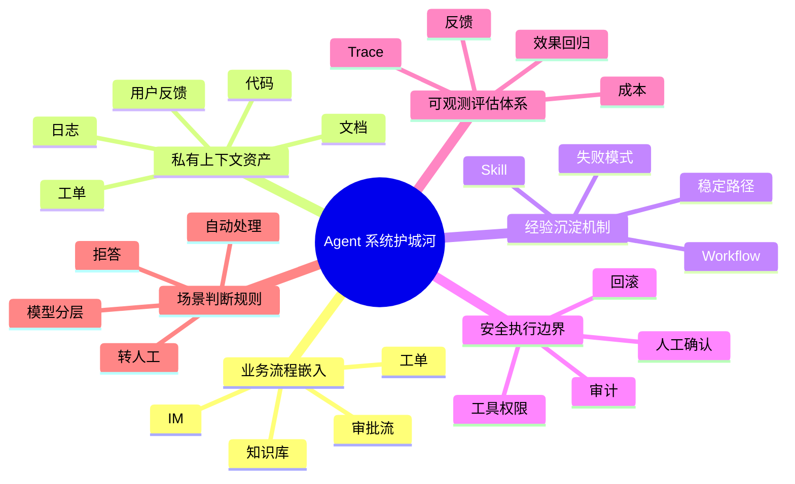

# 生产级 Agent 应该是什么样的

从最开始用 SDK 调 AI 接口，到后来用一些 AI 框架做案例，表面上看一直在推进：模型能调了，工具能接了，任务链路也能跑了。

但这种推进很容易停在 demo 阶段。模型答对了一次，并不等于系统能稳定承担一千次不稳定的成功和失败。

我在读一些关于生产化 Agent 的资料时，看到一个被反复提到的判断：学 Agent 不能只学模型怎么做事，还要学系统怎么承受模型做事。

## 真正的问题不是 demo 少，而是缺少生产化参照系

很多 Agent 教程都会给人一种错觉。

接一个模型，写一段 prompt，绑定几个工具，跑一个任务链路，最后输出一个看起来不错的结果。这个过程很顺，甚至会让人觉得 Agent 已经能用了。

但这类 demo 通常只回答了一个问题：模型有没有机会完成这件事。

它没有回答另外一组更关键的问题：

- 做错了怎么办？
- 成本失控怎么办？
- 工具调错了怎么办？
- 用户权限不一致怎么办？
- 任务跑到一半中断怎么办？
- 结果要不要进入业务系统？
- 这次失败有没有留下可复盘的证据？
- 下次遇到同类问题，系统会不会比上次更好？

这些问题才是 demo 和生产之间真正的距离。

我在一些资料里看到这种距离被叫做 **一次性成功幻觉**。

它看起来已经成功了，但只是一次成功。没有权限边界，没有执行记录，没有失败恢复，没有成本评估，没有业务闭环，这个系统就还没有离开 demo 阶段。

在读到这些讨论之后，我自己也更容易在看到一个 demo 时立刻反问一句：这个能力有没有离开它的演示环境？

## Agent 生产化要过五道门

很多资料里会把生产化要过的问题归纳成几道门。我目前看到的一种整理方式是五道门。

这五道门不是框架选型，也不是某个技术栈的最佳实践，而是任何 AI 能力进入真实系统前都绕不开的问题。

### 第一，价值门：它解决的是不是真问题

不是所有问题都值得用 Agent 做。

如果一个需求可以用规则、搜索、表单、工作流稳定解决，那 Agent 可能只是增加了不确定性和 token 成本。

价值门要问的是：

- 这个任务是否真的需要推理和动态决策？
- 用户是否真的愿意在这个场景里使用它？
- 它相比传统功能开发有没有明显收益？
- 它的错误率是否在业务可接受范围内？
- 它的单次运行成本是否配得上这次任务的价值？

过不了价值门，后面所有架构设计都是过度设计。

### 第二，接入门：它能不能进入现有流程

一个 Agent 单独跑起来不难，难的是进入业务流程。

很多 AI demo 最后都会变成一个外挂页面：用户要专门打开它、复制信息给它、再把结果搬回原系统。

这不是生产化，只是多了一个工具。

接入门要问的是：

- 用户在哪里触发这个能力？
- 输入数据从哪里来？
- 结果要回写到哪里？
- 它是独立服务，还是老系统里的一个能力模块？
- 和现有系统通过 HTTP、RPC、MQ，还是直接嵌入当前技术栈？
- 它进入流程以后，是减少了复杂度，还是制造了新的割裂？

真实企业里，最优解经常不是再引入一个完整 Agent 框架，而是把 AI 能力嵌进已有流程。

### 第三，权限门：它被允许做到哪一步

Agent 一旦能调用工具，就不再只是一个聊天框。

它可能查数据、改文件、发请求、写记录、触发流程，甚至影响外部系统。

权限门要问的是：

- 它能调用哪些工具？
- 哪些工具只能读，哪些工具可以写？
- 哪些动作必须人工确认？
- 工具参数有没有边界？
- 不同用户看到的数据是否一致？
- 它的每次操作能不能被审计？

没有权限门的 Agent，越能干越危险。

### 第四，观测门：它为什么这么做能不能被看见

传统系统出错，至少还有日志、异常栈、监控指标。

Agent 出错，如果没有 trace，就只剩一句“模型答错了”。这句话没有工程价值。

观测门要问的是：

- 用户输入是什么？
- prompt 是什么？
- 上下文装了什么？
- 检索到了哪些内容？
- 模型为什么选择这个工具？
- 工具返回了什么？
- 最终答案引用了哪些信息？
- 这次执行花了多少 token 和时间？

没有观测，就没有调试。没有调试，就没有长期维护。

### 第五，成本门：它能不能规模化运行

Agent 的能力不是免费的。

每一次模型调用、上下文传递、工具执行、失败重试，都是成本。

成本门要问的是：

- 单次任务平均消耗多少 token？
- 高频问题要不要缓存？
- 哪些任务可以用小模型？
- 哪些上下文可以压缩？
- 哪些工具调用可以提前过滤？
- 失败重试会不会把成本放大？
- 这个能力如果被 1000 个用户使用，成本是否还能接受？

Demo 可以不算账，生产系统必须算账。

## 用知识库问答 Agent 看一遍这五道门

为了不把问题说得太虚，可以拿一个最常见的场景来看：企业内部知识库问答 Agent。

最简单的 demo 可能是这样的：

- 把几篇文档丢进向量库
- 用户提问后做一次检索
- 把检索结果塞进 prompt
- 模型生成一个回答
- 页面上展示答案

这个 demo 有价值，但它还不是生产系统。

真正放到企业里，问题马上出现。

用户问到过期制度，Agent 还在引用旧文档；研发人员看到了财务文档的检索片段；用户反馈答案错了，但系统没有记录是哪次检索出了问题；prompt 改了一版，老问题集上的准确率反而下降；热门问题每天重复烧 token，却没人知道钱花在哪里。

这时候就能看到五道门的作用。

价值门看的是：这个问答 Agent 是否真的比人工搜索更快、更准，是否能减少客服、运维或内部支持成本。

接入门看的是：它应该做成单独页面，还是接进 IM、OA、工单系统或内部文档平台。

权限门看的是：不同部门、不同角色、不同项目的人，检索范围是否应该不同。

观测门看的是：每个回答背后有哪些引用、命中了哪些文档、模型有没有编造、用户反馈如何回流。

成本门看的是：高频问题是否缓存，低价值问题是否降级模型，长文档是否先压缩再进入上下文。

所以判断一个知识库 Agent 是否还停在 demo，不能只看它能不能回答问题，而要看它有没有进入真实业务闭环。

我目前看到的资料里，会用一张 **demo 退场清单** 去看：

- 没有权限边界，只能算 demo
- 没有引用来源，只能算 demo
- 没有执行 trace，只能算 demo
- 没有反馈闭环，只能算 demo
- 没有成本估算，很难规模化
- 没有接入业务流程，只是外挂工具
- 没有失败恢复，就不能承担关键任务

这些能力不一定第一天全做完，但作为评估清单，至少要先承认它们存在。否则“能跑通一次”就会被误判成“可以上线”。

## 从 demo 到生产，不是一步跨过去的

很多资料在描述生产化时，会把它分成几个阶段。我目前看到的一种常见切法是三个阶段：验证期、价值实现期、长期生产期。

每个阶段都有自己的任务。阶段错了，学习和设计都会错位。

### 第一阶段：验证期，证明它值得做

验证期只回答一个问题：这个 Agent 能力值不值得继续投入。

资料里普遍会建议，这个阶段不要一上来追求完整架构。先选一个足够小、足够真实的场景，把价值跑出来。

还是知识库问答的例子。验证期可以只选一小批文档，比如研发规范、部署手册、常见故障处理记录，再准备一组真实问题，看它能不能比人工搜索更快给出可用答案。

这个阶段重点看四件事：

- 用户会不会用
- 答案能不能帮上忙
- 错误率是否能接受
- 单次回答成本是否离谱

验证期可以粗糙，但不能没有结论。

一个 demo 最失败的地方，不是页面不好看，也不是架构不完整，而是跑完以后仍然不知道它有没有业务价值。

### 第二阶段：价值实现期，让它进入流程

一旦验证成立，下一步就不是继续堆功能，而是让它进入系统。

价值实现期的核心问题是：这个能力如何稳定接入当前业务流程。

知识库问答 Agent 到了这个阶段，重点就不再是“再多支持几种文档格式”，而是：

- 如果公司主要在 IM 里协作，入口就应该接到群聊或机器人里
- 如果问题来自客服或运维工单，结果就应该能回写工单系统
- 如果知识文档本来就在内部文档平台，索引更新就要跟文档发布流程打通
- 如果不同团队文档权限不同，检索前就要先解决身份和权限过滤

这时要警惕一个常见误区：用 demo 的方式继续堆能力。

多接一个工具，多加一个数据源，多做一个多 Agent 协作，看起来都像进展。但如果它不能进入业务流程，这些能力仍然只是外挂增强。

价值实现期的关键词不是“更智能”，而是“接得住”。

### 第三阶段：长期生产期，让它可治理、可复盘、可演进

长期生产期才是真正意义上的生产级 Agent。

这个阶段 Agent 不再是实验能力，而是业务系统的一部分。

它需要被治理、被审计、被评估、被持续优化。

知识库问答 Agent 到了这个阶段，问题会变得更具体：

- 每天有多少问题被回答？
- 多少回答被用户标记为无效？
- 哪些文档经常被引用？
- 哪些文档从来没被命中？
- 哪类问题最容易答错？
- 错误来自检索、文档缺失，还是模型总结？
- prompt 或检索策略改动后，历史问题集上的效果有没有回退？
- 用户反馈之后，是进入知识库维护流程，还是只停在日志里？

长期生产期的关键词也不是“更智能”，而是“可治理”。

一个生产级 Agent 不能每天重新开始。它要从问题里积累经验，从失败里沉淀规则，从反馈里更新系统。

否则它只是一个每天重新入职的聪明新人。

## 新系统和老系统，打法不一样

讨论生产化时，还要分清楚一个问题：这是从零做新系统，还是在老系统里引入 AI 能力。

如果是新系统，约束相对少，可以先快速做 MVP，验证核心价值，再补工程化能力。

但新系统也不能一直停在 MVP。验证成立以后，就要尽快补齐权限、状态、观测、成本和运维能力。

如果是老系统，重点就不是“怎么搭一个完整 Agent 平台”，而是“怎么以最小成本融合到现有系统资产里”。

这时要先看已有条件：

- 现有系统是什么语言和技术栈？
- 是否已有 HTTP、RPC、MQ 等通信方式？
- 是否已有权限系统？
- 是否已有日志和监控体系？
- 是否已有任务调度能力？
- 是否已有数据访问层？
- 是否已有审批和人工确认流程？

老系统里的 AI 改造，最忌讳重新造一套孤岛。

很多时候，正确做法不是引入一个庞大的 Agent 框架，而是在现有系统里增加一个模型调用服务，把 AI 能力包装成内部 API，只在低风险环节先做人机协同。

Agent 不一定要成为新系统。很多时候，它应该先成为老系统里的一个受控能力。

## 我读到的另一种整理：护城河可能在系统资产上

在不少关于生产级 Agent 的讨论里，会反复出现一个判断：搭建 Agent 系统时，最容易误判的一点，是把模型能力当成护城河。

模型是租来的，框架是会换的，API 是会变的。

这些资料里更强调的是，能长期沉淀下来的，是系统资产。它们一般会被整理成下面这一组维度（mindmap 见原图）。

第一，业务流程嵌入。

Agent 是否已经进入工单、IM、知识库、代码仓库、审批流这些真实工作入口。只要它还停在一个单独页面里，就很容易被替代。一旦它成为默认流程的一部分，替换成本就不再只是换一个模型。

第二，私有上下文资产。

企业自己的文档、工单、代码、日志、用户反馈、历史处理记录，能不能被整理成可检索、可权限控制、可更新的上下文。大家都能用公开模型，但不是每个人都有这套业务上下文。

第三，经验沉淀机制。

系统能不能记住哪些任务容易失败、哪些路径更稳、哪些结果必须人工确认、哪些成功流程可以固化成 Skill 或 Workflow。一个不能沉淀经验的 Agent，只是每天重新入职的聪明新人。

第四，安全执行边界。

Agent 能调用哪些工具，能做到哪一步，哪些动作需要审批，出了问题能不能审计和回滚。能让 Agent 安全地进入真实执行环境，本身就是壁垒。

第五，可观测和评估体系。

每次执行能不能被记录、分析和复盘，prompt、上下文、工具调用、成本、反馈能不能形成改进闭环。没有这层，Agent 的成功和失败都只是黑箱。

第六，场景判断规则。

什么问题自动处理，什么问题转人工，什么问题拒答，什么问题值得调用更贵模型。这些规则来自真实业务实践，不是接一个通用框架就能获得。

所以这类资料会总结成一句话：

> 模型能力是入口，系统资产才是护城河。

我自己目前还在学习阶段，没法判断这句话在真实企业里成立到什么程度。但作为一个观察方向，确实会改变我看资料时的视角：相比“哪个模型更强”，更值得追问的是“哪个系统已经把 AI 能力嵌进了自己的流程”。

## 我读到的：要补的可能是工程判断，而不是更多模型 API

很多资料里都同意一个观点：如果目标不是停在 demo，而是接近生产级 Agent，那么学习重点就不能只放在模型调用和框架 API 上。

框架当然要学，但框架会变。更长期有价值的，是那些换工具以后仍然成立的判断。

我在这些资料里读到的、目前觉得需要重点补的方向，是六类能力。

第一，场景判断能力。判断一个问题是否真的适合 Agent，而不是看到 AI 就想接进去。

第二，系统集成能力。知道 AI 能力怎么接入业务数据、内部服务、权限系统、任务流程和结果回写。

第三，上下文工程能力。设计模型应该看到什么、不该看到什么、历史信息怎么选、工具结果怎么整理。

第四，工具边界设计能力。设计工具粒度、参数结构、返回格式、读写权限和人工确认点。

第五，可观测和评估能力。记录执行过程，追踪成功率、失败率、耗时、token、工具调用次数、用户反馈和错误类型。

第六，成本和风险意识。知道什么时候该用小模型、什么时候该缓存、什么时候该拒答、什么时候必须人工确认。

这些能力听起来没有“多 Agent 编排”那么酷，但它们决定了 Agent 能不能离开 demo。

## 我目前尝试的 Agent 资料读法

读到上面这些讨论之后，我自己尝试调整了一下读 Agent 资料的方式。

现在再看一条 Agent 资料，我会先问它落在哪一层。

它是地图型、架构型、框架型、案例型，还是协议型？

- 地图型资源，用来搭领域主线，不要追 API 细节
- 架构型资源，用来看系统怎么拆、怎么治理、怎么演进
- 框架型资源，用来解决具体工具里的实现问题
- 案例型资源，用来看别人怎么落地、怎么取舍
- 协议型资源，用来理解组件和生态接口的边界

分清类型以后，再过七个问题：

1. 它解决的是验证期、价值实现期，还是长期生产期的问题？
2. 它是在讲框架 API，还是在讲系统判断？
3. 它有没有对应真实工程问题？
4. 它最值得拿走的一个判断是什么？
5. 它最容易被高估的地方是什么？
6. 它里面哪些东西换框架以后仍然成立？
7. 看完之后，我能不能做一个最小验证？

一条资料看完，能留下三样东西就够了：

- 一条判断：这部分最值钱的点是什么
- 一个落点：它在真实项目里对应哪个模块或流程
- 一个检查点：以后遇到类似问题时，我该先看什么

## 结尾：不要只问 Agent 能做什么

Agent 最吸引人的地方，是它看起来什么都能做。

它能规划、能调用工具、能总结、能搜索、能写代码、能分析数据。

但生产系统不能只问“它能做什么”。

我自己目前对生产系统的理解还很浅，但读到这些资料之后，会开始特别在意这些问题：

- 它解决的是真问题吗？
- 它进入业务流程了吗？
- 它有权限边界吗？
- 它的执行过程能复盘吗？
- 它的成本能规模化吗？
- 它失败以后系统还能继续工作吗？

会跑 demo，只说明模型有能力。

能进生产，说明系统有边界。
