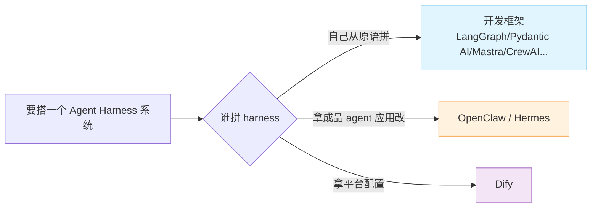
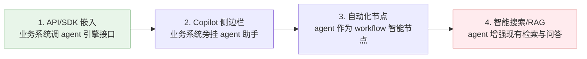
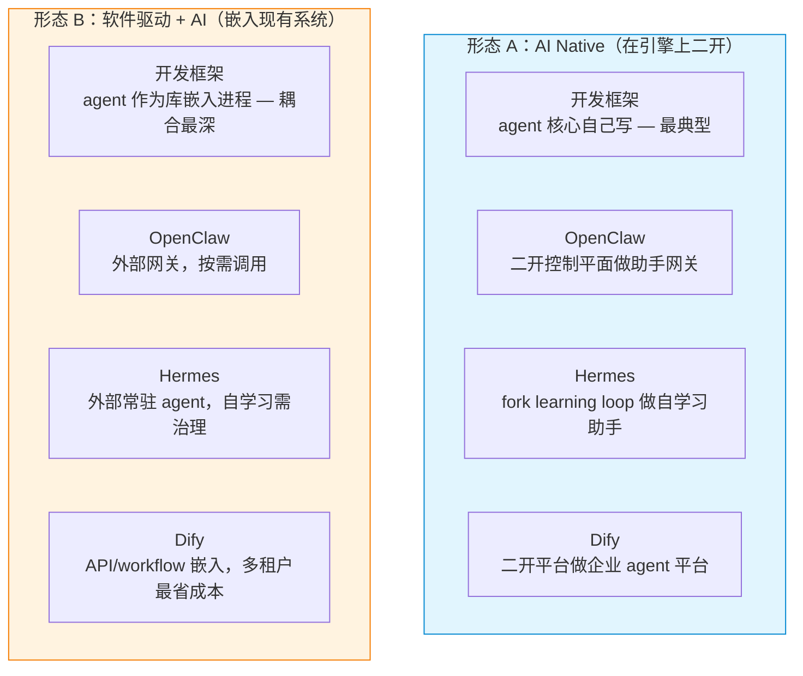

# 构建 Agent Harness 系统：四条引擎路径的对比与企业落地

> 这篇是 [建立 Agent 设计模式元认知](../evolution-trends/agent-coding-strategy-state-reflect.md) 的下游。那篇回答"Harness 是什么、为什么需要"；这篇回答"真要搭一个 Harness 系统，有哪几条路，每条路的特性以什么形式存在，以及怎么落到企业系统里"。

Harness 的定义先复述一遍，作为整篇文章的坐标：**Harness 是模型周围让模型能行动、能回滚、能复盘、能治理的工程轨道**。它由五条主线撑起来——主循环、上下文装配、工具系统、状态与事件记录、治理边界。一个 agent 系统好不好，看的不是模型，而是这五条线搭得怎么样。

但"搭这五条线"有不止一种搭法。有人从原语自己拼，有人拿一个成品 agent 改，有人在一个平台上配。这就是本文要对比的四条路径：**开发框架、OpenClaw、Hermes、Dify**。

需要先说清楚：这四者不是同一层级的东西，把它们放一起对比，不是为了分高下，是因为它们都是"你想搭 agent harness 系统时实际会摆在桌上的选项"。选型的本质，是在"谁拼 harness、拼多少、为谁拼"这三个轴上找缺口最小的那条。

---

## 一、为什么"搭法"会分叉：谁拼 Harness

四条路径的差异，根源不在功能多少，在一个假设不同：**harness 由谁来拼**。

- **自己拼**：框架给你 loop、工具、状态的原语，harness 是你写出来的代码。自由度最高，治理/可观测/多租户这些工程不变量也得你自己补。
- **拿成品 agent 应用改**：已经是一个跑得起来的 agent（有 gateway、有运行时、有记忆），你二开它的骨架。harness 是它给定形状的，你在形状里改。
- **拿平台配**：harness 是平台提供的可配置能力，你通过 UI 和配置组装应用。开箱即用，定制天花板受平台约束。

OpenClaw 和 Hermes 都属于"拿成品 agent 应用改"这一类，但它俩的取向不同——OpenClaw 偏**控制平面骨架**（消息链路怎么穿系统），Hermes 偏**自学习闭环**（agent 怎么跨会话变好）。而且 Hermes 是 OpenClaw 的进化继任：Hermes 仓库里直接带了 `hermes claw migrate` 迁移命令，能把 OpenClaw 的 settings/memories/skills/API keys 平滑迁过来。所以这俩不是竞品的并列，是同一脉络的两代。

这个"谁拼 harness"的分叉，决定了下面所有特性形式的差异。

---

## 二、四条路径各是什么

### 路径一：开发框架——自己拼 Harness

**代表**：LangGraph、Pydantic AI、Mastra、LlamaIndex Agents、CrewAI、AutoGen、Agno/Phidata 等。

**形态**：库 / SDK。它给你 agent loop、工具注册、状态 schema、记忆抽象、图/状态机编排这些原语，但不给你一个"开箱即用的 agent 应用"。harness 存在于你写的代码里。

**特性形式（对齐五条主线）**：

| 主线 | 在框架里以什么形式存在 |
|------|----------------------|
| 主循环 | 你用框架的图/状态机编排（如 LangGraph 的 `StateGraph`），或干脆自己写 `while` loop 调模型 |
| 上下文装配 | 框架给 message 列表和 memory 抽象，塞什么、压什么由你决定 |
| 工具系统 | 框架给 tool 装饰器/接口，工具定义、权限、隔离你自己接 |
| 状态与事件 | 框架给 state schema（如 LangGraph 的 `TypedDict` State），持久化、回放、trace 你自己加 |
| 治理边界 | 基本要你自己加——权限、审批、沙箱、审计都得接第三方或自己写 |

**适合**：agent 能力是产品核心逻辑、需要极致定制、团队有工程能力补齐工程不变量。AI Native 产品的 agent 核心，多数走这条路。

**代价**：demo 很容易，生产很难。harness 元认知里点名的那些工程不变量——Git、测试、权限、日志、可观测、多租户、成本——框架一个都不替你兜底。一个能跑的 demo 和一个能进生产的 agent harness 之间，差的就是这五条主线的工程化深度。

### 路径二：OpenClaw——多渠道助手控制平面

**定位**：一个个人 AI 助手的**控制平面 / 网关**。它把多渠道接入（WhatsApp、Telegram、Slack、Discord）、模型路由、Agent 运行时、工具记忆、Sandbox、Skills、Sub-agent、安全模型放进同一张系统图。仓库里已有 [OpenClaw 源码解析](../../resources/systems/openclaw-book/index.md) 做源码导读。

**形态**：真实开源项目（TypeScript 大项目），可二开。它关心的不是"agent 是什么"，而是"一条消息怎么进系统、怎么穿过去、怎么出去"。

**特性形式（对齐五条主线）**：

| 主线 | 在 OpenClaw 里以什么形式存在 |
|------|----------------------|
| 主循环 | Pi 引擎驱动；消息入境 → 路由 → 运行时 → 出境，是它的主线 |
| 上下文装配 | Gateway 控制平面 + 运行时上下文管理，跨渠道统一 |
| 工具系统 | 工具 + Sandbox + Browser + Skills + Sub-agent + ACP 一整套运行时能力 |
| 状态与事件 | 记忆系统；消息链路本身就是一条事件账本 |
| 治理边界 | 安全模型 + 扩展体系，作为运行时机制而非外挂 |

**适合**：做多渠道 AI 助手网关、想从真实项目源码倒推系统设计、需要一个现成的控制平面骨架二开。

**代价**：它的定位是"个人助手控制平面"，做企业内部 agent 要改造；它给你的形状是"网关 + 运行时"，企业级多租户、业务编排不在它的主战场。

### 路径三：Hermes——自改进的个人 AI Agent（OpenClaw 的进化继任）

**定位**：Nous Research 出的 **self-improving AI agent**——唯一内建 learning loop 的 agent。它会从经验自动创建 skills、使用中改进 skills、周期性 nudge 自己持久化知识、搜索自己过往的会话、跨会话建立对你的深度建模。可以跑在 $5 VPS、GPU 集群或 serverless 上，不绑笔记本，从 Telegram 跟云端 VM 上的它对话。项目地址：[github.com/NousResearch/hermes-agent](https://github.com/NousResearch/hermes-agent)。

**形态**：可安装的 agent 应用（CLI + gateway + Desktop），MIT，Python。装即用，不是库也不是平台。

**特性形式（对齐五条主线）**：

| 主线 | 在 Hermes 里以什么形式存在 |
|------|----------------------|
| 主循环 | agent loop **+ learning loop**：复杂任务后自动创 skill、用中改进、nudge 持久化——循环不只是推进任务，还推进 agent 自身 |
| 上下文装配 | context files + agent-curated memory + FTS5 全文搜索会话 + LLM 摘要做跨会话回忆 + Honcho 辩证式用户建模 |
| 工具系统 | 40+ 工具 + toolset 系统 + MCP + 隔离 subagent 并行 + Python RPC 把多步管道压成零上下文成本的一轮 |
| 状态与事件 | persistent memory + skills（作为 procedural memory）+ 跨会话用户模型；状态不只记任务，还记"你是谁" |
| 治理边界 | 命令审批 + DM pairing + 容器隔离；6 种终端后端（local / Docker / SSH / Singularity / Modal / Daytona），其中 Modal/Daytona 提供 serverless 持久化（idle 休眠、按需唤醒） |
| 额外 | 内置 cron 定时自动化 + 研究就绪（批量轨迹生成、轨迹压缩用于训练下一代 tool-calling 模型） |

**适合**：要一个跨会话学习、随用随改进、云端常驻的个人 AI agent；做 agent 研究/训练 trajectory。

**代价**：它的定位是"个人 AI agent"，企业多租户和业务编排不是主战场。更关键的是，"self-improving"在企业场景里是一把双刃剑——agent 自动创建 skill 听起来好，但 skill 自创需要额外治理，否则 agent 会把临时偏好固化成"技能"。Hermes 把 learning loop 做进了 harness，这是它的卖点，也是用它时最需要盯的地方。

### 路径四：Dify——低代码 agent + 工作流平台

**定位**：企业级低代码 agent / 工作流编排平台。有 UI、应用配置层、agent runtime、RAG、MCP、多租户、可观测、触发器。仓库里已有 [Dify 架构拆解（v1.15.0）](../../application-notes/engineering/dify/index.md) 共 16 篇。

**形态**：平台型产品。harness 是它提供的可配置能力，你通过 UI 和配置组装应用，而不是写代码拼 loop。

**特性形式（对齐五条主线，直接引用仓库拆解编号）**：

| 主线 | 在 Dify 里以什么形式存在 |
|------|----------------------|
| 主循环 | agent runtime + reasoning（[dify-03](../../application-notes/engineering/dify/dify-03-agent-runtime.md) / [dify-04](../../application-notes/engineering/dify/dify-04-agent-reasoning.md)）+ workflow engine（[dify-11](../../application-notes/engineering/dify/dify-11-workflow-engine.md)） |
| 上下文装配 | agent context 层（[dify-05](../../application-notes/engineering/dify/dify-05-agent-context.md)）+ RAG indexing/retrieval（[dify-09](../../application-notes/engineering/dify/dify-09-rag-indexing.md) / [dify-10](../../application-notes/engineering/dify/dify-10-rag-retrieval.md)） |
| 工具系统 | tool registration（[dify-07](../../application-notes/engineering/dify/dify-07-tool-registration.md)）+ MCP（[dify-12](../../application-notes/engineering/dify/dify-12-mcp-protocol.md)） |
| 状态与事件 | async tasks/events（[dify-06](../../application-notes/engineering/dify/dify-06-async-tasks-and-events.md)）+ trigger system（[dify-15](../../application-notes/engineering/dify/dify-15-trigger-system.md)） |
| 治理边界 | 多租户与安全（[dify-13](../../application-notes/engineering/dify/dify-13-multi-tenancy-and-security.md)）+ 可观测（[dify-14](../../application-notes/engineering/dify/dify-14-observability.md)） |
| 额外 | model providers 与扩展（[dify-08](../../application-notes/engineering/dify/dify-08-model-providers-and-extensions.md)）、应用配置层（[dify-02](../../application-notes/engineering/dify/dify-02-app-config-layer.md)） |

**适合**：企业级、多租户、可视化搭建、业务人员可参与、需要完整平台能力开箱即用。

**代价**：定制天花板受平台约束；要深度定制得深入源码二开；平台本身比较重。它的五条主线都齐，但都封装在平台里——你是在它画好的格子里填，不是从原语搭。

---

## 三、四条路径的横向对比

把上面四张表压成一张，加上和落地相关的维度：

| 维度 | 开发框架 | OpenClaw | Hermes | Dify |
|------|---------|----------|--------|------|
| **形态** | 库 / SDK | 控制平面项目 | agent 应用 | 平台 |
| **谁拼 harness** | 你 | 改它的骨架 | 用它的 loop | 配它的平台 |
| **主循环谁定** | 你写 | Pi 引擎 | agent loop + learning loop | runtime + workflow |
| **上下文装配** | 你管 | 控制平面 | memory + FTS5 + 用户建模 | context 层 + RAG |
| **工具系统** | 你定义 | Sandbox/Skills/Sub-agent | 40+ 工具 + MCP + subagent | tool registration + MCP |
| **状态/事件** | 你加 | 记忆 | persistent memory + skills | async + trigger |
| **治理边界** | 你补 | 安全模型 | 审批 + 隔离 + 6 种后端 | 多租户 + 安全 + 可观测 |
| **上手方式** | 写代码 | 读源码二开 | 装即用 | UI 配置 |
| **定制天花板** | 最高 | 高（源码可改） | 中（应用层 + 二开） | 中（平台内 + 二开） |
| **企业多租户** | 自己做 | 要改 | 不是主战场 | 原生支持 |
| **多渠道 gateway** | 自己接 | 原生 | 原生 | 平台接入 |
| **自学习/记忆** | 自己做 | 记忆系统 | learning loop 闭环 | RAG + 记忆 |
| **典型场景** | 任意 | 中大型助手网关 | 个人/小团队自学习 | 企业级平台 |

读这张表的方式不是逐列比强弱，是先定你的场景在哪一行，再看哪一列的"特性形式"和你的缺口最小。

再用一张四象限定位表看分布：

|   | 个人助手取向 | 企业平台取向 |
|---|---|---|
| **harness 由你拼** | 开发框架（个人助手） | 开发框架（企业自建 harness） |
| **harness 引擎给定** | OpenClaw / Hermes | Dify |

象限给的是一个粗定位，不是结论。开发框架横跨个人和企业两个象限，是因为它的取向由你的代码决定，框架本身不预设场景。OpenClaw 和 Hermes 都在"引擎给定 + 个人助手"一侧，但 OpenClaw 更靠控制平面、Hermes 更靠自学习。Dify 独占"引擎给定 + 企业平台"。

---

## 四、落地到企业系统：两种形态

对比完四条路径，下一个问题是：选定了路径之后，怎么落到一个真实的企业系统里。这里有两条根本不同的落地形态，对应需求里点名的两种走法。

### 形态 A：AI Native——在引擎上二开，系统围绕 agent 构建

**什么意思**：agent 是产品主体，业务流程围绕 agent 能力设计。选一个引擎做底座，二开成自己的 AI Native 产品。系统的中心是 agent runtime，其他模块围着它转。

**什么时候选**：做全新的 AI 产品；agent 能力是核心卖点；没有历史系统包袱；愿意以 agent 为中心重塑流程。

**四条路径在 AI Native 下的表现**：

- **开发框架**：AI Native 产品的 agent 核心逻辑自己写，这是最典型的 AI Native 路径。框架的原语足够你拼出任何 harness 形状。
- **OpenClaw**：做 AI Native 个人助手 / 网关产品，二开它的控制平面骨架。消息链路、多渠道、运行时机制都是现成的，你在上面长业务。
- **Hermes**：做 AI Native 自学习个人助手，fork 它的 learning loop。这是它最擅长的形态——一个能跨会话变好的云端常驻 agent。
- **Dify**：做 AI Native 企业 agent 平台，基于 Dify 二开。很多公司就是这么干的：拿 Dify 当底座，改前端、加模型、接内部系统、定制 workflow 节点。

**AI Native 下要回答的工程问题**：harness 治理、多租户、可观测、成本、持久化——这些引擎给了多少、你补多少。开发框架几乎全要自己补；OpenClaw/Hermes 给了 harness 骨架但企业化要补；Dify 给得最全，但要适配它的平台边界。

### 形态 B：软件驱动 + AI——嵌入现有业务系统

**什么意思**：现有业务系统（ERP / CRM / OA / 工单 / 客服 / 内部工具）是主体，agent 作为能力嵌入——copilot、智能助手、自动化节点、智能搜索。现有架构和权限体系保留，AI 是增强层，不是主体。

**什么时候选**：已有成熟业务系统；AI 是增强不是主体；要保留现有架构、权限、审计；不能推倒重来。

**嵌入方式（按耦合度从低到高）**：

1. **API/SDK 嵌入**：业务系统调 agent 引擎的 API（如 Dify 的应用 API、自建框架 agent 的 HTTP 接口）。耦合最低，agent 引擎作为外部服务存在。
2. **Copilot 侧边栏**：业务系统旁边挂一个 agent 助手，能读当前上下文、能操作当前页面。这是最常见的"软件驱动 + AI"形态。
3. **自动化节点**：agent 作为业务 workflow 里的一个智能节点，由触发器驱动（工单进来 → agent 分类 → 路由）。
4. **智能搜索 / RAG**：agent 增强现有系统的检索和问答，不动主流程，只改"找东西"和"问问题"的体验。

**四条路径在软件驱动 + AI 下的表现**：

- **开发框架**：最灵活嵌入。agent 作为库直接嵌进业务系统进程，和现有代码同生命周期，共享权限上下文。耦合可以做到最深。
- **OpenClaw**：作为外部网关存在，业务系统通过消息渠道或 API 接入。耦合低，但要多跑一套控制平面，适合"AI 能力独立部署、业务系统按需调用"。
- **Hermes**：作为外部常驻 agent，业务系统通过 gateway/API 调。它的自学习特性在嵌入场景是亮点也是风险——agent 跨会话记住业务上下文是好事，但 skill 自创和企业权限体系要治理好，否则 agent 会把某次临时操作固化成"技能"。
- **Dify**：平台型嵌入。业务系统调 Dify API、或把 Dify workflow 作为后端编排层。多租户适合多业务线各自配各自的 agent，是"软件驱动 + AI"里最省工程成本的选项。

**软件驱动 + AI 下要回答的工程问题**：与现有权限/数据/审计的打通、agent 调用边界（能改什么不能改什么）、成本可控（按调用计费 vs 常驻）、不破坏现有流程。这些问题的核心是"agent 要进入既有治理体系，而不是另起一套"。

### 两种形态怎么选

| 判断信号 | 选哪种形态 |
|---------|-----------|
| 全新 AI 产品，agent 是核心卖点 | AI Native |
| 已有成熟业务系统，AI 是增强 | 软件驱动 + AI |
| 没有历史系统包袱 | AI Native |
| 必须保留现有权限/审计/流程 | 软件驱动 + AI |
| 团队想以 agent 为中心重塑流程 | AI Native |
| 团队只想给现有系统加智能 | 软件驱动 + AI |
| 两者都有 | 核心场景 AI Native，边缘场景软件驱动 + AI |

现实里很少有纯 A 或纯 B。常见的是混合：**核心场景走 AI Native 重做，边缘场景走软件驱动 + AI 嵌入**。比如一个客服系统，核心的"智能工单处理"用 AI Native 重做（agent 是主体），边缘的"知识库搜索"用软件驱动 + AI 嵌入现有系统。

### 两种形态都要守的工程不变量

承接 [Harness 元认知](../evolution-trends/agent-coding-strategy-state-reflect.md) 里点名的工程不变量——不管哪种形态、哪个引擎，这几样都不能省：

- **Git / 版本**：agent 改了什么，diff 能看到；改坏了能回退
- **测试 / 验证**：外部信号优先于模型自评（测试、类型检查、lint、diff、日志）
- **权限 / 审批**：哪些操作自动、哪些必须确认、哪些禁止
- **日志 / 可观测**：perception / action / reflection trace，能回答"它为什么这么做"
- **成本**：调用计费、上下文长度、休眠唤醒，要可控
- **回滚**：长任务跑偏了能回到某个检查点

引擎给你一部分，剩下的你要补。AI Native 形态下你要补的更多（因为你在造系统），软件驱动 + AI 形态下你要补的更偏"和现有系统对齐"（因为现有系统已有自己的不变量，agent 要接入而不是另造）。

---

## 五、一张总图：四条路径 × 两种落地形态

把四条路径和两种形态交叉，看每条路在每种形态下的适配：

读这张图的关键：**同一条路径在两种形态下的适配度不同，同一种形态下不同路径的工程成本也不同**。

- 开发框架是唯一两种形态都"原生适配"的——因为它最灵活，AI Native 能当核心写，软件驱动 + AI 能当库嵌。
- OpenClaw 和 Hermes 都偏 AI Native（它们本来就是成品 agent 应用），做软件驱动 + AI 时更像"外部 agent 服务"，耦合偏松。
- Dify 两种形态都强：AI Native 能当平台二开，软件驱动 + AI 能当后端编排层 + 多租户。这也是为什么很多企业选 Dify——它两种形态都能接。

---

## 六、选型判断：回到五个问题

承接 [实操落地篇](../tool-mastery/agent-from-paradigm-to-practice.md) 的判断式写法，选型时不问"哪个最强"，问这五个问题：

**1. 你的 agent 主循环谁定？**
- 自己定全流程 → 开发框架
- 用引擎给定的循环 → OpenClaw / Hermes / Dify

**2. 你的场景是个人助手还是企业平台？**
- 个人 / 小团队助手 → OpenClaw / Hermes（或开发框架自己搭）
- 企业级 / 多租户 / 多业务线 → Dify（或开发框架自己搭企业 harness）

**3. 你要不要 agent 自学习（跨会话变好）？**
- 要，且能治理 skill 自创 → Hermes
- 不要，或自己实现 → 其他三条

**4. 你是全新产品还是嵌入现有系统？**
- 全新产品，agent 是核心 → AI Native 形态
- 嵌入现有系统，AI 是增强 → 软件驱动 + AI 形态
- 混合 → 核心场景 A，边缘场景 B

**5. 你的工程能力能补多少 harness 缺口？**
- 能补齐 Git/测试/权限/日志/可观测/多租户 → 开发框架，自由度最高
- 能补一部分、想要现成骨架 → OpenClaw / Hermes
- 想要平台兜底大部分工程不变量 → Dify

这五个问题的答案组合起来，基本能把四条路径 + 两种形态收敛到一两个选项。剩下的取舍就是"特性形式"层面的偏好——你是更愿意在代码里控制 harness，还是在平台配置里控制 harness。

---

## 七、结尾：Harness 不变，搭法分叉

回到开头那句话：harness 是模型周围让模型能行动、能回滚、能复盘、能治理的工程轨道。这条轨道的五条主线——主循环、上下文、工具、状态、治理——不管你走哪条路都要齐。

四条路径殊途同归，都在给模型套上这条轨道。区别只是：

- **开发框架**：轨道的每一节都你自己铺，最自由也最累
- **OpenClaw**：轨道铺成了控制平面，消息在轨道上穿系统
- **Hermes**：轨道会自己生长——learning loop 让 harness 随会话变厚
- **Dify**：轨道铺成了平台，你在站台上配置列车

而落到企业系统时，再叠一层选择：是在引擎上二开成 AI Native 产品（系统围着 agent 转），还是把 agent 嵌进现有业务系统做软件驱动 + AI（agent 围着系统转）。

选型不是选最强，是选**你的场景下 harness 缺口最小**的那条。一个能跑的 demo 和一个能进生产的 agent harness 之间，差的从来不是功能清单的长短，是五条主线的工程化深度。这个判断，四条路径通用，两种形态也通用。

这也是为什么这篇文章不堆功能清单——功能会变，引擎会迭代（Hermes 都已经从 OpenClaw 进化过来了），但"五条主线要齐 + 两种落地形态要分清"这个判断框架，是跨引擎、跨形态、跨时间还能继续用的东西。
