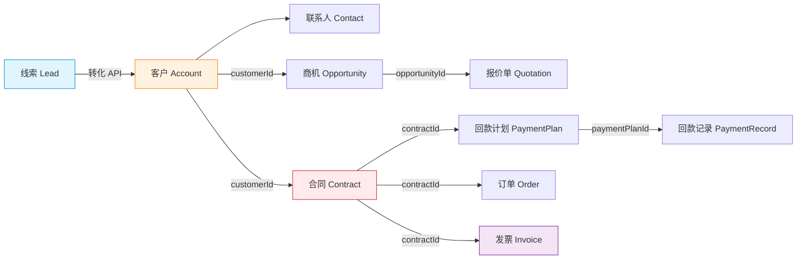

# 拆解 CordysCRM-skills：把企业系统装成 Skill 的一个样本

> 这篇是 [Skill 经验封装篇](../agent-system-design/agent-skill-design.md) 的真实样本，也是 [构建 Agent Harness 系统](./agent-harness-engine-comparison.md) 里"软件驱动 + AI——嵌入现有业务系统"形态的一个落地案例。那两篇讲 Skill 是什么、企业落地有哪几条路；这篇拆一个具体项目，看把一套存量 CRM 装成 Skill 到底做了什么、怎么做的。

CordysCRM-skills 是"把企业系统装成 Skill"这条路径的一个完整样本：一套存量 CRM 不改业务代码，被重新组织成通用 AI 能读懂、会调用的"说明书 + 工具箱"，从而获得智能。本文拆解它做了什么、怎么做的，并从中提取能带到其他企业系统的判断。

---

## 一、功能：这个 Skill 做了什么

它把 Cordys CRM 从"一个要在网页上点来点去的数据系统"，变成"一个能听懂人话、知道你是谁、主动挑重点、跨模块推理、还能安全写入的对话式智能层"。五个维度：

1. **角色感知**——一个 API Key 背后是一个具体的人。系统调 `whoami`（一条 CLI 命令：用 API Key 向 CRM 问"这把钥匙是谁的"，拿回姓名、岗位、部门等身份信息）读出岗位，自动匹配到销售、经理、高管、商务、财务五种视角之一。同一句"看看线索"：销售拿到按超期排序的"今天该先跟谁"清单，经理拿到"团队本周谁掉队"的按人下钻看板，财务被直接带去合同→回款→发票的资金链路。没有"请选择角色"下拉框，输出在开口前就按身份变形。
2. **L2C 全链路原生**——线索→客户→商机→报价→合同→订单→回款计划→回款记录→发票，九个模块不是平铺菜单，而是一条从线索到现金的流水线。系统知道每一环的下一环是谁，一句"查查这笔单子"能从一份合同反溯到商机、客户、线索，再正追到回款和发票，一次给出完整时间线，而不是在九个页面之间来回跳。
3. **跨模块链断裂检测**——传统单模块 CRM 只会告诉你"这个商机赢单了"；这个系统会继续追问"赢单 15 天了，关联合同呢？"。商机赢单没建合同、合同签了没回款计划、发票开了 90 天没回款——这些跨模块"断链"在传统系统里要等月底对账才暴露，这里在查看相关数据的当下就被扫出来、主动报给你，连同严重度和建议动作。
4. **模糊意图路由**——"今天做什么"这句话里没有任何模块名。但系统知道：对销售，它意味着"查今日跟进计划→挑超期的→排优先级→出行动清单"；对财务，"欠款情况"意味着"拉全部回款计划→筛逾期→按到期排序→给催收优先级"。模糊人话被映射到一份预先写好的、按角色定制的多步操作流程上，而不是丢给模型自由发挥。
5. **安全的写操作**——AI 不会凭空猜字段就往 CRM 里写。创建客户前，先调表单接口拿到"现在有哪些字段、哪些必填、行业只能填哪些枚举值"的实时定义，据此校验输入，给一张预览表确认后才写入，写完再读回核对落库。能创建、更新、转化，但**删除被一票否决——不提供、不封装、不响应**：最坏只是造了一条坏数据，永远不会毁掉好数据。

---

## 二、结构：整体长什么样

不是一个巨型 Prompt，而是四个层次 + 一组九引擎晶格。

### 四层结构

```
CordysCRM-skills/                       ← 仓库根
├── .workbuddy-plugin/plugin.json       ← 入口层（WorkBuddy 打包配置）
├── agents/cordys-crm.md                ← 入口层（WorkBuddy 专家定义）
├── README.md
│
└── skills/cordys-crm/                  ← 技能本体
    ├── SKILL.md                        ← 入口层（编排入口、安全红线）
    ├── registry.json                   ← 入口层（技能清单、依赖声明）
    ├── .env / user-role.md             ← 凭证 / 运行时身份缓存（不入库）
    │
    ├── core/                           ← 认知层（9 个引擎晶格）
    ├── profiles/                       ← 认知层（5 个角色人格）
    │
    ├── scripts/cordys.sh               ← 执行层（无头 CLI）
    │
    ├── references/                     ← 知识层（API 文档、OpenAPI 规范）
    └── rules/                          ← 知识层（可扩展的业务/表单/字段映射规则）
```

| 层 | 代表文件 | 职责 |
|----|---------|------|
| **入口层** | SKILL.md、agents/、registry.json、plugin.json | 告诉外部 Agent"我是谁、何时触发我、安全红线是什么"——Agent 加载和触发的入口 |
| **认知层** | core/（9 引擎）+ profiles/（5 人格） | "怎么想"——角色推断、意图路由、关联推理、风险判断、输出格式、写入护栏 |
| **执行层** | scripts/cordys.sh | "怎么做"——一个无头 CLI，把认知层的决策落成对 CRM 的实际 API 调用 |
| **知识层** | references/ + rules/ | "系统是什么样"——API 文档作为事实来源；rules/ 提供可扩展的业务规则钩子 |

一句话：**入口层管"被找到"，认知层管"怎么想"，执行层管"怎么做"，知识层管"系统什么样"。**

### 九引擎晶格

认知层 9 个引擎，每个是 `core/` 下一个职责单一的 markdown 文件，按激活信号懒加载：

| 引擎 | 文件 | 激活信号 | 做什么 |
|------|------|---------|--------|
| 角色 | role-engine.md | 会话启动 | 调 whoami 推断身份→匹配角色→加载 profile（机制一） |
| 意图 | intent-engine.md | "今天做什么" | 模糊指令→角色工作流路由（机制二） |
| CLI 规范 | cli-spec.md | 任何查询 | 自然语言→cordys.sh 命令的翻译规范（命令族/参数/模块推断/条件/排序/搜索/审批，526 行，最大一个） |
| CLI 参考 | cli-reference.md | 复杂筛选/写入 | 字段类型→操作符速查 + 写入端点，cli-spec 的字典附录（331 行） |
| 链路 | linkage-engine.md | "查这笔单子" | L2C 关联图 + 正向/反向追踪（机制四） |
| 漏斗 | funnel-engine.md | "管道怎么样" | 统计 API 聚合，管道/转化率/趋势 |
| 风险 | risk-engine.md | 数据展示后 | 单模块异常 + 跨模块链断裂检测（机制四） |
| 输出 | output-engine.md | 每次响应 | JSON→人类可读、角色自适应（结论先行/表格限制/大结果集摘要） |
| 写入 | write-engine.md | "创建/修改" | 表单获取→校验→写入→验证（机制五） |

按职责分四组：**理解输入**（角色、意图）——决定"谁在问、要什么"；**构造调用**（CLI 规范做主翻译，CLI 参考当字典、复杂筛选/写入时才查）；**理解输出**（输出格式化、链路追关联、漏斗算聚合、风险扫异常）——决定"怎么呈现、怎么预警"；**改变数据**（写入）。启动时只强制加载角色引擎，其余按意图懒加载（见第三节）；引擎之间不直接调用，靠 `user-role.md` + 对话上下文这条共享总线协同。

### SKILL.md：入口编排文件

SKILL.md 是 Agent 加载 skill 时读的第一个文件，既是入口契约也是编排蓝图。它开篇定调"你是 Cordys CRM 用户的专属业务助手，根据用户的实际角色自动适配交互方式"，内容分六块：

**1 · frontmatter（入口契约）**——声明 name、description（含触发词）、environment、security：

```yaml
name: cordys-crm
description: |
  Cordys CRM L2C 全链路技能。支持跨模块关联追踪、漏斗分析、Customer 360、智能工作流引导，以及完整的 CLI 指令映射。
  触发词：线索、客户、商机、合同、回款、发票、审批、漏斗、管道、CRM
environment:
  required: [CORDYS_ACCESS_KEY, CORDYS_SECRET_KEY, CORDYS_CRM_DOMAIN]
  optional: [ROLE_MAP]
security:
  requiresSecrets: true
  sensitiveEnvironment: true
  externalNetworkAccess: true
```

宿主读这一段决定何时唤醒（触发词）、配什么环境、放不放它联网。

**2 · 核心架构（路由蓝图）**——用户输入按意图分叉到各引擎，经角色透镜适配，汇成统一输出：

```
用户输入
  ├─ 单模块查询？→ page/search/get
  ├─ L2C 链路追踪？→ linkage-engine
  ├─ 漏斗/管道分析？→ funnel-engine
  ├─ 模糊工作指令？→ intent-engine（意图路由 + 自动匹配工作流）
  ├─ 写入操作？→ write-engine
  ├─ 审批意图？→ approval 命令族
  ├─ 角色适配 → 销售(SELF)/经理(部门+漏斗)/高管(全公司+趋势)/商务(合同+合规)/财务(合同→现金)
  └─ 输出 → 结论 + L2C 视图 + 预警 + 建议
```

**3 · 初始化流程 + 加载策略表（加载纪律）**：

```
第一步：加载角色引擎（唯一必加载的核心引擎）→ core/role-engine.md
第二步：确认用户身份 → 匹配角色 → 加载 profiles/{角色}.md
第三步：后续引擎按场景按需加载
```

> user-role.md 缺失或无效时自动初始化；存在且有效则从第二步开始。

| 场景 | 加载文件 | 触发时机 |
|------|---------|---------|
| 构建查询命令 | core/cli-spec.md | 每次构造 cordys.sh crm 命令时 |
| 格式化输出 | core/output-engine.md | 每次 API 返回数据后 |
| 扫描预警风险 | core/risk-engine.md | 展示数据后、查看列表/详情时 |
| 字段类型不确定 | core/cli-reference.md | 构造 conditions 不确定 type 时 |
| 审批操作细节 | core/cli-reference.md §4 | 涉及审批 JSON body 时 |
| L2C 链路追踪 | core/linkage-engine.md | 用户问跨模块关联/全链路追踪时 |
| L2C 漏斗分析 | core/funnel-engine.md | 用户问转化率/管道/漏斗时 |
| 意图路由 | core/intent-engine.md | 用户说模糊指令（今天做什么/周报等）时 |
| 写入操作 | core/write-engine.md | 创建/更新线索、客户、商机、联系人时 |
| 自定义规则 | `rules/form-rules/{module}.md` | 写入操作时自动检查（如存在） |

> **核心原则**：role-engine.md 是唯一启动时必加载的。其他引擎全部按需加载，避免 token 浪费。

这张表就是第三节各加载步骤"SKILL.md 的规定"的出处。

**4 · 安全红线**：

- `cordys raw` 只支持查询，不支持写入、删除、转化
- **绝对禁止**在输出中包含 `CORDYS_ACCESS_KEY`/`CORDYS_SECRET_KEY` 的值
- **绝对禁止执行任何删除操作**——不提供、不封装、不响应删除意图
- API 错误消息含密钥信息必须脱敏后展示
- 不打印含认证 header 的完整 curl 命令
- `.env` 是敏感文件，不入版本控制，不在输出中提及

**5 · 多步查询的上下文管理**——大 JSON 读完即提取关键信息、原始不留：

| 场景 | 做法 |
|------|------|
| 单次查询、JSON 正常 | 直接格式化输出 |
| 全局模糊搜索（6 模块并行） | 每模块 JSON 读完即提取关键信息，大 JSON 不在思考中保留 |
| 逐步下钻（A→B） | A 格式化后只留摘要供 B 用，原始 JSON 丢弃 |
| 分页遍历拉全量 | 每页解析后只留全局统计 |
| 返回 30+ 条 | 只展示前 10 条 + 统计摘要 |

> 不要留着原始 JSON 不放。格式化输出本身就是最好的摘要。

**6 · 输出原则**——响应按层层下钻结构：

```
关键结论（如果有清晰发现）
└─ 核心数据（表格 ≤5 列，≤10 条，角色关注字段优先）
   └─ L2C 链路视图（如果涉及跨模块数据）
      └─ 链路健康检查（如果发现链断裂）
         └─ 异常提醒（risk-engine 扫描结果）
            └─ 建议动作（具体到"做什么、谁做、优先级"）
```

大结果集分级：1–10 条完整表格；11–30 条前 10+"还有 N 条，是否查看更多"；30 条以上统计摘要+前 10+"建议增加筛选条件"。禁止反模式：直接贴 JSON、纯搬运不做判断、抛选择不给建议、表格超 5 列。

---

## 三、每一块怎么做：按渐进式加载展开

SKILL.md 的渐进式加载是这套 Skill 的运行脊柱：会话启动只加载 role-engine，其余引擎按激活信号逐个进入上下文、用完即弃。这条纪律写在 SKILL.md 的"初始化流程"+"引擎按需加载策略"表+"核心原则"里，是**协议非代码**——靠 Agent 读完 SKILL.md 后自觉遵守，没有 lazy-load 运行时，模型若把九个引擎全读进来也不会崩，只是白费 token。下面按一次会话的加载顺序，逐步展开每个引擎的实现细节。加载轨迹作为路线图：

```
会话启动       : role-engine.md + profiles/sales.md
"今天做什么"   : + intent-engine.md + cli-spec.md + output-engine.md + risk-engine.md
"创建客户"     : + write-engine.md + cli-reference.md + rules/form-rules/account.md
"查查这笔单子" : + linkage-engine.md
"管道怎么样"   : + funnel-engine.md
```

### 步骤 0｜会话启动：role-engine + profile

**SKILL.md 的规定**：初始化流程第一步"加载 `core/role-engine.md`（唯一必加载的核心引擎）"，核心原则"`role-engine.md` 是唯一启动时必加载的"。

**触发与流程**：会话启动时跑一遍——`whoami`（`cordys.sh crm whoami` → `GET /personal/center/info`）拿回姓名/岗位/部门，`verify` 前置确认 Key 有效，两者都只是 REST 调用、不带智能。

```
检查 user-role.md 是否存在？
├─ 存在且有效 → 加载角色上下文，进入交互
└─ 不存在/无效 →
    ├─ cordys.sh crm verify       验证 API Key
    ├─ cordys.sh crm whoami       获取用户信息
    ├─ 将结果写入 user-role.md    持久化身份
    └─ 匹配角色，加载 profiles/{role}.md
```

**设计细节**——两层匹配策略。第一层用户自定义映射（`.env` 的 `ROLE_MAP`，格式"岗位关键词|…=角色ID"，长关键词优先）：

```bash
ROLE_MAP=总经理|副总裁|VP=executive,总监|经理=sales-manager,商务|合同管理=contract-admin,销售|顾问=sales,财务|会计|出纳=finance
```

```python
for kw in sorted(role_map.keys(), key=len, reverse=True):  # 长关键词优先
    if any(kw in pos for pos in positions):
        return role_map[kw]
```

第二层内置规则（fallback），对 `position` 按固定优先级匹配：

| 优先级 | 命中关键词 | 角色 |
|--------|-----------|------|
| 1 | id=admin 或 roles 含 admin | sales-manager（管理员按经理视角） |
| 2 | 总经理、副总裁、VP、CEO、COO、CFO、总裁、合伙人、董事长 | executive |
| 3 | 经理、总监、主管、负责人、leader、部长、主任 | sales-manager |
| 4 | 财务、会计、出纳、财务经理、财务总监 | finance |
| 5 | 商务、合同管理、合同专员、法务、合规、商务经理、商务总监 | contract-admin |
| 6 | 销售、BD、专员、顾问、业务员、运营 | sales |
| 兜底 | 全部不命中 | sales（最受限，防权限扩散） |

`position` 为空时还有软规则：从历史行为推断（频繁查回款/发票→财务，查 org/members→经理，查自己的线索/商机→销售），仅补充不覆盖。匹配结果写运行时文件 `user-role.md`（不入库）：

```markdown
# 🧠 用户身份上下文
> 自动获取：2026-05-09 10:30
> 匹配角色：sales-manager

## 身份信息
| 字段 | 值 |
|------|-----|
| 用户ID | admin |
| 姓名 | 张三 |
| 岗位 | 销售一部经理 |
| 邮箱 | zhang@company.com |
| 角色ID | sales-manager |
```

刷新条件："刷新身份"/"换账号"→重跑；连续 3 次 401/403→提示检查密钥；满 7 天→后台静默刷新。引用不存在的角色 ID 降级到 `sales`。

随后加载的 `profiles/{role}.md` 是角色人格——定义该角色的核心关注、查询偏好、典型工作流（日常/周常/月常）、KPI 基线、权限边界、异常预警，5 个角色（sales/sales-manager/executive/contract-admin/finance）各一份。角色不是用户选的偏好，而是系统推断的上下文。

### 步骤 1｜用户输入：intent-engine

**SKILL.md 的规定**：核心架构图把输入分叉路由"模糊工作指令？→ intent-engine"；加载策略表"意图路由→`core/intent-engine.md`，用户说模糊指令（今天做什么/周报等）时"。

**触发与流程**：用户每次输入时跑——五级优先路由，命中后加载对应引擎/profile，执行预设工作流。

```
优先级 1：显式模块+操作（"查线索"、"创建客户"）→ 直接路由到 cli-spec.md 构造命令
优先级 2：模糊工作指令（"今天做什么"、"这周怎么样"）→ 查意图映射表，加载对应 profile 工作流
优先级 3：模糊搜索（"搜一下XX"）→ 触发全局模糊搜索
优先级 4：L2C 链路追踪（"查查这笔单子"、"XX公司全景"）→ 触发 linkage-engine
优先级 5：无法识别 → 提示用户细化意图
```

写操作独立路由："创建/新建/添加+模块"→create；"修改/更新/编辑"→update；"批量创建/导入"→batch；"线索转客户/转化"→transition。

**设计细节**——意图→工作流映射表（节选），把模糊人话钉到角色专属 SOP：

| 用户说 | 角色 | 加载 profile | 执行工作流 |
|--------|------|-------------|-----------|
| "今天做什么"/"有什么要跟的" | 销售 | sales.md | 日常 §晨会速览 |
| "这周怎么样"/"周报" | 销售 | sales.md | 周常 §周回顾 |
| "团队今天"/"部门概览" | 经理 | sales-manager.md | 日常 §团队晨会 |
| "团队这周"/"部门周会" | 经理 | sales-manager.md | 周常 §周会数据 |
| "公司情况"/"经营数据" | 高管 | executive.md | 日常 §快照速览 |
| "目标怎么样"/"季度预测" | 高管 | executive.md | 月常 §季度预测 |
| "今天回款"/"回款情况" | 财务 | finance.md | 日常 §回款日报 |
| "欠款情况"/"催款" | 财务 | finance.md | 周常 §应收全景 |
| "审批到哪了"/"合同审批" | 商务 | contract-admin.md | 日常 §合同审批追踪 |
| "合同到期"/"续约" | 商务 | contract-admin.md | 周常 §到期预警 |
| "查查这笔单子"/"链路追踪" | 全部 | — | linkage-engine（通用） |
| "搜一下XX"/"查找XX" | 全部 | — | cli-spec.md §11 全局搜索 |
| "创建线索"/"新建客户" | 全部 | — | write-engine |

覆盖 5 角色 × 日常/周常/月常约 25 条工作流。配合参数默认值表，构造命令时的 viewId/排序/时间范围也按角色预设：

| 场景 | viewId | 排序 | 时间范围 |
|------|--------|------|---------|
| 销售看自己 | SELF | followTime:asc | 不限 |
| 经理看团队 | ALL + departmentId | createTime:desc | 不限 |
| 高管看全公司 | ALL | signTime:desc | 不限 |
| 财务看回款 | ALL | planPayTime:asc | 不限 |
| 今日/本周/本月 | 按角色 | — | TODAY/WEEK/MONTH |

还有"搜索即链路"：全局模糊搜索命中 account 标注"名下 N 个商机"，命中 lead+account 标注"可能已转化"，命中 contract 标注"回款进度 X%"。模型负责理解，Skill 负责规定"理解之后该怎么做"。

### 步骤 2｜构造命令：cli-spec

**SKILL.md 的规定**：加载策略表"构建查询命令→`core/cli-spec.md`，每次需要构造 `cordys.sh crm ...` 命令时"。

**触发与流程**：意图确定后（或显式命令直接进），按 cli-spec 把意图翻译成一条 `cordys.sh crm ...` 命令——选命令族、推断模块、构造 conditions、定排序、配 viewId/时间范围。

**设计细节**——cli-spec（526 行，最大一个）定义命令族总览、模块推断、高级条件处理、动态参数替换、排序规则、内置视图、部门组织架构展开、全局模糊搜索、审批操作。模块推断把人话映射到模块名和默认 viewId：

| 用户说 | 模块 | viewId 默认 |
|--------|------|-------------|
| 线索、潜客 | lead | 按角色 |
| 客户、公司、厂商 | account | 按角色 |
| 商机、机会 | opportunity | 按角色 |
| 合同 | contract | ALL |
| 回款、回款计划 | contract/payment-plan | ALL |
| 回款记录 | contract/payment-record | ALL |
| 发票 | invoice | ALL |
| 报价单 | opportunity/quotation | ALL |
| 订单 | order | ALL |

复杂筛选/写入时再加载 cli-reference（331 行）当字典附录，查"字段类型→操作符"速查和写入端点——它是 cli-spec 的参考层，不常驻上下文。

### 步骤 3｜执行命令：cordys.sh

**SKILL.md 的规定**：SKILL.md 全程用 `cordys.sh crm ...` 命令表达每个操作，把 CLI 作为 Agent 调用系统的唯一入口——SKILL.md 里没有任何"拼 HTTP、管鉴权"的指示，全收口在 CLI。

**触发与流程**：Agent 用执行工具（Bash/exec）跑构造好的命令 → cordys.sh 子进程 source `.env`、鉴权、域名校验、payload 构造 → curl 打 CRM → JSON 回 stdout → Agent 读输出。

**设计细节**——`scripts/cordys.sh`，582 行 Bash CLI，封装全部 REST API。骨架：

```bash
#!/usr/bin/env bash
set -euo pipefail
SCRIPT_DIR="$(cd "$(dirname "${BASH_SOURCE[0]}")" && pwd)"
SKILL_DIR="$(dirname "$SCRIPT_DIR")"
ENV_FILE="${SKILL_DIR}/.env"

# 启动时自动加载技能目录里的 .env
if [[ -f "$ENV_FILE" ]]; then set -a; source "$ENV_FILE"; set +a; fi
CORDYS_CRM_DOMAIN="${CORDYS_CRM_DOMAIN:-https://www.cordys.cn}"
```

鉴权收口在一个函数，对上只露语义命令：

```bash
api_request() {
  local method="$1" url="$2" content_type="$3"; shift 3
  check_keys   # 校验 CORDYS_ACCESS_KEY / CORDYS_SECRET_KEY 已设置
  curl -s -X "$method" "$url" \
    -H "X-Access-Key: ${CORDYS_ACCESS_KEY}" \
    -H "X-Secret-Key: ${CORDYS_SECRET_KEY}" \
    -H "X-Request-Source: SKILL" \
    -H "Content-Type: $content_type; charset=utf-8" "$@"
}
```

零信任域名校验——`validate_url` 取目标域名和 `CORDYS_CRM_DOMAIN` 比对，不匹配拒绝（除非 `CORDYS_ALLOW_UNTRUSTED=1`）：

```bash
if [[ "$domain" != "$trusted_domain" ]] && [[ "$domain" != *".$trusted_domain" ]]; then
  warn "目标域名 '$domain' 与配置的 Cordys CRM 域名 '$trusted_domain' 不匹配"
  return 1   # CORDYS_ALLOW_UNTRUSTED=1 时才继续
fi
```

payload 构造收口——page/search/stat 走 `merge_payload`，把用户 JSON 合并到默认 payload（current=1, pageSize=30, viewId=ALL…），非合法 JSON 当 keyword。

对上的语义命令面（AI 只记这些）：

| 类别 | 命令 |
|------|------|
| 查询 | crm page / get / search / view / contact / follow / product |
| 统计 | crm stat / stat-home / glocount / acct-sub / contract-sub |
| 写入 | crm form / add / update / batch-update / transition / transform |
| 身份与组织 | crm whoami / verify / org / members |
| 审批 | crm approval todo / action / resource / flow |
| 逃生口 | `raw <METHOD> <PATH>`（仅查询） |

分发是 `case "$cmd"` switch，每子命令对应一个 bash 函数。`raw` 是逃生口，只读且必过 `validate_url`。完整调用链（"查查合同 CRM-2026-001"）：

```
1. 用户输入"查查合同 CRM-2026-001"
2. Agent 识别触发词 → 加载 SKILL.md → 按 role-engine 跑 verify/whoami → 匹配角色
3. 意图路由 → 加载 linkage-engine → 构造命令:
     cordys.sh crm page contract '{"keyword":"CRM-2026-001"}'
4. Agent 用它的执行工具(Bash/exec)运行这条命令
5. cordys.sh 子进程: source .env → check_keys → merge_payload 补默认参数
     → curl -X POST $DOMAIN/contract/page \
         -H "X-Access-Key: ..." -H "X-Secret-Key: ..." --data-binary '{...}'
     → CRM 返回 JSON → 输出到 stdout
6. Agent 读 stdout 的 JSON → 按 output-engine 格式化 + risk-engine 扫描 → 回复用户
```

第 4–5 步是关键：Agent 跑 bash 命令不是 HTTP 请求，看到的是 stdout；鉴权/URL/域名/payload 全在子进程里。各 Agent 调用方式相同——都靠"exec shell + 读 stdout"：

| Agent | 怎么调 |
|-------|--------|
| Claude Code | 用 Bash 工具跑 `bash cordys.sh crm ...` |
| WorkBuddy | 专家运行时授予 exec+network，跑同一条命令 |
| OpenClaw | 同上 |
| 内部运行时 | 系统 subprocess 调 cordys.sh，凭证在系统进程内 |

Agent 只需"能跑 bash + 读 stdout"，不需要系统专用 API 插件/SDK/OAuth——这是"运行时无关"的根因。权限协商在 `registry.json`：`"capabilities": ["exec","network"]`。安全边界由 `validate_url` 把凭证锁死在 `CORDYS_CRM_DOMAIN`：Agent 被 prompt injection 骗调别的 URL，CLI 也拒绝——CLI 是闸门，Agent 是操作员，凭证在闸门这一侧。这一层是解耦点：**业务能力的暴露方式（CLI）和智能的消费方式（Agent）被彻底解耦**——这正是 [构建 Agent Harness 系统](./agent-harness-engine-comparison.md) 里"软件驱动 + AI——嵌入现有业务系统"形态的核心特征。

### 步骤 4｜格式化输出：output-engine

**SKILL.md 的规定**：加载策略表"格式化输出→`core/output-engine.md`，每次 API 返回数据后、需要格式化展示时"；输出原则规定响应按"核心数据 → L2C 链路视图 → 链路健康检查 → 异常提醒 → 建议动作"层层下钻。

**触发与流程**：API 返回 JSON → output-engine 格式化 → 呈现给用户。

**设计细节**——JSON → 角色自适应的人类可读格式。结论先行；表格 ≤5 列 ≤10 行、角色关注字段优先；大结果集分级处理（1–10 条完整表格，11–30 条前 10 条+"还有 N 条，是否查看更多"，30 条以上统计摘要+前 10 条+"建议增加筛选条件"）。明确禁止反模式：直接贴 JSON、纯搬运不给建议、抛给用户选择但不给建议、表格超 5 列、保留大量原始 JSON 在思考中。多步查询时大 JSON 读完即提取关键信息、原始 JSON 不保留（加载后即丢弃，与机制三的"用完即卸"呼应）。

### 步骤 5｜扫描风险：risk-engine

**SKILL.md 的规定**：加载策略表"扫描预警风险→`core/risk-engine.md`，展示数据后、用户查看列表/详情时"；输出原则"异常提醒（risk-engine 扫描结果）"。

**触发与流程**：数据展示后自动跑——扫单模块异常 + 跨模块链断裂，首次发现才报，一次最多 3 条。

**设计细节**——跨模块"链断裂检测"，行业经验写成"条件→提醒→触发时机→适用角色"四列表，模型查表+交叉比对：

| 断裂点 | 条件 | 严重度 | 适用角色 |
|--------|------|--------|---------|
| 线索→客户 | 线索创建 >30 天未关联客户 | ⚠️ | 销售、经理 |
| 线索→客户 | 线索创建 >90 天未转化 | 🚨 | 经理 |
| 商机→合同 | 赢单商机无关联合同 | ⚠️ | 销售、经理 |
| 商机→合同 | 赢单 >15 天未签约 | 🚨 | 经理 |
| 合同→回款 | 已签约无回款计划 | ⚠️ | 财务 |
| 合同→回款 | 签约 >30 天无回款记录 | 🚨 | 财务 |
| 合同→发票 | 签约 >15 天未开票 | ⚠️ | 财务 |
| 客户活跃度 | 有合同但 >180 天无新商机 | 📊 | 经理 |

单模块内角色专属预警：销售看"线索>3 天未跟进""商机停留>7 天"；经理看"团队跟进率&lt;60%""成员连续 2 周转化&lt;10%"；财务看"回款逾期""未开票>本月签约 30%"；高管看"季度时间进度>业绩进度+15%""部门签约环比降>30%"。预警纪律：同一异常只提醒首次、一次最多报 3 条、判断优先于复述（"YYY 集团已 7 天未跟进，建议今日优先联系"而非"有 3 条线索超期"）、API 报错时不产出预警。

### 分支 A｜跨模块追踪：linkage-engine

**SKILL.md 的规定**：加载策略表"L2C 链路追踪→`core/linkage-engine.md`，用户询问跨模块关联/全链路追踪时"；核心架构"L2C 链路追踪？→ linkage-engine"。

**触发与流程**："查查这笔单子"/"XX 公司全景" → 加载 linkage → 查关联字段交叉比对 → 输出 L2C 时间线 + 链路健康度。

**设计细节**——九个模块的关联画成有向图：



手工验证每条关联字段，整理成表——跨模块推理的地基：

| 源模块 | 目标模块 | 关联字段（已验证） |
|--------|---------|-----------------|
| Lead | Account | 无字段——靠 `POST /lead/transition/account` 转化 |
| Opportunity | Account | customerId |
| Contract | Account | customerId |
| Order | Account / Contract | customerId / contractId |
| Quotation | Opportunity | opportunityId |
| PaymentPlan | Contract | contractId |
| PaymentRecord | Contract / PaymentPlan | contractId / paymentPlanId |
| Invoice | Contract | contractId |

诚实标注系统的不一致：Lead 没有 `accountId`（靠转化 API），Contract 没有 `opportunityId`（靠 `customerId` 间接追溯）。Customer 360 是先 `glocount` 锁定客户 ID，再并行调 6 个 `acct-sub` 子资源（合同/商机/订单 + 合同额/回款/开票三个统计）拼出全景。全链路追踪还输出链路健康度：

```
🔗 链路健康：华星科技
✅ 线索→客户      已转化
✅ 客户→商机      2 个活跃商机
⚠️  商机→合同      1 个赢单未签约（15 天）
✅ 合同→回款      2 个合同，回款进度 50%
🚨 合同→发票      1 个合同未开发票（30 天）
```

所谓"跨模块智能推理"，本质是把专家脑子里的关联规则提前编码成可被模型执行的结构化检查清单。

### 分支 B｜漏斗分析：funnel-engine

**SKILL.md 的规定**：加载策略表"L2C 漏斗分析→`core/funnel-engine.md`，用户问转化率/管道/漏斗时"。

**触发与流程**："管道怎么样"/"转化率" → 加载 funnel → 调统计 API 聚合 → 管道/转化率/趋势。

**设计细节**——用 Cordys 的统计 API 聚合，不拉全量自己算。首页统计（`POST /home/statistic/lead`、`/opportunity`、`/opportunity/success`、`/opportunity/underway`，按本年/本月/本周/本日返回新增数和金额）+ 模块统计（`POST /contract/statistic`、`/contract/payment-record/statistic`、`/opportunity/statistic`、`/order/statistic`，返回 `{amount, averageAmount}`）。请求体的 `searchType` 按角色映射：销售 `SELF`、经理 `DEPARTMENT`（展开子部门）、高管/财务 `ALL`；配 `priorPeriodEnable` 拿环比，算管道覆盖、阶段转化、趋势。

### 分支 C｜写入：write-engine + cli-reference + rules

**SKILL.md 的规定**：加载策略表"写入操作→`core/write-engine.md`，创建/更新线索、客户、商机、联系人时"，并连带加载 `rules/form-rules/{module}.md`（如存在）；安全红线"**不提供、不封装、不响应任何删除意图**""`cordys raw` 只支持查询"。

**触发与流程**："创建/修改/转化" → 加载 write-engine（+cli-reference 查字段类型，+rules 查自定义校验） → 取表单定义 → 校验 → 预览确认 → 写入 → 回查验证 → 变更对比。

```
用户意图 → 识别模块/操作 → 获取表单定义 → 校验数据 → 构建请求体 → 执行写入 → 验证结果 → 输出
```

**设计细节**——所有模块（lead/account/opportunity/contact）走同一条流程，抽象函数层 `get_form`/`validate`/`build_save_body`/`save`/`update`/`transition_lead` 共用。

1. 先取表单定义，绝不盲写。`cordys.sh crm form <模块>`（`GET /{module}/module/form`）返回 `ModuleFormConfigDTO`：

```json
{
  "fields": [
    { "fieldId": "name", "fieldName": "名称", "fieldType": "INPUT", "required": true },
    { "fieldId": "industry", "fieldType": "SELECT", "options": [...], "required": false }
  ],
  "formProp": { "layout": 1, "labelPos": "top" }
}
```

每字段带 `fieldId`/`fieldName`/`fieldType`（INPUT/SELECT/DATE_TIME/INPUT_NUMBER…）/`required`/`options[]`/`defaultValue`。对话内缓存，超 30 分钟重取。

2. 校验。内置规则来自表单定义（必填空/类型不符/枚举不合法一律阻止）；自定义规则放 `rules/form-rules/{module}.md`，**增强不覆盖**系统规则，文件不存在静默跳过。复杂字段类型/写入端点查 cli-reference（字典附录）。

3. 预览确认。展示待写入字段表，"是/修改/取消"；批量操作先展示预览、标注问题行，再逐条执行。

4. 写入。端点统一：

| 操作 | 命令 | 端点 | 必填 |
|------|------|------|------|
| 创建 | `crm add <模块> '<JSON>'` | `POST /{module}/add` | 见下表 |
| 更新 | `crm update <模块> '<JSON>'` | `POST /{module}/update`（非 PUT） | JSON 须含 id |
| 批量更新 | `crm batch-update <模块> '<JSON>'` | `POST /{module}/batch/update` | ids+fieldId+fieldValue |
| 线索转客户 | `crm transition '<JSON>'` | POST /lead/transition/account | clueId+name |
| 线索转换 | `crm transform '<JSON>'` | POST /lead/transform | clueId |

各模块创建必填字段：

| 模块 | 必填字段 |
|------|---------|
| 线索 | name, products |
| 客户 | name |
| 商机 | name, contactId, owner, products |
| 联系人 | customerId, name（通过 account/contact 访问） |

两个易踩的坑：**update 用 POST 不是 PUT**，且商机更新要传全部必填字段（name/contactId/owner/products），不是只传改的；**batch-update 的 fieldId 不能用系统字段 businessKey**（如 name/phone），必须用内部 key（如 owner）或表单定义里的实际字段 ID，否则报 "Field does not exist"。线索转化有默认字段映射表（company/name→name、phone→phone、industry→industry…），可 `rules/field-mapping/lead-to-account.md` 自定义。

5. 验证。写入后 `get` 回查。6. 变更对比。更新展示"旧值→新值"。

硬红线：**不提供、不封装、不响应任何删除意图**；`cordys raw` 只查询；系统字段（id/createTime/createUser）不可改；不执行"先删后建"等同删除的操作。

---

## 四、如何遵循 Skill 规范

这个 Skill 之所以能被任何 Agent 加载，是因为它按 [Skill 规范](../agent-system-design/agent-skill-design.md) 写成了一个标准工件：

- **入口契约**——SKILL.md frontmatter 声明 name/触发词/environment/security（内容见第二节），宿主读它决定何时唤醒、配什么环境。
- **清单（registry.json）**——声明 version、dependencies（curl/python3）、`capabilities: ["exec","network"]`、tags。宿主据此判断能否承载、怎么沙箱化。
- **加载协议写进入口**——SKILL.md 的加载策略表把"何时加载哪份"写成规范让模型遵守（内容见第二节）。
- **凭证隔离**——密钥只放 `.env`，不入版本控制，不在任何输出出现；`user-role.md` 也是运行时产物不入库。
- **安全红线写进入口**——"禁删/禁输出密钥/跨域拒绝"反复写在 SKILL.md 入口（内容见第二节），模型每次加载都看到。
- **多宿主适配**——核心 Skill Agent 无关；OpenClaw 把目录放进 `workspace/skills/`，WorkBuddy 用 `.workbuddy-plugin/plugin.json` + `agents/cordys-crm.md` 包一层。换宿主只改适配层，不动核心。
- **运行时无关**——宿主只需三条：能读契约、能跑 `cordys.sh`、能按 Markdown 协议加载。外部 Agent（WorkBuddy/Claude Code/OpenClaw）和内部系统自嵌的 skill 运行时都满足，同一份工件内外通用。

---

## 五、最终达到的效果

把按加载顺序展开的各步合起来，"智能"不来自任何模型能力，而来自把"一个 CRM 专家该如何思考和行动"工程化成可被通用 AI 加载执行的规范体系：

| 智能表现 | 实现来源 |
|---------|---------|
| 推理（跨模块关联） | 预编码的关联字段表 + 检查清单 |
| 理解（自然语言意图） | 优先级路由表 + 角色工作流映射 |
| 判断（什么是异常） | 角色专属的阈值表和预警规则 |
| 个性化（角色适配） | 身份推断 + 五份人格 profile |
| 安全（写操作护栏） | 表单驱动 + 两阶段确认 + 删除禁令 |

通用 AI 在这里是"读得懂规范、会调 CLI、会按流程办事的执行体"；领域智能外置到 Markdown，模型只负责通用理解、编排和表达。这种分工让企业系统智能化不被厂商模型投入卡脖子——外部 Agent 通用能力涨，Skill 表现就跟着涨。

业务上的实际效果：

- **上手趋近零成本**——配三行 `.env` 即用，不改业务系统、不部署、不培训。
- **同一份数据按角色产出不同价值**——销售拿优先级行动清单，财务拿应收全景和催收排序，"数据呈现"升级成"决策支持"。
- **主动预警把事后查变事前防**——链断裂在查看数据的当下就扫出来，不等月底对账。
- **跨模块推理消除系统割裂感**——一句话拉出完整 L2C 时间线，不在五六个页面间跳。
- **写操作有护栏敢用**——表单驱动+预览+禁删，AI 写生产数据可审计可回退。
- **零改造成本**——Cordys 业务代码一行没动，套一层 CLI+规范就获得智能，对存量系统近乎普适。

代价与边界：

- **能力上限被 API 锁死**——只能智能调已有能力，不能创造新能力；Cordys 没暴露的统计/关联，Skill 做不出来。
- **上下文成本随规范膨胀**——近 4000 行 Markdown，按需加载缓解，但维护"专家说明书"是隐性成本，规范作者要同时懂业务/API/Agent 行为。
- **安全边界外移**——凭证交给外部 Agent，安全边界从"系统内部控制"外移到"Skill 规范"，要靠域名校验/脱敏/禁删/最小权限兜底，也要求企业有审计第三方 Skill 的能力。
- **角色推理脆弱**——靠 position 关键词命中，岗位命名不规范会误匹配（ROLE_MAP 可兜底）。
- **影子 schema 同步负担**——手工维护的关联字段表会随 Cordys 版本升级失效，Skill 和系统必须同步演进，否则智能悄悄变笨。

---

## 结语

CordysCRM-skills 把一个跑了很多年的传统 CRM 变成了能听懂人话、知道你是谁、主动挑重点、跨模块推理、还能安全写入的对话式智能层——没动一行业务代码。它的智能不来自模型，而来自把"CRM 专家该如何思考和行动"工程化成一套可被通用 AI 加载执行的规范体系。

这套构造方法能不能推广到其他企业系统——ERP、OA、工单、客服——是下一步要验证的问题。但这个样本至少证明了一件事：存量系统智能化不被厂商模型投入卡脖子，套一层 CLI + 规范，通用 Agent 能力涨，Skill 表现就跟着涨。这与这个站一直在说的判断一致——客观模型决定能力上限，把"专家该如何思考和行动"工程化成输入侧的规范，决定单次能否落在好结果。

---

*本文基于对 CordysCRM-skills 仓库的源码阅读，主要参考 `SKILL.md`、`agents/cordys-crm.md`、`core/role-engine.md`、`core/intent-engine.md`、`core/risk-engine.md`、`core/linkage-engine.md`、`core/write-engine.md`、`core/output-engine.md`、`scripts/cordys.sh` 及五个角色 profile。*
