# Claude Code 用户视角使用篇

在使用ClaudeCode层面提供了很多使用入口配置文件，装在电脑的 `~/.claude/` 里。理解这些文件长什么样、各自干什么，比死记硬背"有什么命令"重要得多。

这篇文章从**用户的视角**看 Claude Code：

1. **先看全局** —— 你电脑上的 `~/.claude/` 目录里到底有什么，30 个文件/目录各自的作用、数据生命周期
2. **再建立坐标系** —— 这一切按能力怎么分层（用户层 / 配置层 / 引擎层 / 外部层）
3. **最后分块展开** —— 逐个深入：Slash 命令、子 Agent、Skill、Hook、MCP、Settings ...

读完你应该能回答三个问题：

- Claude Code 开放了哪些入口，哪些数据是我能管的
- 看到某项能力，能立刻定位它属于"哪个文件、哪一层"
- 自己造 Agent / Skill / Hook 时，能从 Claude Code 的设计里**抄到哪些模式**

> **📍 运行环境提醒**：本文涉及大量 Slash 命令（`/xxx`），这些命令的可用性**因运行环境而异** —— Claude Code **终端 CLI** 支持全集，但 **Claude Desktop 应用**只支持其中一部分（不支持的命令强行使用，桌面端通常报 `isn't a recognized command here`）。具体可用性请看 [维度一](#维度一slash-命令用户直接敲的那些) 的命令速查表。

---

## 用户视角的整体地图

> **在用 Claude Code 之前，先看一眼它在你电脑上长什么样** —— 所有的能力、配置、对话历史、备份，都在一组固定的目录里。

打开 `~/.claude/`（Mac/Linux）或 `C:\Users\<你>\.claude\`（Windows），你会看到下面这堆文件夹和文件：

```text
# 全局级（不进 git）
~/.claude/
├── CLAUDE.md            # 用户级记忆（你写给 Claude 的指令，所有项目生效）
├── agents/              # 子 Agent 定义（Markdown + frontmatter）声明式定义
├── backups/             # 写文件前的自动备份
├── commands/            # Slash Command（用户主动 /xxx）
├── debug/               # 调试日志（/debug 或 claude --debug 时）
├── ide/                 # IDE 集成状态（VS Code / JetBrains）
├── output-styles/       # 输出风格配置
├── plans/               # Plan 模式生成的方案md文件
├── plugins/             # 已装的插件（marketplace）
├── projects/            # 项目级会话记录（含 transcript JSONL、memory/）
│   └── <project>/
│       ├── *.jsonl      # 对话记录
│       └── memory/      # Auto Memory（Claude 被动积累）
│           ├── MEMORY.md    # 索引文件（每次 session 自动加载）
│           └── *.md         # 主题文件（debugging / patterns / ...）
├── scratch/             # 临时草稿
├── session-env/         # 会话环境变量快照
├── sessions/            # 会话元数据
├── shell-snapshots/     # Shell 状态快照
├── skills/              # Skill 目录，ClaudeCode装载的skills
├── tasks/               # 后台任务 / TodoWrite
├── telemetry/           # 遥测数据
├── .last-cleanup        # 上次自动清理时间
├── history.jsonl        # 全局对话历史
├── settings.json        # 全局 settings
└── stats-cache.json     # 用量统计缓存

# 项目级（进 git）
<项目根>/
├── CLAUDE.md            # 项目级记忆（团队约定）
├── .claude/
│   ├── CLAUDE.md        # 项目级记忆（跟 ./CLAUDE.md 效果相同，项目级优先）
│   ├── settings.json    # 项目级配置
│   ├── settings.local.json  # 本地私有配置
│   ├── agents/          # 项目级子 Agent
│   ├── commands/        # 项目级 Slash Command
│   ├── skills/          # 项目级 Skill
│   └── rules/           # 按文件类型加载的规则（条件性 CLAUDE.md）

```

### 1. 三个层级：全局 / 项目 / 临时

按作用域分三层，**不要把东西放错位置**：

| 层级 | 位置 | 特点 | 何时用 |
|------|------|------|--------|
| **用户全局** | `~/.claude/` | 跨项目生效、跟个人走 | 个人偏好、跨项目习惯 |
| **项目级** | `<项目根>/.claude/` | 团队共享 | 项目约定、团队规范 |
| **会话临时** | 运行时生成 | 会话结束通常清掉 | 临时调试、草稿 |

**判断口诀**：

- "换个项目也想要" → 全局
- "团队成员都要遵守" → 项目级
- "只是这次会话要用" → 临时（默认就好，别手动建）

**"进不进 git"的判断见 [第 4 节](#4-隐私与备份)**，四级覆盖的完整细节见 [维度十一settings-的四级覆盖](#维度十一settings-的四级覆盖)。

### 2. 数据生命周期

不是所有东西都"永久存在"，要分清"**会自动维护**"和"**需要手动管**"：

| 类型 | 位置 | 生命周期 | 能删吗 |
|------|------|----------|--------|
| 配置（settings / agents / commands / skills） | 全局 + 项目 | 长期 | **别删**，删了能力就没了 |
| 会话记录（projects/、sessions/、shell-snapshots/） | 全局 | 长期累积 | 可定期清理（用 `/doctor` 或手动） |
| 调试日志（debug/） | 全局 | 单次会话 | **能删**，下次出问题会自动建 |
| 备份（backups/） | 全局 | 最近若干次 | **别乱删**，回滚用 |
| 临时草稿（scratch/） | 全局 | 会话级 | **能删** |
| 遥测/统计（telemetry/、stats-cache.json） | 全局 | 长期累积 | **能删**，不影响功能 |

**一个常见错误**：磁盘满了就 `rm -rf ~/.claude/` —— 这会把所有项目级备份、调试历史、自定义 Agent 全清掉。**应该用 `/doctor` 命令清理**，它知道哪些能删、哪些不能。

### 3. 故障排查路径

出问题去哪找：

| 症状 | 先看哪 |
|------|--------|
| 行为不符合预期 | `projects/<sanitized-cwd>/<session-id>.jsonl` —— 完整 transcript |
| 权限弹窗太多 | `~/.claude/settings.json` 和项目 `.claude/settings.json` |
| 某条命令报错 | `debug/<session-id>.txt`（开了 debug 后才有） |
| 改的文件没了 | `backups/` —— 有最近的备份 |
| 装了插件不生效 | `plugins/` 和 `telemetry/` |
| "我装过的 Agent 怎么没了" | `agents/` 和项目 `.claude/agents/` |

**最常用的排查命令**：`/doctor` —— 自动跑诊断并清理。

### 4. 隐私与备份

**核心判断**：

- 跟 git 走（团队共享）的：项目级 `.claude/settings.json`、`.claude/agents/`、`.claude/commands/`、`.claude/skills/`、`.mcp.json`
- **绝不能进 git，必须加 `.gitignore`**：`.claude/settings.local.json`（个人偏好）、`~/.claude/`（整目录）
- **四级 settings 的覆盖关系详见 [维度十一](#维度十一settings-的四级覆盖)**

**备份策略**：

- **项目级配置**（`.claude/` + `.mcp.json`）→ 跟着 git 走就行
- **全局配置 + 历史**（`~/.claude/settings.json`、`~/.claude/agents/`）→ 个人 dotfiles 仓库或定期手动备份
- **会话记录 + 备份**（`projects/`、`backups/`、`debug/`）→ 看需要，可备份到网盘

### 5. 记忆系统：CLAUDE.md + Auto Memory + Rules

这一节展开**目录树里没讲清楚的关键能力** —— 怎么让 Claude Code **记住**事情。三层机制叠加使用：

| 机制 | 谁写 | 何时加载 | 适用场景 |
|------|------|----------|----------|
| **CLAUDE.md** | 你（**主动**配置） | 每次 session 启动自动加载 | 项目约定、个人偏好、组织策略 |
| **Auto Memory** | Claude（**被动**积累） | session 开始自动加载 MEMORY.md 索引 | 让 Claude 跨会话记住调试经验、代码模式 |
| **Rules** | 你（**主动**配置） | **按文件类型**条件加载 | 特定目录/文件类型用专门规则 |

---

#### 5.1 CLAUDE.md 的四个作用域

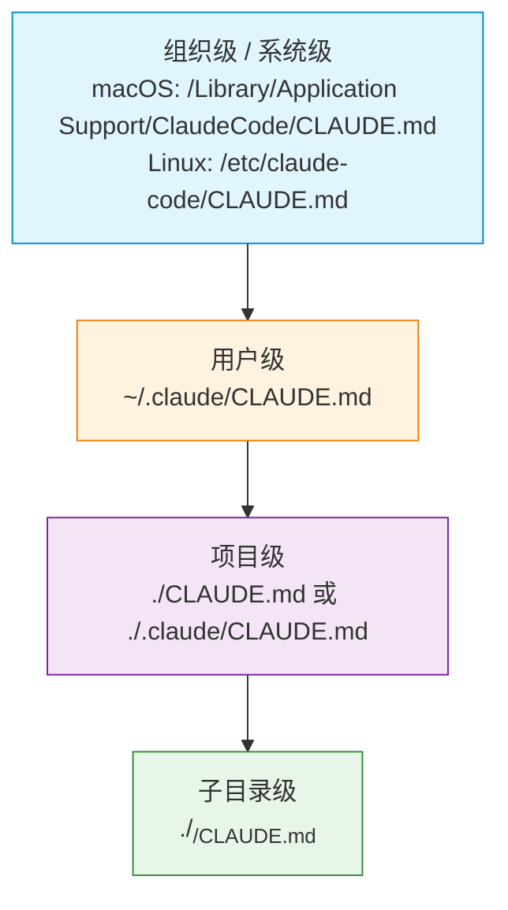

**关键事实**：

- **后者覆盖前者**：组织级被用户级覆盖，用户级被项目级覆盖
- **项目级两个位置等价**：`./CLAUDE.md` 和 `./.claude/CLAUDE.md` 选一个用就行，不要两个都写（避免混乱）
- **子目录级 CLAUDE.md** 在进入该目录时**叠加**到主上下文，但默认推荐只在根目录放一份
- **组织级路径**（macOS 的 `/Library/Application Support/...`、Linux 的 `/etc/claude-code/...`）通常由**IT 管理员**通过 MDM / 配置文件部署，普通用户不会手动碰

##### 类型一：项目级 CLAUDE.md（团队规范）

**位置**：`./CLAUDE.md` 或 `./.claude/CLAUDE.md`

**特点**：

- 提交到 Git，团队共享
- 每次 session 开始时完整加载
- 用于团队需要共同遵守的规范

**适合存放**：

```markdown
# my-project/CLAUDE.md 示例

## 技术栈
- Frontend: React 18 + TypeScript + Vite
- Backend: FastAPI + PostgreSQL
- 测试: pytest + Vitest

## 开发命令
- 启动开发服务器: `make dev`
- 运行测试: `make test`
- 代码格式化: `make fmt`

## 架构规范
- API 路由放在 `backend/routers/`
- 数据库 models 放在 `backend/models/`
- 前端组件放在 `frontend/src/components/`

## 代码规范
- Python: 遵循 PEP 8，函数 < 30 行
- TypeScript: 使用 strict mode，禁止 any 类型
- 所有公开函数必须有 docstring/JSDoc
```

##### 类型二：用户级 CLAUDE.md（个人偏好）

**位置**：`~/.claude/CLAUDE.md`

**特点**：

- 只属于你，不提交 Git
- 在所有项目中生效
- 用于个人工作习惯

**适合存放**：

```markdown
# ~/.claude/CLAUDE.md 示例

## 我的偏好
- 回复简洁，直接给代码
- 不要主动解释"做了什么"，除非我问
- 中文对话，代码用英文注释

## 我的工作习惯
- 每完成一个小任务就 commit
- commit message 格式：feat/fix/refactor: 简短描述
- 遇到重大决策，先列出 2-3 个方案让我选

## 常用工具偏好
- 包管理器：pnpm（不用 npm 或 yarn）
- 格式化：prettier + eslint（不用 biome）
- 测试框架：vitest（不用 jest）
```

---

#### 5.2 Auto Memory：让 Claude 跨会话学习

`projects/<sanitized-cwd>/memory/` 目录是 Claude Code 的 **Auto Memory 系统** —— 跟 CLAUDE.md 完全相反的机制：

| 维度 | CLAUDE.md | **Auto Memory** |
|------|----------|----------------|
| 谁写 | 你主动写 | **Claude 被动写** |
| 内容 | 项目约定、规范 | Claude 跨会话积累的**调试经验、模式发现** |
| 触发 | 每次启动加载 | session 开始时**自动加载索引** |
| 路径 | 固定的几个位置 | `projects/<project>/memory/*.md` |
| 控制权 | 你完全控制 | 你也可以手动编辑/删除 |

**典型工作流**：

1. 第一次跑某个项目时，Claude 会在 `memory/` 下自动建文件，记录"这个项目用 X 库"、"build 命令是 Y"
2. 下次开新会话，Claude **自动**读到这些记忆，不用你再说一遍
3. 你想**干预**？直接编辑 `memory/*.md`、删不想要的内容,或者跟ClaudeCode对话让他强制写记录
4. 你想**禁用**？删 `memory/` 目录即可

**MEMORY.md 示例**：

```markdown
# Project Memory Index

## 关键发现
- 构建命令：`pnpm build:prod`（不是 `pnpm build`，后者跳过优化）
- 数据库迁移：先运行 `pnpm db:generate`，再 `pnpm db:migrate`
- 测试需要本地 Redis 实例（port 6379）

## 调试记录
- auth 模块的 race condition 已在 2024-01-10 修复，见 debugging.md

## 代码规律
- API handler 的错误处理模式，见 patterns.md

## 未解决问题
- Safari 上的 FormData 兼容性问题，暂时用 polyfill 绕过
```

**让 Claude 写入 Auto Memory**（自然语言触发）：

```text
> 记住：这个项目的测试需要先启动 mock server，命令是 `pnpm mock:server`

> 把刚才我们发现的那个 UUID 生成 bug 的根本原因记录下来
```

---

#### 5.3 Rules：按文件类型加载的规则

`.claude/rules/` 目录是**条件性 CLAUDE.md** —— 不同于 CLAUDE.md 每次都加载全部，**Rules 只在 Claude 操作匹配的文件时加载**。

```text
.claude/rules/
├── api-design.md      # 改 src/api/ 时自动加载
├── testing.md         # 改 *.test.* / *_test.go 时自动加载
└── frontend.md        # 改 src/components/ 时自动加载
```

**`paths` frontmatter 用法**（核心机制）：

```markdown
<!-- .claude/rules/api-design.md -->

---
paths:
  - "src/api/**/*.ts"
  - "backend/routers/**/*.py"
---

# API 设计规范

## 命名规范
- REST 资源用复数名词：/users, /orders
- 动作用动词前缀：/search-users, /bulk-delete

## 响应格式
所有 API 返回统一格式：
{
  "data": ...,
  "error": null | { "code": "...", "message": "..." },
  "meta": { "requestId": "..." }
}
```

```markdown
<!-- .claude/rules/testing.md -->

---
paths:
  - "**/*.test.ts"
  - "**/*.spec.ts"
  - "tests/**/*.py"
---

# 测试规范
- 每个测试必须有 Arrange-Act-Assert 结构
- Mock 外部依赖，不发真实网络请求
- 测试描述用中文，清楚说明测试了什么场景
```

**对比 CLAUDE.md 的优势**：**节省上下文**。长规范不会每次都占位置，只在需要时出现。按需或者渐进式加载，更少的占用 context。

---

#### 5.4 维护 MEMORY.md 的技巧

**设计哲学：轻量索引 + 按需加载** —— MEMORY.md 故意保持小，关键信息立即可用，详细内容分散到主题文件按需读。

```text
每次 session 启动：
├── 加载 MEMORY.md 前 200 行或 25KB（自动，以先到者为准）
└── 其他主题文件只在需要时读取

好处：
- 关键信息立即可用（不需要查询）
- 详细内容不占用 context（按需加载）
- Claude 自主决定什么时候去查看详细文件
```

**定期整理的 prompt 模板**：

```text
> 查看一下 memory 目录，删除过时的内容
  保持 MEMORY.md 简洁，确保最重要的 10 条记录在前 50 行
```

---

#### 5.5 什么时候存，什么时候不存

**值得存入 Memory 的信息**：

```text
✓ 非显而易见的构建/测试命令
✓ 项目特有的代码规范（与行业惯例不同的）
✓ 已解决的重要 bug 的根本原因
✓ 架构决策及其原因（ADR）
✓ 你的个人偏好（哪些写法你喜欢/不喜欢）
✓ 环境配置的特殊要求
```

**不值得存入 Memory 的信息**：

```text
✗ 可以从代码中直接读取的信息（如函数签名）
✗ 会频繁变更的临时状态（如当前 sprint 的任务）
✗ 通用的编程知识（Claude 本身就知道）
✗ 太宽泛的指令（如"写好代码"）
✗ 每次 session 都要重新判断的决策
```

---

#### 5.6 三个机制怎么配合？场景对照

把四套机制（CLAUDE.md / Auto Memory / Rules / Session）按"谁来写 + 生命周期"和"什么时候用"放在一起对照：

| 机制 | 谁来写 | 生命周期 | 适合存放 | 典型场景 |
|------|--------|----------|----------|----------|
| **CLAUDE.md（项目级）** | 你（主动） | 永久，提交 Git | 团队规范、项目架构、工作流程 | "项目用 X 技术栈，跑 Y 命令" |
| **CLAUDE.md（用户级）** | 你（主动） | 永久，本机 | 个人偏好、跨项目习惯 | "我的全局工作偏好" |
| **CLAUDE.md（组织级）** | IT 部署 | 永久，托管 | 安全策略、合规约束 | "IT 强制的安全策略" |
| **Auto Memory** | Claude（自动） | 永久，本机私有 | 构建技巧、调试发现、模式 | "我之前调试过这个 bug，记下来了" |
| **Rules** | 你（主动） | 永久，提交 Git | 特定文件类型/目录的规范 | "改 API 时严格按这套规范" |
| **Tasks** | 你 | 手动更新 | 当前工作状态、未完成任务 | （任务跟踪用，非记忆） |
| **Session 对话** | 双方 | 一个 session | 当前问题的上下文 | （一次会话内的对话） |

**判断口诀**：

- "**每次都需要**" → CLAUDE.md（项目级或用户级）
- "**只对特定文件生效**" → Rules
- "**Claude 跨会话学到**" → Auto Memory
- "**IT 强制**" → 组织级 CLAUDE.md

---

#### 5.7 高级模式：跨项目 Memory

三种方案按复杂度递增：

**方案一：共享 rules 目录（symlink）**

```bash
# 创建共享规则库
mkdir -p ~/my-claude-rules

# 在不同项目中 symlink
cd ~/projects/project-a
ln -s ~/my-claude-rules .claude/rules/shared

cd ~/projects/project-b
ln -s ~/my-claude-rules .claude/rules/shared
```

**方案二：用户级 `~/.claude/CLAUDE.md`**

适合放**跨项目通用规范**（如编码风格、个人工作流程）。**所有项目都生效**，所以不要放项目特异的内容。

**方案三：在项目 CLAUDE.md 中引用共享文件**

```markdown
# ./CLAUDE.md

# 引用用户级的共享规范（不提交到 Git 的部分）
@~/.claude/company-standards.md

# 项目特有规范
[项目特有内容]
```

---

#### 5.8 用 `/memory` 命令管理

`/memory` 命令可以**查看当前加载了哪些记忆文件**：

```text
/memory

输出：
Loaded CLAUDE.md files:
  ✓ /Users/alice/.claude/CLAUDE.md (user)
  ✓ /Users/alice/projects/my-app/CLAUDE.md (project)
  ✓ /Users/alice/projects/my-app/.claude/rules/api-design.md (rule, active)

Auto Memory:
  ✓ ~/.claude/projects/my-app/memory/MEMORY.md
  [Toggle auto memory: ON]

Select a file to open in editor...
```

**这个命令的用途**：

- **快速确认**某个 CLAUDE.md / Rule 是否被正确加载
- **打开编辑器**直接编辑某个文件
- **开关 Auto Memory**（如果想临时禁用）

> **⚠️ 5.X 节统一可信度声明**：Auto Memory / Rules / `@<filepath>` 引用语法 `/memory` 命令的具体细节（阈值、glob 规则、输出格式），**精确行为请以官方文档或本地实测为准**。


---

## 先建立坐标系：Claude Code 的能力分层

Claude Code 把"和 Agent 交互的方式"分成了几层。它们不是平铺的，而是有清晰的依赖关系：

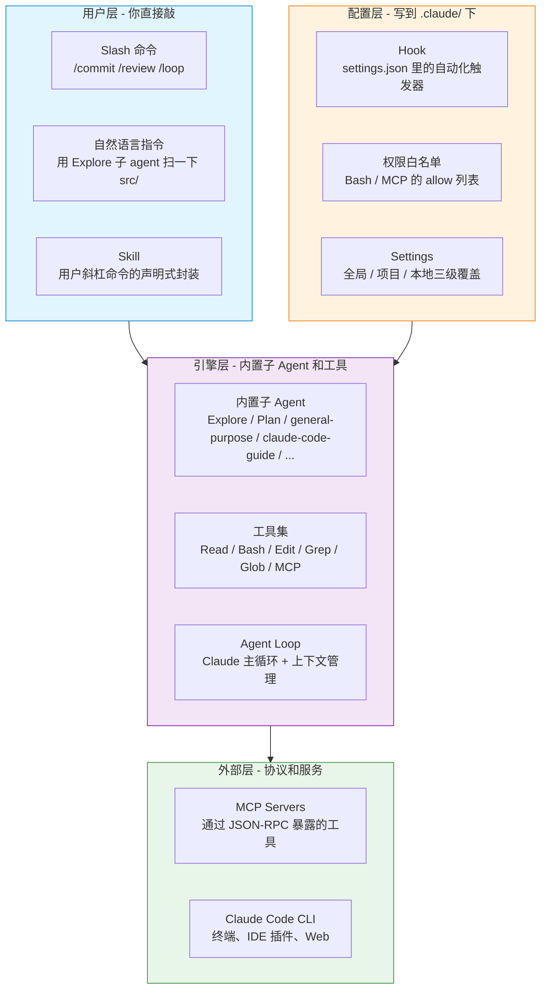

**关键观察**：用户层每个能力，背后要么是一个子 Agent、要么是 Hook 触发、要么是 Skill 加载一段 Prompt。把它们映射到 Agent 理论，Claude Code 是个教科书级的"全栈实现"。

---

## 维度一：Slash 命令（用户直接敲的那些）

Slash 命令是 Claude Code 最表层的交互。每条命令触发后，要么是加载一段 Prompt（**inline**）、要么是 fork 一个子 Agent 跑（**fork**）。

### 1. 常用命令速查

| 命令 | 类型 | 触发什么 | 适用场景 | 可用性 |
|------|------|----------|----------|--------|
| `/commit` | fork | 自动分析 git diff，生成符合规范的 commit message | 改完代码想提交 | ✅ 终端 + 桌面 |
| `/review` | fork | 审查当前 diff，按"严重性/文件:行号/问题"格式输出 | PR 前自查 | ✅ 终端 + 桌面 |
| `/init` | inline | 扫描项目结构，生成 `CLAUDE.md` | 第一次进入项目 | 终端  |
| `/clear` | inline | 清空当前对话上下文 | 上下文太长要重来 |✅ 终端 + 桌面 |
| `/compact` | inline | 压缩上下文，保留关键信息 | 接近 token 上限 | ✅ 终端 + 桌面 |
| `/help` | inline | 显示帮助 | 忘了命令怎么用 | ✅ 终端 |
| `/config` | inline | 打开交互式配置面板 | 改 model / theme 等 | 终端 |
| `/permissions` | inline | 打开权限管理面板 | 调整 allow/deny | 终端 |
| `/doctor` | inline | 诊断安装和环境问题 | 出问题先跑这个 |  终端 |
| `/loop <interval> <cmd>` | fork | 周期性重复执行某条命令 | 轮询 CI、定时检查 | ✅ 终端 + 桌面 |
| `/mcp` | inline | 列出当前连接的 MCP servers 和工具 | 确认 MCP 是否加载 | 终端 |
| `/agents` | inline | 列出可用子 agent | 想知道有哪些 agent 可以用 | **仅终端** |

### 2. inline vs fork 的本质区别

这是 Agent 设计里很重要的一个概念，Claude Code 直接体现在命令上：

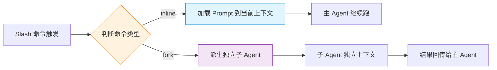

- **inline**：把命令对应的 Prompt **塞进主 Agent 的上下文**，主 Agent 带着这段新指令继续。上下文会膨胀。
- **fork**：派生一个**全新独立上下文**的子 Agent 跑，结果只回传摘要。上下文隔离。

**什么时候该用哪种？** 需要"独立思考"的（审查、深度调研）用 fork，避免污染主上下文；只是"补充指令"的（清空、压缩）用 inline。

---

## 维度二：自定义命令系统（Slash Command vs Skill）

Claude Code 内置命令不够用时，可以**自己造命令**。从 Claude Code 1.0+ 开始，**自定义命令（`.claude/commands/`）已合并到 Skill 系统中**——两者用同样的方式工作，但 Skill 功能更完整。

| | Slash Command（旧） | **Skill（新推荐）** |
|---|---|---|
| 路径 | `.claude/commands/<name>.md` | `.claude/skills/<name>/SKILL.md` |
| 触发 | 用户主动输入 `/xxx` | **用户 `/xxx` + 模型自动判断**（两者都支持） |
| frontmatter | `description`（推荐） | 全部可选，`description` 推荐 |
| 上下文行为 | inline 进主 Agent（默认） | inline 或 `context: fork` 跑子 Agent |
| 文件形态 | 单个 `.md` | **目录**，可附带 scripts/templates/references 等 |
| 动态上下文注入 | ❌ 不支持 | ✅ 支持 `` !`command` `` 预处理 |
| 工具白名单 | ❌ 不支持 | ✅ `allowed-tools` / `disallowed-tools` |

> **核心区别**：Skill 既可**用户主动调用**（`/skill-name`），也可**模型自动判断触发**。`disable-model-invocation: true` 可禁用自动触发，保留手动调用。

### 1. Slash Command（用户主动调用的命令）

文件位置：`.claude/commands/<name>.md`

```markdown
---
description: 审查当前 diff 的可读性
---

读取 git diff，按"可读性问题 / 文件:行号 / 建议"格式输出。
不要修改任何文件。
```

存好后，**输入 `/<name>` 立即可用**。`.claude/commands/` 中的文件仍然有效，但**推荐迁移到 Skill 目录**以获得完整功能（支持文件、动态注入、工具白名单等）。

**作用域：**

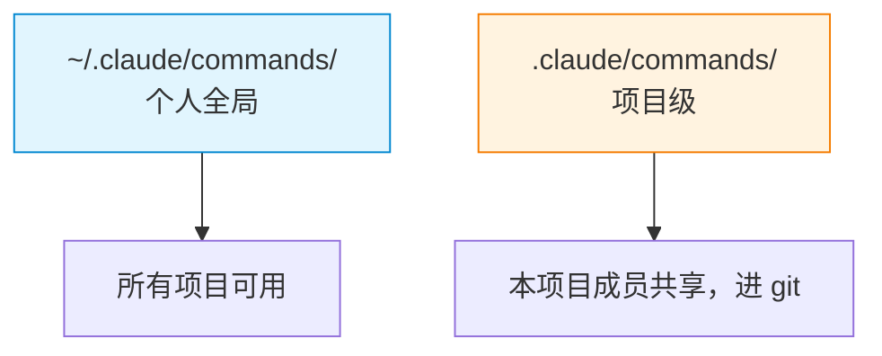

注意这里**没有** `settings.local.json` —— 那是配置覆盖用的，跟 Slash Command 无关。

### 2. Skill（既可手动调用，也可模型自动触发）

Claude Code 的 Skill 系统遵循 [Agent Skills](https://agentskills.io) 开放标准。

- ✅ **用户可以主动调用**：输入 `/skill-name` 直接触发
- ✅ **模型可以自动判断**：根据 `description` 匹配用户意图后自动加载
- ✅ **可以禁用自动触发**：`disable-model-invocation: true` 强制只允许手动调用
- ✅ **可以隐藏菜单项**：`user-invocable: false` 让 Skill 不在 `/` 菜单显示

**文件位置（四级作用域）：**

| 位置 | 路径 | 适用于 |
|------|------|--------|
| 企业 | 托管设置 | 组织所有用户 |
| 个人 | `~/.claude/skills/<name>/SKILL.md` | 你的所有项目 |
| 项目 | `.claude/skills/<name>/SKILL.md` | 仅此项目（提交 Git） |
| 插件 | `<plugin>/skills/<name>/SKILL.md` | 启用插件的范围 |

**作用域覆盖规则**：企业 > 个人 > 项目。同名 Skill 各级别会覆盖。嵌套目录（monorepo）中的 Skill 以 `子目录路径:skill名` 形式访问。

**最小可用结构：**

```text
.claude/skills/code-reviewer/
  SKILL.md            # 入口文件（必需）
  scripts/            # 可选：附带脚本
  templates/          # 可选：附带模板
  references/         # 可选：参考资料
```

**SKILL.md 模板：**

```markdown
---
name: code-reviewer
description: 审查当前 diff 的可读性、性能、安全问题
allowed-tools: Read, Grep, Glob
---

你是只读的代码审查 agent：
- 按"严重性 / 文件:行号 / 问题 / 建议"格式输出
- 不要修改任何文件
```

#### 2.1 关键设计点

**a) 触发控制（两个独立维度）**

| Frontmatter | 用户可调用 | Claude 可调用 | 何时加载 |
|-------------|-----------|--------------|----------|
| （默认） | ✅ 是 | ✅ 是 | 描述始终在上下文中，调用时加载完整 Skill |
| `disable-model-invocation: true` | ✅ 是 | ❌ 否 | 描述不在上下文中，用户调用时加载 |
| `user-invocable: false` | ❌ 否 | ✅ 是 | 描述始终在上下文中，调用时加载 |

**典型用法**：
- `disable-model-invocation: true` → 有副作用的工作流（`/deploy`、`/commit`），你不希望 Claude 自己决定执行
- `user-invocable: false` → 背景知识（如"遗留系统上下文"），Claude 需要知道但用户不需要手动调用

**b) 执行上下文：inline vs fork**

默认情况下 Skill **inline 进主 Agent 上下文**运行。设置 `context: fork` 后，Skill 内容变成驱动**独立子 Agent** 的提示：

```markdown
---
name: deep-research
description: 深度调研某个主题
context: fork
agent: Explore
---

Research $ARGUMENTS thoroughly:
1. Find relevant files using Glob and Grep
2. Read and analyze the code
3. Summarize findings with specific file references
```

`agent` 字段指定子 Agent 类型（`Explore`、`Plan`、`general-purpose` 或自定义 Agent）。**`context: fork` 只适合有明确任务指令的 Skill**——纯参考资料类的 Skill 用 fork 没有意义。

**c) 动态上下文注入**

`` !`<command>` `` 语法在 Skill 内容发送给 Claude **之前**运行 shell 命令，把输出替换到提示中：

```markdown
---
name: pr-summary
description: 总结 PR 变更
context: fork
agent: Explore
allowed-tools: Bash(gh *)
---

## Pull request context
- PR diff: !`gh pr diff`
- PR comments: !`gh pr view --comments`
- Changed files: !`gh pr diff --name-only`

## Your task
Summarize this pull request...
```

**执行顺序**：① 命令立即执行 → ② 输出替换占位符 → ③ Claude 收到的是实际数据（不是命令本身）。这是**预处理**，不是 Claude 执行的内容。

**d) 参数传递**

Skill 支持位置参数，通过 `$ARGUMENTS`、`$ARGUMENTS[N]`、`$N` 占位符使用：

```markdown
---
name: fix-issue
description: Fix a GitHub issue
disable-model-invocation: true
---

Fix GitHub issue $ARGUMENTS following our coding standards.
```

运行 `/fix-issue 123` → Claude 收到 "Fix GitHub issue 123..."

命名参数通过 frontmatter `arguments` 声明：`arguments: [issue, branch]` → `$issue` 和 `$branch` 可用。

**e) Skill 内容生命周期**

- Skill 内容作为**单条消息**进入对话，会话期间**不会重新读取**文件
- 自动压缩后，最近调用的 Skill 会被重新附加（前 5,000 token），共享 25,000 token 预算
- 如果 Skill 在第一个响应后"失效"，通常是模型选择了其他工具，不是内容被丢弃
- **实时变更检测**：编辑 Skill 目录中的文件在当前会话中立即生效，无需重启

**f) 支持文件**

`SKILL.md` 保持在 500 行以下，详细参考资料放到单独文件，在 `SKILL.md` 中引用：

```markdown
## Additional resources
- For complete API details, see [reference.md](reference.md)
- For usage examples, see [examples.md](examples.md)
```

Claude 只在需要时加载这些文件，节省上下文。

#### 2.2 完整 Frontmatter 参考

| 字段 | 必需 | 描述 |
|------|------|------|
| `name` | 否 | 显示名称，默认用目录名 |
| `description` | **推荐** | Skill 功能与使用时机，Claude 据此决定自动触发 |
| `when_to_use` | 否 | 额外的触发上下文（触发短语、示例请求等） |
| `argument-hint` | 否 | 自动补全时的参数提示，如 `[issue-number]` |
| `arguments` | 否 | 命名位置参数列表，用于 `$name` 替换 |
| `disable-model-invocation` | 否 | `true` 阻止 Claude 自动加载此 Skill |
| `user-invocable` | 否 | `false` 从 `/` 菜单隐藏 |
| `allowed-tools` | 否 | Skill 活动期间免审批的工具白名单 |
| `disallowed-tools` | 否 | Skill 活动期间从可用工具池中移除的工具 |
| `model` | 否 | Skill 活动期间使用的模型 |
| `effort` | 否 | Skill 活动期间的推理工作量级别 |
| `context` | 否 | `fork` 在独立子 Agent 上下文中运行 |
| `agent` | 否 | 当 `context: fork` 时使用的子 Agent 类型 |
| `hooks` | 否 | 限定于此 Skill 生命周期的 Hooks |
| `paths` | 否 | Glob 模式，限制 Skill 仅在匹配文件时激活 |

#### 2.3 Skill 评估与迭代

要知道 Skill 是否有效，需要分别测量两件事：① **Claude 是否在应该的提示上调用它**，② **当调用时输出是否符合预期**。推荐使用 `skill-creator` 插件自动化 A/B 对比测试（有 Skill vs 无 Skill 的通过率、token 消耗、耗时）。

### 3. 跟其他系统的关系

| 系统 | 触发 | 上下文 | 文件形态 |
|------|------|--------|----------|
| **Slash Command** | 用户输入 `/xxx` | inline 进主 Agent | 单个 `.md` |
| **Skill** | 用户 `/xxx` **或** 模型自动判断 | inline 或 fork（`context: fork`） | **目录**（SKILL.md + 附件） |
| **子 Agent**（[§ 维度三](#维度三子-agent-系统内置--自定义)） | 模型按 description 自动判断 | **fork 出独立上下文** | 单个 `.md` |
| **Hook** | 工具调用事件触发 | 完全绕开 Agent | JSON 配置 |
| **MCP** | 模型按工具描述自动调用 | 注入到工具集 | JSON 配置 + 外部进程 |

**Skill 和子 Agent 的关键区别**：Skill 默认 **inline 进主上下文**（不隔离），子 Agent 默认 **fork 出独立上下文**（隔离）。但 Skill 也可以通过 `context: fork` 在子 Agent 中运行，这时它同时具备两者的特点——Skill 的内容结构 + 子 Agent 的上下文隔离。

---

## 维度三：子 Agent 系统（内置 + 自定义）

Claude Code 的子 Agent（Subagent）是**独立上下文窗口**中运行的专门 AI 助手。当一个辅助任务会用搜索结果、日志或文件内容充斥主对话时，派子 Agent 去跑——它在自己的上下文中完成工作，只返回摘要。

子 Agent 帮助你：**保留主对话上下文**、**强制执行工具约束**、**跨项目复用**、**控制成本**（可指定更便宜的模型如 Haiku）。

### 1. 内置子 Agent

Claude Code 包含以下内置子 Agent，Claude 在适当时自动使用：

| Agent | 模型 | 工具集 | 何时被触发 |
|-------|------|--------|------------|
| `Explore` | **Haiku**（快速、低延迟） | 只读工具（拒绝 Write/Edit） | 文件发现、代码搜索、代码库探索 |
| `Plan` | 继承自主对话 | 只读工具（拒绝 Write/Edit） | Plan Mode 期间的代码库调研 |
| `general-purpose` | 继承自主对话 | 所有工具 | 复杂多步骤任务（探索 + 修改） |
| `claude-code-guide` | Haiku | Read, Grep, Glob, WebFetch, WebSearch | Claude Code 自身功能问题 |
| `statusline-setup` | Sonnet | Read, Edit | 配置状态栏（`/statusline`） |

> **关键区分**：`Explore` 和 `Plan` 会**跳过 CLAUDE.md 和 git 状态**以保持上下文精简；其他内置 Agent 和自定义 Agent 都会加载。

> **注意**：你在系统提示中看到的 `bug-analyzer`、`code-reviewer`、`ui-sketcher`、`claude` 等 Agent 类型，它们**不是内置子 Agent**，而是来自捆绑 Skill、插件或其他机制。`code-reviewer` 是捆绑 Skill（`/code-review`），不是子 Agent。区分标准：内置子 Agent 有独立的系统提示和固定的工具约束；捆绑 Skill 是基于 Prompt 编排的。

### 2. 关键设计：只读工具集

`Explore` 和 `Plan` 都是**只读工具集**。这是 Claude Code 的强制安全设计 ——

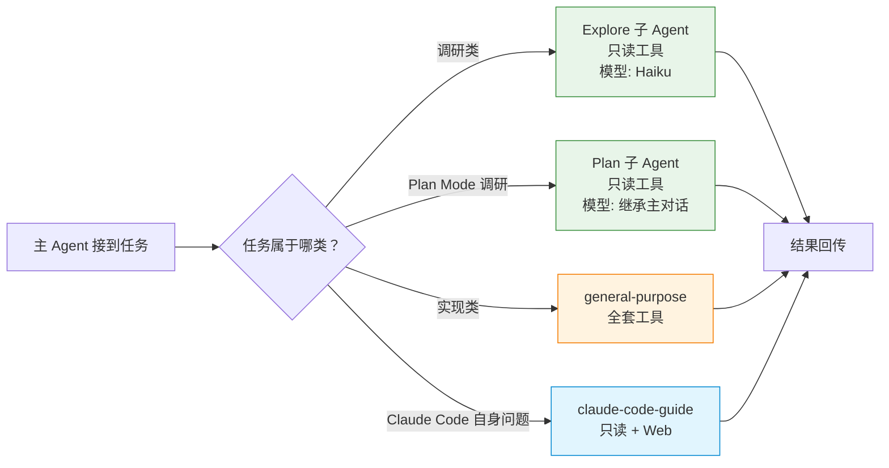

**为什么 Explore 必须是只读？** 因为它的职责是"找到代码在哪"，不是"改代码"。给它写权限等于让搜索工具可以误删文件。这种**最小权限**的设计是 Agent 工程化的核心原则。

### 3. 自定义子 Agent

除了内置的，你可以创建自己的子 Agent，放在：

| 位置 | 作用域 | 优先级 |
|------|--------|--------|
| 托管设置 | 组织范围 | 1（最高） |
| `--agents` CLI 标志 | 当前会话 | 2 |
| `.claude/agents/` | 当前项目（可提交 Git） | 3 |
| `~/.claude/agents/` | 所有你的项目 | 4 |
| Plugin 的 `agents/` 目录 | 启用插件的范围 | 5（最低） |

**子 Agent 文件格式**（Markdown + YAML frontmatter）：

```markdown
---
name: code-reviewer
description: Reviews code for quality and best practices
tools: Read, Glob, Grep
model: sonnet
---

You are a code reviewer. When invoked, analyze the code and provide
specific, actionable feedback on quality, security, and best practices.
```

**关键 frontmatter 字段**（`name` 和 `description` 是必需的）：

| 字段 | 描述 |
|------|------|
| `name` | 唯一标识符（小写 + 连字符） |
| `description` | Claude 何时应委托给此子 Agent |
| `tools` | 允许的工具列表（省略 = 继承所有工具） |
| `disallowedTools` | 要拒绝的工具 |
| `model` | 使用的模型：`sonnet`、`opus`、`haiku`、`fable` 或 `inherit`（默认） |
| `permissionMode` | 权限模式：`default`、`acceptEdits`、`auto`、`bypassPermissions`、`plan` |
| `skills` | **启动时预加载的 Skill 列表**（注入完整内容，不只是描述） |
| `mcpServers` | 对此子 Agent 可用的 MCP 服务器 |
| `hooks` | 限定于此子 Agent 的生命周期 Hook |
| `memory` | 持久内存范围：`user`、`project` 或 `local` |
| `isolation` | `worktree` 在临时 git worktree 中运行 |
| `maxTurns` | 最大 Agent 轮数 |
| `background` | `true` 始终作为后台任务运行 |
| `effort` | 努力级别覆盖 |

### 4. 子 Agent 如何加载 Skill

子 Agent 使用 Skill 有两种方式，**方向相反**：

| 方式 | 配置位置 | 机制 |
|------|----------|------|
| **预加载 Skill** | 子 Agent 的 `skills` frontmatter | 启动时将 Skill **完整内容**注入子 Agent 上下文 |
| **运行时调用** | Skill 工具（默认可用） | 子 Agent 执行期间通过 Skill 工具发现和调用 |

**预加载示例**：

```markdown
---
name: api-developer
description: Implement API endpoints following team conventions
skills:
  - api-conventions
  - error-handling-patterns
---

Implement API endpoints. Follow the conventions from the preloaded skills.
```

**关键约束**：
- 设置了 `disable-model-invocation: true` 的 Skill **无法被预加载**（因为预加载来自 Claude 可自动调用的 Skill 集）
- 如果不列出 `skills`，子 Agent 仍可通过 Skill 工具在运行时发现和调用 Skill
- 要阻止子 Agent 调用 Skill，从 `tools` 中省略 `Skill` 或加入 `disallowedTools`
- 这与 [Skill 的 `context: fork`](#2-skill既可手动调用也可模型自动触发) 是相反的方向：`skills` 字段是子 Agent 控制系统提示并加载 Skill；`context: fork` 是 Skill 内容注入到指定 Agent

### 5. claude-code-guide 的特别之处

它的系统提示里特别强调：

> **Before spawning a new agent, check if there is already a running or recently completed claude-code-guide agent that you can continue via SendMessage.**

已经派过它的问题，应该用 `SendMessage` 续上，而不是开新的。这是**上下文复用**的典范 —— 每次重启都从零开始，是 Agent 系统的常见浪费。

### 6. 何时用子 Agent vs 主对话 vs Skill

| 场景 | 用什么 |
|------|--------|
| 任务需要频繁来回或迭代细化 | **主对话** |
| 多个阶段共享重要上下文 | **主对话** |
| 任务产生大量不需要留在主上下文的输出 | **子 Agent** |
| 想强制执行特定工具限制或权限 | **子 Agent** |
| 想要可重用的 Prompt 而非隔离上下文 | **Skill**（[§ 维度二](#维度二自定义命令系统slash-command-vs-skill)） |
| 关于对话中已有内容的快速问题 | `/btw`（不是子 Agent） |

> **下一节**：见 [§ 维度四：代理团队](#维度四代理团队agent-teams--让多个-claude-互相协作)（独立成节）。

---

## 维度四：代理团队（Agent Teams —— 让多个 Claude 互相协作）

> **⚠️ 实验性功能**：Agent Teams 默认禁用，需设置 `CLAUDE_CODE_EXPERIMENTAL_AGENT_TEAMS=1` 启用。该功能在会话恢复、任务协调和关闭行为方面有已知限制，见[官方文档](https://code.claude.com/docs/zh-CN/agent-teams)。

**子 Agent**（见 [§ 维度三](#维度三子-agent-系统内置--自定义)）是"主 Agent 派一个独立任务、结果回传"。**代理团队**是"主 Agent 同时管多个**互相协作**的独立 Claude Code 实例"。

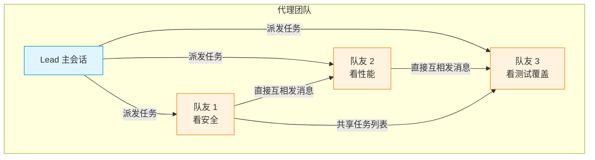

**跟子 Agent 的关键差别**：

| 维度 | 子 Agent（[§ 维度三](#维度三子-agent-系统内置--自定义)） | **代理团队**（这一节） |
|------|---------------------|---------------------|
| Context | 自己的 context window；结果返回给调用者 | 自己的 context window；完全独立 |
| 通信 | 仅向主 Agent 报告结果 | 队友之间**直接发消息** |
| 协调 | 主 Agent 管理所有工作 | **共享任务列表** + 自我协调 |
| 最适合 | 只有结果重要的专注任务 | 需要讨论和协作的复杂工作 |
| Token 成本 | 较低（结果汇总回主上下文） | 较高（每个队友是独立的 Claude 实例） |

### 1. 两种生成方式

队友有两种方式被生成：

- **你请求队友**：给 Claude 一个受益于并行工作的任务，明确要求队友
- **Claude 提议队友**：Claude 判断任务适合并行后建议生成，你确认后才执行

**Claude 不会在没有你批准的情况下生成队友**——你始终保持控制权。

### 2. 显示模式

| 模式 | 行为 | 要求 |
|------|------|------|
| **In-process**（默认） | 所有队友在主终端内运行，用上下箭头选择、Enter 查看 | 任何终端 |
| **Split panes** | 每个队友获得自己的窗格，可同时看到输出 | tmux 或 iTerm2 |

设置方式：`teammateMode` 配置项（`"in-process"` / `"auto"` / `"tmux"` / `"iterm2"`）。

### 3. 队友可使用子 Agent 定义

生成队友时可以引用已有的子 Agent 类型：

```text
Spawn a teammate using the security-reviewer agent type to audit the auth module.
```

队友遵守子 Agent 定义的 `tools` 允许列表和 `model`，定义正文作为额外指令**附加**到队友的系统提示。注意：`skills` 和 `mcpServers` frontmatter 在作为队友运行时**不被应用**——队友从项目和用户设置加载这些。

### 4. 适合的场景

**1. 并行审查**（一个改动，多角度审查）

```text
Spawn three teammates to review PR #142:
- One focused on security implications
- One checking performance impact
- One validating test coverage
```

**2. 竞争假设调试**（互相反驳，收敛到真相）

```text
auth 模块出现 race condition。生成 5 个队友调查不同假设，
让他们互相讨论反驳对方理论，像科学辩论一样，最后把共识写入文档。
```

**3. 跨层改动**（前后端 + 测试各一人）

```text
实现一个新功能：
- 队友 1：改后端 API（src/api/）
- 队友 2：改前端组件（src/components/）
- 队友 3：写集成测试（tests/integration/）
```

### 5. 代价：token 线性叠加

**每个队友都是独立的 Claude 实例**，不是共享上下文 —— **token 消耗是线性叠加的**。

| 队友数 | 相对 token 消耗 |
|--------|----------------|
| 1 个 | 1× |
| 3 个 | 3× |
| 5 个 | 5× |

**实操建议**：

- **3-5 个队友**比较合理（参考文档推荐）
- **每个队友 5-6 个任务**比较高效
- **从研究和审查开始**（不需要写代码，边界清晰，展示并行价值）
- 队友**自动加载项目 context**（CLAUDE.md、MCP、Skill），但不继承负责人对话历史

### 6. 怎么避免文件冲突

**关键原则**：分解工作让每个队友拥有**不同的文件集**。两个队友编辑同一文件会导致覆盖。

| 工具 | 需要 worktree 隔离吗 |
|------|---------------------|
| **代理团队** | ❌ **不需要**（通过任务拆分避免冲突） |
| **动态工作流子 Agent**（[§ 维度五](#维度五动态工作流workflow--把计划移出主上下文)） | ✅ **需要**（任务之间互不相关） |
| **手动多会话** | ✅ **需要**（不同 worktree 互不影响） |

> **注意**：当前文档中"代理团队不需要 worktree"的说法成立的前提是**任务拆分做对了**。如果两个队友确实需要改同一文件，应该合并成一个任务或串行处理。

### 7. 已知限制

Agent Teams 是实验性的，当前限制包括：

- **In-process 队友无会话恢复**：`/resume` 不会恢复 in-process 队友
- **任务状态可能滞后**：队友有时无法及时标记任务完成
- **每个会话一个团队**：无法创建多个命名团队或跨会话共享
- **没有嵌套团队**：队友无法生成自己的队友
- **负责人是固定的**：无法转移领导权
- **权限在生成时设置**：无法在生成时指定每个队友的权限模式

### 8. 什么时候用代理团队？

**判断顺序**（自上而下）：

```text
1. 一个 Claude 就能搞定？
   是 → 用主对话 + Plan 模式
2. 一个 Claude 不够，但不需要互相协作？
   是 → 用单个子 Agent（Explore / general-purpose）
3. 需要多个 Claude 互相讨论、互相验证、互相质疑？
   是 → 用代理团队
4. 任务大到超出主会话协调能力（500 文件级）？
   是 → 用动态工作流（[§ 维度五](#维度五动态工作流workflow--把计划移出主上下文)）
```

**典型适用**：3-10 个并行任务、每个任务独立、但需要交叉验证。

**典型不适用**：

- 简单调研（用 Explore 子 Agent）
- 大规模迁移（用动态工作流）
- 串行任务链（A 改完 B 才能改）
- 日常简单任务（token 成本不值得）

---

## 维度五：动态工作流（Workflow —— 把"计划"移出主上下文）

> 需要 Claude Code **v2.1.154+**，在所有付费计划上可用。Pro 计划需从 `/config` 中启用"Dynamic workflows"。

**这一维度适用于任务规模超出单次会话协调能力的场景**（500 文件级代码库审计、跨包迁移、需要多角度交叉验证的研究）。普通任务用前面的"维度二/三/四"就够了，不需要到这里。

### 1. 跟前面维度的关系

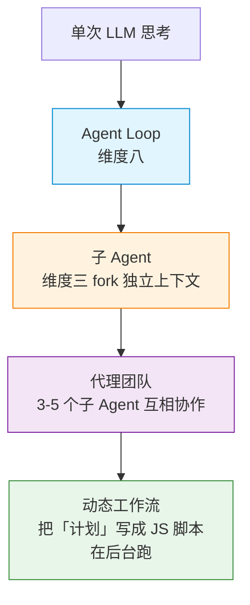

**四种并行方式的本质区别——谁掌握计划：**

| | 子 Agent | Skill | 代理团队 | **工作流** |
|------|------|------|------|------|
| 它是什么 | Claude 生成的工作者 | Claude 遵循的指令 | 监督对等会话的主导代理 | **运行时执行的脚本** |
| 谁决定下一步 | Claude，逐轮 | Claude，遵循提示 | 主导代理，逐轮 | **脚本（确定性）** |
| 中间结果在哪 | Claude 的上下文窗口 | Claude 的上下文窗口 | 共享任务列表 | **脚本变量** |
| 可重复性 | 工作者定义 | 指令 | 团队定义 | **编排本身（可保存复用）** |
| 规模 | 每轮几个委派 | 同子 Agent | 少数几个长期对等体 | **每次数十到数百个代理** |
| 中断恢复 | 重启轮次 | 重启轮次 | 队友继续运行 | **同一会话中可恢复** |

**一句话总结**：子 Agent / 代理团队是 **"Claude 自己逐轮决定下一步"**；动态工作流是 **"把决定写进脚本，runtime 严格按脚本跑"**。

### 2. 是什么：一个后台跑的 JS 脚本

**动态工作流（Workflow）是一个由 Claude 写出来的 JavaScript 脚本，在后台执行，跑大量子代理并交叉检查结果**。运行时在隔离环境中执行脚本，中间结果保留在脚本变量中，不进入 Claude 的上下文——Claude 的上下文只持有最终答案。

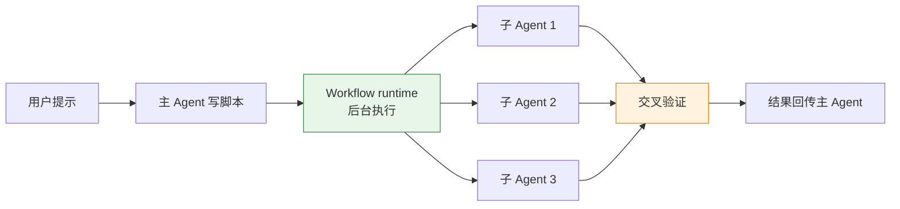

### 3. 怎么触发

| 触发方式 | 用法 | 何时用 |
|----------|------|--------|
| **ultracode 关键字** | `ultracode: 审计 src/routes/ 下所有 API endpoint` | 单次任务用工作流（不改变会话努力级别） |
| **自然语言** | "用工作流审计..." / "run a workflow to..." | 同上，Claude 将直接请求视为相同的选择加入 |
| **/effort ultracode** | 设置后自动为每个实质性任务规划工作流 | 整个会话持续启用，Claude 自己判断何时升级 |
| **直接调内建工作流** | `/deep-research <question>` | 复用现成的高质量工作流 |

**关键设计**：工作流是 **opt-in** 的，不是默认行为。因为比普通对话消耗更多 token（多子 Agent 并行 + 交叉验证）。

### 4. 运行前批准

启动工作流前，Claude Code 会展示计划阶段让你审批：

| 权限模式 | 提示行为 |
|----------|----------|
| 默认 / acceptEdits | 每次运行都提示（除非选了"不再询问"） |
| auto | 仅首次提示 |
| bypassPermissions / `-p` | 从不提示，立即启动 |

你可以选择 **"是，运行它"**、**"查看原始脚本"**（`Ctrl+G` 在编辑器中打开）、或 **"否"** 取消。

### 5. 观看和管理运行

运行在后台进行，会话保持响应。随时用 `/workflows` 列出所有运行中和已完成的工作流：

```text
/workflows
```

选择一个运行打开进度视图，可以看到每个阶段及其代理计数、令牌总数、耗时。控制键：

| 键 | 操作 |
|------|------|
| `↑`/`↓` | 选择阶段或代理 |
| `Enter` | 深入查看代理的提示、工具调用和结果 |
| `p` | 暂停/恢复运行 |
| `x` | 停止选定的代理或整个工作流 |
| `r` | 重启选定的运行中代理 |
| `s` | **保存脚本为命令** |

**暂停后可恢复**：已完成的代理返回缓存结果，其余的实时运行。恢复仅在同一会话中有效。

### 6. 保存为命令复用

**正确做法**：运行 `/workflows`，选择想保留的运行，按 `s`，选择保存位置：

- `.claude/workflows/`（项目级，团队共享）
- `~/.claude/workflows/`（用户级，所有项目可用）

保存后作为 `/<name>` 命令使用，可传递参数（通过 `args` 全局变量）。

### 7. 并发和总代理数限制

| 限制 | 数值 | 作用 |
|------|------|------|
| **最大并发子 Agent** | 16 个（CPU 少的机器更少） | 防止单台机器过载 |
| **每次运行总代理数** | 1,000 个 | 防止失控循环烧 token |
| **无中途用户输入** | — | 仅代理权限提示可暂停运行 |
| **无直接文件系统/shell 访问** | — | 脚本只协调代理，不直接读写 |

### 8. 成本与关闭

工作流生成许多代理，token 消耗显著高于对话模式。建议先在**小范围**上试运行（一个目录而非整个仓库）。`/workflows` 视图实时显示每个代理的 token 使用，可随时停止。

关闭工作流：`/config` 中切换"Dynamic workflows"关闭，或设置 `"disableWorkflows": true`。

### 9. 跟 worktree 隔离的配合

工作流本身**不强制** worktree 隔离。如需隔离，在子 Agent 定义中设 `isolation: "worktree"`：

```text
agent("审计 auth 路由", { isolation: "worktree" })
```

worktree 管"文件冲突"，工作流管"协调调度"——**两者正交，按需叠加**。

### 10. 什么时候用工作流？

**判断顺序**（自上而下）：

```text
1. 一个子 Agent 就能搞定？ → 用子 Agent（维度三）
2. 需要多个 Claude 互相讨论、互相质疑？ → 用代理团队（维度四）
3. 大到超出单次协调能力（500 文件、跨包审计）？ → 用动态工作流
4. 团队模式下会不会撞文件？ → worktree 隔离 / 任务拆分
```

**典型适用**：代码库范围审计、跨包迁移、多角度交叉验证研究、大规模 sweep。

**典型不适用**：改一个 bug（子 Agent）、写一个新功能（主对话 + Plan 模式）、单个文件审查（`/review` 或 `/code-review` 捆绑 Skill）。

---

## 维度六：worktree 隔离（让并行会话不会改到同一份文件）

**这一维度跟"维度五：动态工作流"正交**——工作流管"协调调度"，worktree 管"文件冲突"。

### 1. 什么问题？

代理视图、代理团队、动态工作流里的子 Agent —— **这些并行工具本质上都有可能同时编辑同一份文件**。worktree 是解决"文件冲突"的那一层：

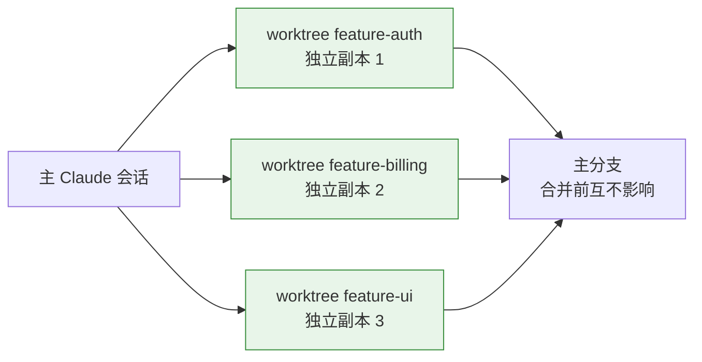

**没有 worktree 会怎样**：

- 两个子 Agent 同时改 `src/api/auth.ts` → 互相覆盖
- 一个人在工作流里改 A 文件，另一个人手动改同一文件 → 冲突
- CI 在你 worktree 改文件时主分支也改了 → 拉取冲突

### 2. 怎么触发：4 条路径

| 触发方式 | 语法 | 何时用 |
|----------|------|--------|
| **CLI flag** | `claude --worktree feature-auth` | 手动开一个 worktree，在新分支 `worktree-feature-auth` 上 |
| **CLI flag（从 PR 分支）** | `claude --worktree "#1234"` | 从特定 PR 创建 worktree |
| **会话内切换** | Claude 调用 `EnterWorktree` 工具 | 在已有会话中进入 worktree（不离开当前进程） |
| **子 Agent isolation** | frontmatter 设 `isolation: "worktree"` | 子 Agent 拿独立临时副本，**无改动自动清理** |
| **配置文件** | `.worktreeinclude` | 用 `.gitignore` 语法声明**哪些 gitignored 文件需同步**（如 `.env`） |

**基础分支选择**：

- 默认从 `origin/HEAD`（远程默认分支）分支，保证从干净树开始
- 设置 `worktree.baseRef: "head"` 从本地 HEAD 分支（适合在已有工作进行中的分支上操作）
- 如果未配置远程或获取失败，回退到本地 HEAD

**关键差异**：

- `--worktree` 标志 → worktree **长期存在**（你手动管理生命周期）
- `isolation: "worktree"` → worktree **临时**（子 Agent 完成且无改动时自动删除）
- 用 `--worktree` 创建的 worktree **不会被自动清理扫描删除**；子 Agent worktree 超过 `cleanupPeriodDays`（默认 30 天）后自动清理

### 3. 清理生命周期

| 场景 | 行为 |
|------|------|
| 无未提交更改、无未跟踪文件、无新提交 | worktree 及其分支**自动删除** |
| 有未提交更改或新提交 | Claude **提示**保留或删除 |
| 非交互式运行（`-p`） | **不自动清理**，需手动 `git worktree remove` |
| 子 Agent worktree | 超过 `cleanupPeriodDays` 后自动删除（前提：无未提交更改） |

### 4. `.worktreeinclude` 的作用

```gitignore
# .worktreeinclude
.env
.env.local
*.local
```

这个文件告诉 git/Claude Code：**"每个 worktree 都要把这些文件同步过去"**。git 默认只跟踪仓库里的文件，但有些配置（`.env`、secrets、本地 override）**不应该进 git、但 worktree 里必须有**。

**典型场景**：

- 跑测试需要 `.env.test`（不进 git，但 worktree 也要能跑）
- 调试需要 `.env.local` 的本地覆盖
- CI 配置（虽然 CI 通常不用 worktree，但本地复现 CI 行为时需要）

### 5. 代理团队要不要 worktree？

**注意区分两种"多 Agent 协作"**：

| 场景 | 需要 worktree 吗 | 原因 |
|------|----------------|------|
| **代理团队**（3-5 个子 Agent 互相协作） | ❌ **不需要** | 队友之间要看到彼此的修改（互相验证） |
| **动态工作流的子 Agent**（独立任务） | ✅ **需要** | 任务之间互不相关，必须隔离 |
| **手动开多个会话**（你用 `claude --worktree` 开两个） | ✅ **需要** | 不同 worktree 互不影响 |

**关键原则**：

- **代理团队**通过**任务拆分**避免文件冲突（每个队友改不同文件集）
- **工作流子 Agent**通过 **worktree 隔离**避免文件冲突
- 两者**机制不同**，不能混用

### 6. 跟动态工作流的配合

```text
# 子 Agent 跑在 worktree 里（任务结束自动清理）
ultracode: 在 worktree feature-auth 里审计所有 API endpoint 的 auth 检查

# 工作流级别启用 worktree（在脚本里声明）
agent("审计 auth 路由", { isolation: "worktree" })
```

**判断**：工作流是"协调维度"（决定哪个子 Agent 跑什么），worktree 是"文件冲突维度"（决定每个子 Agent 在哪改文件）。**两者正交，按需叠加**。

### 7. 什么时候用 worktree？

**判断口诀**：

```text
1. 并行子 Agent 会不会改同一份文件？
   - 会 → 启用 worktree 隔离
   - 不会 → 不需要 worktree（任务拆分即可）
2. 手动开多个会话做对比/实验？
   - 是 → 每个会话用 --worktree
   - 否 → 单个会话即可
3. 需要 .env 等"不进 git 但 worktree 里必须有"的配置？
   - 是 → 配 .worktreeinclude
   - 否 → 默认即可
```

**典型适用场景**：

- 多 session 并行实验（A/B 测试不同方案）
- 大规模工作流 + 文件改动（500 文件级迁移）
- 保护主分支不被半成品污染

**典型不适用场景**：

- 串行任务（一前一后改同一个文件）
- 代理团队队友之间（需要互相看到修改）
- 只读的调研任务（Explore 子 Agent 不改文件，worktree 没意义）

> **非 git 版本控制**：对于 SVN、Perforce 等，可通过配置 `WorktreeCreate` / `WorktreeRemove` hooks 提供自定义创建和清理逻辑，此时 `.worktreeinclude` 不会被自动处理。

---

## 维度七：协作范式（Plan / Goal / Spec / Loop）

**这一维度的概念不在"哪个 Agent 在跑"，而在"人怎么介入、Claude 怎么推进"**。4 种范式分别回答 4 个不同的问题：

| 范式 | 核心问题 | 人的介入点 | 退出机制 |
|------|----------|-----------|----------|
| **Plan** | 怎么做？ | 方案出来**approve / 拒绝** | approve 后执行 |
| **Goal** | 达成什么？ | 设定**完成条件**，Claude 持续推进 | 条件满足自动停止 |
| **Spec** | 做什么/不做什么？ | 写**规范文档**，Claude 严格遵守 | 规范完成 |
| **Loop** | 多长时间做一次？ | 设**间隔**和**提示词** | 手动停止 / 7 天过期 |

**这跟"子 Agent"是完全不同的维度**：

- 维度三的"子 Agent"（Explore / Plan / general-purpose 等）—— 回答**"哪个 Agent 在跑"**
- 维度七的"协作范式"—— 回答**"人怎么跟 Claude 协作"**

一个 Plan 任务可以派给 Explore 子 Agent，一个 Goal 任务可以用 Loop 周期性触发 —— **范式和 Agent 类型是组合关系**。

---

### 1. Plan 范式（先出方案，approve 后执行）

**核心机制**：用户请求方案 → **主 Agent 可能派 Plan 子 Agent 做调研**（只读工具探索代码库）→ 主 Agent 出方案 → 用户 approve → 主 Agent 切回正常模式执行。

**触发方式**：

- 自然语言："先给我个方案" / "plan 一下这个改动"
- EnterPlanMode 工具：显式进入 Plan Mode

**关键边界**：

- Plan Mode **调研阶段**：主 Agent **可派 Plan 子 Agent**（只读工具，独立上下文，跳过 CLAUDE.md/git 状态以保持精简）
- Plan Mode **出方案阶段**：主 Agent **自己**在只读约束下生成方案（不派子 Agent）
- **两阶段区分**：调研是子 Agent 跑，方案是主 Agent 写
- approve 后**才切回正常模式**开始执行（解锁 Edit/Write 工具）

> **注**：官方文档里"Plan"有**两层含义**：
> 1. **Plan 范式/模式**：主 Agent 的工作模式切换（只读出方案 → approve → 执行）
> 2. **Plan 子 Agent**：只读工具的内置子 Agent，在 Plan Mode **调研阶段**被主 Agent 派去探索代码库
>
> **两者是协作关系**：Plan Mode 是主 Agent 的行为框架，Plan 子 Agent 是这个框架下调研阶段的执行者。详见 [§ 维度三](#维度三子-agent-系统内置--自定义)。

---

### 2. Goal 范式（设完成条件，Claude 持续推进直到达成）

> 需要 Claude Code **v2.1.139+**

**核心机制**：`/goal` 是会话范围的**基于提示的 Stop hook 的包装器**。用户给一个**可验证的完成条件** → 主 Agent 反复跑多个回合 → 每个回合后**一个小模型（默认 Haiku）评估条件是否满足** → 满足就停。

**与 Loop 的本质区别**：
- **Loop**：**时间驱动**，按固定或动态间隔重复执行（"每 5 分钟查一次"），7 天后自动过期
- **Goal**：**条件驱动**，持续工作直到完成条件满足（"直到所有测试通过"），条件达成自动停止
- **选择原则**：需要定期轮询状态用 Loop，需要持续推进直到目标达成用 Goal

**触发**：`/goal <condition>`，例如：

```text
/goal all tests in test/auth pass and the lint step is clean
```

**关键设计**：

- **每个回合后评估**（不是每个工具调用后）
- 评估用**小模型**（默认 Haiku）读对话历史判断——不调用工具，只看 Claude 在对话中呈现的内容
- 条件最多 **4,000 字符**
- 评估器返回简短原因（是/否 + 为什么），最近原因出现在状态视图中

**管理命令**：

| 命令 | 作用 |
|------|------|
| `/goal <condition>` | 设置新目标（替换已有目标），立即启动一个回合 |
| `/goal`（裸） | 查看当前状态：条件、已运行多久、回合数、token 支出、评估器最近原因 |
| `/goal clear` | 在条件满足前移除活跃目标（别名：`stop`、`off`、`reset`、`none`、`cancel`） |

**编写有效条件的 3 要素**：

1. **可测量的最终状态**：测试结果、构建退出代码、文件计数、空队列
2. **陈述的检查方法**：`npm test` 退出 0、`git status` 干净
3. **重要约束**：不要改其他文件、不要引入新依赖

**限制时长**：条件里加 `or stop after 20 turns`

**恢复**：会话结束时仍然活跃的目标，用 `--resume` 恢复时会自动恢复（条件保留，计数重置）。

**非交互式模式**：`claude -p "/goal CHANGELOG.md has an entry for every PR merged this week"` 在单次调用中运行循环至完成。

**不可用场景**：设置了 `disableAllHooks` 或 `allowManagedHooksOnly` 时 `/goal` 不可用。

**技术实现**：
- **Stop hook**：每个回合后触发，可运行脚本进行确定性检查或模型评估
- **Goal 是 Stop hook 的快捷方式**：封装了"模型评估条件"的逻辑，无需手动写 hook 脚本
- **与 Auto Mode 的关系**：互补。Auto mode 消除每个工具调用的提示，Goal 消除每个回合的提示，两者叠加实现高度自主

---

### 3. Spec 范式（规范先于代码，AI 严格按规范执行）

> **注**：Spec 范式**不是 Claude Code 单独的内置命令**（没有 `/spec` 这种命令），而是一种**工作方法论** —— 把"规范"作为人机协作的核心，把"代码"作为规范的产物。Claude Code 通过 **Skill + Slash Command + CLAUDE.md 工程约束** 的组合来支撑这种范式。

**核心思想**：

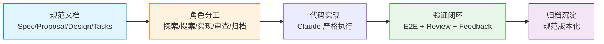

**一句话总结**：**规范先于代码，共识先于实现**。每一次功能迭代都从规范开始，到规范沉淀结束。

#### 3.1 5 步标准流程（以 OpenSpec 为例）

> OpenSpec 是当前比较主流的轻量级 SDD 框架，本节用它的 5 步流程做具体说明。其他框架（Spec-kit、Superpowers）的步骤可能不同，但**核心范式一致**。

| 阶段 | 命令 | 产出 | 人的介入 |
|------|------|------|----------|
| 1. **探索** | `/opsx:explore` | 对话共识（不产生代码） | 反复追问需求细节 |
| 2. **提案** | `/opsx:propose` | `proposal.md` `design.md` `specs/` `tasks.md` | 审阅方案 |
| 3. **实现** | `/opsx:apply` | 任务清单逐条完成 + E2E 测试 + 自动 review | 每个任务完成后验收 |
| 4. **反馈** | `/openspec-feedback` | 问题分类 + 影响面评估 + 修复 | 自然语言描述问题即可触发 |
| 5. **归档** | `/opsx:archive` | 增量规范合并到主规范 + 变更目录归档 | 确认本次迭代完成 |

**关键设计**：每个阶段**默认需要用户手动触发**，但在 `CLAUDE.md` 里写明"自动触发条件"后，可以让 Claude **自己判断进入下一阶段**（减少心智负担）。

#### 3.2 3 个核心工程改进（Spec 范式必须补的能力）

OpenSpec 默认**没有测试覆盖和代码审查的强制机制**。要让 Spec 范式真正落地，必须补 3 个 Skill：

| Skill | 触发时机 | 核心职责 |
|-------|---------|----------|
| **`openspec-review`** | 每任务完成后、归档前 | 多维度代码审查（后端规范、REST 合规、架构、E2E） |
| **`openspec-feedback`** | 用户报告 Bug 或改进点 | 反馈分类 + 影响面评估 + 修复 + 自动 review |
| **`openspec-e2e`** | 编写或审查 E2E 测试 | 定义测试目录结构、命名（`TC{NNNN}-{name}.ts`）、模板 |

**为什么需要这 3 个 Skill**：

| 问题 | 没有 Skill | 有 Skill |
|------|----------|---------|
| 测试覆盖 | 依赖 AI 自觉，**没有强制** | 任务完成必须跑 E2E 才能标完成 |
| 代码审查 | 完全靠人工 review | 每任务自动 review，**Critical 问题阻断归档** |
| 反馈处理 | 用户口头说，AI 可能漏 | 自动分类、追踪、影响面分析 |

#### 3.3 Spec 范式 vs Plan 范式 vs Goal 范式

| 维度 | Plan 范式 | Goal 范式 | **Spec 范式** |
|------|----------|----------|---------------|
| **核心问题** | 怎么做？ | 达成什么？ | **做什么 / 不做什么？** |
| **文档作用** | **输出**方案（Claude 写） | 设定完成条件 | **输入**规范（用户写或 Claude 写但用户审） |
| **介入点** | approve / 拒绝 | 持续推进直到条件满足 | 阶段间审阅 + 归档前全面审查 |
| **适合** | 设计不明确的任务 | 有清晰完成标准的任务 | **有清晰规范、需多次迭代**的工程任务 |
| **范围** | 单一任务 | 单一任务 | **完整功能迭代**（跨多个任务） |
| **跟规范的关系** | 一次性 | 不涉及 | **核心**：规范是产物，也是输入 |

**关键区别**：

- **Plan**："先出方案我看看"——一次性，不留痕
- **Goal**："做完这个标准就停"——一次性，但不关心过程
- **Spec**："这套规范**贯穿整个迭代**"——多次迭代，规范在每次迭代里**演进**

#### 3.4 上下文治理（Spec 范式特有的难题）

Spec 范式会带来**上下文熵增**问题：

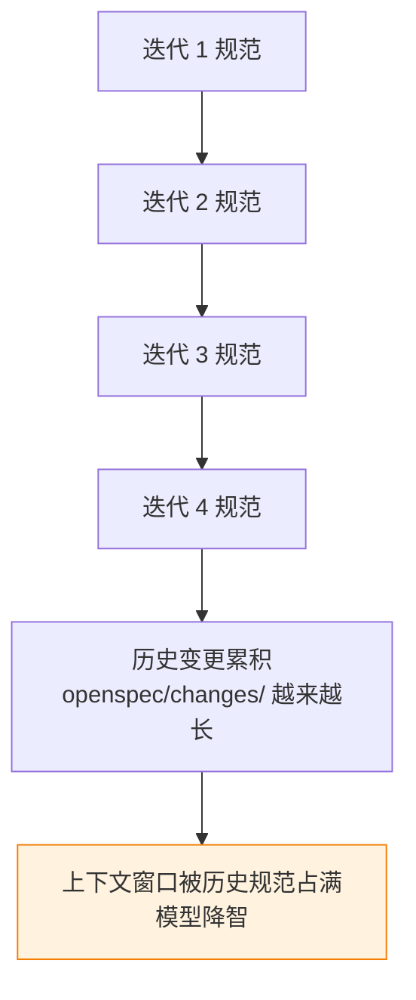

**解决策略**（"小粒度变更 + 及时归档"）：

1. **小步迭代**：每个 OpenSpec 变更只含 1-3 个功能点（不是 10 个），保持上下文精简
2. **SubAgent 隔离**：长任务（E2E 测试、审查）让 Claude 开 SubAgent，避免主会话过载
3. **及时归档**：每个迭代完成就 `/opsx:archive`，增量规范合并到主规范 `openspec/specs/`，变更目录移入 `archive/`
4. **`/new` 强制重置**：完成一轮变更后用 `/new` 开新会话，从根本上杜绝上下文堆积

**归档的两层价值**：

- **上下文层面**：归档后的变更不再加载到日常上下文
- **规范层面**：增量规范合并到主规范，**项目规范持续沉淀**（不是分散在历史 proposal 里）

#### 3.5 Spec 范式适合谁？

**适合**：

- 中小团队的 AI 协同开发项目（功能迭代频繁但规模可控）
- 已有清晰工程规范、想把"AI 协同"工程化的团队
- 重视**可追溯性、可复现性**的项目

**不适合**：

- 一次性原型 / PoC（用 Plan 范式更快）
- 简单维护任务（用 Goal 范式更轻）
- 周期性的轮询 / 监控（用 Loop 范式）
- 完全无规范的小项目（先建立规范再谈 Spec 范式）

#### 3.6 跟其他 3 种范式的配合

```text
# 启动阶段：用 Plan 探索方向
先 plan 一下我们这个新功能该怎么设计

# 进入正式迭代：Spec 范式
/opsx:explore → /opsx:propose → /opsx:apply → /opsx:archive

# 持续推进：Goal 范式
/goal "本周完成 v1.1 全部 5 个迭代的归档"

# 监控 CI：用 Loop 范式
/loop 5m "检查 CI 状态，有失败就通知我"
```

**4 种范式是组合关系，不是互斥**。Spec 范式是**"主旋律"**——完整功能迭代的骨架；Plan / Goal / Loop 是**"局部协奏"**——在主旋律的某个阶段提供具体支持。

---

### 4. Loop 范式（按时间间隔重复执行）

> 需要 Claude Code **v2.1.72+**。`/loop` 是**捆绑 Skill**（基于 Prompt 编排），不是内置命令（内置命令直接执行固定逻辑）。

**核心机制**：用户给一个**间隔**和**提示词** → Claude 反复跑 → 7 天后自动过期。

**触发**：

```text
# 固定间隔
/loop 5m check if the deployment finished

# 动态间隔（Claude 自己决定 1min~1h）
/loop check whether CI passed and address any review comments

# 裸 /loop：跑内置维护提示词
/loop

# 运行 skill
/loop 20m /review-pr 1234
```

**3 种循环模式**：

| 提供的内容 | 行为 |
|----------|------|
| 间隔 + 提示词 | 固定计划（cron 表达式），间隔单位：s/m/h/d |
| 仅提示词 | **动态间隔**（Claude 每次迭代后根据情况自选延迟）。可能直接使用 Monitor 工具避免轮询 |
| 裸 `/loop` | 跑**内置维护提示词**（继续未完成工作 + PR 审查 + 清理），动态间隔 |

> **注意**：设置了 `disable-model-invocation: true` 的 Skill 在计划触发时**不会运行**——它们作为纯文本到达 Claude 而不执行。

**一次性提醒**（非 `/loop`）：

```text
remind me at 3pm to push the release branch
in 45 minutes, check whether the integration tests passed
```

用自然语言描述，Claude 使用 `CronCreate`（`recurring: false`）创建单次触发任务。

**关键限制**：

- **会话范围**：关掉会话就停止（用 `--resume` 可恢复未过期任务）
- **7 天过期**：重复任务创建 7 天后自动停止（最后触发一次后删除）
- **最小间隔 1 分钟**（cron 粒度）；秒数向上舍入
- **最多 50 个并发任务**
- 任务仅在 Claude Code 运行且**空闲**时触发（忙碌时等到当前回合结束）

**抖动**：为避免所有会话在 `:00` 同时触发，调度器给每个任务加**确定性偏移**（基于任务 ID）。重复任务最多偏移 30 分钟（或间隔的一半）；一次性任务在 `:00`/`:30` 时最多提前 90 秒。选择非 `:00`/`:30` 的分钟可避免一次性抖动。

**`loop.md` 自定义默认提示词**：

```text
.claude/loop.md       # 项目级（优先）
~/.claude/loop.md     # 用户级
```

`loop.md` 替换裸 `/loop` 的内置维护提示词。**保持在 25,000 字节以内**（超出会被截断）。

**底层工具**：`CronCreate`（创建）、`CronList`（列出）、`CronDelete`（按 ID 取消）。

**与 Goal 的边界**：

- **Goal**：跑**直到条件满足**（回合驱动，按条件结束）
- **Loop**：跑**按时间间隔**（时间驱动，到 7 天或手动停止）
- **Routines / Desktop 计划任务**：独立于会话存在，不需要会话保持打开

---

### 5. 4 种范式怎么配合？

**范式可以组合使用**，比如：

```text
# Plan + Goal：先出方案，让 Claude 自动推进
先 plan 一下，然后 /goal "test/ 全部通过且 lint clean"

# Loop + Plan：周期性检查某件事的状态
/loop 1h "检查 src/api/ 里有没有待办 plan"

# Spec + Plan：写完规范后让 Claude 出实现方案
写完 SPEC.md 后，plan 怎么分阶段实现
```

**判断口诀**：

| 你的需求 | 用哪个 |
|----------|--------|
| "做之前先让我看看方案" | **Plan** |
| "做到满足这个条件为止" | **Goal** |
| "严格按这份规范做" | **Spec** |
| "每隔多久查一次 / 做一次" | **Loop** |

---

## 维度八：Hook（事件驱动的自动化）

Hook 是 Claude Code 最容易被低估的能力。它们是**用户定义的 shell 命令**，在 Claude Code 生命周期的特定点执行，提供**确定性控制**——确保某些操作始终发生，而不是依赖 LLM 选择运行它们。

Hook 对 Agent **透明**（Agent 不知道 Hook 跑了什么），这与 Skill（Agent 主动读到 Prompt）形成互补。需要强制约束用 Hook，需要引导 Agent 行为用 Skill。

### 0. 配置结构：为什么有两层 hooks？

Hook 配置使用**两层嵌套结构**，初次看到可能让人困惑：

```json
{
  "hooks": {                       // 第1层：配置块容器
    "Notification": [              // 第2层：事件名称 + hook 组数组
      {
        "matcher": "",             // 过滤条件：何时触发
        "hooks": [                 // 第3层：具体执行列表
          {
            "type": "command",     // hook 类型：如何执行
            "command": "echo 'test'" // 执行内容：shell 命令
          }
        ]
      }
    ]
  }
}
```

**两层 `hooks` 的区别**：

| 层级 | 作用 | 为什么需要 |
|------|------|------------|
| **外层 `hooks`** | 配置块的根键名 | 区分 hooks 配置和其他设置（permissions、skills 等） |
| **内层 `hooks`** | 单个 hook 组的执行列表 | 一个事件可以有多组不同逻辑，每组可以并行跑多个命令 |

**三层结构示例**：

```json
// 同一事件的多个 hook 组（不同 matcher）
{
  "hooks": {
    "PostToolUse": [
      {
        "matcher": "Edit|Write",  // 组1：文件编辑后格式化
        "hooks": [
          { "type": "command", "command": "prettier --write" }
        ]
      },
      {
        "matcher": "Bash",  // 组2：Bash 命令后日志
        "hooks": [
          { "type": "command", "command": "echo 'Bash used' >> log.txt" }
        ]
      }
    ]
  }
}

// 单个 hook 组的多个并行动作
{
  "hooks": {
    "PostToolUse": [
      {
        "matcher": "Edit",
        "hooks": [
          { "type": "command", "command": "prettier --write" },       // 动作1
          { "type": "command", "command": "echo 'formatted' >> log.txt" } // 动作2（并行）
        ]
      }
    ]
  }
}
```

**关键字段含义**：
- `matcher`：过滤触发时机（空字符串 `""` = 每次都触发）
- `type`：执行方式（`command` / `prompt` / `agent` / `http` / `mcp_tool`）
- `command`：shell 命令内容（当 `type: "command"` 时）

### 1. 快速创建第一个 Hook

**场景**：Claude 完成工作等待输入时，自动发送桌面通知（不用盯着终端）。

1. **编辑配置文件**

   打开 `~/.claude/settings.json`，添加 `Notification` hook：

   ```json
   {
     "hooks": {
       "Notification": [
         {
           "matcher": "",
           "hooks": [
             {
               "type": "command",
               "command": "osascript -e 'display notification \"Claude needs input\" with title \"Claude Code\"'"
             }
           ]
         }
       ]
     }
   }
   ```

   macOS 用 `osascript`，Linux 用 `notify-send`，Windows 用 PowerShell（见完整示例章节）。

2. **验证 Hook 已加载**

   运行 `/hooks` 打开浏览菜单，看到 `Notification` 旁边有个计数。选择它查看详细信息：事件、matcher、type、command。

3. **测试触发**

   让 Claude 做需要权限的事（如读新文件），然后切换到其他应用。几秒后收到桌面通知。

**matcher 详解**：
- `""`（空字符串）：所有通知类型都触发
- `"idle_prompt"`：只在 Claude 完成工作等待你时触发
- `"permission_prompt"`：只在需要权限批准时触发

### 2. 工作流程：Hook 如何控制 Claude

Hook 的核心机制是 **stdin → shell 命令 → stdout/stderr + 退出码**：

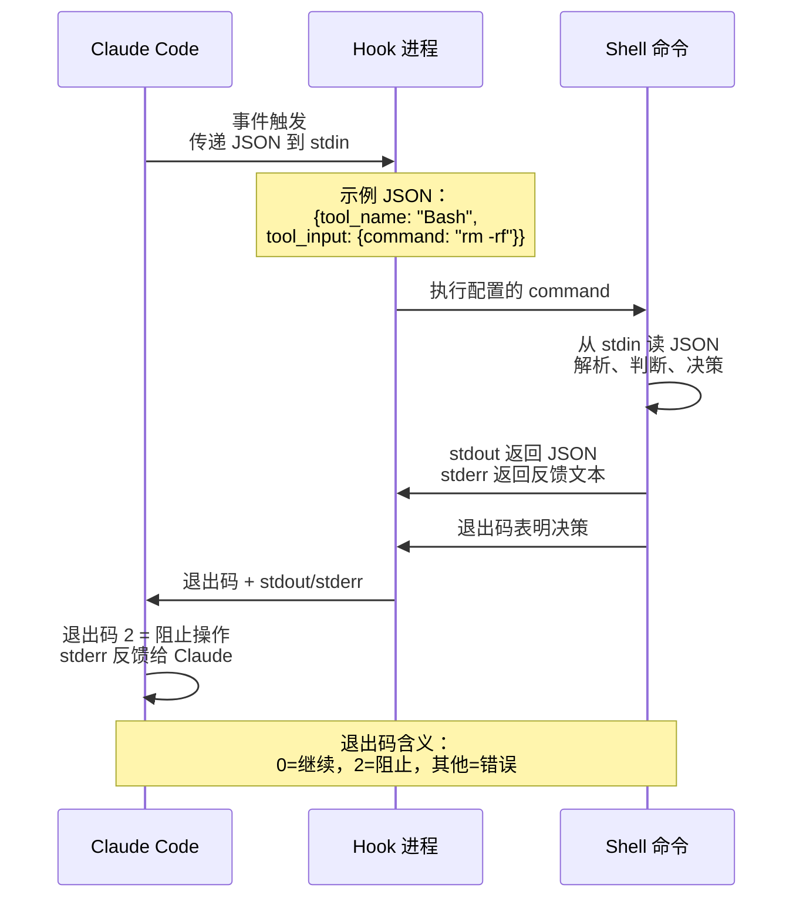

**示例：拦截危险命令**：

```bash
#!/bin/bash
# .claude/hooks/block-dangerous.sh

INPUT=$(cat)  # 从 stdin 读取 Claude 传来的 JSON
COMMAND=$(echo "$INPUT" | jq -r '.tool_input.command')

if echo "$COMMAND" | grep -q "rm -rf"; then
  echo "Blocked: destructive command detected" >&2  # stderr → Claude 的反馈
  exit 2   # 退出码 2 = 阻止操作
fi

exit 0     # 退出码 0 = 无异议，继续正常流程
```

**退出码控制表**：

| 退出码 | 含义 | 后果 |
|--------|------|------|
| **0** | 无异议 | 操作继续。stdout 内容可能注入上下文（取决于事件类型） |
| **2** | 阻止 | 工具调用被取消。stderr 作为反馈发给 Claude，让它调整行为 |
| **其他** | 错误 | 操作继续，但显示 "hook error" 通知，stderr 进入调试日志 |

**stdin JSON 结构**（PreToolUse 事件示例）：

```json
{
  "session_id": "abc123",
  "cwd": "/Users/sarah/myproject",
  "hook_event_name": "PreToolUse",
  "tool_name": "Bash",
  "tool_input": {
    "command": "npm test"
  }
}
```

不同事件传递不同字段。`tool_name` 和 `tool_input` 让你知道 Claude 正在做什么。

**JSON 结构化输出**（更精细的控制）：

退出码 2 只能"阻止"，JSON 输出可以实现"批准"、"延迟"等决策：

```json
{
  "hookSpecificOutput": {
    "hookEventName": "PreToolUse",
    "permissionDecision": "deny",
    "permissionDecisionReason": "Use rg instead of grep for better performance"
  }
}
```

`permissionDecision` 的 4 种值：
- `"allow"`：跳过交互式提示（但拒绝规则仍适用）
- `"deny"`：取消工具调用，反馈原因给 Claude
- `"ask"`：照常显示权限提示
- `"defer"`：非交互模式下保留工具调用供稍后处理

### 3. Hook 的 5 种类型

| 类型 | 执行方式 | 适用场景 | 超时 |
|------|----------|----------|------|
| **`command`** | Shell 命令 | 确定性规则（格式化、拦截、通知） | 10 分钟 |
| **`prompt`** | 单轮 LLM 评估（默认 Haiku） | 需要判断（"任务完成了吗？"） | 30 秒 |
| **`agent`** | 多轮子 Agent 验证 | 需要检查文件/跑命令验证 | 60 秒 |
| **`http`** | POST 到 HTTP 端点 | 外部服务（webhook、云审计） | 10 分钟 |
| **`mcp_tool`** | 调用 MCP 服务器工具 | 复用 MCP 工具能力 | 10 分钟 |

**类型选择决策**：
- 确定性规则（"绝不允许 rm -rf"）→ `command`
- 需要判断（"任务真的完成了吗？"）→ `prompt`
- 需要验证（"跑测试看看是否通过"）→ `agent`
- 外部集成（"发送到 Slack"）→ `http`

**prompt 类型示例**（Stop hook 检查任务完成）：

```json
{
  "hooks": {
    "Stop": [
      {
        "hooks": [
          {
            "type": "prompt",
            "prompt": "Check if all tests passed. If not, respond with {\"ok\": false, \"reason\": \"what failed\"}"
          }
        ]
      }
    ]
  }
}
```

模型返回 `{ok: true}` 允许停止，`{ok: false, reason: "..."}` 让 Claude 继续工作。

### 4. 完整事件一览

Hook 事件覆盖 Claude Code 的整个生命周期。按功能分组：

**会话生命周期：**

| 事件 | 触发时机 | 典型用途 |
|------|----------|----------|
| `SessionStart` | 会话开始或恢复（含压缩后） | 注入上下文、设置环境 |
| `SessionEnd` | 会话终止 | 清理临时文件 |
| `Setup` | `--init-only` 或 `--init`/`--maintenance` 时 | CI/脚本中的一次性准备 |
| `PreCompact` | 上下文压缩前 | 保存关键信息 |
| `PostCompact` | 上下文压缩完成后 | 重新注入上下文 |

**工具调用拦截：**

| 事件 | 触发时机 | 典型用途 |
|------|----------|----------|
| `PreToolUse` | 工具调用**前**（可拦截） | 阻止危险命令、验证参数、自动备份 |
| `PostToolUse` | 工具调用**成功后** | 跑 formatter、记录日志 |
| `PostToolUseFailure` | 工具调用**失败后** | 错误通知、重试逻辑 |
| `PostToolBatch` | 一批并行工具调用全部完成后 | 批量后处理 |
| `PermissionRequest` | 权限弹窗出现时 | 自动批准特定提示 |
| `PermissionDenied` | auto mode 分类器拒绝工具调用时 | 告知模型可重试 |

**用户交互：**

| 事件 | 触发时机 | 典型用途 |
|------|----------|----------|
| `UserPromptSubmit` | 用户提交消息后，Claude 处理前 | 注入附加上下文 |
| `UserPromptExpansion` | 用户输入的命令展开为提示时 | 拦截命令展开 |
| `Notification` | 发送通知时 | 桌面弹窗提醒 |
| `Stop` | Agent 完成响应时 | 检查任务是否真正完成、清理 |
| `StopFailure` | 回合因 API 错误结束时 | 错误处理 |
| `MessageDisplay` | 助手消息文本显示时 | 实时输出处理 |

**子 Agent / 代理团队：**

| 事件 | 触发时机 | 典型用途 |
|------|----------|----------|
| `SubagentStart` | 子 Agent 生成时 | 设置子 Agent 环境 |
| `SubagentStop` | 子 Agent 完成时 | 清理、记录 |
| `TaskCreated` | 任务创建时 | 验证任务质量 |
| `TaskCompleted` | 任务标记完成时 | 强制质量门 |
| `TeammateIdle` | 队友即将空闲时 | 发送反馈让队友继续工作 |

**文件与环境变更：**

| 事件 | 触发时机 | 典型用途 |
|------|----------|----------|
| `InstructionsLoaded` | CLAUDE.md / rules 加载时 | 审计规则加载 |
| `ConfigChange` | 配置文件在会话中被修改 | 审计配置变更 |
| `CwdChanged` | 工作目录改变时 | 自动加载 direnv |
| `FileChanged` | 监视的文件变更时 | 重新加载环境 |
| `WorktreeCreate` | worktree 创建时 | 自定义 VCS 逻辑 |
| `WorktreeRemove` | worktree 移除时 | 清理 |
| `Elicitation` | MCP 服务器请求用户输入时 | 自定义引导流程 |
| `ElicitationResult` | 用户响应 MCP 引导后 | 验证用户输入 |

### 5. 匹配器系统：精确控制触发时机

**`matcher` 字段**在 hook 组级别过滤：

| 事件类型 | matcher 过滤的内容 | 示例 |
|----------|-------------------|------|
| 工具事件 | 工具名称 | `Bash`、`Edit\|Write`、`mcp__github__.*` |
| `SessionStart` | 启动方式 | `startup`、`resume`、`clear`、`compact` |
| `Notification` | 通知类型 | `idle_prompt`、`permission_prompt` |
| `SubagentStart/Stop` | Agent 类型 | `Explore`、`general-purpose` |
| `PreCompact/PostCompact` | 触发原因 | `manual`、`auto` |
| `ConfigChange` | 配置源 | `user_settings`、`project_settings`、`skills` |
| `SessionEnd` | 结束原因 | `clear`、`resume`、`logout` |

**`if` 字段**（v2.1.85+）在单个 hook 级别按**工具名称 + 参数**过滤：

```json
{
  "matcher": "Bash",
  "hooks": [
    {
      "type": "command",
      "if": "Bash(git *)",
      "command": "./check-git-policy.sh"
    }
  ]
}
```

`if` 使用与权限规则相同的语法，支持子命令检测（`$()`、反引号内的命令也会被检查）。

### 6. 配置位置

| 位置 | 范围 | 可共享 |
|------|------|--------|
| `~/.claude/settings.json` | 所有你的项目 | 否 |
| `.claude/settings.json` | 单个项目 | ✅ 提交 Git |
| `.claude/settings.local.json` | 单个项目 | 否（gitignored） |
| 托管策略设置 | 组织范围 | ✅ 管理员控制 |
| Plugin `hooks/hooks.json` | 启用插件时 | ✅ 捆绑 |
| Skill/Agent frontmatter | Skill/Agent 活动时 | ✅ 组件内 |

运行 `/hooks` 浏览所有已配置的 hooks（只读）。直接编辑设置文件，文件监视器会自动拾取更改。

### 7. 多个 Hook 的合并规则

同一事件的多个 hook **并行运行**，然后合并结果：

- **最严格的决策获胜**：顺序为 `deny` > `defer` > `ask` > `allow`
- 一个 hook 返回 `deny` 不会阻止兄弟 hooks 执行
- `additionalContext` 文本从每个 hook 保留并一起传递给 Claude

### 8. 关键限制

- `PostToolUse` **无法撤销操作**（工具已执行）
- `Stop` hook 连续阻止 8 次后会被覆盖（检查 `stop_hook_active` 字段避免）
- `PermissionRequest` 在非交互模式（`-p`）中不触发，改用 `PreToolUse`
- 命令 hooks 通过退出码和 stdout/stderr 通信，无法触发 `/` 命令或工具调用
- 超时：`command`/`http`/`mcp_tool` 默认 10 分钟（`UserPromptSubmit` 降至 30 秒），`prompt` 30 秒，`agent` 60 秒
- `PreToolUse` hooks **在任何权限模式检查之前触发**——返回 `deny` 即使在 `bypassPermissions` 下也生效。但返回 `allow` 不会绕过来自设置的拒绝规则

### 9. Hook vs Skill 的本质区别

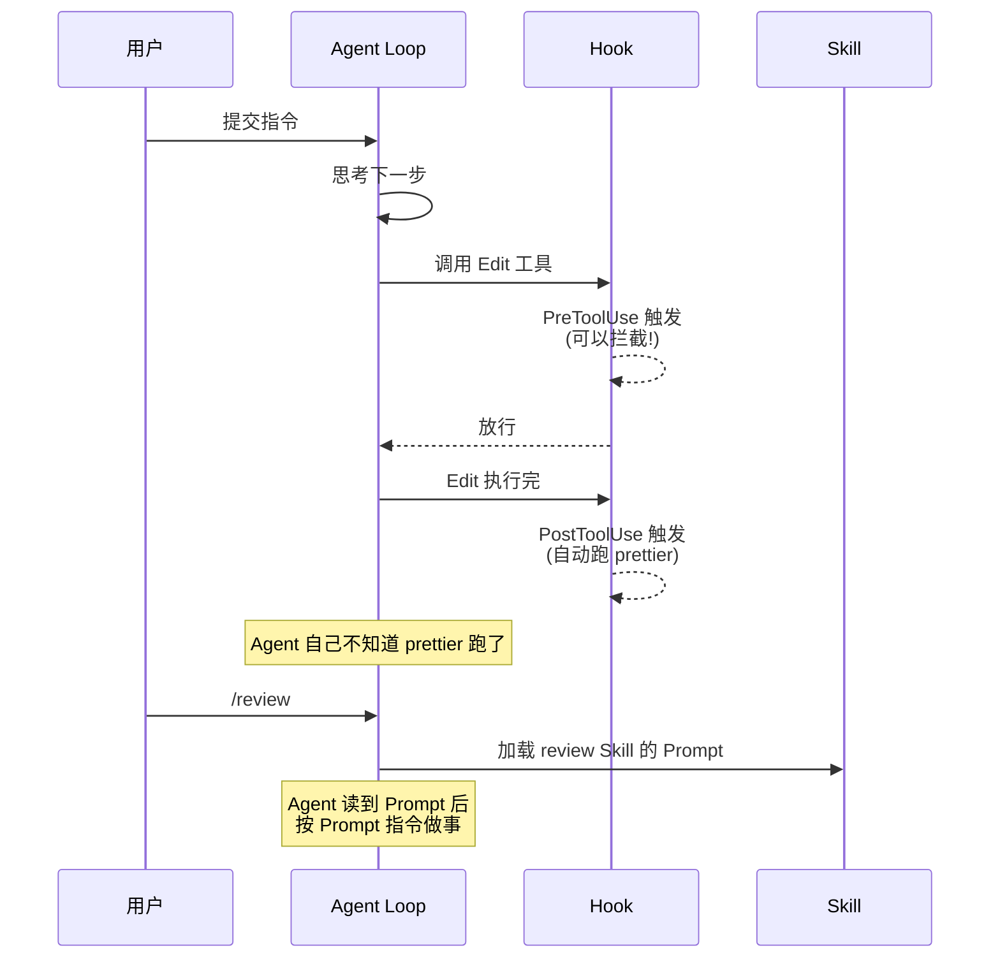

**关键洞见**：Hook 是**对 Agent 透明的**（Agent 不知道），Skill 是**Agent 主动读到的**。需要强制约束用 Hook，需要引导 Agent 行为用 Skill。

**何时用哪种**：

| 需求 | 方案 |
|------|------|
| 确定性规则（"绝不允许删 .git"） | Hook（`PreToolUse` + 退出 2） |
| 需要判断（"任务真的完成了吗？"） | 基于提示的 Hook（`type: "prompt"`） |
| 需要检查文件/跑命令验证 | 基于代理的 Hook（`type: "agent"`） |
| 引导 Claude 怎么做 | Skill |
| 外部服务集成 | HTTP Hook 或 MCP 工具 Hook |

---

## 维度九：MCP 集成（外部工具的标准化接入）

MCP（Model Context Protocol）让 Claude Code 连接外部服务的工具变成**即插即用**。`/mcp` 命令能立刻看到当前连接的所有 MCP servers。

### 1. 配置方式

在 `.mcp.json` 或 `~/.claude.json` 里：

```json
{
  "mcpServers": {
    "github": {
      "command": "npx",
      "args": ["-y", "@modelcontextprotocol/server-github"],
      "env": {
        "GITHUB_TOKEN": "ghp_xxx"
      }
    },
    "filesystem": {
      "command": "npx",
      "args": ["-y", "@modelcontextprotocol/server-filesystem", "/allowed/path"]
    }
  }
}
```

### 2. MCP 工具的命名规则

连上后，Claude Code 看到的工具名形如 `mcp__<server>__<tool>`，例如：

- `mcp__github__create_issue`
- `mcp__filesystem__read_file`
- `mcp__slack__slack_read_thread`

这套命名直接进了权限白名单的格式里（`Bash(...)` vs `mcp__xxx__yyy`），所以 MCP 工具可以**精确放行**。

### 3. MCP 的工具自动注册机制

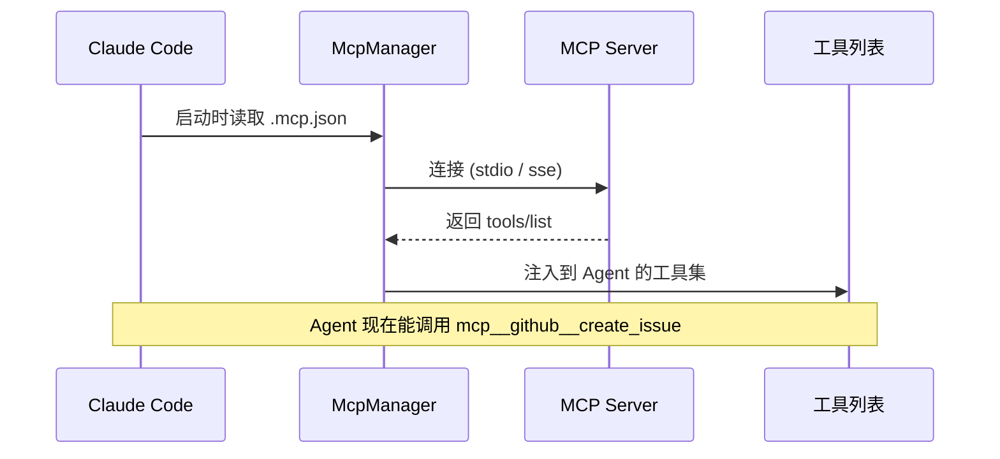

MCP 的 `tools/list` 响应**自动**成为 Claude 可用的工具，无需写额外注册代码。这就是"工具的 USB 接口"的含义。

---

## 维度十：权限系统（减少弹窗的核心机制）

权限系统是 Claude Code 安全模型的**第一层防线**——控制 Claude 可以使用哪些工具、访问哪些文件/域。

### 1. 权限的三层分类

| 工具类型 | 示例 | 需要批准？ | "是，不再询问"行为 |
|:------|:------|:-----|:------------|
| **只读** | 文件读取、Grep | 否 | 不适用 |
| **Bash 命令** | Shell 执行 | 是 | **永久生效**(每个项目目录+命令) |
| **文件修改** | Edit/Write | 是 | **会话级**(直到会话结束) |

**关键区别**：Bash 命令的"不再询问"会持久化到设置文件,下次开会话仍生效;文件修改的"不再询问"只在当前会话有效,下次重启要重新批准。

### 2. 权限模式：全局行为控制

权限模式决定**整体批准策略**,不是单条规则。用 `/permissions` 或 `defaultMode` 设置切换:

| 模式 | 何时用 | 行为 |
|:-----|:------|:-----|
| **default** | 默认模式 | 每个新工具首次使用时提示 |
| **acceptEdits** | 快速开发 | 自动批准工作目录内的文件编辑+常见文件系统命令(`mkdir`/`touch`/`mv`/`cp`) |
| **plan** | Plan Mode | Claude 只读文件+只读 shell,不改源码 |
| **auto** | 无人值守(研究预览) | 自动批准+后台安全检查验证操作与请求一致 |
| **dontAsk** | 锁定模式 | 自动拒绝,除非预先通过 `/permissions` 或 `allow` 规则批准 |
| **bypassPermissions** | 容器/VM 内使用 | 跳过所有提示(除了显式 `ask` 规则+关键路径删除) |

**⚠️ bypassPermissions 警告**：跳过对 `.git`/`.claude`/`.vscode` 等配置目录的写入保护。仅在隔离环境(容器/VM)中使用,防止 Claude Code 损害主机。

**防止 bypass 被滥用**：在托管设置中设置 `permissions.disableBypassPermissionsMode: "disable"` 强制禁用。

### 3. 权限规则语法

权限规则格式：`Tool` 或 `Tool(specifier)`。

**评估顺序(关键!)**：deny → ask → allow。**第一个匹配的规则决定结果**,规则特异性不改变顺序。

这意味着宽泛的 deny 规则(`Bash(aws *)`)会阻止所有匹配调用,**包括**更具体的 allow 规则(`Bash(aws s3 ls)`),因此 deny 不能包含"允许列表例外"。

#### Bash 规则

支持 `*` 通配符(可出现在任何位置):

```json
{
  "permissions": {
    "allow": [
      "Bash(npm run lint)",        // 精确匹配
      "Bash(npm run test *)",      // 前缀匹配(注意空格!)
      "Bash(git * main)",          // 中间通配
      "Bash(* --version)",         // 后缀通配
      "Bash(* --help *)"
    ],
    "deny": [
      "Bash(git push *)",          // 阻止所有 git push
      "Bash(curl *)",              // 阻止 curl(用 WebFetch 替代)
    ]
  }
}
```

**空格很重要**：`Bash(ls *)` 匹配 `ls -la` 但不匹配 `lsof`;`Bash(ls*)` 匹配两者。

**复合命令处理**：Claude Code 知道 shell 运算符(`&&`/`||`/`;`/`|`),规则需独立匹配每个子命令。

**进程包装器剥离**：匹配前剥离 `timeout`/`time`/`nice`/`nohup`/`stdbuf`/`xargs`(无参数),因此 `Bash(npm test *)` 也匹配 `timeout 30 npm test`。

**只读命令(永不提示)**：`ls`/`cat`/`echo`/`pwd`/`head`/`tail`/`grep`/`find`/`wc`/`which`/`diff`/`stat`/`du`/`cd` + 所有 git 只读子命令。该集合不可配置。

#### Read/Edit 规则(路径控制)

遵循 gitignore 规范,四种锚点:

| 模式 | 含义 | 示例 | 匹配 |
|:----|:-----|:-----|:-----|
| `//path` | 文件系统根目录的绝对路径 | `Read(//Users/alice/secrets/**)` | `/Users/alice/secrets/**` |
| `~/path` | 主目录路径 | `Read(~/.zshrc)` | `/Users/alice/.zshrc` |
| `/path` | **项目根目录**相对路径(不是绝对路径!) | `Edit(/src/**/*.ts)` | `<project>/src/**/*.ts` |
| `path` 或 `./path` | 当前目录相对路径 | `Read(*.env)` | `<cwd>/*.env` |

**Windows 路径规范化**：`C:\Users\alice` → `/c/Users/alice`,用 `//c/**/.env` 匹配该驱动器。

**符号链接处理**：
- **Allow 规则**：符号链接路径+目标路径都匹配才适用(目录内符号链接指向外部仍会提示)
- **Deny 规则**：符号链接路径或目标路径任一匹配就适用(指向被拒文件的符号链接本身被拒)

示例：
```json
{
  "permissions": {
    "allow": ["Read(./project/**)"],   // 允许项目内读取
    "deny": ["Read(~/.ssh/**)", "Read(**/.env)"]  // 拒绝 SSH 目录+所有 .env
  }
}
```

`./project/key` 符号链接指向 `~/.ssh/id_rsa` → **被阻止**(目标未通过 allow+匹配 deny)。

#### WebFetch 规则(域名控制)

```json
{
  "permissions": {
    "allow": [
      "WebFetch(domain:github.com)",      // 精确域名
      "WebFetch(domain:*.example.com)",   // 子域(不匹配 example.com 本身)
    ],
    "deny": [
      "WebFetch(domain:evil.com)"         // 阻止特定域
    ]
  }
}
```

**通配符限制**：`WebFetch(domain:example.*)` 匹配 `example.org`(单个点间文本)但不匹配 `example.evil.com`(跨越点),防止尾部通配符匹配攻击者可注册域。

#### MCP 规则

```json
{
  "permissions": {
    "allow": [
      "mcp__puppeteer__puppeteer_navigate",  // 特定工具
      "mcp__github__get_*",                  // get_开头的工具
      "mcp__puppeteer__*"                    // puppeteer 服务器的所有工具
    ],
    "deny": [
      "mcp__filesystem"                      // 拒绝整个 filesystem 服务器
    ]
  }
}
```

**工具名称通配符**：deny/ask 规则支持 `"*"`(所有工具)或 `"mcp__*"`(所有 MCP);allow 规则仅接受 `mcp__<server>__` 后的通配符。

#### Agent 规则(控制子 Agent)

```json
{
  "permissions": {
    "deny": ["Agent(Explore)"]  // 禁用 Explore 子 Agent
  }
}
```

#### 按输入参数匹配(高级)

匹配工具的顶级参数(嵌套字段不可匹配):

```json
{
  "permissions": {
    "deny": [
      "Agent(model:opus)",              // 拒绝 Opus 模型级别的 Agent
      "Agent(isolation:worktree)",      // 拒绝 worktree 隔离
      "Bash(run_in_background:true)"    // 拒绝后台运行
    ]
  }
}
```

每个规则命名一个参数,要组合需多个规则;`*` 通配匹配任意显式值;省略的参数永不匹配。

### 4. 使用 `/permissions` 管理规则

运行 `/permissions` 打开交互式管理界面,列出所有规则及其来源(settings 文件路径)。

**规则来源标识**：
- Allow 规则 → 绿色标记
- Ask 规则 → 黄色标记
- Deny 规则 → 红色标记

**实操建议**：
- 先用 `/permissions` 查看当前规则,理解"为什么这个命令要提示/被拒绝"
- 添加规则时,精确到子命令(如 `Bash(git push origin main)` 而非 `Bash(git push *)`)
- 定期清理过于宽泛的规则(如 `Bash(npm *)` 改为 `Bash(npm run build)`)

### 5. 工作目录与其他目录

**默认访问范围**：Claude 只能访问启动目录内的文件。

**扩展访问**：
- **启动时**：`--add-dir <path>` CLI 参数
- **会话中**：`/add-dir` 命令
- **持久配置**：`permissions.additionalDirectories` 设置

其他目录内的文件遵循相同权限规则(无需提示即可读取,编辑遵循当前权限模式)。

**⚠️ 其他目录只授文件访问,不加载配置**：大多数 `.claude/` 配置不从 `--add-dir` 目录发现。例外：
- Skills/Agents 从 `--add-dir` 加载(实时重新加载)
- Settings 仅加载 `enabledPlugins` 和 `extraKnownMarketplaces` 键

**改变主工作目录**：用 `/cd`(v2.1.169+) 重新定位会话(加载新目录的 CLAUDE.md,`--resume` 从那里找会话)。

### 6. 沙箱：限制 Bash 命令的访问边界

**沙箱是什么**：用操作系统强制执行 Bash 命令的文件系统和网络边界,限制命令运行后能访问的内容。

**与权限的区别**：权限控制"能不能用工具",沙箱控制"用了之后能访问什么"。

**启用方式**：运行 `/sandbox` 命令,选择"自动允许"或"常规权限"模式。

| 模式 | 行为 |
|:----|:-----|
| **自动允许** | 沙箱内命令自动批准,无需提示。仍检查显式 deny 规则+关键路径删除 |
| **常规权限** | 沙箱内命令仍走正常权限流程,需要批准 |

**默认限制**：
- 文件系统：只写工作目录+会话临时目录
- 网络：首次访问新域时提示批准

**扩展访问(设置配置)**：
```json
{
  "sandbox": {
    "enabled": true,
    "filesystem": {
      "allowWrite": ["~/.kube", "/tmp/build"]  // 沙箱外写入路径
    }
  }
}
```

**何时使用沙箱**：

| 场景 | 是否需要沙箱 |
|:----|:---------|
| 本机日常开发(减少提示) | ✅ 用沙箱自动允许模式 |
| 无人值守运行(auto模式) | ✅ 用沙箱或容器/VM |
| 不受信任的代码仓库 | ❌ 不够安全,用容器/VM |
| 团队标准化环境 | ✅ 用沙箱+托管设置强制执行 |

**限制**：沙箱仅隔离 Bash 和子进程,不隔离 Read/Edit/WebFetch/MCP。要隔离全部工具,需用容器或 VM。

详见 [bash沙箱文档](https://code.claude.com/docs/sandboxing)。

### 7. 托管设置：组织级强制执行

管理员可通过托管设置部署**不可覆盖**的策略。传递机制：

| 机制 | macOS | Linux/WSL | Windows |
|:-----|:------|:---------|:--------|
| **服务器管理** | claude.ai 管理控制台或自托管 gateway | 同上 | 同上 |
| **MDM/OS 级别** | `com.anthropic.claudecode` plist(Jamf/Kandji) | `/etc/claude-code/managed-settings.json` + `managed-settings.d/` 放入目录 | HKLM 注册表项(Intune/组策略) |
| **文件部署** | `/Library/Application Support/ClaudeCode/` | `/etc/claude-code/` | `C:\Program Files\ClaudeCode\` |

**仅托管设置有效的键**：
- `allowManagedHooksOnly`: 阻止用户/项目 hooks,仅托管生效
- `allowManagedMcpServersOnly`: 仅托管 MCP 允许列表生效
- `allowManagedPermissionRulesOnly`: 阻止用户/项目定义权限规则
- `disableBypassPermissionsMode`: 强制禁用 bypass 模式
- `strictKnownMarketplaces`: 限制插件市场来源
- `strictPluginOnlyCustomization`: 锁定 skills/agents/hooks/MCP 只来自插件/托管

**无效条目容错处理(v2.1.169+)**：托管配置验证失败时删除无效条目+警告+强制执行剩余有效策略。单个拼写错误不会禁用整个策略。

### 8. 设置优先级(权限规则特殊处理)

常规设置覆盖顺序：Managed(最高) → 命令行 → Local → Project → User(最低)。

**权限规则合并(不同于覆盖)**：deny/ask/allow 数组跨作用域合并,而非替换。

**评估优先级**：来自任何作用域的 deny 规则优先于所有 ask/allow,因此用户级 deny 会阻止项目级 allow。

**判断口诀**：
- 托管设置的 deny → 永久生效,无法绕过
- 项目设置的 deny → 团队强制执行
- 用户设置的 deny → 个人自我约束
- 项目+用户都有 allow → 合并生效
- 项目有 ask,用户有 allow → ask 规则提示(优先级更高)

### 9. 永远不要加进 allow 的危险模式

这些等于允许任意代码执行：

| 模式 | 风险 |
|:----|:-----|
| `Bash(python*)`/`node*`/`bun*`/`deno*` | 解释器可执行任意代码 |
| `Bash(bash*)`/`sh*` | Shell 本身就是代码执行入口 |
| `Bash(npx*)`/`bunx*`/`uvx*` | 包执行器下载+运行远程包 |
| `Bash(npm run *)`/`yarn run *)` | 通配太宽,可能运行恶意脚本 |
| `Bash(gh api *)` | 可能 POST/PUT/DELETE,不只是读取 |
| `Bash(docker run*)`/`kubectl exec*)` | 容器内任意命令 |
| `Bash(curl *)`/`Bash(wget *)` | 绕过 WebFetch 域名控制,直接网络访问 |

**安全替代**：
- `Bash(bun run typecheck)` → 精确到子命令(安全)
- `WebFetch(domain:github.com)` → 通过 WebFetch 工具+域名规则控制网络访问
- `Read(**/.env)` deny → 阻止读取敏感文件(路径规则比 Bash 命令匹配更可靠)

**URL 过滤脆弱性示例**：`Bash(curl http://github.com/ *)` 意在限制 GitHub URL,但不会匹配：
- URL 前的选项(`curl -X GET http://github.com/...`)
- 不同协议(`curl https://github.com/...`)
- 重定向(`curl -L http://bit.ly/xyz` 重定向到 GitHub)
- 变量(`URL=http://github.com && curl $URL`)

改用 WebFetch 工具+PreToolUse hook 验证 URL,或 deny Bash 网络工具。

---

## 维度十一：Settings 的四级覆盖

配置作用域决定设置**应用的位置**和**与谁共享**。

### 1. 四级作用域完整表格

| 作用域 | 位置 | 影响范围 | 与团队共享？ | 典型用途 |
|:-----|:-----|:-------|:----------|:--------|
| **Managed** | 服务器/系统级文件/注册表 | 组织所有成员(服务器);机器所有用户(文件/注册表) | 是(IT 部署) | 安全策略/合规要求/标准化配置 |
| **User** | `~/.claude/` | 您,跨所有项目 | 否 | 个人偏好(主题/编辑器)/跨项目工具/API 密钥 |
| **Project** | `.claude/` | 此仓库所有协作者 | 是(进 git) | 团队共享设置(权限/hooks/MCP)/团队插件 |
| **Local** | `.claude/settings.local.json` | 您,仅在此仓库 | 否(gitignored) | 项目个人覆盖/配置测试/机器特定设置 |

**Windows 路径**：`~/.claude` → `%USERPROFILE%\\.claude`。

### 2. 设置文件位置详解

**用户设置**：`~/.claude/settings.json`(所有项目生效)

**项目设置**：
- `.claude/settings.json` → 进 git,团队共享
- `.claude/settings.local.json` → 不进 git,个人私有(Claude Code 自动配置 git 忽略)

**托管设置(仅管理员可写)**：

| 平台 | 位置 |
|:-----|:-----|
| **macOS 文件** | `/Library/Application Support/ClaudeCode/managed-settings.json` + `managed-settings.d/*.json` 放入目录 |
| **macOS MDM** | `com.anthropic.claudecode` plist(Jamf/Kandji) |
| **Linux/WSL 文件** | `/etc/claude-code/managed-settings.json` + `managed-settings.d/*.json` |
| **Windows 文件** | `C:\Program Files\ClaudeCode\managed-settings.json` |
| **Windows 注册表** | HKLM `SOFTWARE\Policies\ClaudeCode`/HKCU `SOFTWARE\Policies\ClaudeCode`(最低) |
| **服务器管理** | claude.ai 管理控制台或自托管 [Claude apps gateway](https://code.claude.com/docs/claude-apps-gateway) |

**放入目录合并规则**：`managed-settings.json` 作为基础合并,`managed-settings.d/*.json` 按字母顺序排序合并在其上。用数字前缀控制顺序(`10-telemetry.json` < `20-security.json`)。

**示例部署模板**：[Claude Code 仓库 examples/mdm](https://github.com/anthropics/claude-code/tree/main/examples/mdm) 提供 Jamf/Kandji/Intune/组策略模板。

**其他配置**：`~/.claude.json` 存储 OAuth 会话/MCP 配置(用户和本地作用域)/项目状态/缓存;项目 MCP 单独存储在 `.mcp.json`。

### 3. 设置优先级(覆盖顺序)

**常规设置(权限规则除外)**：

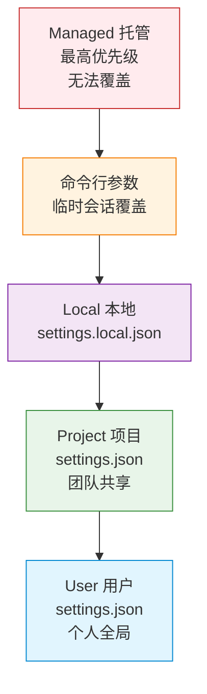

**权限规则特殊处理**：deny/ask/allow 数组跨作用域合并,而非覆盖。优先级：deny > ask > allow(来自任何作用域)。

### 4. 编辑何时生效

**实时重新加载**：Claude Code 监视设置文件,大多数键的编辑立即生效(无需重启),包括：
- `permissions` 权限规则
- `hooks` Hook 配置
- `apiKeyHelper` 凭证助手
- 用户/项目/本地/托管设置

每次检测到更改触发 [`ConfigChange` hook](https://code.claude.com/docs/hooks#configchange)。

**仅启动时读取(需重启生效)**：
- `model`: 用 `/model` 在会话中切换
- `outputStyle`: System Prompt 部分,需 `/clear` 或重启重建

### 5. 可用设置分类速查

**权限设置**：见 [维度十§ 3](#维度十权限系统减少弹窗的核心机制)。

**沙箱设置**：

| 键 | 用途 | 示例 |
|:---|:-----|:-----|
| `sandbox.enabled` | 启用沙箱 | `true` |
| `sandbox.filesystem.allowWrite` | 允许沙箱外写入路径 | `["~/.kube"]` |
| `sandbox.credentials.files` | 阻止读取凭证文件 | `[{ "path": "~/.aws/credentials", "mode": "deny" }]` |
| `sandbox.credentials.envVars` | 取消环境变量(沙箱内) | `[{ "name": "GITHUB_TOKEN", "mode": "deny" }]` |

**路径前缀**：`/tmp`(绝对)、`~/`(主目录)、`./`(项目相对)。

**Worktree 设置**：

| 键 | 描述 | 示例 |
|:---|:-----|:-----|
| `worktree.baseRef` | 新 worktree 分支参考 | `"fresh"`(默认,从远程默认分支)或 `"head"`(从本地 HEAD) |
| `worktree.symlinkDirectories` | 符号链接目录 | `["node_modules", ".cache"]` |
| `worktree.sparsePaths` | Sparse checkout 目录 | `["packages/my-app", "shared/utils"]` |

**全局配置设置(存储在 ~/.claude.json)**：

| 键 | 描述 |
|:---|:-----|
| `autoConnectIde` | 外部终端自动连接 IDE |
| `autoInstallIdeExtension` | VS Code 终端自动安装扩展 |
| `teammateDefaultModel` | Agent Team 队友默认模型 |

**其他关键设置**：

| 键 | 描述 | 示例 |
|:---|:-----|:-----|
| `model` | 默认模型 | `"claude-sonnet-5"` |
| `theme` | 颜色主题 | `"dark"` / `"light"` / `"auto"` |
| `verbose` | 详细输出 | `true`(显示完整工具输出) |
| `cleanupPeriodDays` | 会话清理周期 | `30`(默认) |
| `autoCompactEnabled` | 自动压缩上下文 | `true`(默认) |

完整设置参考见 [设置文档](https://code.claude.com/docs/settings#available-settings)。

### 6. 使用 `/config` 管理设置

运行 `/config` 打开交互式设置面板,可：
- 查看当前状态信息
- 修改配置选项
- 从 v2.1.181 起,传递 `key=value` 单独修改(如 `/config verbose=true`)

**实操建议**：
- 团队约定的权限/沙箱/hooks → 项目 `.claude/settings.json`(进 git)
- 个人偏好(主题/详细输出) → 用户 `~/.claude/settings.json` 或 `/config` 临时修改
- 项目特定覆盖(不想影响其他项目) → 本地 `.claude/settings.local.json`
- 组织强制策略 → 托管设置(IT 部署)

### 7. 判断口诀：何时用哪个作用域

| 你的需求 | 用哪个作用域 |
|:-------|:----------|
| "换个项目也想要" | User(用户全局) |
| "团队成员都要遵守" | Project(项目级,进 git) |
| "IT 强制/合规要求" | Managed(托管) |
| "只是这个项目/这次测试" | Local(本地私有) |
| "临时改一下(不持久)" | 命令行参数(如 `--verbose`) |

---

## 维度十二：Agent 循环与上下文管理（背后的引擎）

虽然不是用户直接交互的命令，但理解 Claude Code 的 Agent Loop 是理解前面所有能力的关键。

### 1. 主循环结构

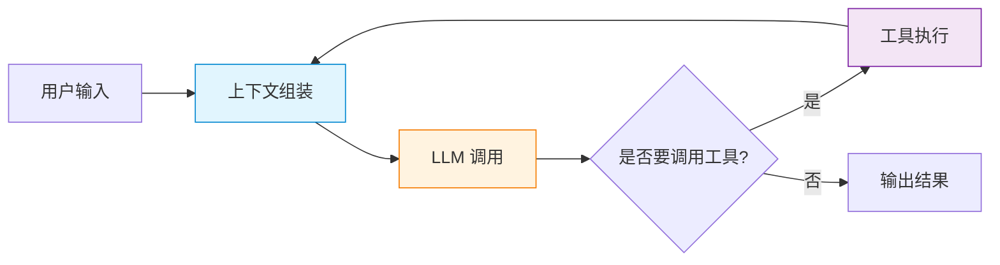

每一次循环都包含：
1. 把当前上下文（系统提示 + 历史 + 工具结果）发给 LLM
2. LLM 决定下一步：调用工具 or 输出答案
3. 如果调用工具，执行后把结果塞回上下文
4. 回到第 1 步

### 2. 上下文管理的 4 个杠杆

当上下文接近 token 上限时，Claude Code 有四种应对：

| 杠杆 | 触发方式 | 原理 |
|------|----------|------|
| **自动压缩** | 接近上限 | 把旧消息总结成一段，保留新消息原文 |
| **手动压缩** | `/compact` | 同上，用户主动触发 |
| **清空** | `/clear` | 直接丢弃历史 |
| **子 Agent** | fork 类命令 | 把任务丢给独立上下文的子 Agent |

**什么时候该用什么**：

- 调试一个长期项目：让自动压缩跑，主 Agent 持续累积理解
- 切换完全不同的话题：`/clear`
- 单个深度调研：派 Explore 子 Agent，隔离上下文
- 上下文快爆但任务还没完：`/compact`

### 3. 为什么 Skill/Hook/MCP 都靠这个循环

所有上层能力（Slash 命令、Hook、MCP 工具、子 Agent）都是**给主循环注入东西**：

- **Slash 命令 inline**：往上下文里塞一段 Prompt
- **Slash 命令 fork**：起一个独立的主循环
- **Hook**：在循环的特定点（工具调用前后）插一段外部代码
- **MCP**：往循环的工具集里加新工具
- **子 Agent**：再开一个独立的循环

**判断你看到的能力属于哪一类，就看它**改变了循环的哪个部分**。

---

## 把 Claude Code 当教科书：可以学到什么

学完上面八层，回看自己造 Agent 的设计：

### 1. 抄得到的模式

| Claude Code 的设计 | 你的 Agent 应该有的 |
|-------------------|---------------------|
| 内置子 Agent 列表 | 按职责拆 Agent，每个有明确 description |
| 只读工具集（Explore） | 给"调研类" Agent 限定最小权限 |
| Skill = Prompt 封装 | 把"领域知识"写成 Markdown，不是写代码 |
| Hook = 事件触发 | 在关键步骤插自动化，不让 Agent 自己记 |
| MCP = 工具协议化 | 工具跨进程调用要有标准接口 |
| 三级 settings | 配置分层：全局/项目/本地 |

### 2. 容易忽略的反模式

- **给 Agent 太多工具**：Claude Code 严格按职责拆 Agent，每个 Agent 的工具集是**白名单**而不是**黑名单**。
- **用 Skill 代替子 Agent**：需要隔离上下文的（深度调研、长期任务）用 fork，别用 inline，否则主上下文被污染。
- **Hook 写得太复杂**：Hook 是无状态的命令行，复杂逻辑应该写成 MCP 工具或子 Agent。
- **权限白名单太宽**：精确到 `Bash(git log *)` 而不是 `Bash(git *)`，后者能跑 `git push`。

### 3. 一个具体的"仿写"练习

如果你想造一个"代码审查 Agent"，抄 Claude Code 的 `/review`：

```markdown
<!-- .claude/agents/code-reviewer.md -->
---
name: code-reviewer
description: 审查当前 diff 的可读性、性能、安全问题
tools: Read, Grep, Glob, Bash
model: sonnet
---

你是一个只读的代码审查 agent：
- 使用 Read/Grep/Glob 阅读代码，不要修改任何文件
- 按"严重性 / 文件:行号 / 问题 / 建议"格式输出
- 不要寒暄、不要总结、不要修改
```

对比 `/review` 的内置实现，你就有了**参照系**——这个自定义 Agent 跟内置的差别在哪，能不能复用，能不能组合。

---

## 总结：一张能力全景图

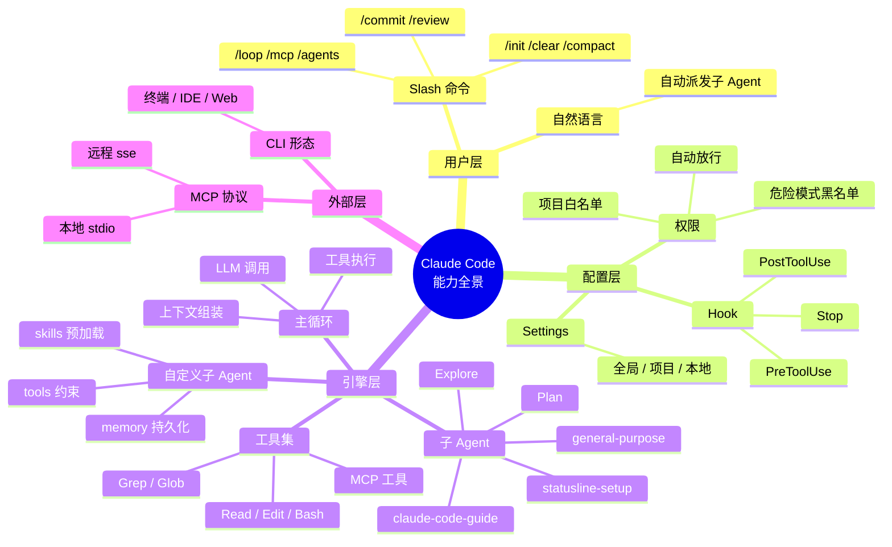

**最后一句话**：Claude Code 不是个黑盒，它是 Agent 理论的"开源实现"。把它当案例拆，比读 10 篇 Agent 综述都有用。

---

## 相关阅读

- [MCP 与 Skill 设计篇](../agent-system-design/agent-mcp-skill-design.md) —— 本文的上游，更深入讲 Skill 的设计原理
- [Agent Loop 循环设计篇](../agent-system-design/agent-loop-design.md) —— 主循环的内部机制
- [工具调用篇](../agent-system-design/agent-tool-calling.md) —— 工具的本质与设计
- [上下文管理篇](../agent-system-design/agent-context-management.md) —— 上下文压缩与隔离