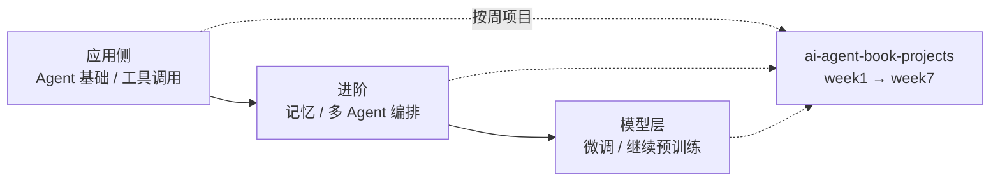

# AgentBook

- 在线版：[https://agentbook.minims.cn/#/](https://agentbook.minims.cn/#/)
- 项目仓库：[https://github.com/bojieli/ai-agent-book](https://github.com/bojieli/ai-agent-book)
- 配套代码：[https://github.com/bojieli/ai-agent-book-projects](https://github.com/bojieli/ai-agent-book-projects)（按周划分的实践项目）

## 这条资源主要在讲什么

作者李博杰是前华为"天才少年"、Logenic AI 联合创始人。这是一本新开源的 Agent 学习系统书：不停在"拼个能跑的 demo"，而是把 Agent 从头到尾系统讲一遍，全书涵盖面广、内容细致，并配一个按周组织的项目仓库做实验训练，`week1` 一路排到 `week7`。

它最明显的特点是既全面又有跨度：横向覆盖应用侧的工具调用、记忆、多 Agent 编排等主题，纵向后期还往下延伸到继续预训练这类模型层话题——模型本身怎么训、怎么改。这条"从应用到模型"的完整跨度，是大多数入门教程刻意回避的地方。

