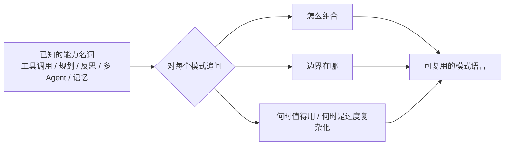

# Agentic Design Patterns（中文翻译）

- 官网：[https://adp.xindoo.xyz/](https://adp.xindoo.xyz/)
- 项目仓库：[https://github.com/xindoo/agentic-design-patterns](https://github.com/xindoo/agentic-design-patterns)

## 这条资源主要在讲什么

它是同名书《Agentic Design Patterns》的**中文翻译项目**，把原书对 Agent 设计模式的系统梳理搬到中文语境。内容不从零教你调通一个 demo，而是把 Agent 系统里反复出现的设计模式拎出来讲清楚。

更像一份模式手册：当你已经知道工具调用、工作流、规划、多 Agent、记忆这些词之后，继续追问它们在系统里该怎么组合、边界在哪里、什么时候值得用、什么时候只是把简单问题复杂化。所以它不是第一本入门教程，而是做过几个原型之后，用来把零散经验对到一套现成"模式语言"上的参考。

