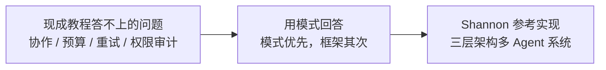

# AI Agent Book

- 官网：[https://www.waylandz.com/ai-agent-book/](https://www.waylandz.com/ai-agent-book/)
- 项目仓库：[https://github.com/Kocoro-lab/ai-agent-book](https://github.com/Kocoro-lab/ai-agent-book)

## 这条资源主要在讲什么

按作者前言，这本书是他 2025 下半年从 AI 理论转向 Agent 工程落地时踩坑摸出来的。市面上的教程要么停在"调 API 做个 chatbot"的 demo，要么是某个框架的文档翻译，而他真正下手做生产级系统时遇到的问题没人回答：

- 多个 Agent 之间怎么协作，用 DAG 还是 Supervisor？
- Token 预算怎么分，单次调用还是整个 workflow？
- 工具执行出错怎么重试，状态怎么持久化？
- 企业环境下怎么做权限控制和审计？

这些问题只能在踩坑中摸索，配套产物就是三层架构的多 Agent 系统 [Shannon](https://github.com/Kocoro-lab/Shannon)（Go/Rust/Python）。书里把 Shannon 当参考实现，但写作理念很明确——**模式优先，框架其次**：框架会过时，模式不会，所以它刻意不绑定 LangChain/CrewAI 这类具体框架。

正因为 Agent 生态进化很快，与其说它是一份定型的"生产化手册"，不如说是一份带着真实工程问题去查的模式参考：遇到编排、预算、重试、权限这类问题时，回来看它怎么拆。

