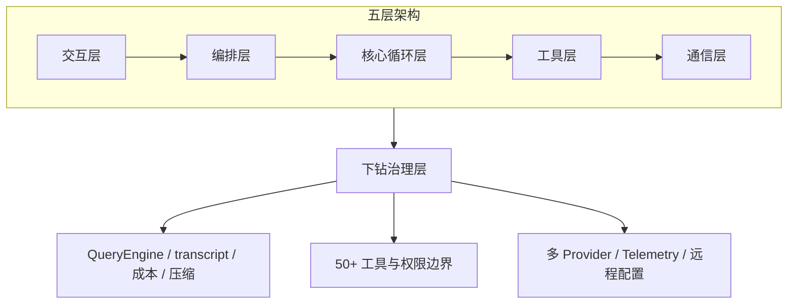

# Claude Code Architecture（CCB）

- 官网：[https://ccb.agent-aura.top/docs/introduction/what-is-claude-code](https://ccb.agent-aura.top/docs/introduction/what-is-claude-code)
- 项目仓库：[https://github.com/claude-code-best/claude-code](https://github.com/claude-code-best/claude-code)

## 这条资源主要在讲什么

它不教你从零写一个最小 agent loop，也不是使用手册。重心很明确：把 Claude Code 当作一个 terminal-native agentic coding system 来逆向拆——它不是 IDE 插件，不是云端聊天，也不只是 API wrapper，而是本地终端里的 agentic coding system，核心能力来自五层配合。

站点不止停在主循环，还继续下钻 QueryEngine、50+ 工具与权限边界、多 Provider 通信、Telemetry 与远程配置。真正关心的问题是：这样一个成熟 coding agent 是怎样被一层层工程化出来的。

