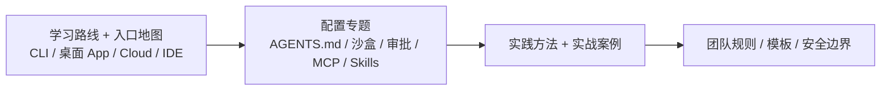

# CodexGuide

- 官网：[https://codexguide.ai/](https://codexguide.ai/)
- 项目仓库：[https://github.com/freestylefly/CodexGuide](https://github.com/freestylefly/CodexGuide)

## 这条资源主要在讲什么

它不讲抽象概念，而是把 Codex 从第一次上手一路带到真实工作流里。README 直接说了：它关注怎么开始、怎么交付、怎么沉淀，而不是只给一份命令列表。

解决的是一个很具体的问题：准备把 Codex 真正放进日常开发、写作、研究、自动化或团队协作，先该走哪条路。内容按一条从入口到落地的路径组织。

