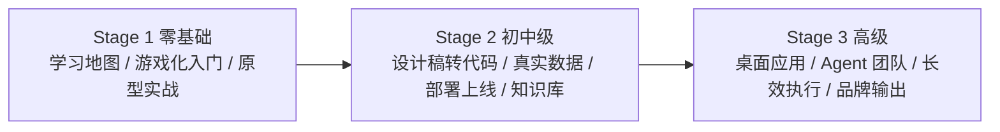

# Easy-Vibe

- 官网：[https://datawhalechina.github.io/easy-vibe/zh-cn/](https://datawhalechina.github.io/easy-vibe/zh-cn/)
- 项目仓库：[https://github.com/datawhalechina/easy-vibe](https://github.com/datawhalechina/easy-vibe)

## 这条资源主要在讲什么

它不问"Agent 是什么""Claude Code 内部怎么做"，而是直接问一个面向结果的问题：一个会描述需求的人，怎么借助 AI 把产品一步步做出来。README 说得很直白：`In the AI era, programming starts by describing what you want.`

它关心的核心不是某个底层框架，而是"会说需求 → 会做产品 → 能上线 → 能持续迭代"这条实际路径，并把它拆成三个阶段。

