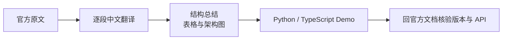

# LangChain 官方文档中文走读

- 中文走读：[https://shuaibilx.github.io/langchain-docs/](https://shuaibilx.github.io/langchain-docs/)
- 官方文档：[https://docs.langchain.com/](https://docs.langchain.com/)

## 这条资源主要在讲什么

这是一份围绕 LangChain 官方文档组织的中文走读资料。它把每篇文档拆成“原文、翻译、总结、DEMO示例”四层：逐段保留英文并翻译，补充表格和架构图提炼主线，再提供 Python 与 TypeScript Demo，把中文理解推进到代码验证。

它适合作为官方资料的第二阅读层，帮助定位关键词和章节关系；涉及当前版本、依赖和 API 行为时，仍需回到官方文档确认。

