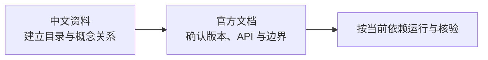

# LangChain 官方文档与中文资料

- 官方文档：[https://docs.langchain.com/](https://docs.langchain.com/)
- 中文资料：[https://langchain-zh.cn/](https://langchain-zh.cn/)

## 这条资源主要在讲什么

`docs.langchain.com` 是英文官方文档，负责提供版本、API、概念和生态边界的第一手信息；`langchain-zh.cn` 是最新的中文版资料，适合先建立目录和概念关系，再回官方页面核对细节。

中文资料能降低第一次阅读的成本，但不能替代官方文档。尤其是代码示例、包名、参数和版本行为，应以官方页面和当前依赖版本为准。

