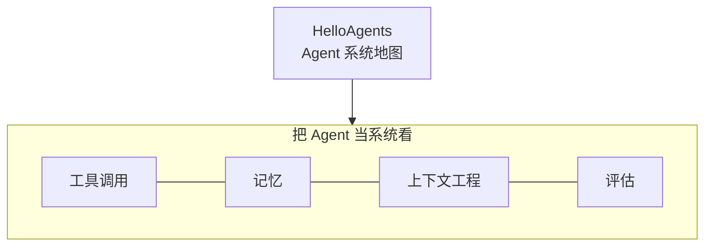

# HelloAgents

- 官网：[https://datawhalechina.github.io/hello-agents/](https://datawhalechina.github.io/hello-agents/)
- 项目仓库：[https://github.com/datawhalechina/hello-agents](https://github.com/datawhalechina/hello-agents)

## 这条资源主要在讲什么

它适合在初学 Agent 时快速补一批认知：不是教"怎么写一个 prompt"，而是更靠后一层——如果要把 Agent 做成一个能持续工作的系统，工具、记忆、上下文、评估这些东西该怎么连起来看。很多资料教你拼 demo 就停了，HelloAgents 在补"系统为什么这样搭"这个空档。

所以它更像一张 Agent 学习地图，帮你在入门阶段先建立模块全景、快速补齐概念，再按缺口去啃具体一块。

