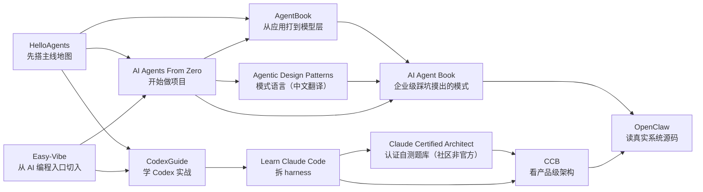

# 资源导航

这页不是书单，而是一张学习地图。

目标只有一个：让你在 2 到 3 分钟内先知道这些资源各自是什么形态、适合拿来干什么。

## 一点理念

没有哪条资源能一次讲透 Agent。每条都只从一个角度切进去——主线地图、项目实战、模式语言、机制拆解、真实源码。同一个概念，在教程里是一段话，在项目里是一次踩坑，在源码里是一处实现。

学习的不同阶段，缺口不一样：入门缺全貌，动手缺项目，卡住缺模式，深究缺机制。所以这里不推唯一答案，而是按阶段和缺口调不同角度的资源来回看，从而积累经验。

整理这一页，就两个用途：

- **日常补认知**：把它当参考架，平时按分类系统地补 Agent 这块的认知。
- **遇到问题找思路**：卡住时来对应分类翻一翻有没有现成思路。但不指望翻文档就能解决——真解决要靠动手实践或翻同类型开源项目。这些资源的价值在于，看懂它们怎么拆一类系统，再遇到别的系统时，就更容易找到该从哪个角度切进去。

## 先看地图

按"你拿它干什么"分类。

| 分类 | 你拿它干什么 | 资源 |
| --- | --- | --- |
| 通用 Agent 系统教程 | 通读一本，建立 Agent 全貌 | `AgentBook（新开源）` `HelloAgents` `AI Agents From Zero` |
| 模式与生产参考 | 模式总结以及作者的踩坑记录 | `Agentic Design Patterns（中文翻译）` `AI Agent Book` |
| AI 编程上手 | 教你用 AI工具  | `Easy-Vibe` `CodexGuide` |
| Coding Agent 机制拆解 | 看 coding agent 怎么造出来 | `Learn Claude Code` `Claude Certified Architect · 认证自测题库（社区非官方）` `CCB` |
| 真实系统源码 | 读完整系统的真实源码 | `OpenClaw 源码解析` |

## 常见阅读路线

## 如果你现在只能先选 1 条

| 你的当前缺口                    | 先看哪条 | 为什么不是别条 |
|---------------------------| --- | --- |
| 我缺一张 Agent 主线地图           | [HelloAgents](https://datawhalechina.github.io/hello-agents/) | 因为它更适合搭模块全景，不会一上来把你拖进架构深水区 |
| 我想边做项目边学 Agent            | [AI Agents From Zero](https://didilili.github.io/ai-agents-from-zero/#/) | 因为它更像项目驱动路径，不像 `HelloAgents` 那么偏地图 |
| 我想从 AI 编程入口真正做出东西         | [Easy-Vibe](https://datawhalechina.github.io/easy-vibe/zh-cn/) | 因为它在设计“怎么把人带进来”，不是先拆底层系统 |
| 我想要一条从应用打到模型层的系统主线      | [AgentBook](https://agentbook.minims.cn/#/) | 因为它跨到了继续预训练这类模型层话题，不像其他教学资源大多停在应用和框架层 |
| 我想先学怎么把 Codex 用进真实工作流    | [CodexGuide](https://codexguide.ai/) | 因为它更像从上手到落地的路线图，不像单纯的命令速查表 |
| 我想知道 coding agent 是怎么工作   | [Learn Claude Code](https://learn.shareai.run/zh/s01/) | 因为它先拆 harness，不像 `CCB` 那样先给你白皮书式结构 |
| 我想把 harness 知识串成体系 + 场景自测 | [Claude Certified Architect · 认证自测题库（社区非官方）](https://github.com/paullarionov/claude-certified-architect) | 因为它做的是知识体系梳理和题库自测，不像 `Learn Claude Code` 那样讲新机制 |
| 我想系统补 Agent 设计模式和模式语言      | [Agentic Design Patterns（中文翻译）](https://adp.xindoo.xyz/) | 因为它是同名书的中文翻译，把模式系统整理成册，不像项目教程那样负责带你从零跑通 |
| 我卡在多 Agent 协作、预算、重试、权限这类问题上 | [AI Agent Book](https://www.waylandz.com/ai-agent-book/) | 因为它专门回答这些现成教程答不上的工程问题，且模式优先不绑框架，不像 `OpenClaw` 那样更依赖真实源码背景 |
| 我想拆成熟 coding agent 的产品级边界 | [Claude Code Architecture（CCB）](https://ccb.agent-aura.top/docs/introduction/what-is-claude-code) | 因为它更像逆向架构白皮书，不像 `Learn Claude Code` 那样偏教学 |
| 我想看真实大型系统怎么把这些概念落地        | [OpenClaw 源码解析](https://openclaw-book.myhubs.dev/) | 因为它面对的是完整系统，不再只是教学材料或架构总结 |

## 资源角色卡

### 通用 Agent 系统教程

这一组是"通读一本、建立 Agent 全貌"的成书型教程。  
适合定阅读顺序和学习节奏，不适合指望靠一条直接吃透所有工程深水区。

#### AgentBook

:::tip 新开源
华为前"天才少年"李博杰刚开源的系统教程，内容较新、跨度大，配套按周项目仓库仍在更新。
:::

| 槽位 | 内容 |
| --- | --- |
| 一句定位 | 新开源、全面细致、配套项目实验的系统化 Agent 学习书 |
| 最适合现在的谁 | 想要一本涵盖面广又细致的系统书、并愿意按周动手跑配套项目、还想往模型层看的人 |
| 如果你只想拿走 1 个东西 | Agent 的完整跨度不止在应用侧，还往下连着模型怎么训、怎么改 |
| 最容易读错的地方 | 基础不够就从头硬走，到模型层那几周只记住一堆名词 |
| 建议进入方式 | 先过在线版目录挑缺的段，配 `ai-agent-book-projects` 对应周的项目跑 |

入口：[资源页](./agentbook-bojie/) · [在线版](https://agentbook.minims.cn/#/) · [GitHub 仓库](https://github.com/bojieli/ai-agent-book)

#### HelloAgents

| 槽位 | 内容 |
| --- | --- |
| 一句定位 | 初学 Agent 时快速补认知的主线地图 |
| 最适合现在的谁 | 刚开始学 Agent、想快速补齐工具/记忆/上下文/评估这套认知的人 |
| 如果你只想拿走 1 个东西 | Agent 不是 prompt 延长线，而是工具、上下文、记忆、评估共同组成的系统 |
| 最容易读错的地方 | 把它当成终局教材，而不是地图 |
| 建议进入方式 | 先看目录，再优先看工具、上下文、记忆 |

入口：[资源页](./hello-agents/) · [官方入口](https://datawhalechina.github.io/hello-agents/)

#### AI Agents From Zero

| 槽位 | 内容 |
| --- | --- |
| 一句定位 | 带你从 0 用框架做出项目的实战路径 |
| 最适合现在的谁 | 想被带着从零上手框架、一路做到 workflow、MCP、RAG 和项目落地的人 |
| 如果你只想拿走 1 个东西 | 平台、框架和项目要被你拿来练迁移能力，不是只练平台操作 |
| 最容易读错的地方 | 把“项目做通一次”误解成“已经学会了通用方法” |
| 建议进入方式 | 先跑一个工作流项目，再补 LangChain / LangGraph 案例 |

入口：[资源页](./ai-agents-from-zero/) · [官方入口](https://didilili.github.io/ai-agents-from-zero/#/)

### 模式与生产参考

这一组是"带着具体问题回头查"的参考型资料，不是从头跟着走的路径。  
适合已经做过一些 Agent 原型、手里有真实问题的人。

#### Agentic Design Patterns（中文翻译）

| 槽位 | 内容 |
| --- | --- |
| 一句定位 | 同名书《Agentic Design Patterns》的中文翻译，Agent 模式语言 |
| 最适合现在的谁 | 已经做过几个 Agent 原型，想把工具、规划、反思、多 Agent 等能力对到一套现成模式语言上的人 |
| 如果你只想拿走 1 个东西 | 模式不是能力清单，而是用来判断“什么时候该复杂化、什么时候不该复杂化”的语言 |
| 最容易读错的地方 | 把它当成模式背诵表，而不是带着项目问题去查的设计参考 |
| 建议进入方式 | 先浏览目录建立模式地图，再按当前项目里的具体问题回头细读 |

入口：[资源页](./agentic-design-patterns/) · [官方入口](https://adp.xindoo.xyz/)

#### AI Agent Book

| 槽位 | 内容 |
| --- | --- |
| 一句定位 | 从零构建企业级多 Agent 系统踩坑摸出的模式参考 |
| 最适合现在的谁 | 卡在多 Agent 协作、Token 预算、出错重试、权限审计这类现成教程答不上的问题上的人 |
| 如果你只想拿走 1 个东西 | 框架会过时，模式不会——所以它押注模式而非某个框架 |
| 最容易读错的地方 | 把它当成一份定型的生产化手册，而不是带着真实问题去查的模式参考 |
| 建议进入方式 | 先看前言弄清它要回答哪些问题，再按编排、预算、重试、权限抓对应章节 |

入口：[资源页](./ai-agent-book/) · [官方入口](https://www.waylandz.com/ai-agent-book/)

### AI 编程上手

这一组解决"怎么用 AI 真正做出东西"，重心在编程工作流本身。  
适合想把 AI 编程能力落到日常产出的人。

#### Easy-Vibe

| 槽位 | 内容 |
| --- | --- |
| 一句定位 | AI 编程入口设计 |
| 最适合现在的谁 | 想从“会说需求”一路走到原型、部署和持续迭代的人 |
| 如果你只想拿走 1 个东西 | 它最值钱的不是底层深度，而是“怎么让更多人真能开始做” |
| 最容易读错的地方 | 误以为前期的产品爽感已经等于后面的系统能力 |
| 建议进入方式 | 先看 Stage 1 和学习地图，再按需进 Stage 2 |

入口：[资源页](./easy-vibe/) · [官方入口](https://datawhalechina.github.io/easy-vibe/zh-cn/)

#### CodexGuide

| 槽位 | 内容 |
| --- | --- |
| 一句定位 | Codex 使用路径 |
| 最适合现在的谁 | 想把 Codex 作为编码工具真正用进真实工作流的人 |
| 如果你只想拿走 1 个东西 | Codex 不是只靠命令列表用起来的，而是要把入口、配置、实践和沉淀串成一条路 |
| 最容易读错的地方 | 把它当成命令速查表，而不是使用路径设计 |
| 建议进入方式 | 先看学习路线和入口地图，再补配置专题和实践方法 |

入口：[资源页](./codex-guide/) · [官方入口](https://codexguide.ai/) · [GitHub 仓库](https://github.com/freestylefly/CodexGuide)

### Coding Agent 机制拆解

这一组主要解决“Claude Code、Codex、Cursor 这类东西是怎么工作的”。  
不是泛 Agent 入门，而是把 coding agent 的 loop、tools、planning、compression、权限和产品边界拆开来看。

#### Learn Claude Code

| 槽位 | 内容 |
| --- | --- |
| 一句定位 | agent harness 拆解课 |
| 最适合现在的谁 | 已经在用 coding agent，想把背后机制一层层拆开的人 |
| 如果你只想拿走 1 个东西 | 好用的 coding agent 靠的不是模型魔法，而是 loop、tools、todo、subagents、skills、compression 这套外层机制 |
| 最容易读错的地方 | 只记住 Claude Code 的形状，没有继续往通用 harness 模式上提炼 |
| 建议进入方式 | 先看 `s01-s06`，把 loop、tool、todo、compact 这条主线立起来 |

入口：[资源页](./learn-claude-code/) · [官方入口](https://learn.shareai.run/zh/s01/)

#### Claude Certified Architect · 认证自测题库（社区非官方）

| 槽位 | 内容 |
| --- | --- |
| 一句定位 | 认证知识体系 + 场景自测（非官方社区资料） |
| 最适合现在的谁 | 已经在用 coding agent，想把零散机制点串成自测用的知识体系的人 |
| 如果你只想拿走 1 个东西 | 它不是新机制，而是把 harness 拆解课的零散点按认证结构重新组织，配场景题做自检 |
| 最容易读错的地方 | 把它当成新的机制课或入门路径，从而跳过 `Learn Claude Code` / `CCB` 直接看它 |
| 建议进入方式 | 先用 `Learn Claude Code` 和 `CCB` 立直觉，再来这一条做知识体系梳理和盲点自测 |

入口：[资源页](./claude-certified-architect/) · [官方入口](https://github.com/paullarionov/claude-certified-architect)

#### Claude Code Architecture（CCB）

| 槽位 | 内容 |
| --- | --- |
| 一句定位 | 逆向架构白皮书 |
| 最适合现在的谁 | 已经在用 coding agent，想继续看 QueryEngine、权限、压缩、遥测和配置治理的人 |
| 如果你只想拿走 1 个东西 | 真正的产品级差异不在“会不会调工具”，而在 QueryEngine、权限边界、压缩和治理基础设施 |
| 最容易读错的地方 | 把它当 Claude Code 说明书补充，而不是一份通用分析框架 |
| 建议进入方式 | 先看五层架构，再看 QueryEngine、权限和压缩链路 |

入口：[资源页](./claude-code-architecture/) · [官方入口](https://ccb.agent-aura.top/docs/introduction/what-is-claude-code)

### 真实系统源码

这一组解决“真实大型系统到底怎么把这些概念落到工程里”。  
适合已经有一些概念和框架基础、想进入真实项目源码的人。

#### OpenClaw 源码解析

| 槽位 | 内容 |
| --- | --- |
| 一句定位 | control plane 源码导读 |
| 最适合现在的谁 | 想从真实大系统里看消息网关、控制平面、运行时、扩展和安全怎么揉在一起的人 |
| 如果你只想拿走 1 个东西 | 真正的大系统先解决消息入口和控制平面，不是先堆工具清单 |
| 最容易读错的地方 | 一头扎进模块细节，却没有先抓入口到运行时的主线 |
| 建议进入方式 | 先抓 Gateway / 控制平面 / Pi 引擎这条主链，再看扩展和安全 |

入口：[资源页](./openclaw-book/) · [官方入口](https://openclaw-book.myhubs.dev/)
