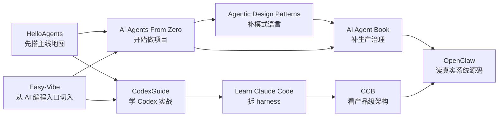

# 资源导航

这页不是书单，而是一张学习地图。

目标只有一个：让你在 2 到 3 分钟内先知道这些资源各自站在哪、适合拿来干什么，以及为什么不该把它们混着读。

## 先看地图

- 横向看：从左到右，资源会越来越靠近架构治理和真实系统。
- 纵向看：越靠上越偏教学和入门路径，越靠下越偏产品和系统结构。

| | 入门路径 | 架构治理 | 源码系统 |
| --- | --- | --- | --- |
| 教学型 | `HelloAgents` `AI Agents From Zero` `Easy-Vibe` `CodexGuide` | `Learn Claude Code` |  |
| 产品 / 系统型 |  | `Agentic Design Patterns` `AI Agent Book` `Claude Code Architecture（CCB）` | `OpenClaw 源码解析` |

## 常见阅读路线

## 如果你现在只能先选 1 条

| 你的当前缺口                    | 先看哪条 | 为什么不是别条 |
|---------------------------| --- | --- |
| 我缺一张 Agent 主线地图           | [HelloAgents](https://datawhalechina.github.io/hello-agents/) | 因为它更适合搭模块全景，不会一上来把你拖进架构深水区 |
| 我想边做项目边学 Agent            | [AI Agents From Zero](https://didilili.github.io/ai-agents-from-zero/#/) | 因为它更像项目驱动路径，不像 `HelloAgents` 那么偏地图 |
| 我想从 AI 编程入口真正做出东西         | [Easy-Vibe](https://datawhalechina.github.io/easy-vibe/zh-cn/) | 因为它在设计“怎么把人带进来”，不是先拆底层系统 |
| 我想先学怎么把 Codex 用进真实工作流    | [CodexGuide](https://codexguide.ai/) | 因为它更像从上手到落地的路线图，不像单纯的命令速查表 |
| 我想知道 coding agent 是怎么工作   | [Learn Claude Code](https://learn.shareai.run/zh/s01/) | 因为它先拆 harness，不像 `CCB` 那样先给你白皮书式结构 |
| 我想系统补 Agent 设计模式和模式语言      | [Agentic Design Patterns](https://adp.xindoo.xyz/) | 因为它更适合整理模式判断，不像项目教程那样负责带你从零跑通 |
| 我想补生产架构、预算、安全、治理          | [AI Agent Book](https://www.waylandz.com/ai-agent-book/) | 因为它直接讨论这些问题，不像 `OpenClaw` 那样更依赖真实源码背景 |
| 我想拆成熟 coding agent 的产品级边界 | [Claude Code Architecture（CCB）](https://ccb.agent-aura.top/docs/introduction/what-is-claude-code) | 因为它更像逆向架构白皮书，不像 `Learn Claude Code` 那样偏教学 |
| 我想看真实大型系统怎么把这些概念落地        | [OpenClaw 源码解析](https://openclaw-book.myhubs.dev/) | 因为它面对的是完整系统，不再只是教学材料或架构总结 |

## 资源角色卡

### 学习地图与路径

这一组主要解决“我该怎么上路”。  
它们更适合帮你定阅读顺序、项目切口和学习节奏，不适合指望靠一条资源直接吃透所有工程深水区。

#### CodexGuide

| 槽位 | 内容 |
| --- | --- |
| 一句定位 | Codex 使用路径 |
| 最适合现在的谁 | 想把 Codex 作为编码工具真正用进真实工作流的人 |
| 如果你只想拿走 1 个东西 | Codex 不是只靠命令列表用起来的，而是要把入口、配置、实践和沉淀串成一条路 |
| 最容易读错的地方 | 把它当成命令速查表，而不是使用路径设计 |
| 建议进入方式 | 先看学习路线和入口地图，再补配置专题和实践方法 |

入口：[资源页](./codex-guide/) · [官方入口](https://codexguide.ai/) · [GitHub 仓库](https://github.com/freestylefly/CodexGuide)

#### HelloAgents

| 槽位 | 内容 |
| --- | --- |
| 一句定位 | Agent 主线地图 |
| 最适合现在的谁 | 已经能跑通模型 API，但还没把工具、记忆、上下文和评估串成系统的人 |
| 如果你只想拿走 1 个东西 | Agent 不是 prompt 延长线，而是工具、上下文、记忆、评估共同组成的系统 |
| 最容易读错的地方 | 把它当成终局教材，而不是地图 |
| 建议进入方式 | 先看目录，再优先看工具、上下文、记忆 |

入口：[资源页](./hello-agents/) · [官方入口](https://datawhalechina.github.io/hello-agents/)

#### AI Agents From Zero

| 槽位 | 内容 |
| --- | --- |
| 一句定位 | 项目驱动的 Agent 实战路径 |
| 最适合现在的谁 | 想从零一路做到 workflow、MCP、RAG 和项目落地的人 |
| 如果你只想拿走 1 个东西 | 平台、框架和项目要被你拿来练迁移能力，不是只练平台操作 |
| 最容易读错的地方 | 把“项目做通一次”误解成“已经学会了通用方法” |
| 建议进入方式 | 先跑一个工作流项目，再补 LangChain / LangGraph 案例 |

入口：[资源页](./ai-agents-from-zero/) · [官方入口](https://didilili.github.io/ai-agents-from-zero/#/)

#### Easy-Vibe

| 槽位 | 内容 |
| --- | --- |
| 一句定位 | AI 编程入口设计 |
| 最适合现在的谁 | 想从“会说需求”一路走到原型、部署和持续迭代的人 |
| 如果你只想拿走 1 个东西 | 它最值钱的不是底层深度，而是“怎么让更多人真能开始做” |
| 最容易读错的地方 | 误以为前期的产品爽感已经等于后面的系统能力 |
| 建议进入方式 | 先看 Stage 1 和学习地图，再按需进 Stage 2 |

入口：[资源页](./easy-vibe/) · [官方入口](https://datawhalechina.github.io/easy-vibe/zh-cn/)

### Harness / Coding Agent

这一组主要解决“Claude Code、Codex、Cursor 这类东西是怎么工作的”。  
不是泛 Agent 入门，而是把 coding agent 的 loop、tools、planning、compression、权限和产品边界拆开来看。

#### Learn Claude Code

| 槽位 | 内容 |
| --- | --- |
| 一句定位 | agent harness 拆解课 |
| 最适合现在的谁 | 已经在用 coding agent，想把背后机制一层层拆开的人 |
| 如果你只想拿走 1 个东西 | 好用的 coding agent 靠的不是模型魔法，而是 loop、tools、todo、subagents、skills、compression 这套外层机制 |
| 最容易读错的地方 | 只记住 Claude Code 的形状，没有继续往通用 harness 模式上提炼 |
| 建议进入方式 | 先看 `s01-s06`，把 loop、tool、todo、compact 这条主线立起来 |

入口：[资源页](./learn-claude-code/) · [官方入口](https://learn.shareai.run/zh/s01/)

#### Claude Code Architecture（CCB）

| 槽位 | 内容 |
| --- | --- |
| 一句定位 | 逆向架构白皮书 |
| 最适合现在的谁 | 已经在用 coding agent，想继续看 QueryEngine、权限、压缩、遥测和配置治理的人 |
| 如果你只想拿走 1 个东西 | 真正的产品级差异不在“会不会调工具”，而在 QueryEngine、权限边界、压缩和治理基础设施 |
| 最容易读错的地方 | 把它当 Claude Code 说明书补充，而不是一份通用分析框架 |
| 建议进入方式 | 先看五层架构，再看 QueryEngine、权限和压缩链路 |

入口：[资源页](./claude-code-architecture/) · [官方入口](https://ccb.agent-aura.top/docs/introduction/what-is-claude-code)

### 架构与生产化

这一组解决“系统为什么会在编排、预算、安全、治理上长出复杂度”。  
它更适合已经做过一些 Agent 原型、开始关心上线和长期维护的人。

#### Agentic Design Patterns

| 槽位 | 内容 |
| --- | --- |
| 一句定位 | Agent 模式语言索引 |
| 最适合现在的谁 | 已经做过几个 Agent 原型，想把工具、规划、反思、多 Agent 等能力整理成模式判断的人 |
| 如果你只想拿走 1 个东西 | 模式不是能力清单，而是用来判断“什么时候该复杂化、什么时候不该复杂化”的语言 |
| 最容易读错的地方 | 把它当成模式背诵表，而不是带着项目问题去查的设计索引 |
| 建议进入方式 | 先浏览目录建立模式地图，再按当前项目里的具体问题回头细读 |

入口：[资源页](./agentic-design-patterns/) · [官方入口](https://adp.xindoo.xyz/)

#### AI Agent Book

| 槽位 | 内容 |
| --- | --- |
| 一句定位 | 生产化手册 |
| 最适合现在的谁 | 已经做过一些 Agent 原型，开始关心编排、预算、安全和治理的人 |
| 如果你只想拿走 1 个东西 | 不要先问 Agent 能做什么，要先问系统会在哪些边界失控 |
| 最容易读错的地方 | 前置认知没到位就硬啃，最后只记住一堆高级名词 |
| 建议进入方式 | 先看章节级锐评，再抓编排、三层架构、预算和治理这几块 |

入口：[资源页](./ai-agent-book/) · [官方入口](https://www.waylandz.com/ai-agent-book/)

### 源码与真实系统

这一组解决“真实大型系统到底怎么把这些概念落到工程里”。  
适合已经有一些概念和框架基础、想进入真实项目源码的人。

#### OpenClaw 源码解析

| 槽位 | 内容 |
| --- | --- |
| 一句定位 | control plane 源码导读 |
| 最适合现在的谁 | 想从真实大系统里看消息网关、控制平面、运行时、扩展和安全怎么揉在一起的人 |
| 如果你只想拿走 1 个东西 | 真正的大系统先解决消息入口和控制平面，不是先堆工具清单 |
| 最容易读错的地方 | 一头扎进模块细节，却没有先抓入口到运行时的主线 |
| 建议进入方式 | 先抓 Gateway / 控制平面 / Pi 引擎这条主链，再看扩展和安全 |

入口：[资源页](./openclaw-book/) · [官方入口](https://openclaw-book.myhubs.dev/)
