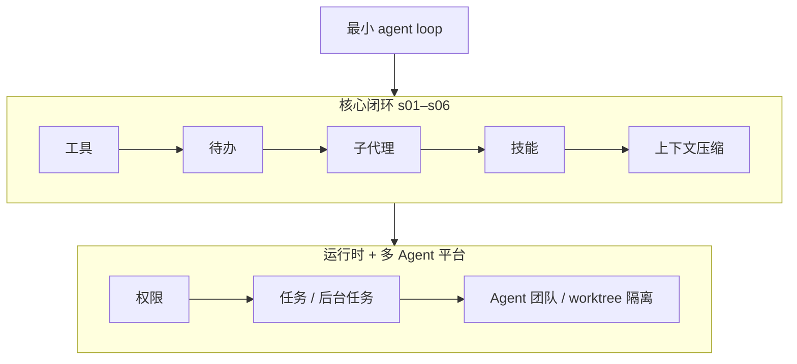

# Learn Claude Code

- 官网：[https://learn.shareai.run/zh/s01/](https://learn.shareai.run/zh/s01/)
- 项目仓库：[https://github.com/shareAI-lab/learn-claude-code](https://github.com/shareAI-lab/learn-claude-code)

## 这条资源主要在讲什么

它不再讲一遍"Agent 是什么"，而是直接把 Claude Code 这一类产品往回拆，去讲支撑它的那套 harness 到底怎么长出来的。官方中文站从 `s01` 起，把内容分成核心闭环、系统加固、任务运行时、多 Agent 平台几层。

它关心的不是抽象概念够不够全，而是：一个最小 agent loop 怎么搭，工具、计划、技能、压缩怎么一层层挂上去，为什么 Claude Code 不是"模型突然会干活"，而是 harness 把能力组织出来了。

