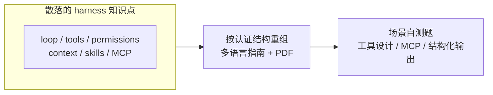

# Claude Certified Architect · 认证自测题库（社区非官方）

- 官网：[https://github.com/paullarionov/claude-certified-architect](https://github.com/paullarionov/claude-certified-architect)

:::note
这是一份**非官方社区资料**，**不是** Anthropic 官方出品的认证或教材。
:::

## 这条资源主要在讲什么

它的形态和前面几条相反：`Learn Claude Code` 从机制往外搭，`CCB` 从产品往里逆向，这一条则把已经散落的 harness 知识按认证结构重新整理——多语言指南加 PDF 自测题，覆盖工具设计、MCP 集成、结构化输出这几类典型场景。

它的价值不在讲新东西，而在两件事：把 loop、tools、permissions、context、skills、MCP 这些零散点串成一份能自测的知识体系；提供场景题，判断"这种配置/调用在 Claude Code 里到底算对还是错"。一句话：它不是 source of truth，而是 source of self-check。

