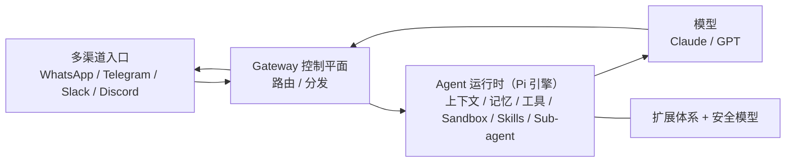

# OpenClaw 源码解析

- 官网：[https://openclaw-book.myhubs.dev/](https://openclaw-book.myhubs.dev/)
- 项目仓库：[https://github.com/coolclaws/openclaw-book](https://github.com/coolclaws/openclaw-book)

## 这条资源主要在讲什么

它不重新定义 Agent，也不讲最小 demo，而是直接围绕 `OpenClaw` 这个真实开源项目，从源码层面讲系统怎么搭起来。README 的定位很直接：`OpenClaw` 不是模型本身，而是一个个人 AI 助手的**控制平面**——把 WhatsApp、Telegram、Slack、Discord 等多渠道统一接入，路由给 Claude、GPT 等模型，再把回复分发回去。

它真正关心的是：这种 AI 助手网关的整体骨架是什么，一条消息怎么进出系统，Agent 运行时、工具、记忆、Sandbox、Skills、Sub-agent 在真实项目里怎么落位，扩展体系和安全模型为什么这样设计。

