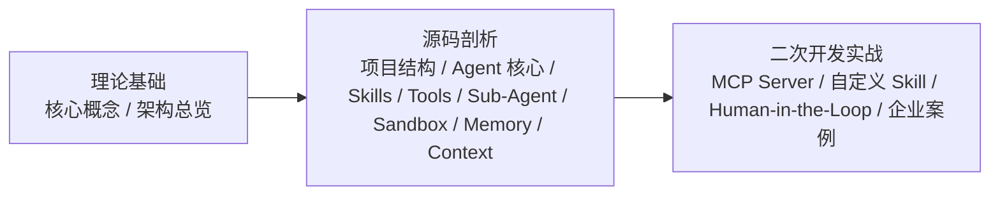

# DeerFlow 二次开发

- 在线版：[https://hawkli-1994.github.io/deerflow-book/](https://hawkli-1994.github.io/deerflow-book/)
- 项目仓库：[https://github.com/hawkli-1994/deerflow-book](https://github.com/hawkli-1994/deerflow-book)

## 这条资源主要在讲什么

它不是 DeerFlow 的快速上手教程，也不只介绍几个 API，而是把一个真实 Agent 系统拆到源码和架构层，再继续往二次开发推进。书站以 DeerFlow 2.0 为对象，先讲核心概念和整体架构，再进入项目结构、Agent 核心、Skills、Tools、Sub-Agent、Sandbox、Memory 和 Context Engineering，最后落到 MCP Server、自定义 Skill、Human-in-the-Loop 和企业级应用案例。

它真正关心的是：一个基于 LangGraph 的 Agent 应用，如何把状态、上下文、工具、技能、子 Agent、沙箱和人工介入组织成可扩展的运行系统；当你需要改造 DeerFlow 时，应该从哪些模块进入，哪些边界不能只靠配置解决。

## 内容结构

| 部分 | 主要内容 | 适合解决的问题 |
| --- | --- | --- |
| 理论基础 | 引言、核心概念、架构总览 | DeerFlow 的系统边界和模块关系是什么 |
| 源码剖析 | 项目结构、Agent 核心、Skills 与 Tools、Sub-Agent、Sandbox、Memory、Context Engineering | 一次请求如何经过运行时、工具和上下文系统 |
| 二次开发实战 | MCP Server、自定义 Skill、Human-in-the-Loop、企业级应用案例 | 如何在现有架构上接入能力并处理生产场景 |
| 附录 | 配置参考、贡献指南、代码示例、术语表 | 查配置、跑示例和继续读源码 |

## 适合谁

- 已经了解 Agent、LangGraph 和异步 Python，想进入真实项目源码的人。
- 准备基于 DeerFlow 做功能扩展、Skill 定制、MCP 集成或企业应用改造的人。
- 想同时理解 Agent runtime、上下文工程和二次开发边界，而不是只会调用现成接口的人。

书站首页标注的前置要求包括 Python 3.12+、LangChain / LangGraph 基础、Agent / LLM 应用开发经验，以及用于 Sandbox 章节的 Docker 基础。版本信息会随 DeerFlow 仓库变化，运行示例时应回到项目仓库核对当前代码。

## 建议阅读顺序

- **Agent 开发新手**：先读第一至三章建立概念和架构，再跳到第十二章看自定义 Skill。
- **二次开发工程师**：重点读第四至七章，接着看第十一至十三章，把项目结构、运行时和扩展入口串起来。
- **企业应用开发者**：重点看第五、八、九、十三、十四章，关注 Agent 核心、Sandbox、Memory、Human-in-the-Loop 和企业案例。
- **源码贡献者**：通读全书，再结合附录 B 和 DeerFlow 当前源码验证实现细节。
