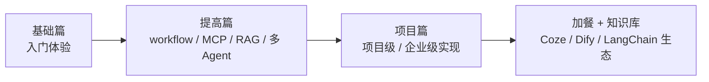

# AI Agents From Zero

- 官网：[https://didilili.github.io/ai-agents-from-zero/#/](https://didilili.github.io/ai-agents-from-zero/#/)
- 项目仓库：[https://github.com/didilili/ai-agents-from-zero](https://github.com/didilili/ai-agents-from-zero)

## 这条资源主要在讲什么

它的重心是带着你从 0 上手框架、真正做出项目：不先给一堆抽象定义，而是直接按"基础篇 → 提高篇 → 项目篇 → 加餐 → 知识库"的路线往前推，边做边补认知。覆盖的既有 workflow、multi-agent、MCP、RAG 这些常见主题，也有 Coze、Dify、LangChain、LangGraph 这些实际会碰到的工具和框架，一路过渡到项目级、甚至偏企业级的实现。

它明显更想把你推进到"用框架真的做出东西"这一步，而不只是建立地图。

